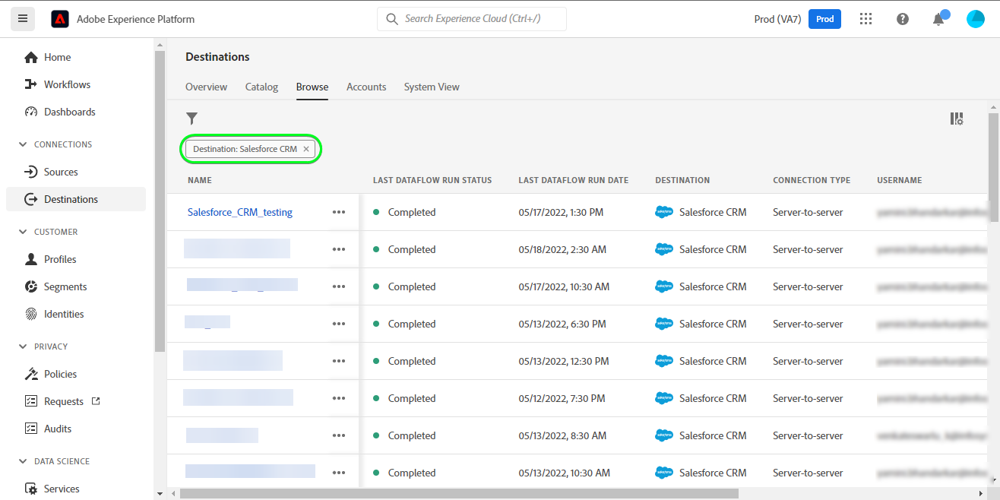

# [!DNL Salesforce CRM] connection

## Overview {#overview} 

[[!DNL Salesforce CRM]](https://www.salesforce.com/crm/) is a popular Customer Relationship Management (CRM) platform and supports the below:

* [Leads](https://developer.salesforce.com/docs/atlas.en-us.object_reference.meta/object_reference/sforce_api_objects_lead.htm) - A lead is the name of a person or company who may (or may not) be interested in the products or services you sell.
* [Contacts](https://developer.salesforce.com/docs/atlas.en-us.object_reference.meta/object_reference/sforce_api_objects_contact.htm) - A contact is an individual with whom one of your representatives has established a relationship and has been qualified as a potential customer.     

This [!DNL Adobe Experience Platform] [destination](/help/destinations/home.md) leverages the [[!DNL Salesforce composite API]](https://developer.salesforce.com/docs/atlas.en-us.api_rest.meta/api_rest/resources_composite_sobjects_collections_update.htm), which supports both types of profiles described above.

When [activating segments](#activate), you can select between either leads or contacts and update attributes and segment data into [!DNL Salesforce CRM].

[!DNL Salesforce CRM] uses OAuth 2 with Password Grant as an authentication mechanism to communicate with the Salesforce REST API. Instructions to authenticate to your [!DNL Salesforce CRM] instance are further below, in the [Authenticate to destination](#authenticate) section.

## Use cases {#use-cases}

As a marketer, you can deliver personalized experiences to your users, based on attributes from their Adobe Experience Platform profiles. You can build segments from your offline data and send these segments to Salesforce CRM, to display in the users' feeds as soon as segments and profiles are updated in Adobe Experience Platform.

## Prerequisites {#prerequisites}

### Prerequisites in Experience Platform {#prerequisites-in-experience-platform}

Before activating data to the Salesforce CRM destination, you must have a [schema](/help/xdm/schema/composition.md), a [dataset](https://experienceleague.adobe.com/docs/platform-learn/tutorials/data-ingestion/create-datasets-and-ingest-data.html?lang=en), and [segments](https://experienceleague.adobe.com/docs/platform-learn/tutorials/segments/create-segments.html?lang=en) created in [!DNL Experience Platform].

### Prerequisites in [!DNL Salesforce CRM] {#prerequisites-destination}

Note the following prerequisites in [!DNL Salesforce CRM], in order to export data from Platform to your Salesforce account:

#### You need to have a [!DNL Salesforce] account {#prerequisites-account}

Go to the Salesforce [trial](https://www.salesforce.com/in/form/signup/freetrial-sales/) page to register and create a Salesforce account, if you do not have one already.

#### Configure a connected app within [!DNL Salesforce] {#prerequisites-connected-app}

First, you need to configure a [!DNL Salesforce connected app](https://help.salesforce.com/s/articleView?id=sf.connected_app_create.htm&language=en_US&r=https%3A%2F%2Fhelp.salesforce.com%2F&type=5) within your [!DNL Salesforce] account, if you do not have one already. [!DNL Salesforce CRM] will leverage the connected app to connect to [!DNL Salesforce].

Next, enable [!DNL OAuth Settings for API Integration] for the [!DNL Salesforce connected app]. Refer to the [[!DNL Salesforce]](https://help.salesforce.com/s/articleView?id=connected_app_create_api_integration.htm&type=5&language=en_US) documentation for guidance.

Also, ensure that the [scopes](https://help.salesforce.com/s/articleView?id=connected_app_create_api_integration.htm&type=5&language=en_US) mentioned below are selected for the [!DNL Salesforce connected app].

* ``chatter_api``
* ``lightning``
* ``visualforce``
* ``content``
* ``openid``
* ``full``
* ``api``
* ``web``
* ``refresh_token``
* ``offline_access``

Finally, ensure that the `password` grant is enabled within your [!DNL Salesforce] account. Refer to the [!DNL Salesforce] [OAuth 2.0 Username-Password Flow for Special Scenarios](https://help.salesforce.com/s/articleView?id=sf.remoteaccess_oauth_username_password_flow.htm&type=5) documentation if you need guidance.

>[!IMPORTANT]
>
>If your [!DNL Salesforce] account administrator has restricted access to trusted IP ranges, you need to contact them to get Platform IP's allowed. Refer to the [!DNL Salesforce] [Restrict Access to Trusted IP Ranges for a Connected App](https://help.salesforce.com/s/articleView?id=sf.connected_app_edit_ip_ranges.htm&type=5) documentation if you need additional guidance.

#### Create custom fields within [!DNL Salesforce] {#prerequisites-custom-field}

When activating segments, Platform uses the value you specify in the **[!UICONTROL Mapping ID]** field for each activated segment, in the **[Segment schedule](#schedule-segment-export-example)** step, to update segment status within [!DNL Salesforce]. Refer to the Adobe Experience Platform documentation for [Segment Membership Details schema field group](/help/xdm/field-groups/profile/segmentation.md) if you need guidance on segment statuses.

For each segment to be activated within Platform you will need a custom field of the type `Text Area (Long)` within [!DNL Salesforce]. You can define the field character length of any size between 256 - 131,072 characters according to your business requirement. See the [!DNL Salesforce] [Custom Field Types](https://help.salesforce.com/s/articleView?id=sf.custom_field_types.htm&type=5) documentation page for additional information on custom field types. Also refer the [!DNL Salesforce] documentation to [create custom fields](https://help.salesforce.com/s/articleView?id=mc_cab_create_an_attribute.htm&type=5&language=en_US) if you need assistance on field creation.

>[!IMPORTANT]
>
>Do not include whitespace characters in the field name. Instead, use the underscore `(_)` character as a separator.
>Within [!DNL Salesforce] you must create custom fields with a **[!UICONTROL FIELD NAME]** that exactly matches the value specified within **[!UICONTROL Mapping ID]** for each activated Platform segment. For example the screenshot below shows a custom field named `crm_2_seg`. When activating a segment to this destination, add `crm_2_seg` as **[!UICONTROL Mapping ID]** to populate segment audiences from Experience Platform into this custom field.

An example of custom field creation in [!DNL Salesforce], *Step 1 - Select the data type*, is shown below:

An example of custom field creation in [!DNL Salesforce], *Step 2 - Enter the details for the custom field*, is shown below:

>[!TIP]
>
>* To distinguish between custom fields used for Platform segments and other custom fields within [!DNL Salesforce Marketing Cloud] you could include a recognizable prefix or suffix when creating the custom field. For example, instead of `test_segment`, use `DEV_test_segment` or `test_segment_DEV`
>* If you already have other custom fields created in [!DNL Salesforce], you can use the same name as the Platform segment, to easily identify the segment in [!DNL Salesforce].

>[!NOTE]
>
>* Objects in Salesforce are restricted to 25 External fields, see [Custom Field Attributes](https://help.salesforce.com/s/articleView?id=sf.custom_field_attributes.htm&type=5).
>* This restriction implies that you can only have a maximum of 25 Experience Platform segment memberships active at any time. 
>* If you have reached this limit within Salesforce, you must remove the custom attribute from Salesforce that were used to store the segment status against older segments within Experience Platform before a new **[!UICONTROL Mapping ID]** can be used.

#### Gather [!DNL Salesforce CRM] credentials {#gather-credentials}

Note down the items below before you authenticate to the [!DNL Salesforce CRM] destination:

| Credential | Description | Example |
| --- | --- | --- |
| Custom Domain | Your [!DNL Salesforce] domain prefix.   See the [[!DNL Salesforce] documentation](https://help.salesforce.com/s/articleView?id=sf.domain_name_setting_login_policy.htm&type=5) to learn how to obtain this value from the [!DNL Salesforce] interface. | If your [!DNL Salesforce Marketing Cloud] domain is  *`d5i000000isb4eak-dev-ed` .my.salesforce.com*,  you need to provide  `d5i000000isb4eak-dev-ed`  as the value.|
| Client ID | Your Salesforce `Consumer Key`.   Refer to the [[!DNL Salesforce] documentation](https://help.salesforce.com/s/articleView?id=sf.connected_app_rotate_consumer_details.htm&type=5) to learn how to obtain this value from the [!DNL Salesforce] interface. | `r23kxxxxxxxx0z05xxxxxx` | 
| Client ID | Your Salesforce `Consumer Secret`.   Refer to the [[!DNL Salesforce] documentation](https://help.salesforce.com/s/articleView?id=sf.connected_app_rotate_consumer_details.htm&type=5) to learn how to obtain this value from the [!DNL Salesforce] interface. | `ipxxxxxxxxxxT4xxxxxxxxxx` | 

### Guardrails {#guardrails}

[!DNL Salesforce] balances transaction loads by imposing request, rate and timeout limits. Refer to the [API Request Limits and Allocations](https://developer.salesforce.com/docs/atlas.en-us.salesforce_app_limits_cheatsheet.meta/salesforce_app_limits_cheatsheet/salesforce_app_limits_platform_api.htm) for details.

>[!IMPORTANT]
>
>When [activating segments](#activate) you must select between either *Contact* or *Lead* types. You need to ensure that your segments have the appropriate data mapping according to the type selected.

## Supported identities {#supported-identities}

[!DNL Salesforce CRM] supports update of identities described in the table below. Learn more about [identities](/help/identity-service/namespaces.md).

|Target Identity|Description|Considerations|
|---|---|---|
| `SalesforceId` | The [!DNL Salesforce CRM] identifier for the contact or lead identities that you export or update through your segment.|Mandatory|

## Export type and frequency {#export-type-frequency}

Refer to the table below for information about the destination export type and frequency.

| Item | Type | Notes |
---------|----------|---------|
| Export type | **[!UICONTROL Profile-based]** | <ul><li>You are exporting all members of a segment, together with the desired schema fields *(for example: email address, phone number, last name)*, according to your field mapping.</li><li> Each segment status in [!DNL Salesforce CRM] gets updated with the corresponding segment status from Platform, based on the **[!UICONTROL Mapping ID]** value provided during the [segment scheduling](#schedule-segment-export-example) step.</li></ul> |
| Export frequency | **[!UICONTROL Streaming]** | <ul><li>Streaming destinations are "always on" API-based connections. As soon as a profile is updated in Experience Platform based on segment evaluation, the connector sends the update downstream to the destination platform. Read more about [streaming destinations](/help/destinations/destination-types.md#streaming-destinations).</li></ul>|

{style="table-layout:auto"}

## Connect to the destination {#connect}

>[!IMPORTANT]
>
>To connect to the destination, you need the **[!UICONTROL Manage Destinations]** [access control permission](/help/access-control/home.md#permissions). Read the [access control overview](/help/access-control/ui/overview.md) or contact your product administrator to obtain the required permissions.

To connect to this destination, follow the steps described in the [destination configuration tutorial](../../ui/connect-destination.md). In the configure destination workflow, fill in the fields listed in the two sections below.

Within **[!UICONTROL Destinations]** > **[!UICONTROL Catalog]** search for [!DNL Salesforce CRM]. Alternatively you can locate it under the **[!UICONTROL CRM]** category.

### Authenticate to destination {#authenticate}

To authenticate to the destination, fill in the required fields below and select **[!UICONTROL Connect to destination]**. Refer to the [Gather [!DNL Salesforce CRM] credentials](#gather-credentials) section for any guidance.
| [!DNL Salesforce CRM] destination | [!DNL Salesforce] |
| --- | --- |
| **[!UICONTROL Username]** | Your [!DNL Salesforce] account username. |
| **[!UICONTROL Password]** | Your [!DNL Salesforce] account password. |
| **[!UICONTROL Custom Domain]** | Your [!DNL Salesforce] domain prefix.  For example if your domain is  *`d5i000000isb4eak-dev-ed` .my.salesforce.com*, you need to provide  `d5i000000isb4eak-dev-ed`  as the value. |
| **[!UICONTROL Client ID]** | Your [!DNL Salesforce] connected app  `Consumer Key`. |
| **[!UICONTROL Client Secret]** | Your [!DNL Salesforce] connected app  `Consumer Secret`. |

If the details provided are valid, the UI displays a **[!UICONTROL Connected]** status with a green check mark, you can then proceed to the next step.

### Fill in destination details {#destination-details}

To configure details for the destination, fill in the required and optional fields below. An asterisk next to a field in the UI indicates that the field is required.
*  **[!UICONTROL Name]**: A name by which you will recognize this destination in the future.
*  **[!UICONTROL Description]**: A description that will help you identify this destination in the future.
*  **[!UICONTROL Salesforce ID Type]**: 
    * Select **[!UICONTROL Contact]** if the identities you are looking to export or update are of type *Contact*.
    * Select **[!UICONTROL Lead]** if the identities you are looking to export or update are of type *Lead*.

### Enable alerts {#enable-alerts}

You can enable alerts to receive notifications on the status of the dataflow to your destination. Select an alert from the list to subscribe to receive notifications on the status of your dataflow. For more information on alerts, see the guide on [subscribing to destinations alerts using the UI](../../ui/alerts.md).

When you are finished providing details for your destination connection, select **[!UICONTROL Next]**.

## Activate segments to this destination {#activate}

>[!IMPORTANT]
>
>To activate data, you need the **[!UICONTROL Manage Destinations]**, **[!UICONTROL Activate Destinations]**, **[!UICONTROL View Profiles]**, and **[!UICONTROL View Segments]** [access control permissions](/help/access-control/home.md#permissions). Read the [access control overview](/help/access-control/ui/overview.md) or contact your product administrator to obtain the required permissions.

Read [Activate profiles and segments to streaming segment export destinations](/help/destinations/ui/activate-segment-streaming-destinations.md) for instructions on activating audience segments to this destination.

### Mapping considerations and example {#mapping-considerations-example}

To correctly send your audience data from Adobe Experience Platform to the [!DNL Salesforce CRM] destination, you need to go through the field mapping step. Mapping consists of creating a link between your Experience Data Model (XDM) schema fields in your Platform account and their corresponding equivalents from the target destination.

Attributes specified in the **[!UICONTROL Target field]** should be named exactly as described in the attribute mappings table as these attributes will form the request body.

Attributes specified in the **[!UICONTROL Source field]** do not follow any such restriction. You can map it based on your need, however if the data format is not correct when pushed to [!DNL (API) Salesforce CRM] it will result in an error.

To correctly map your XDM fields to the [!DNL (API) Salesforce CRM] destination fields, follow these steps:

1. In the **[!UICONTROL Mapping]** step, select **[!UICONTROL Add new mapping]**, you will see a new mapping row on the screen.

1. In the **[!UICONTROL Select source field]** window, choose the **[!UICONTROL Select attributes]** category and select the XDM attribute or choose the **[!UICONTROL Select identity namespace]** and select an identity.
1. In the **[!UICONTROL Select target field]** window, choose the **[!UICONTROL Select identity namespace]** and select an identity or choose **[!UICONTROL Select custom attributes]** category and select an attribute or define one using the **[!UICONTROL Attribute name]** field as needed. Refer to the [[!DNL Salesforce CRM] documentation](https://help.salesforce.com/s/articleView?id=sf.custom_field_attributes.htm&type=5) for guidance on supported attributes.
    * Repeat these steps to add the following mappings between your XDM profile schema and [!DNL (API) Salesforce CRM]:

    **Working with Contacts**

    * If you are working with *Contacts* within your segment, refer to the Object Reference in Salesforce for [Contact](https://developer.salesforce.com/docs/atlas.en-us.object_reference.meta/object_reference/sforce_api_objects_contact.htm) to define mappings for the fields to be updated.
    * You can identify mandatory fields by searching for the word *Required*, which is mentioned in field descriptions in the link above.
    * Depending on the fields you want to export or update, add mappings between your XDM profile schema and [!DNL (API) Salesforce CRM]:
        |Source Field|Target Field| Notes |
        | --- | --- | --- |
        |`IdentityMap: crmID`|`Identity: SalesforceId`|`Mandatory`|
        |`xdm: person.name.lastName`|`Attribute: LastName`| `Mandatory`. Last name of the contact up to 80 characters. |    
        |`xdm: person.name.firstName`|`Attribute: FirstName`| The contact's first name up to 40 characters. |
        |`xdm: personalEmail.address`|`Attribute: Email`| The contact's email address. |

    * An example using these mappings is shown below:
    

    **Working with Leads**

    * If you are working with *Leads* within your segment, refer to the Object Reference in Salesforce for [Lead](https://developer.salesforce.com/docs/atlas.en-us.object_reference.meta/object_reference/sforce_api_objects_lead.htm) to define mappings for the fields to be updated.
    * You can identify mandatory fields by searching for the word *Required*, which is mentioned in field descriptions in the link above.
    * Depending on the fields you want to export or update, add mappings between your XDM profile schema and [!DNL (API) Salesforce CRM]:
        |Source Field|Target Field| Notes |
        | --- | --- | --- |
        |`IdentityMap: crmID`|`Identity: SalesforceId`|`Mandatory`|
        |`xdm: person.name.lastName`|`Attribute: LastName`| `Mandatory`. Last name of the lead up to 80 characters. |    
        |`xdm: b2b.companyName`|`Attribute: Company`| `Mandatory`. The lead's company. |
        |`xdm: personalEmail.address`|`Attribute: Email`| The lead's email address. |

    * An example using these mappings is shown below:
        

When you have finished providing the mappings for your destination connection, select **[!UICONTROL Next]**.

### Schedule segment export and example {#schedule-segment-export-example}

When performing the [Schedule segment export](/help/destinations/ui/activate-segment-streaming-destinations.md#scheduling) step you must manually map activated segments within Platform to its corresponding custom field in [!DNL Salesforce].

To do this, select each segment, then enter name of the custom field from [!DNL Salesforce] in the **[!UICONTROL Mapping ID]** field. Refer to the [Create custom fields within [!DNL Salesforce]](#prerequisites-custom-field) section for guidance and best practices on creating custom fields in [!DNL Salesforce].

For example, if your [!DNL Salesforce] custom field is `crm_2_seg`, specify this value in the **[!UICONTROL Mapping ID]** to populate segment audiences from Experience Platform into this custom field.

An example custom field from [!DNL Salesforce] is shown below:

An example indicating the location of the Mapping ID is shown below:

You will observe the [!DNL Salesforce] **[!UICONTROL FIELD NAME]** exactly matches the value specified within **[!UICONTROL Mapping ID]**.

Repeat this section for each activated Platform segment.

## Validate data export {#exported-data}

To validate that you have correctly set up the destination, follow the steps below:

1. Select **[!UICONTROL Destinations]** > **[!UICONTROL Browse]** to navigate to the list of destinations.

1. Select the destination and validate that the status is **[!UICONTROL enabled]**.

1. Switch to the **[!UICONTROL Activation data]** tab, then select a segment name.

1. Monitor the segment summary and ensure that the count of profiles corresponds to the count created within the segment.

1. Finally, log in to the Salesforce website and validate if the profiles from the segment have been added or updated.

    **Working with Contacts**

    * If you have selected *Contacts* within your Platform segment, navigate to the **[!DNL Apps]** > **[!DNL Contacts]** page.
    

    * Select a *Contact* and check if the fields are updated. You can see that each segment status in [!DNL Salesforce CRM] was updated with the corresponding segment status from Platform, based on the **[!UICONTROL Mapping ID]** value provided during the [segment scheduling](#schedule-segment-export-example).
    

    **Working with Leads**

    * If you have selected *Leads* within your Platform segment, then navigate to the **[!DNL Apps]** > **[!DNL Leads]** page.
    

    * Select a *Lead* and check if the fields are updated. You can see that each segment status in [!DNL Salesforce CRM] was updated with the corresponding segment status from Platform, based on the **[!UICONTROL Mapping ID]** value provided during the [segment scheduling](#schedule-segment-export-example).
    

## Data usage and governance {#data-usage-governance}

All [!DNL Adobe Experience Platform] destinations are compliant with data usage policies when handling your data. For detailed information on how [!DNL Adobe Experience Platform] enforces data governance, see the [Data Governance overview](/help/data-governance/home.md).

## Errors and troubleshooting {#errors-and-troubleshooting}

### Unknown errors encountered while pushing events to the destination {#unknown-errors}

* When checking a dataflow run, you might encounter the following error message: `Unknown errors encountered while pushing events to the destination. Please contact the administrator and try again.`
    

    * To fix this error, verify that the **[!UICONTROL Mapping ID]** that you provided in the activation workflow to the [!DNL Salesforce CRM] destination exactly matches the value of the custom field type you created in [!DNL Salesforce]. Refer to the [Create custom fields within [!DNL Salesforce]](#prerequisites-custom-field) section for guidance.

* When activating a segment, you might obtain an error message: `The client's IP address is unauthorized for this account. Allowlist the client's IP address...`
    * To fix this error, contact your [!DNL Salesforce] account administrator to add [Experience Platform IP addresses](/help/destinations/catalog/streaming/ip-address-allow-list.md) to your [!DNL Salesforce] accounts' trusted IP ranges. Refer to the [!DNL Salesforce] [Restrict Access to Trusted IP Ranges for a Connected App](https://help.salesforce.com/s/articleView?id=sf.connected_app_edit_ip_ranges.htm&type=5) documentation if you need additional guidance.

## Additional resources {#additional-resources}

Additional useful information from the [Salesforce developer portal](https://developer.salesforce.com/) is below:
* [Quick Start](https://developer.salesforce.com/docs/atlas.en-us.api_rest.meta/api_rest/quickstart.htm)
* [Create a Record](https://developer.salesforce.com/docs/atlas.en-us.api_rest.meta/api_rest/dome_sobject_create.htm)
* [Custom Recommendation Audiences](https://developer.salesforce.com/docs/atlas.en-us.236.0.chatterapi.meta/chatterapi/connect_resources_recommendation_audiences_list.htm)
* [Using Composite Resources](https://developer.salesforce.com/docs/atlas.en-us.api_rest.meta/api_rest/using_composite_resources.htm?q=composite)
* This destination leverages the [Upsert Multiple Records](https://developer.salesforce.com/docs/atlas.en-us.api_rest.meta/api_rest/resources_composite_sobjects_collections_update.htm) API instead of the [Upsert Single Record](https://developer.salesforce.com/docs/atlas.en-us.api_rest.meta/api_rest/dome_composite_upsert_example.htm?q=contacts) API call.