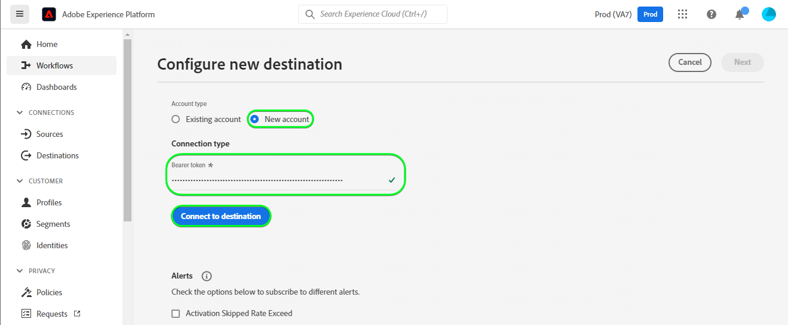
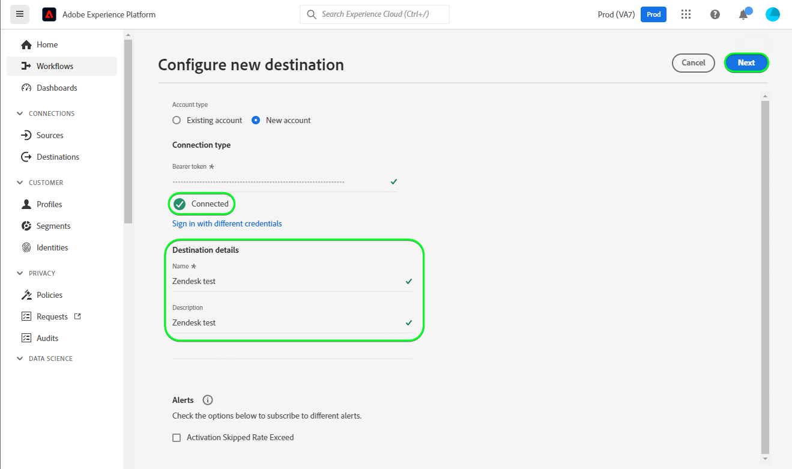
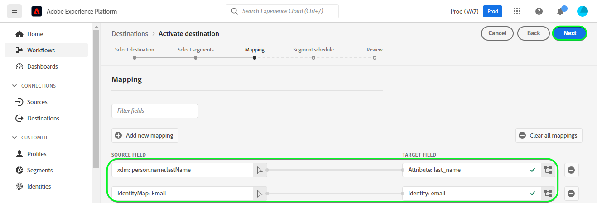
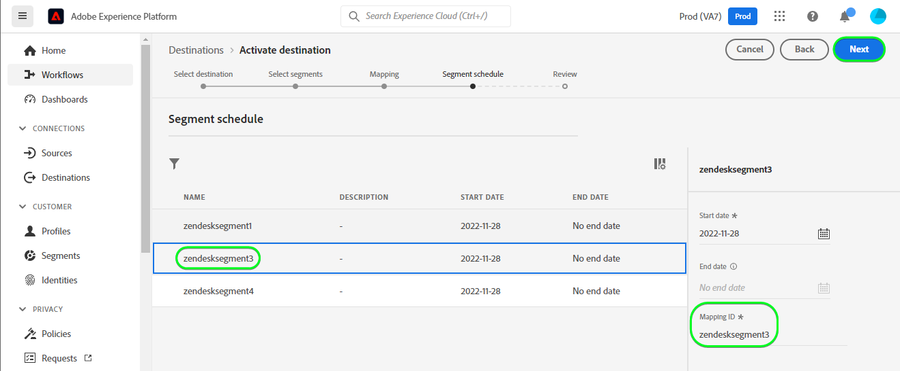
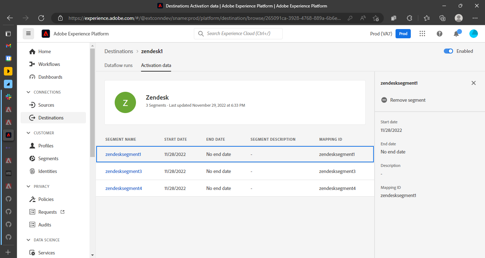
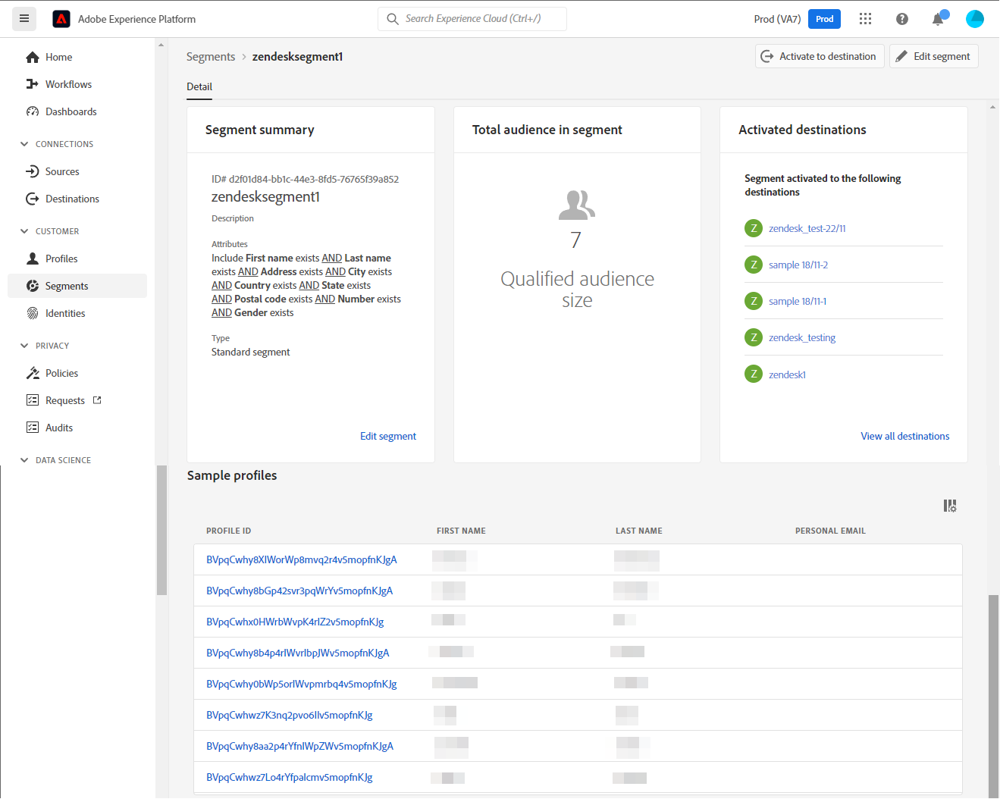
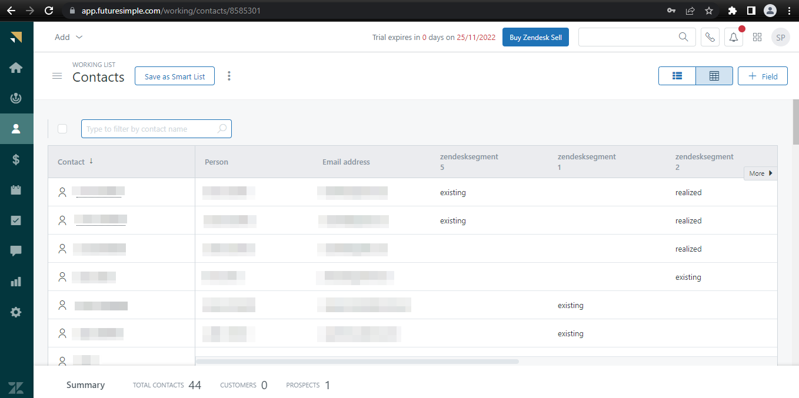
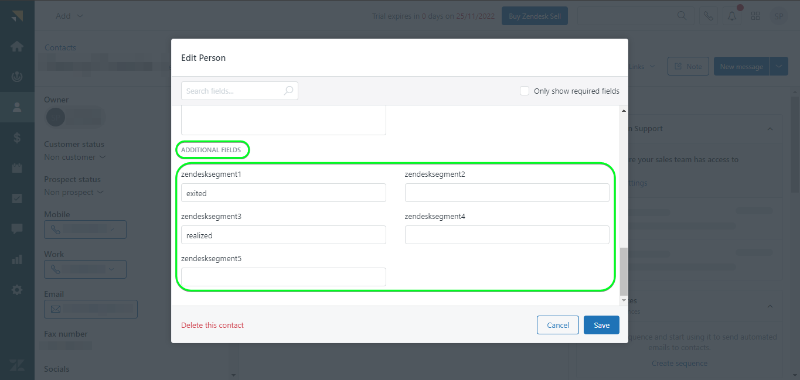

# [!DNL Zendesk] connection

[[!DNL Zendesk]](https://www.zendesk.com) is a customer service solution and sales tool.

This [!DNL Adobe Experience Platform] [destination](/help/destinations/home.md) leverages the [[!DNL Zendesk] Contacts API](https://developer.zendesk.com/api-reference/sales-crm/resources/contacts/), to **create and update identities** within a segment as contacts within [!DNL Zendesk].

[!DNL Zendesk] uses bearer tokens as an authentication mechanism to communicate with the [!DNL Zendesk] Contacts API. Instructions to authenticate to your [!DNL Zendesk] instance are further below, in the [Authenticate to destination](#authenticate) section.

## Use cases {#use-cases}

The customer service department of a multichannel B2C platform wants to ensure a seamless personalized experience for its customers. The department can build segments from their own offline data to create new user profiles or update existing profile information from different interactions (for example purchases, returns etc.) and send these segments from Adobe Experience Platform to [!DNL Zendesk]. Having the updated information in [!DNL Zendesk] ensures the customer service agent has the recent information of the customer immediately available, enabling quicker responses and resolution.

## Prerequisites {#prerequisites}

### Experience Platform prerequisites {#prerequisites-in-experience-platform}

Before activating data to the [!DNL Zendesk] destination, you must have a [schema](/help/xdm/schema/composition.md), a [dataset](https://experienceleague.adobe.com/docs/platform-learn/tutorials/data-ingestion/create-datasets-and-ingest-data.html?lang=en), and [segments](https://experienceleague.adobe.com/docs/platform-learn/tutorials/segments/create-segments.html?lang=en) created in [!DNL Experience Platform].

Refer to Experience Platform documentation for [Segment Membership Details schema field group](/help/xdm/field-groups/profile/segmentation.md) if you need guidance on segment statuses.

### [!DNL Zendesk] prerequisites {#prerequisites-destination}

In order to export data from Platform to your [!DNL Zendesk] account you need to have a [!DNL Zendesk] account.

#### Gather [!DNL Zendesk] credentials {#gather-credentials}

Note down the items below before you authenticate to the [!DNL Zendesk] destination:

| Credential | Description | Example |
| --- | --- | --- |
| `Bearer token` | The Access token you have generated in your [!DNL Zendesk] account.   Follow the documentation to [generate a [!DNL Zendesk] access token](https://developer.zendesk.com/documentation/sales-crm/first-call/#1-generate-an-access-token) if you do not have one.| `a0b1c2d3e4...v20w21x22y23z` |

## Guardrails {#guardrails}

The [Pricing and Rate Limits](https://developer.zendesk.com/api-reference/sales-crm/rate-limits/#pricing) page details the [!DNL Zendesk] API limits associated with your account. You need to ensure that your data and payload are within these constraints.

## Supported identities {#supported-identities}

[!DNL Zendesk] supports update of identities described in the table below. Learn more about [identities](/help/identity-service/namespaces.md).

|Target Identity|Example|Description|Mandatory|
|---|---|---|---|
| `email` | `test@test.com` | Email address of the contact.| Yes |

## Export type and frequency {#export-type-frequency}

Refer to the table below for information about the destination export type and frequency.

| Item | Type | Notes |
---------|----------|---------|
| Export type | **[!UICONTROL Profile-based]** | <ul><li>You are exporting all members of a segment, together with the desired schema fields *(for example: email address, phone number, last name)*, according to your field mapping.</li><li> Each segment status in [!DNL Zendesk] gets updated with the corresponding segment status from Platform, based on the **[!UICONTROL Mapping ID]** value provided during the [segment scheduling](#schedule-segment-export-example) step.</li></ul> |
| Export frequency | **[!UICONTROL Streaming]** | <ul><li>Streaming destinations are "always on" API-based connections. As soon as a profile is updated in Experience Platform based on segment evaluation, the connector sends the update downstream to the destination platform. Read more about [streaming destinations](/help/destinations/destination-types.md#streaming-destinations).</li></ul>|

{style="table-layout:auto"}

## Connect to the destination {#connect}

>[!IMPORTANT]
>
>To connect to the destination, you need the **[!UICONTROL Manage Destinations]** [access control permission](/help/access-control/home.md#permissions). Read the [access control overview](/help/access-control/ui/overview.md) or contact your product administrator to obtain the required permissions.

To connect to this destination, follow the steps described in the [destination configuration tutorial](../../ui/connect-destination.md). In the configure destination workflow, fill in the fields listed in the two sections below.

Within **[!UICONTROL Destinations]** > **[!UICONTROL Catalog]** search for [!DNL Zendesk]. Alternatively you can locate it under the **[!UICONTROL CRM]** category.

### Authenticate to destination {#authenticate}

Fill in the required fields below. Refer to the [Gather [!DNL Zendesk] credentials](#gather-credentials) section for any guidance.
* **[!UICONTROL Bearer Token]**: The Access Token you have generated in your [!DNL Zendesk] account.

To authenticate to the destination, select **[!UICONTROL Connect to destination]**.

If the details provided are valid, the UI displays a **[!UICONTROL Connected]** status with a green check mark. You can then proceed to the next step.

### Fill in destination details {#destination-details}

To configure details for the destination, fill in the required and optional fields below. An asterisk next to a field in the UI indicates that the field is required.

* **[!UICONTROL Name]**: A name by which you will recognize this destination in the future.
* **[!UICONTROL Description]**: A description that will help you identify this destination in the future.

### Enable alerts {#enable-alerts}

You can enable alerts to receive notifications on the status of the dataflow to your destination. Select an alert from the list to subscribe to receive notifications on the status of your dataflow. For more information on alerts, see the guide on [subscribing to destinations alerts using the UI](../../ui/alerts.md).

When you are finished providing details for your destination connection, select **[!UICONTROL Next]**.

## Activate segments to this destination {#activate}

>[!IMPORTANT]
>
>To activate data, you need the **[!UICONTROL Manage Destinations]**, **[!UICONTROL Activate Destinations]**, **[!UICONTROL View Profiles]**, and **[!UICONTROL View Segments]** [access control permissions](/help/access-control/home.md#permissions). Read the [access control overview](/help/access-control/ui/overview.md) or contact your product administrator to obtain the required permissions.

Read [Activate profiles and segments to streaming segment export destinations](/help/destinations/ui/activate-segment-streaming-destinations.md) for instructions on activating audience segments to this destination.

### Mapping considerations and example {#mapping-considerations-example}

To correctly send your audience data from Adobe Experience Platform to the [!DNL Zendesk] destination, you need to go through the field mapping step. Mapping consists of creating a link between your Experience Data Model (XDM) schema fields in your Platform account and their corresponding equivalents from the target destination.

Attributes specified in the **[!UICONTROL Target field]** should be named exactly as described in the attribute mappings table as these attributes will form the request body.

Attributes specified in the **[!UICONTROL Source field]** do not follow any such restriction. You can map it based on your need, however if the data format is not correct when pushed to [!DNL Zendesk] it will result in an error.

To correctly map your XDM fields to the [!DNL Zendesk] destination fields, follow these steps:

1. In the **[!UICONTROL Mapping]** step, select **[!UICONTROL Add new mapping]**. You will see a new mapping row on the screen.
1. In the **[!UICONTROL Select source field]** window, choose the **[!UICONTROL Select attributes]** category and select the XDM attribute or choose the **[!UICONTROL Select identity namespace]** and select an identity.
1. In the **[!UICONTROL Select target field]** window, choose the **[!UICONTROL Select identity namespace]** category and select a target identity, or choose the **[!UICONTROL Select attributes]** category and select one of the supported schema attributes.
    * Repeat these steps to add the following mandatory mappings, you can also add any other attributes you want to update between your XDM profile schema and your [!DNL Zendesk] instance:
        |Source Field|Target Field| Mandatory|
        |---|---|---|
        |`xdm: person.name.lastName`|`xdm: last_name`| Yes |
        |`IdentityMap: Email`|`Identity: email`| Yes |
        |`xdm: person.name.firstName`|`xdm: first_name`| |

    * An example using these mappings is shown below:
    

>[!IMPORTANT]
>
>The `Attribute: last_name` and `Identity: email` target mappings are mandatory for this destination. If these mappings are missing, any other mappings are ignored and not sent to [!DNL Zendesk].

When you are finished providing the mappings for your destination connection, select **[!UICONTROL Next]**.

### Schedule segment export and example {#schedule-segment-export-example}

In the [[!UICONTROL Schedule segment export]](/help/destinations/ui/activate-segment-streaming-destinations.md#scheduling) step of the activation workflow, you must manually map Platform segments to the custom field attribute in [!DNL Zendesk].

To do this, select each segment, then enter the corresponding custom field attribute from [!DNL Zendesk] in the **[!UICONTROL Mapping ID]** field.

An example is shown below:

## Validate data export {#exported-data}

To validate that you have correctly set up the destination, follow the steps below:

1. Select **[!UICONTROL Destinations]** > **[!UICONTROL Browse]** and navigate to the list of destinations.
1. Next, select the destination and switch to the **[!UICONTROL Activation data]** tab, then select a segment name.

1. Monitor the segment summary and ensure that the count of profiles corresponds to the count within the segment.

1. Log in to the [!DNL Zendesk] website, then navigate to the **[!UICONTROL Contacts]** page to check if the profiles from the segment have been added. This list can be configured to display columns for the additional fields created with the segment **[!UICONTROL Mapping ID]** and segment statuses.

1. You can alternatively drill down into an individual **[!UICONTROL Person]** page and check the **[!UICONTROL Additional fields]** section displaying the segment name and segment statuses.

## Data usage and governance {#data-usage-governance}

All [!DNL Adobe Experience Platform] destinations are compliant with data usage policies when handling your data. For detailed information on how [!DNL Adobe Experience Platform] enforces data governance, see the [Data Governance overview](/help/data-governance/home.md).

## Additional resources {#additional-resources}

Additional useful information from the [!DNL Zendesk] documentation is below:
* [Making your first call](https://developer.zendesk.com/documentation/sales-crm/first-call/)
* [Custom Fields](https://developer.zendesk.com/api-reference/sales-crm/requests/#custom-fields)

### Changelog

This section captures the functionality and significant documentation updates made to this destination connector.

+++ View changelog

|Release month|Update type|Description|
|---|---|---|
|April 2023|Documentation update| <ul><li>We updated the [use-cases](#use-cases) section. The mandatory mappings mentioned in the [Mapping considerations and example](#mapping-considerations-example) section was updated, In the initial release along-with `Email` there used to be a choice where you could provide either the `Last Name` or `Name` for the mandatory mappings, this has been made invalid and `Email` and `Last Name` are now mandatory. We also elaborated this section to include an example of a non-mandatory attribute mapping.</li></ul> |
|March 2023|Initial release|Initial destination release and documentation publish.|

{style="table-layout:auto"}

+++