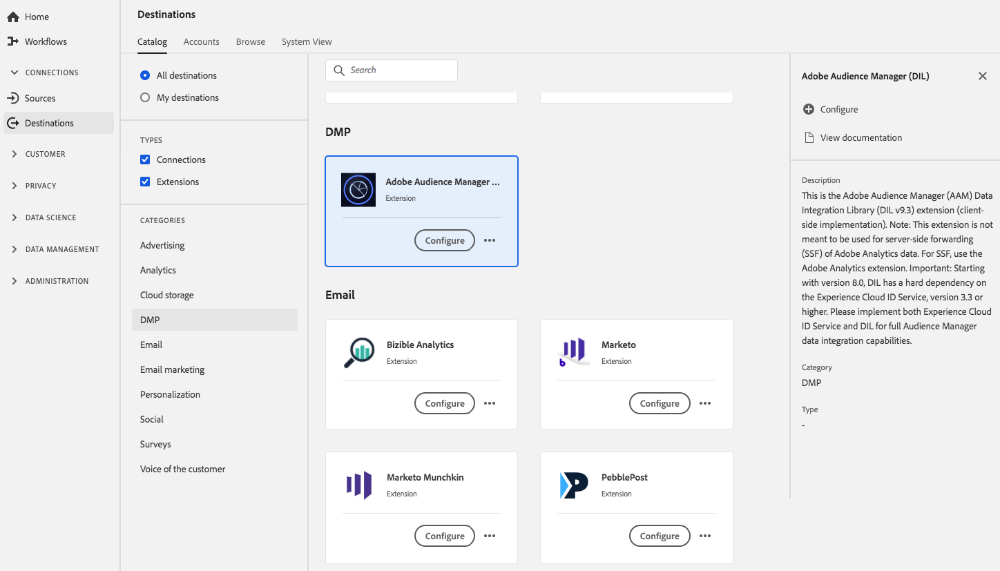

# Audience Manager DIL extension {#aam-dil-extension}

## Overview {#overview}

This is the Adobe Audience Manager Data Integration Library extension (client-side implementation). Note: This extension is not meant to be used for server-side forwarding (SSF) of Adobe Analytics data. For SSF, use the Adobe Analytics extension. Important: Starting with version 8.0, DIL has a hard dependency on the [!DNL Experience Cloud] ID Service, version 3.3 or higher. Please implement both [!DNL Experience Cloud] ID Service and DIL for full [!DNL Audience Manager] data integration capabilities.

[!DNL Audience Manager] DIL is a Data Management Platform (DMP) extension in Adobe Experience Platform. For more information about the extension functionality, see the [Audience Manager extension page](../../../tags/extensions/client/audience-manager/overview.md) in the tags documentation.

This destination is a tag extension. For more information about how extensions work in Platform, see the [tag extensions overview](../launch-extensions/overview.md).

## Prerequisites {#prerequisites}

This extension is available in the [!DNL Destinations] catalog for all customers who have purchased Platform.

To use this extension, you need access to tags in Adobe Experience Platform. Tags are offered to Adobe Experience Cloud customers as an included, value-add feature. Contact your organization administrator to get access to tags and ask them to grant you the **[!UICONTROL manage_properties]** permission so you can install extensions.

## Install extension {#install-extension}

To install the [!DNL Audience Manager] DIL extension:

In the [Platform interface](https://platform.adobe.com/), go to **[!UICONTROL Destinations]** > **[!UICONTROL Catalog]**.

Select the extension from the catalog or use the search bar.

Click on the destination to highlight it, then select **[!UICONTROL Configure]** in the right rail. If the **[!UICONTROL Configure]** control is greyed out, you are missing the **[!UICONTROL manage_properties]** permission. See [Prerequisites](#prerequisites).

Select the property in which you want to install the extension. You also have the option of creating a new property. A property is a collection of rules, data elements, configured extensions, environments, and libraries. Learn about properties in the [tags documentation](../../../tags/ui/administration/companies-and-properties.md#properties-page).

The workflow walks you through the steps to complete the installation. 

For information about the extension configuration options, see the [Audience Manager extension page](../../../tags/extensions/client/audience-manager/overview.md) in the tags documentation.

You can also install the extension directly in the [Data Collection UI](https://experience.adobe.com/#/data-collection/). See the guide on [adding a new extension](../../../tags/ui/managing-resources/extensions/overview.md#add-a-new-extension) for more information.

## How to use the extension {#how-to-use}

Once you have installed the extension, you can start setting up rules. In the Data Collection UI, you can set up rules for your installed extensions to send event data to the extension destination only in certain situations. For more information about setting up rules for your extensions, see the overview on [rules](../../../tags/ui/managing-resources/rules.md) in the tags documentation.

## Configure, upgrade, and delete extension {#configure-upgrade-delete}

You can configure, upgrade, and delete extensions in the Data Collection UI.

>[!TIP]
>
>If the extension is already installed on one of your properties, the UI still displays **[!UICONTROL Install]** for the extension. Kick off the installation workflow as described in [Install extension](#install-extension) to configure or delete your extension.

To upgrade your extension, see the guide on the [extension upgrade process](../../../tags/ui/managing-resources/extensions/extension-upgrade.md) in the tags documentation.
