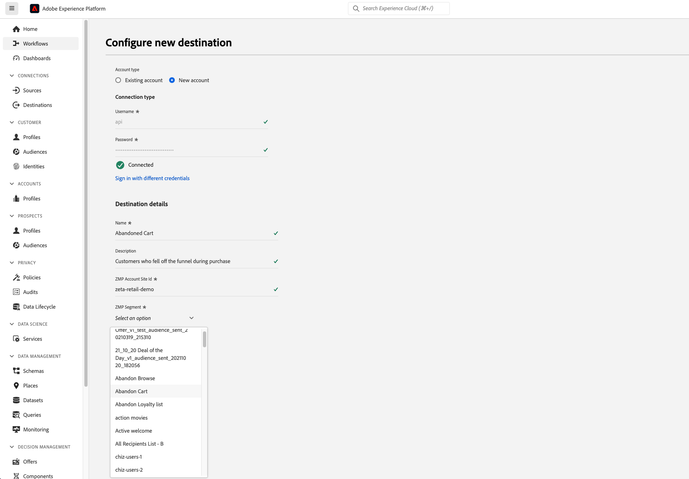
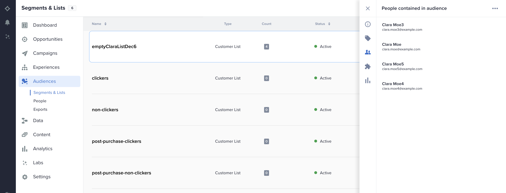
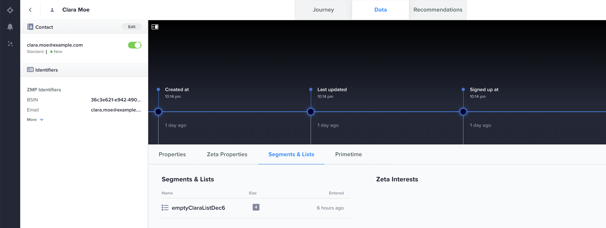

# Zeta Marketing Platform {#zeta-marketing-platform}

## Overview {#overview}

The Zeta Marketing Platform (ZMP) is a cloud-based system which helps you acquire, grow, and retain customers more efficiently, powered by intelligence (proprietary data and AI). For more details, refer to [Zeta Global](https://zetaglobal.com/). 

With the Zeta Marketing Platform connector available in [!DNL Adobe Experience Platform], you can seamlessly synchronize your audiences from Experience Platform to the ZMP.

>[!IMPORTANT]
>
>The destination connector and documentation page are created and maintained by the *Zeta Global* team. For any inquiries or update requests, contact the team at [Contact Us](https://zetaglobal.com/about/contact-us/).

## Use cases {#use-cases}

### Build audience segments {#use-case-build-audiences}

A marketer wants to build unique audience profiles, identify their most valuable segments, and use them across any digital channels that the Zeta Marketing Platform supports. They want to create a true 360 view of a consumer profile, build and activate meaningful audiences. More details on which channels the Zeta Marketing Platform supports can be found [here](https://zetaglobal.com/platform/integrations/).

### Target users with advertisements {#use-case-target-users}

An advertiser aims to target users within specific audiences through the Zeta Demand Side Platform (DSP), as these users interact with their brands. For more information on the Zeta DSP, click [here](https://knowledgebase.zetaglobal.com/pug/).

## Prerequisites {#prerequisites}

### Zeta Marketing Platform prerequisites {#zmp-prerequisites}

* Before you set up a new connection to the Zeta Marketing Platform destination, you must create an empty customer list in your Zeta Marketing Platform account. You must choose one of these customer lists as the designated target to receive the [!DNL Adobe Experience Platform] audience that you plan to send. You can create an empty customer list in the ZMP by following the instructions [here](https://knowledgebase.zetaglobal.com/kb/creating-audiences#CreatingAudiences-CreatingaCustomerList).
* Although the [!DNL Adobe Experience Platform] permits the activation of multiple audiences to a particular ZMP destination instance, it is mandatory that each ZMP destination instance receives only one Experience Platform audience. To handle multiple audiences from the Experience Platform, create additional ZMP destination instances for each audience and select a different customer list from the dropdown. This approach ensures that the target ZMP audiences does not get overwritten. See [Fill in destination details](#destination-details) for more details.
* Use the following credentials to configure the destination:
    * Username: **api** 
    * Password: Your ZMP REST API Key. You can find your REST API Key by logging in to your ZMP account and navigating to **Settings** > **Integrations** > **Keys & Apps** section. See the [ZMP documentation](https://knowledgebase.zetaglobal.com/kb/integrations) for more details.
    
## Supported identities {#supported-identities}

[!DNL Zeta Marketing Platform] supports the activation of custom user IDs described in the table below. For more details, see [identities](/help/identity-service/features/namespaces.md).

>[!IMPORTANT]
>
> The Zeta Marketing Platform destination requires you to map a source identity namespace to the ZMP `uid` target identity. This helps the Zeta Marketing Platform uniquely differentiate each profile.

|Target Identity|Description|Considerations|Notes|
|---------|----------|----------|----------|
|uid|Unique ID that ZMP uses to differentiate customer profiles|Mandatory|Choose the `Email` standard identity namespace if you want to identify unique profiles using their email addresses. Alternatively, you can opt to map your custom namespace to `uid` if customer profiles do not have an email.|
|email_md5_id|Email MD5 that represents each customer profile|Optional|Choose this target identity when you aim to uniquely identify customer profiles using email MD5 values. It is essential that email addresses are already in MD5 format within the Experience Platform, as the Experience Platform does not convert plain text to MD5. In this scenario, set `uid` (mandatory) to either the same email MD5 values or another appropriate identity namespace.|

{style="table-layout:auto"}

## Supported audiences {#supported-audiences}

This section describes which type of audiences you can export to this destination.

| Audience origin | Supported | Description | 
|---------|----------|----------|
| [!DNL Segmentation Service] | Yes | Audiences generated through the Experience Platform [Segmentation Service](../../../segmentation/home.md).|
| All other audience origins | No | This category includes all audience origins outside of audiences generated through the [!DNL Segmentation Service]. Read about the [various audience origins](/help/segmentation/ui/audience-portal.md#customize). Some examples include: <ul><li> custom upload audiences [imported](../../../segmentation/ui/audience-portal.md#import-audience) into Experience Platform from CSV files,</li><li> look-alike audiences, </li><li> federated audiences, </li><li> audiences generated in other Experience Platform apps such as [!DNL Adobe Journey Optimizer], </li><li> and more. </li></ul> |

{style="table-layout:auto"}

>[!NOTE]
>
> As individual members are added or removed from the Experience Platform audience, updates will be sent to the ZMP to ensure that the destination customer list is synchronized accordingly.

## Export type and frequency {#export-type-frequency}

Refer to the table below for information about the destination export type and frequency.

| Item | Type | Notes |
|---------|----------|---------|
| Export frequency | **[!UICONTROL Streaming]** | Streaming destinations are "always on" API-based connections. As soon as a profile is updated in Experience Platform based on segment evaluation, the connector sends the update downstream to the destination platform. Read more about [streaming destinations](/help/destinations/destination-types.md#streaming-destinations).|

{style="table-layout:auto"}

Supported audiences by audience data type:

| Audience data type | Supported | Description | Use cases |
|--------------------|-----------|-------------|-----------|
| [People audiences](/help/segmentation/types/people-audiences.md) | Yes | Based on customer profiles, allowing you to target specific groups of people for marketing campaigns. | Frequent buyers, cart abandoners |
| [Account audiences](/help/segmentation/types/account-audiences.md) | No | Target individuals within specific organizations for account-based marketing strategies. | B2B marketing |
| [Prospect audiences](/help/segmentation/types/prospect-audiences.md) | No | Target individuals who are not yet customers but share characteristics with your target audience. | Prospecting with third-party data |
| [Dataset exports](/help/catalog/datasets/overview.md) | No | Collections of structured data stored in the [!DNL Adobe Experience Platform] Data Lake. | Reporting, data science workflows |

{style="table-layout:auto"}

## Connect to the destination {#connect}

>[!IMPORTANT]
>
>To connect to the destination, you need the **[!UICONTROL Manage Destinations]** [access control permission](/help/access-control/home.md#permissions). Read the [access control overview](/help/access-control/ui/overview.md) or contact your product administrator to obtain the required permissions.

To connect to this destination, follow the steps described in the [destination configuration tutorial](../../ui/connect-destination.md). In the configure destination workflow, fill in the fields listed in the two sections below.

### Authenticate to destination {#authenticate}

To authenticate to the destination, fill in the required fields and select **[!UICONTROL Connect to destination]**.

* **[!UICONTROL Username]**: `api`
* **[!UICONTROL Password]**: Your ZMP REST API Key. You can find your REST API Key by logging in to your ZMP account and navigating to **Settings** > **Integrations** > **Keys & Apps** section. See the [ZMP documentation](https://knowledgebase.zetaglobal.com/kb/integrations) for more details.

### Fill in destination details {#destination-details}

To configure details for the destination, fill in the required and optional fields below. An asterisk next to a field in the UI indicates that the field is required.

* **[!UICONTROL Name]**: A name by which you will recognize this destination in the future.
* **[!UICONTROL Description]**: A description that will help you identify this destination in the future.
* **[!UICONTROL ZMP Account Site Id]**: Your ZMP **Site Id** where you want to send your audiences to. You can view your Site Id by navigating to **Settings** > **Integrations** > **Keys & Apps** section. More information can be found [here](https://knowledgebase.zetaglobal.com/kb/integrations).
* **[!UICONTROL ZMP Segment]**: The customer list segment in your ZMP Site Id account that you want to be updated with the Experience Platform audience.

### Enable alerts {#enable-alerts}

You can enable alerts to receive notifications on the status of the dataflow to your destination. Select an alert from the list to subscribe to receive notifications on the status of your dataflow. For more information on alerts, see the guide on [subscribing to destinations alerts using the UI](../../ui/alerts.md).

When you are finished providing details for your destination connection, select **[!UICONTROL Next]**.

## Activate audiences to this destination {#activate}

>[!IMPORTANT]
>
>* To activate data, you need the **[!UICONTROL Manage Destinations]**, **[!UICONTROL Activate Destinations]**, **[!UICONTROL View Profiles]**, and **[!UICONTROL View Segments]** [access control permissions](/help/access-control/home.md#permissions). Read the [access control overview](/help/access-control/ui/overview.md) or contact your product administrator to obtain the required permissions.
>* To export *identities*, you need the **[!UICONTROL View Identity Graph]** [access control permission](/help/access-control/home.md#permissions).   {width="100" zoomable="yes"}

Read [Activate audiences to streaming destinations](/help/destinations/ui/activate-segment-streaming-destinations.md) for instructions on activating audiences to this destination.

### Map attributes and identities {#map}

Below is an example of correct identity mapping when exporting profiles to [!DNL Zeta Marketing Platform].

Selecting source fields:

* Select a source identity namespace (custom or standard, such as `Email`) that uniquely identifies a profile in [!DNL Adobe Experience Platform] and [!DNL Zeta Marketing Platform].
* Select any XDM source profile attributes that need to be exported to and updated in the [!DNL Zeta Marketing Platform].

Selecting target fields:

* (Mandatory) Select `uid` as the target identity to which you map a source identity namespace. 
* (Optional) Select `email_md5_id` as the target identity to which you mapped the source identity namespace that represents email md5 values. It is essential that email addresses are already in MD5 format within the Experience Platform, as the Experience Platform does not convert plain text to MD5
* Select any additional target mappings if needed.

## Exported data / Validate data export {#exported-data}

A successful audience activation from Experience Platform to the Zeta Marketing Platform updates the target customer list in the ZMP. The count and the sample profiles in the target customer list will be equal to the number of identities that were successfully activated.

Each audience member that was activated from Experience Platform will also be visible under **Audiences** > **People** in the ZMP. You will also be able to view the **Customer List** segment a profile belongs to in the Single Customer view as shown below.

## Data usage and governance {#data-usage-governance}

All [!DNL Adobe Experience Platform] destinations are compliant with data usage policies when handling your data. For detailed information on how [!DNL Adobe Experience Platform] enforces data governance, read the [Data Governance overview](/help/data-governance/home.md).

## Additional resources {#additional-resources}

* [Zeta Knowledge Base](https://knowledgebase.zetaglobal.com/kb/)
