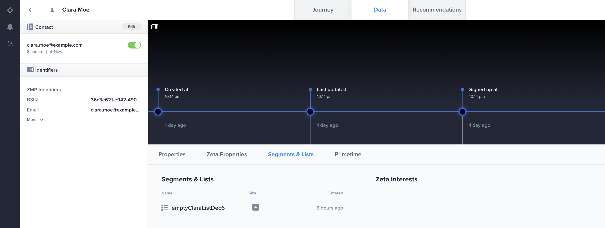

# Zeta Marketing Platform {#zeta-marketing-platform}

## Overview {#overview}

The Zeta Marketing Platform, henceforth ZMP, is a cloud-based system with the tools to help you acquire, grow, and retain customers more efficiently, powered by intelligence (proprietary data and AI). For more details, refer to [Zeta Global](https://zetaglobal.com/). 

With the ZMP connector available in Adobe Experience Platform, you can seamlessly synchronize your audiences from Experience Platform to the ZMP. 
>[!IMPORTANT]
>
>The destination connector and documentation page are created and maintained by the *Zeta Global* team. For any inquiries or update requests, please contact the team at [Contact Us](https://zetaglobal.com/about/contact-us/).

## Use cases {#use-cases}

### Use case #1 {#use-case-1}
A marketer wants to build unique audience profiles, identify their most valuable segments, and use them across any digital channels that the ZMP supports. They want to create a true 360 view of a consumer profile, build and activate meaningful audiences. More details on which channels the ZMP supports can be found [here](https://zetaglobal.com/platform/integrations/).

### Use case #2 {#use-case-2}
An advertiser wants to target users in audiences with ads through the Zeta DSP as the user interacts with their brands. More information on the Zeta DSP and other DSPs that the ZMP supports can be found [here](https://knowledgebase.zetaglobal.com/programmatic-user-guide/).

## Prerequisites {#prerequisites}

### Zeta Marketing Platform prerequisites

* Prior to setting up a new destination, please ensure the presence of a pre-existing shell customer list in your ZMP account. You will  be required to choose one of these customer lists as the designated target to receive the Adobe Experience Platform audience that you plan to send. You can create an empty customer list in the ZMP by following the instructions [here](https://knowledgebase.zetaglobal.com/zmp/creating-audiences#CreatingAudiences-CreatingaCustomerList).
* Although the Adobe Experience Platform permits the activation of multiple audiences to a particular ZMP destination instance, it is mandatory that each ZMP destination instance receives only one Experience Platform audience. To handle multiple audiences from the Experience Platform, create additional ZMP instances for each audience and select a different shell customer list from the dropdown. This approach ensures that the target ZMP audiences does not get overwritten.
* The username and password needed to configure the destination will be **api** and the **REST API Key**, which you can view in your ZMP account by navigating to **Settings** > **Integrations** > **Keys & Apps** section. More information can be found [here](https://knowledgebase.zetaglobal.com/zmp/integrations).

## Supported identities {#supported-identities}

The ZMP destination connector will allow you to map platform identities to identities that the ZMP accepts. 
>[!IMPORTANT]
> Please note that it is mandatory to map a source identity namespace to ZMP's `uid` target identity so that the ZMP can uniquely differentiate each profile. 

[!DNL Zeta Marketing Platform] supports the activation of custom user IDs described in the table below. For more details, see [identities](/help/identity-service/namespaces.md).

|Target Identity|Description|Considerations|Notes|
---------|----------|----------|----------|
|uid|Unique id that ZMP uses to differentiate customer profiles|Mandatory|Choose the `Email` standard identity namespace if you want to identify unique profiles using their email addresses. Alternatively, you can opt to map your custom namespace to `uid` if customer profiles do not have an email.|
|email_md5_id|Email MD5 that represents each customer profile|Optional|Choose this target identity when you aim to uniquely identify customer profiles using email MD5 values. In this case, set `uid` (mandatory) to either the same email MD5 values or another appropriate identity namespace.|

{style="table-layout:auto"}

## Supported audiences {#supported-audiences}

This section describes which type of audiences you can export to this destination.

| Audience origin | Supported | Description | 
---------|----------|----------|
| [!DNL Segmentation Service] | ✓ | Audiences generated through the Experience Platform [Segmentation Service](../../../segmentation/home.md).|

{style="table-layout:auto"}

>[!NOTE]
> As individual members are added or removed from the platform audience, updates will be sent to the ZMP to ensure that the destination customer list is synchronized accordingly.

## Export type and frequency {#export-type-frequency}

Refer to the table below for information about the destination export type and frequency.

| Item | Type | Notes |
---------|----------|---------|
| Export frequency | **[!UICONTROL Streaming]** | Streaming destinations are "always on" API-based connections. As soon as a profile is updated in Experience Platform based on segment evaluation, the connector sends the update downstream to the destination platform. Read more about [streaming destinations](/help/destinations/destination-types.md#streaming-destinations).|

{style="table-layout:auto"}

## Connect to the destination {#connect}

>[!IMPORTANT]
> 
>To connect to the destination, you need the **[!UICONTROL Manage Destinations]** [access control permission](/help/access-control/home.md#permissions). Read the [access control overview](/help/access-control/ui/overview.md) or contact your product administrator to obtain the required permissions.

To connect to this destination, follow the steps described in the [destination configuration tutorial](../../ui/connect-destination.md). In the configure destination workflow, fill in the fields listed in the two sections below.

### Authenticate to destination {#authenticate}

To authenticate to the destination, fill in the required fields and select **[!UICONTROL Connect to destination]**.

* Enter the **[!UICONTROL Username]** as **api**
* Enter the **[!UICONTROL Password]** as your **[!UICONTROL REST API Key]** that you can view in your ZMP account by navigating to **Settings** > **Integrations** > **Keys & Apps** section. More information can be found [here](https://knowledgebase.zetaglobal.com/zmp/integrations).

### Fill in destination details {#destination-details}

To configure details for the destination, fill in the required and optional fields below. An asterisk next to a field in the UI indicates that the field is required.

*  **[!UICONTROL Name]**: A name by which you will recognize this destination in the future.
*  **[!UICONTROL Description]**: A description that will help you identify this destination in the future.
*  **[!UICONTROL ZMP Account Site Id]**: Your ZMP **Site Id** where you want to send your audiences to. You can view your Site Id by navigating to **Settings** > **Integrations** > **Keys & Apps** section. More information can be found [here](https://knowledgebase.zetaglobal.com/zmp/integrations).
*  **[!UICONTROL ZMP Segment]**: The customer list segment in your ZMP Site Id account that you want to be updated with the Platform audience.

### Enable alerts {#enable-alerts}

You can enable alerts to receive notifications on the status of the dataflow to your destination. Select an alert from the list to subscribe to receive notifications on the status of your dataflow. For more information on alerts, see the guide on [subscribing to destinations alerts using the UI](../../ui/alerts.md).

When you are finished providing details for your destination connection, select **[!UICONTROL Next]**.

## Activate segments to this destination {#activate}

>[!IMPORTANT]
> 
>* To activate data, you need the **[!UICONTROL Manage Destinations]**, **[!UICONTROL Activate Destinations]**, **[!UICONTROL View Profiles]**, and **[!UICONTROL View Segments]** [access control permissions](/help/access-control/home.md#permissions). Read the [access control overview](/help/access-control/ui/overview.md) or contact your product administrator to obtain the required permissions.
>* To export *identities*, you need the **[!UICONTROL View Identity Graph]** [access control permission](/help/access-control/home.md#permissions).   {width="100" zoomable="yes"}

Read [Activate profiles and segments to streaming segment export destinations](/help/destinations/ui/activate-segment-streaming-destinations.md) for instructions on activating audience segments to this destination.

### Map attributes and identities {#map}

Below is an example of correct identity mapping when exporting profiles to [!DNL Zeta Marketing Platform].

Selecting source fields:
* Select an identity namespace (custom or standard such as `Email`) as source field that uniquely identifies a profile in Adobe Experience Platform and [!DNL Zeta Marketing Platform].
* Select any XDM source profile attributes that need to be exported to and updated in the [!DNL Zeta Marketing Platform].

Selecting target fields:
* (Mandatory) Select `uid` as the target identity that is mapped to the source identity namespace. 
* (Optional) Select `email_md5_id` as the target identity that is mapped to the source identity namespace that represents email md5 values. In this scenario, map `uid` to a source identity namespace.
* Select any other destination profile attribute names that need to be mapped to corresponding XDM source profile attributes.

## Exported data / Validate data export {#exported-data}

A successful audience syndication from experience platfrom to the ZMP will update the target customer list in the ZMP. The count as well as sample profiles in the target customer list will be exactly equal to the number of identities that were successfuly activated from experience platform as shown below.

Each audience member that was syndicated from the experience platform will also be visible under **Audiences** > **People** in the ZMP. 

You will also be able to view the **Customer List** segment a profile belongs to in the Single Customer view as shown below.

## Data usage and governance {#data-usage-governance}

All [!DNL Adobe Experience Platform] destinations are compliant with data usage policies when handling your data. For detailed information on how [!DNL Adobe Experience Platform] enforces data governance, read the [Data Governance overview](/help/data-governance/home.md).

## Additional resources {#additional-resources}
* [Zeta Knowledge Base](https://knowledgebase.zetaglobal.com/zmp/).
