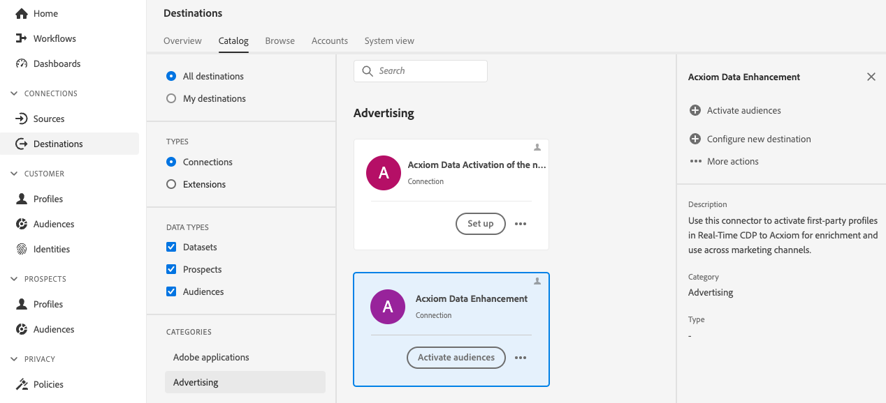
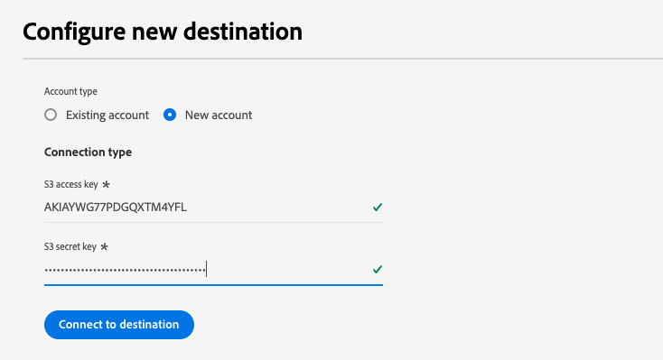
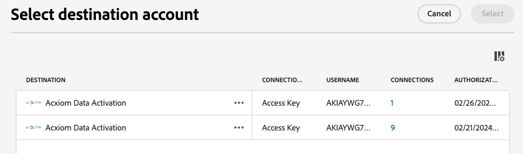
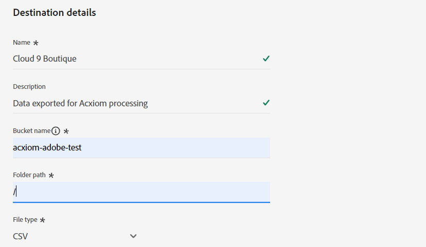

# [!DNL Acxiom Data Enhancement] destination connection

>[!NOTE]
>
>The [!DNL Acxiom Data Enhancement] destination is in beta.  This destination connector and documentation page are created and maintained by the Acxiom team. For any inquiries or update requests, please contact them directly at acxiom-adobe-help@acxiom.com.

## Overview {#overview}

Use the [!DNL Acxiom Data Enhancement] connector to supply additional descriptive data to your customer profiles, for use in analytics, segmentation, and targeting applications. With hundreds of elements available, this allows you to better segment and model data, resulting in more accurate targeting and predictive modeling.

This tutorial provides steps to create an [!DNL Acxiom Data Enhancement] destination connection and dataflow using the Adobe Experience Platform user interface. This connector is used to deliver data to Acxiom enhancement service using Amazon S3 as a drop point.

## Use cases {#use-cases}

To help you better understand how and when you should use the [!DNL Acxiom Data Enhancement] destination, here are sample use cases that Adobe Experience Platform customers can solve by using this destination.

### Enhance Customer data {#enhance-customer-data}

This connector should be used by marketing professionals aiming to enhance the effectiveness of their outreach strategies by appending selected descriptive elements to their customer profiles and use these to better target campaigns.

For example, as a marketer, you might want to deepen your understanding of your existing audiences by enriching their profiles with additional data. Doing so will improve your segmentation and targeting strategies, leading to a boost in campaign personalization and conversion.

The use case is executed through a combination of both destination and source connectors.

You would start by exporting your existing customer records for enrichment using this destination connector. Acxiom's service would search for the file, retrieve it, enrich it with Acxiom's data and generate a file. 

The customer would then use the corresponding [Acxiom Data Ingestion](/help/sources/connectors/data-partners/acxiom-data-ingestion.md) source card to ingest the hydrated customer profiles back into Adobe Real-Time CDP.

## Prerequisites {#prerequisites}

>[!IMPORTANT]
>
>* To connect to the destination, you need the **[!UICONTROL View Destinations]** and **[!UICONTROL Manage Destinations]**, **[!UICONTROL Activate Destinations]**, **[!UICONTROL View Profiles]**, and **[!UICONTROL View Segments]** [access control permissions](/help/access-control/home.md#permissions). Read the [access control overview](/help/access-control/ui/overview.md) or contact your product administrator to obtain the required permissions.
>* To export *identities*, you need the **[!UICONTROL View Identity Graph]** [access control permission](/help/access-control/home.md#permissions).   {width="100" zoomable="yes"}

## Supported audiences {#supported-audiences}

This section describes which type of audiences you can export to this destination.

| Audience origin             | Supported | Description                                                                                                         | 
|-----------------------------|-----------|---------------------------------------------------------------------------------------------------------------------|
| [!DNL Segmentation Service] | ✓         | Audiences generated through the Experience Platform [Segmentation Service](../../../segmentation/home.md).          |
| Custom uploads              | x         | Audiences [imported](../../../segmentation/ui/overview.md#import-audience) into Experience Platform from CSV files. |

{style="table-layout:auto"}

## Export type and frequency {#export-type-frequency}

Refer to the table below for information about the destination export type and frequency.

| Item             | Type                           | Notes                                                                                                                                                                                                                                                                                                                  |
|------------------|--------------------------------|------------------------------------------------------------------------------------------------------------------------------------------------------------------------------------------------------------------------------------------------------------------------------------------------------------------------|
| Export type      | **[!UICONTROL Profile-based]** | You are exporting all members of a segment, together with the desired schema fields (for example: email address, phone number, last name), as chosen in the select profile attributes screen of the [destination activation workflow](/help/destinations/ui/activate-batch-profile-destinations.md#select-attributes). |
| Export frequency | **[!UICONTROL Batch]**         | Batch destinations export files to downstream platforms in increments of three, six, eight, twelve, or twenty-four hours. Read more about [batch file-based destinations](/help/destinations/destination-types.md#file-based).                                                                                         |

{style="table-layout:auto"}

## Connect to the destination {#connect}

>[!IMPORTANT]
>
>To connect to the destination, you need the **[!UICONTROL View Destinations]** and **[!UICONTROL Manage and Activate Dataset Destinations]** [access control permissions](/help/access-control/home.md#permissions). Read the [access control overview](/help/access-control/ui/overview.md) or contact your product administrator to obtain the required permissions.

To connect to this destination, follow the steps described in the [destination configuration tutorial](../../ui/connect-destination.md). In the destination configuration workflow, fill in the fields listed in the two sections below.

### Authenticate to destination {#authenticate}

To authenticate to the destination, fill in the required fields and select **[!UICONTROL Connect to destination]**.

In order to access your bucket on Experience Platform, you need to provide valid values for the following credentials:

| Credential    | Description                                                                                              |
|---------------|----------------------------------------------------------------------------------------------------------|
| S3 Access key | The access key ID for your bucket. You can retrieve this value from the [!DNL Acxiom] team.              |
| S3 Secret key | The secret key ID for your bucket. You can retrieve this value from the [!DNL Acxiom] team.              |
| Bucket name   | This is your bucket where files will be shared. You can retrieve this value from the [!DNL Acxiom] team. |

### New Account

To define a new Acxiom Managed S3 location: 

### Existing Account

Accounts already defined using the [!DNL Acxiom Data Enhancement] destination appear in a list pop-up. When selected, you can see details on the account in the right rail. View the example from the UI, when you navigate to **[!UICONTROL Destinations]** > **[!UICONTROL Accounts]**;

### Fill in destination details {#destination-details}

To configure details for the destination, fill in the required and optional fields below. An asterisk next to a field in the UI indicates that the field is required.

* **Name (Required)** - The name the destination will be saved under
* **Description** -  Short explanation of the destination's purpose
* **Bucket Name (Required)** - Name of the Amazon S3 bucket set up on S3
* **Folder Path (Required)** - If subdirectories in a bucket are used a path must be defined, or '/' to reference the root path.
* **File Type** - Select the format Experience Platform should use for the exported files. Currently, the only file type Acxiom processing will be expecting is CSV

>[!IMPORTANT]
>
>When selecting the CSV option, *Delimiter*, *Quote Character*, *Escape Character*, *Empty Value*, *Null Value*, *Compression format*, and *Include manifest file* options will be presented, the following document explains these settings in more detail [configure the formatting options](../../ui/batch-destinations-file-formatting-options.md).

### Enable alerts {#enable-alerts}

You can enable alerts to receive notifications on the status of the dataflow to your destination. Select an alert from the list to subscribe to receive notifications on the status of your dataflow. For more information on alerts, see the guide on [subscribing to destinations alerts using the UI](../../ui/alerts.md).

When you are finished providing details for your destination connection, select **[!UICONTROL Next]**.

## Activate audiences to this destination {#activate}

>[!IMPORTANT]
>
>* To activate data, you need the **[!UICONTROL View Destinations]**, **[!UICONTROL Activate Destinations]**, **[!UICONTROL View Profiles]**, and **[!UICONTROL View Segments]** [access control permissions](/help/access-control/home.md#permissions). Read the [access control overview](/help/access-control/ui/overview.md) or contact your product administrator to obtain the required permissions.
>* To export *identities*, you need the **[!UICONTROL View Identity Graph]** [access control permission](/help/access-control/home.md#permissions).   {width="100" zoomable="yes"}

Read [Activate audience data to batch profile export destinations](/help/destinations/ui/activate-batch-profile-destinations.md) for instructions on activating audiences to this destination.

### Mapping suggestions

The correct processing of files on the Acxiom side requires name and address elements. While not all elements are required, providing as much as possible will aid in successful matching.

Mapping suggestions are provided in the table below listing attributes on your destination side that are used by Acxiom processing that customers can map profile attributes to. Treat these elements as suggestions as not all elements are required and the source values will depend on the needs of the account.

| Target Field | Source Description                                          |
|--------------|-------------------------------------------------------------|
| name         | The `person.name.fullName` value in Experience Platform.      |
| firstName    | The `person.name.firstName` value in Experience Platform.     |
| lastName     | The `person.name.lastName` value in Experience Platform.      |
| address1     | The `mailingAddress.street1` value in Experience Platform.    |
| address2     | The `mailingAddress.street2` value in Experience Platform.    |
| city         | The `mailingAddress.city` value in Experience Platform.       |
| state        | The `mailingAddress.state` value in Experience Platform.      |
| zip          | The `mailingAddress.postalCode` value in Experience Platform. |

>[!NOTE]
>
>If you map additional fields not listed above in the dataflow, these will be included in the data export, but will be ignored by Acxiom processing.

## Validate data export {#exported-data}

To verify if data has been exported successfully, check your [!DNL Amazon S3 Storage] bucket and make sure that the exported files contain the expected profile populations.

## Next steps

By following this tutorial, you have successfully created a dataflow to export profile data from Experience Platform to your [!DNL Acxiom] managed S3 location. Next, you need to contact your Acxiom representative with the name of the account, file names, and the bucket path so that processing can set up.

## Data usage and governance {#data-usage-governance}

All [!DNL Adobe Experience Platform] destinations are compliant with data usage policies when handling your data. For detailed information on how [!DNL Adobe Experience Platform] enforces data governance, read the [Data Governance overview](/help/data-governance/home.md).

## Additional resources {#additional-resources}

*Acxiom Infobase:* https://www.acxiom.com/wp-content/uploads/2022/02/fs-acxiom-infobase_AC-0268-22.pdf
