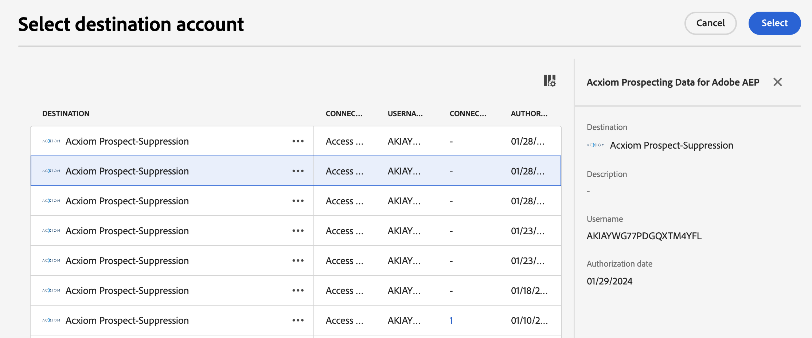
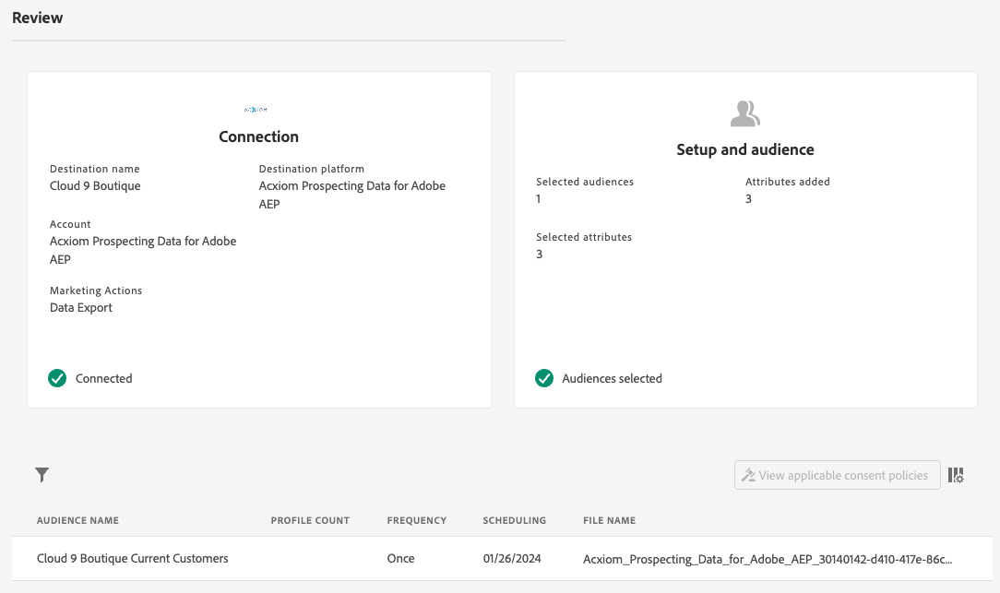

# [!DNL Acxiom Prospect-Suppression] destination connection

>[!NOTE]
>
>The [!DNL Acxiom Prospect-Suppression] destination is in beta. This destination connector and documentation page are created and maintained by the Acxiom team. For any inquiries or update requests, please contact them directly at acxiom-adobe-help@acxiom.com.

## Overview {#overview}

Use [!DNL Acxiom Prospect-Suppression] to deliver the most productive prospect audiences possible. This connector securely exports first party data from Real-Time Customer Data Platform and runs it through an award-winning hygiene and identity resolution which produces a data file to be used as a suppression list. This will be matched against the [!DNL Acxiom Global] database which enables the prospect lists to be tailored for import. Then, use the [[!DNL Acxiom Prospecting Data Import]](/help/sources/connectors/data-partners/acxiom-prospecting-data-import.md) source connector to prospect lists from Acxiom back into Real-Time CDP, with your known or converted customers removed. 

Acxiom offers the industry's best-performing audiences with the largest catalog of over 12,000 global data attributes specifically focused on providing personalized experiences. Tap into limitless combinations of high-quality data to create and distribute audiences to meet specific campaign needs.

This tutorial provides steps to create an [!DNL Acxiom Prospect-Suppression] destination connection and dataflow using the Adobe Experience Platform user interface. This connector is used to deliver data to the Acxiom prospect service using Amazon S3 as a drop point. Contact your Acxiom account representative once you start exporting files to the Amazon S3 drop point.

## Use cases {#use-cases}

To help you better understand how and when you should use the [!DNL Acxiom Prospect-Suppression] destination, here are sample use cases that Adobe Experience Platform customers can solve by using this destination.

### Create a suppression list for prospecting datasets {#create-suppression-list}

Marketing professionals aiming to enhance the effectiveness of their outreach strategies often employ the creation of a suppression list. This list includes existing customers and specific segments, ensuring their exclusion from prospecting activities during targeted campaigns. This strategic approach helps refine the audience, avoids redundant communication, and contributes to a more focused and efficient marketing effort.

For example, as a marketer, you may want to broaden your campaign reach by adding targeted prospect profiles to your campaigns based on segmentation and suppression criteria that you have provided.

The use case is executed through a combination of both destination and source connectors.

You would initially start by exporting your existing customer profiles using this destination connector to be used as a suppression file. This ensures that no existing customer records are included.

Acxiom's service would search for the file, retrieve it and use it alongside additional selection criteria and generate a prospect file. You would then use the corresponding [[!DNL Acxiom Prospecting Data Import]](/help/sources/connectors/data-partners/acxiom-prospecting-data-import.md) source connector to ingest the prospect profiles into Adobe Real-Time CDP.

## Prerequisites {#prerequisites}

>[!IMPORTANT]
>
>* To connect to the destination, you need the **[!UICONTROL View Destinations]** and **[!UICONTROL Manage Destinations]**, **[!UICONTROL Activate Destinations]**, **[!UICONTROL View Profiles]**, and **[!UICONTROL View Segments]** [access control permissions](/help/access-control/home.md#permissions). Read the [access control overview](/help/access-control/ui/overview.md) or contact your product administrator to obtain the required permissions.
>* To export *identities*, you need the **[!UICONTROL View Identity Graph]** [access control permission](/help/access-control/home.md#permissions).   {width="100" zoomable="yes"}

## Supported audiences {#supported-audiences}

This section describes which type of audiences you can export to this destination.

| Audience origin             | Supported | Description                                                                                                         | 
|-----------------------------|-----------|---------------------------------------------------------------------------------------------------------------------|
| [!DNL Segmentation Service] | ✓         | Audiences generated through the Experience Platform [Segmentation Service](../../../segmentation/home.md).          |
| Custom uploads              | x         | Audiences [imported](../../../segmentation/ui/overview.md#import-audience) into Experience Platform from CSV files. |

{style="table-layout:auto"}

## Export type and frequency {#export-type-frequency}

Refer to the table below for information about the destination export type and frequency.

| Item             | Type                           | Notes                                                                                                                                                                                                                                                                                                                  |
|------------------|--------------------------------|------------------------------------------------------------------------------------------------------------------------------------------------------------------------------------------------------------------------------------------------------------------------------------------------------------------------|
| Export type      | **[!UICONTROL Profile-based]** | You are exporting all members of a segment, together with the desired schema fields (for example: email address, phone number, last name), as chosen in the select profile attributes screen of the [destination activation workflow](/help/destinations/ui/activate-batch-profile-destinations.md#select-attributes). |
| Export frequency | **[!UICONTROL Batch]**         | Batch destinations export files to downstream platforms in increments of three, six, eight, twelve, or twenty-four hours. Read more about [batch file-based destinations](/help/destinations/destination-types.md#file-based).                                                                                         |

{style="table-layout:auto"}

## Connect to the destination {#connect}

>[!IMPORTANT]
> 
>To connect to the destination, you need the **[!UICONTROL View Destinations]** and **[!UICONTROL Manage Destinations]** [access control permissions](/help/access-control/home.md#permissions). Read the [access control overview](/help/access-control/ui/overview.md) or contact your product administrator to obtain the required permissions.

To connect to this destination, follow the steps described in the [destination configuration tutorial](../../ui/connect-destination.md). In the destination configuration workflow, fill in the fields listed in the two sections below.

### Authenticate to destination {#authenticate}

To authenticate to the destination, fill in the required fields and select **[!UICONTROL Connect to destination]**.

In order to access your bucket on Experience Platform, you need to provide valid values for the following credentials:

| Credential    | Description                                                                                              |
|---------------|----------------------------------------------------------------------------------------------------------|
| S3 Access key | The access key ID for your bucket. You can retrieve this value from the [!DNL Acxiom] team.              |
| S3 Secret key | The secret key ID for your bucket. You can retrieve this value from the [!DNL Acxiom] team.              |
| Bucket name   | This is your bucket where files will be shared. You can retrieve this value from the [!DNL Acxiom] team. |

### New Account

To Define a new Acxiom Managed S3 location:

### Existing Account

Accounts already defined using the [!DNL Acxiom Prospect Suppression] destination appear in a list pop-up. When selected, you can see details on the account in the right rail. View the example from the UI, when you navigate to **[!UICONTROL Destinations]** > **[!UICONTROL Accounts]**:

### Fill in destination details {#destination-details}

To configure details for the destination, fill in the required and optional fields below. An asterisk next to a field in the UI indicates that the field is required.

* **Name (Required)** - The name the destination will be saved under
* **Description** -  Short explanation of the destination's purpose
* **Bucket Name (Required)** - Name of the Amazon S3 bucket set up on S3
* **Folder Path (Required)** - If subdirectories in a bucket are used a path must be defined, or '/' to reference the root path.
* **File Type** - Select the format Experience Platform should use for the exported files. Currently, the only file type Acxiom processing will be expecting is CSV 

>[!IMPORTANT]
>
>When selecting the CSV option, *Delimiter*, *Quote Character*, *Escape Character*, *Empty Value*, *Null Value*, *Compression format*, and *Include manifest file* options will be presented, the following document explains these settings in more detail [configure the formatting options](../../ui/batch-destinations-file-formatting-options.md).

### Enable alerts {#enable-alerts}

You can enable alerts to receive notifications on the status of the dataflow to your destination. Select an alert from the list to subscribe to receive notifications on the status of your dataflow. For more information on alerts, see the guide on [subscribing to destinations alerts using the UI](../../ui/alerts.md).

When you are finished providing details for your destination connection, select **[!UICONTROL Next]**.

## Activate audiences to this destination {#activate}

>[!IMPORTANT]
>
>* To activate data, you need the **[!UICONTROL View Destinations]**, **[!UICONTROL Activate Destinations]**, **[!UICONTROL View Profiles]**, and **[!UICONTROL View Segments]** [access control permissions](/help/access-control/home.md#permissions). Read the [access control overview](/help/access-control/ui/overview.md) or contact your product administrator to obtain the required permissions.
>* To export *identities*, you need the **[!UICONTROL View Identity Graph]** [access control permission](/help/access-control/home.md#permissions).   {width="100" zoomable="yes"}

Read [Activate audience data to batch profile export destinations](/help/destinations/ui/activate-batch-profile-destinations.md) for instructions on activating audiences to this destination.

### Mapping suggestions

Processing requires name and address elements, while not all elements are required providing as much as possible will aid in successful matching.  Mapping suggestions are provided in the table below listing attributes on your destination side that are used by Acxiom processing that customers can map profile attributes to.  This should be treated as suggestions as not all elements are required and the source values will depend on the needs of the account.

| Target Field | Source Description                                          |
|--------------|-------------------------------------------------------------|
| name         | The `person.name.fullName` value in Experience Platform.      |
| firstName    | The `person.name.firstName` value in Experience Platform.     |
| lastName     | The `person.name.lastName` value in Experience Platform.      |
| address1     | The `mailingAddress.street1` value in Experience Platform.    |
| address2     | The `mailingAddress.street2` value in Experience Platform.    |
| city         | The `mailingAddress.city` value in Experience Platform.       |
| state        | The `mailingAddress.state` value in Experience Platform.      |
| zip          | The `mailingAddress.postalCode` value in Experience Platform. |

{style="table-layout:auto"}

>[!NOTE]
>
>Additional fields not listed above will be included in the export, but will be ignored by Acxiom processing. 

## Review your dataflow

Use the review page for a summary of your dataflow prior to submission

## Validate data export {#exported-data}

To verify if data has been exported successfully, check your [!DNL Amazon S3 Storage] bucket and make sure that the exported files contain the expected profile populations.

## Next steps

By following this tutorial, you have successfully created a dataflow to export batch data from Experience Platform to your [!DNL Acxiom] managed S3 location. You would need to contact your Acxiom representative with the name of the account, filename, and the bucket path so that processing can set up.

## Data usage and governance {#data-usage-governance}

All [!DNL Adobe Experience Platform] destinations are compliant with data usage policies when handling your data. For detailed information on how [!DNL Adobe Experience Platform] enforces data governance, read the [Data Governance overview](/help/data-governance/home.md).

## Additional resources {#additional-resources}

*Acxiom Audience Data and Distribution:* https://www.acxiom.com/customer-data/audience-data-distribution/
