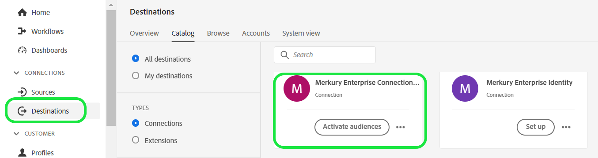
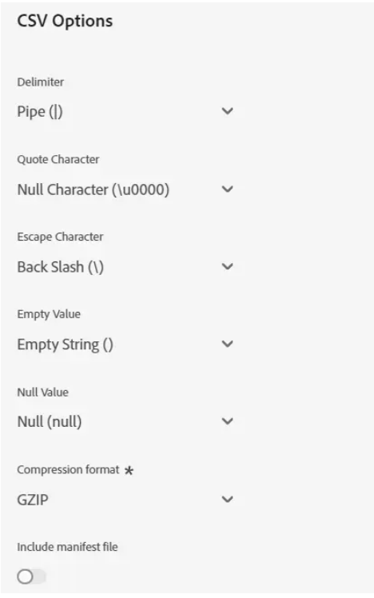
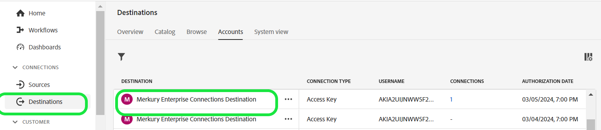

# Merkury Enterprise Connections Destination

>[!NOTE]
>
>The destination connector and documentation page are created and maintained by the [!DNL Merkury] team. For any inquiries or update requests, please contact your [!DNL Merkury] account representative.

## Overview

Use the [!DNL Merkury Enterprise Connections] destination to securely deliver audiences to [!DNL Merkury]. [!DNL Merkury] provides marketers easy matching and delivery of person-based audiences to [!DNL Merkury]'s 80+ premium addressable TV/CTV, publisher, and ad-tech connections. [!DNL Merkury] is powered by a comprehensive US adult consumer identity graph of 268+ million people.

Follow the steps in this documentation page to create a [!DNL Merkury Connections] destination connection and activate audiences using the Adobe Experience Platform user interface. 

>[!NOTE]
>
>If you are looking to activate audiences to media destinations with your [!DNL Merkury Connect] account, use the [!DNL Merkury Connections] destination instead.

## Use Cases

* **Digital Media Activation**: Easy matching and delivery of your audience profiles to [!DNL Merkury]'s 50+ premium addressable publishers and ad-tech connections.
* **Improve Efficiencies**: Enhance your cookie-less, addressable media reach, improve targeting efficiencies and Return on Advertising Spend (ROAS).

## Prerequisites

>[!IMPORTANT]
>
>* To connect to the destination, you need the **View Destinations** and **Manage Destinations**, **Activate Destinations**, **View Profiles**, and **View Segments** [[access control permissions]](https://experienceleague.adobe.com/en/docs/experience-platform/access-control/home#permissions). Read the [[access control overview]](https://experienceleague.adobe.com/en/docs/experience-platform/access-control/ui/overview) or contact your product administrator to obtain the required permissions.
>* To export *identities*, you need the **View Identity Graph** [[access control permission]](https://experienceleague.adobe.com/en/docs/experience-platform/access-control/home#permissions).\

## Supported identities {#supported-identities}

|Target Identity|Description|Considerations|
|---|---|---|
|GAID|Google Advertising ID|Select the GAID target identity when your source identity is a GAID namespace.|
|IDFA|Apple ID for Advertisers|Select the IDFA target identity when your source identity is an IDFA namespace.|
|ECID|Experience Cloud ID|A namespace that represents ECID. This namespace can also be referred to by the following aliases: "Adobe Marketing Cloud ID", "Adobe Experience Cloud ID", "Adobe Experience Platform ID". See the following document on [ECID](/help/identity-service/features/ecid.md) for more information.|
|phone_sha256|Phone numbers hashed with the SHA256 algorithm|Both plain text and SHA256 hashed phone numbers are supported by Adobe Experience Platform. When your source field contains unhashed attributes, check the **[!UICONTROL Apply transformation]** option, to have [!DNL Experience Platform] automatically hash the data on activation.|
|email_lc_sha256|Email addresses hashed with the SHA256 algorithm|Both plain text and SHA256 hashed email addresses are supported by Adobe Experience Platform. When your source field contains unhashed attributes, check the **[!UICONTROL Apply transformation]** option, to have [!DNL Experience Platform] automatically hash the data on activation.|
|extern_id|Custom user IDs|Select this target identity when your source identity is a custom namespace.|

{style="table-layout:auto"}

## Supported audiences

This section describes which type of audiences you can export to this destination.

|**Audience**|**Supported**|**Description origin**|            
|---|---|---|      
|Segmentation Service|✓|Audiences generated through the Experience Platform [[Segmentation Service]](https://experienceleague.adobe.com/en/docs/experience-platform/segmentation/home).|
Custom uploads|X|Audiences [[imported]](https://experienceleague.adobe.com/en/docs/experience-platform/segmentation/ui/overview#import-audience) into Experience Platform from CSV files.

{style="table-layout:auto"}

## Export type and frequency

Refer to the table below for information about the destination export type and frequency.

| **Item** | **Type** | **Notes**|
|---|---|---|  
|Export type|**Profile-based**|You are exporting all members of a segment, together with the desired schema fields (for example: email address, phone number, last name), as chosen in the select profile attributes screen of the [[destination activation workflow]](https://experienceleague.adobe.com/en/docs/experience-platform/destinations/ui/activate/activate-batch-profile-destinations#select-attributes).|
|Frequency|**Batch**|Batch destinations export files to downstream platforms in increments of three, six, eight, twelve, or twenty-four hours. Read more about [[batch file-based frequency destinations]](https://experienceleague.adobe.com/en/docs/experience-platform/destinations/destination-types#file-based).|

{style="table-layout:auto"}

## Connect to the destination

>[!IMPORTANT]
>
>To connect to the destination, you need the **View Destinations** and **Manage and Activate Dataset Destinations** [[access control permissions]](https://experienceleague.adobe.com/en/docs/experience-platform/access-control/home#permissions). Read the [[access control overview]](https://experienceleague.adobe.com/en/docs/experience-platform/access-control/ui/overview) or contact your product administrator to obtain the required permissions.

To connect to this destination, follow the steps described in the [[destination configuration tutorial]](https://experienceleague.adobe.com/en/docs/experience-platform/destinations/ui/connect-destination). In the destination configuration workflow, fill in the fields listed in the two sections below.

### Authenticate to destination

To authenticate to the destination, fill in the required fields and select **Connect to destination**.

To access your bucket on Experience Platform, you need to provide valid values for the following credentials:

| **Credential** | **Description** |
|---|---|
|Access key|The access key ID for your bucket. You can retrieve this value from the Merkury team.|
|Secret key|The secret key ID for your bucket. You can retrieve this value from the Merkury team.|
|Bucket name|This is your bucket where files will be shared. You can retrieve this value from the Merkury team.|

{style="table-layout:auto"}

### Fill in destination details

To configure details for the destination, fill in the required and optional fields below. An asterisk next to a field in the UI indicates that the field is required.

* **Name (Required)** - The name the destination will be saved under
* **Description** - Short explanation of the destination's purpose
* **Bucket Name (Required)** - Name of the Amazon S3 bucket set up on S3
* **Folder Path (Required)** - If subdirectories in a bucket are used a path must be defined, or '/' to reference the root path.
* **File Type** - Select the format Experience Platform should use for the exported files. Consult your Merkury team for the expected file type for your account.

>[!NOTE]
>
>When selecting the CSV option, Delimiter, Quote Character, Escape Character, Empty Value, Null Value, Compression format, and Include manifest file options will be presented, consult your Merkury team for the appropriate settings for your account.

### Existing Account

Accounts already defined using the Merkury Enterprise Connections destination appear in a list pop-up. When selected, you can see details on the account in the right rail. View the example from the UI, when you navigate to **Destinations** > **Accounts**:

## Enable alerts

You can enable alerts to receive notifications on the status of the dataflow to your destination. Select an alert from the list to subscribe to receive notifications on the status of your dataflow. For more information on alerts, see the guide on [subscribing to destinations alerts using the UI](https://experienceleague.adobe.com/en/docs/experience-platform/destinations/ui/alerts).

When you are finished providing details for your destination connection, select **Next**.

## Activate audiences to this destination

>[!IMPORTANT]
>
>* To activate data, you need the **View Destinations**, **Activate Destinations**, **View Profiles**, and **View Segments** access control permissions. Read the access control overview or contact your product administrator to obtain the required permissions.
>* To export identities, you need the **View Identity Graph** access control permission.

Read [Activate audience data to batch profile export destinations](https://experienceleague.adobe.com/en/docs/experience-platform/destinations/ui/activate/activate-batch-profile-destinations) for instructions on activating audiences to this destination.

## Mapping suggestions

The correct processing of files on the [!DNL Merkury] side requires name and address elements. While not all elements are required, providing as much as possible will aid in successful matching.

Mapping suggestions are provided in the table below listing attributes on your destination side that are used by [!DNL Merkury] processing that customers can map profile attributes to. Treat these elements as suggestions as not all elements are required, and the source values will depend on the needs of the account.

|Target Field|Source Description|
|---|---|
|id|Identity field to be used to map [!DNL Merkury] data to Experience Platform through the [!DNL Merkury Enterprise Identity] Source connector|
|Input_First_Name|The `person.name.firstName` value in Experience Platform.|
|Input_Last_Name|The `person.name.lastName` value in Experience Platform.|
|Input_Address_Line_1|The `mailingAddress.street` value in Experience Platform.|
|Input_City|The `mailingAddress.city` value in Experience Platform.|
|Input_State_Province_Code|The `mailingAddress.state` value in Experience Platform. Use if the state is in the two character code form.|
|Input_State_Province_Name|The `mailingAddress.state` value in Experience Platform. Use if the state is the full state name|
|Input_Postal_Code|The `mailingAddress.postalCode` value in Experience Platform.|
|Input_Email_Address|The value you want map as the profiles email address.|
|Input_Phone|The value you want to map as the profiles phone number.|

{style="table-layout:auto"}

## Validate data export

To verify if data has been exported successfully, check your Amazon S3 Storage bucket, and make sure that the exported files contain the expected profile populations.

## Data usage and governance

All Adobe Experience Platform destinations are compliant with data usage policies when handling your data. For detailed information on how Adobe Experience Platform enforces data governance, read the [Data Governance overview](https://experienceleague.adobe.com/en/docs/experience-platform/data-governance/home).

## Next steps

By following this tutorial, you have successfully created a dataflow to export profile data from Experience Platform to your [!DNL Merkury] managed S3 location. Next, you need to contact your [!DNL Merkury] representative with the name of the account, file names, and the bucket path so that processing can set up.
