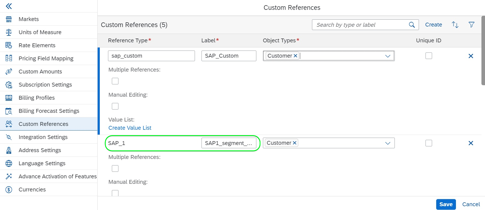

# [!DNL SAP Commerce] connection

[!DNL SAP Commerce], formerly known as [[!DNL Hybris]](https://www.sap.com/india/products/acquired-brands/what-is-hybris.html), is a cloud-based e-commerce platform solution for B2B and B2C enterprises and available as part of the SAP Customer Experience portfolio. [[!DNL SAP] Subscription Billing](https://www.sap.com/products/financial-management/subscription-billing.html) is a product under the portfolio and enables complete subscription lifecycle management with simplified selling and payment experiences through standardized integrations.

This [!DNL Adobe Experience Platform] [destination](/help/destinations/home.md) uses the [[!DNL SAP Subscription Billing] customer management API](https://api.sap.com/api/BusinessPartner_APIs/path/PUT_customers-customerNumber), to update your customer details within [!DNL SAP Commerce] from an existing Experience Platform audience after activation.

Instructions to authenticate to your [!DNL SAP Commerce] instance are further below, in the [Authenticate to destination](#authenticate) section.

## Use cases {#use-cases}

To help you better understand how and when you should use the [!DNL SAP Commerce] destination, here is a sample use case that Adobe Experience Platform customers can solve by using this destination.

[!DNL SAP Commerce] customers store information about individuals or organizational entities who interact with your business. Your team uses the customers existing in [!DNL SAP Commerce] to build the Experience Platform audiences. After sending these audiences to [!DNL SAP Commerce], their information is updated and each customer is assigned a property with its value as the audience name that indicates which audience the customer belongs to.

## Prerequisites {#prerequisites}

Refer to the sections below for any prerequisites that you must set up in Experience Platform and [!DNL SAP Commerce] and for information that you must gather before working with the [!DNL SAP Commerce] destination.

### Experience Platform prerequisites {#prerequisites-in-experience-platform}

Before activating data to the [!DNL SAP Commerce] destination, you must have a [schema](/help/xdm/schema/composition.md), a [dataset](https://experienceleague.adobe.com/docs/platform-learn/tutorials/data-ingestion/create-datasets-and-ingest-data.html), and [audiences](https://experienceleague.adobe.com/docs/platform-learn/tutorials/audiences/create-audiences.html) created in [!DNL Experience Platform].

Refer to Experience Platform documentation for [Audience Membership Details schema field group](/help/xdm/field-groups/profile/segmentation.md) if you need guidance on audience statuses.

### Prerequisites for the [!DNL SAP Commerce] destination {#prerequisites-destination}

Note the following prerequisites in order to export data from Platform to your [!DNL SAP Commerce] account:

#### You must have an [!DNL SAP Subscription Billing] account {#prerequisites-account}

In order to export data from Platform to your [!DNL SAP Commerce] account, you need to have an [!DNL SAP Subscription Billing] account. If you do not have a valid billing account, contact your [!DNL SAP] account manager. Refer to the [[!DNL SAP] Platform Configuration](https://help.sap.com/doc/5fd179965d5145fbbe7f2a7aa1272338/latest/en-US/PlatformConfiguration.pdf) document for additional details.

#### Generate a service key {#prerequisites-service-key}

* The [!DNL SAP Commerce] service key allows you to access the [!DNL SAP Subscription Billing] API through Experience Platform. Refer to the [!DNL SAP Commerce] [create a Service Key with Client ID and Client Secret](https://help.sap.com/docs/CLOUD_TO_CASH_OD/1216e7b79c984675b0a6f0005e351c74/87c11a0f5dc3494eaf3baa355925c030.html#create-a-service-key-with-client-id-and-client-secret) to create a service key. [!DNL SAP Commerce] requires the following:
  * Client ID
  * Client secret
  * URL. The URL pattern is as follows: `https://subscriptionbilling.authentication.eu10.hana.ondemand.com`. This value will be used later to obtain values for `Region` and `Endpoint`.

+++Select to see an example of the service key

```json
{ 
    "url": "https://eu10.revenue.cloud.sap/api",
    "uaa": {
        "clientid": "XXX",
        "clientsecret": "XXX",
        "url": "https://subscriptionbilling.authentication.eu10.hana.ondemand.com",
        "identityzone": "subscriptionbilling",
        "identityzoneid": "XXX",
        "tenantid": "XXX",
        "tenantmode": "dedicated",
        "sburl": "https://internal-xsuaa.authentication.eu10.hana.ondemand.com",
        "apiurl": "https://api.authentication.eu10.hana.ondemand.com",
        "verificationkey": "XXX",
        "xsappname": "XXX",
        "subaccountid": "XXX",
        "uaadomain": "authentication.eu10.hana.ondemand.com",
        "zoneid": "XXX",
        "credential-type": "binding-secret"
    },
    "vendor": "SAP"
}
```

+++

#### Create custom references in [!DNL SAP Subscription Billing] {#prerequisites-custom-reference}

To update the Experience Platform audience status in [!DNL SAP Subscription Billing], you need a custom reference field for each audience selected in Platform.

To create the custom references, Login to your [!DNL SAP Subscription Billing] account and navigate to the **[Master Data and Configuration]** > **[Custom References]** page. Next, select **[!UICONTROL Create]** to add a new reference for each audience selected in Platform. You will require these reference field names in the subsequent [Schedule audience export and example](#schedule-segment-export-example) step.

An example of how to create a custom **[!UICONTROL Reference Type]** within [!DNL SAP Subscription Billing] is shown below:


For additional guidance, refer to the [!DNL SAP Subscription Billing] [custom references](https://help.sap.com/docs/CLOUD_TO_CASH_OD/80d121f216af43648e79664efe5595f7/85696a63c8d8453a934e86c9413a25cf.html?version=2023-11-27) documentation.

### Gather required credentials {#gather-credentials}

To connect [!DNL SAP Commerce] to Experience Platform, you must provide values for the following connection properties:

| Credential | Description |
| --- | --- |
| Client ID | The value of `clientId` from the service key. |
| Client secret | The value of `clientSecret` from the service key. |
| Endpoint | The value of `url` from the service key, it is similar to `https://subscriptionbilling.authentication.eu10.hana.ondemand.com`. |
| Region | Your data center location. The region is present in the `url` and has a value similar to `eu10` or `us10`. For example if the `url` is `https://eu10.revenue.cloud.sap/api` you need `eu10`. |

## Guardrails {#guardrails}

API requests to the [!DNL SAP Cloud Management service] are subject to [Rate Limits](https://help.sap.com/docs/btp/sap-business-technology-platform/account-administration-rate-limiting). When the rate limit is exceeded, you will encounter a `HTTP 429 Too Many Requests` response status code .

## Supported identities {#supported-identities}

[!DNL SAP Commerce] supports update of identities described in the table below. Learn more about [identities](/help/identity-service/features/namespaces.md).

| Target Identity | Description | Considerations |
| --- | --- | --- |
| `customerNumberSAP` | A customer identifier of the individual or corporate customer already present in your [!DNL SAP Commerce] account.| Mandatory |

## Supported audiences {#supported-audiences}

This section describes all the audiences that you can export to this destination.

This destination supports the activation of all audiences generated through the Experience Platform [Segmentation Service](../../../segmentation/home.md).

This destination also supports the activation of the audiences described in the table below.

| Audience type | Description | 
---------|----------|
| [!DNL Segmentation Service] | ✓ | Audiences generated through the Experience Platform [Segmentation Service](../../../segmentation/home.md).|
| Custom uploads | ✓ | Audiences [imported](../../../segmentation/ui/overview.md#import-audience) into Experience Platform from CSV files. |

{style="table-layout:auto"}

## Export type and frequency {#export-type-frequency}

Refer to the table below for information about the destination export type and frequency.

| Item | Type | Notes |
---------|----------|---------|
| Export type | **[!UICONTROL Profile-based]** | <ul><li>You are exporting all members of an audience, together with the desired schema fields *(for example: email address, phone number, last name)*, according to your field mapping.</li><li> For each selected audience in Platform, the corresponding [!DNL SAP Commerce] additional attribute gets updated with its audience status from Platform.</li></ul> |
| Export frequency | **[!UICONTROL Streaming]** | <ul><li>Streaming destinations are "always on" API-based connections. When a profile is updated in Experience Platform based on audience evaluation, the connector sends the update downstream to the destination platform. Read more about [streaming destinations](/help/destinations/destination-types.md#streaming-destinations).</li></ul>|

{style="table-layout:auto"}

## Connect to the destination {#connect}

>[!IMPORTANT]
>
>To connect to the destination, you need the **[!UICONTROL Manage Destinations]** [access control permission](/help/access-control/home.md#permissions). Read the [access control overview](/help/access-control/ui/overview.md) or contact your product administrator to obtain the required permissions.

To connect to this destination, follow the steps described in the [destination configuration tutorial](../../ui/connect-destination.md). In the configure destination workflow, fill in the fields listed in the two sections below.

Within **[!UICONTROL Destinations]** > **[!UICONTROL Catalog]**, search for [!DNL SAP Commerce]. Alternatively you can locate it under the **[!UICONTROL eCommerce]** category.

### Authenticate to destination {#authenticate}

Fill in the required fields below. Refer to the [Generate a service key](#prerequisites-service-key) section for any guidance.

| Field | Description |
| --- | --- |
| **[!UICONTROL Client ID]** | The value of `clientId` from the service key. |
| **[!UICONTROL Client secret]** | The value of `clientSecret` from the service key. |
| **[!UICONTROL Endpoint]** | The value of `url` from the service key, it is similar to `https://subscriptionbilling.authentication.eu10.hana.ondemand.com`. |
| **[!UICONTROL Region]** | Your data center location. The region is present in the `url` and has a value similar to `eu10` or `us10`. For example if the `url` is `https://eu10.revenue.cloud.sap/api` you need `eu10`. |

To authenticate to the destination, select **[!UICONTROL Connect to destination]**.


If the details provided are valid, the UI displays a **[!UICONTROL Connected]** status with a green check mark. You can then proceed to the next step.

### Fill in destination details {#destination-details}

To configure details for the destination, fill in the required and optional fields below. An asterisk next to a field in the UI indicates that the field is required.


* **[!UICONTROL Name]**: A name by which you will recognize this destination in the future.
* **[!UICONTROL Description]**: A description that will help you identify this destination in the future.
* **[!UICONTROL Type of Customer]**: Select either ***Individual*** or ***Corporate*** depending on the entities within your audience. The [!DNL SAP Subscription Billing] [schema](https://api.sap.com/api/BusinessPartner_APIs/schema) switches the mandatory fields depending on this selection which is mapped to the `customerType` attribute. If the selection is ***Corporate***, then the mandatory mappings like `firstName` and `lastName` required for an individual customer will be ignored and `company` becomes mandatory and vice-versa.

### Enable alerts {#enable-alerts}

You can enable alerts to receive notifications on the status of the dataflow to your destination. Select an alert from the list to subscribe to receive notifications on the status of your dataflow. For more information on alerts, see the guide on [subscribing to destinations alerts using the UI](../../ui/alerts.md).

When you are finished providing details for your destination connection, select **[!UICONTROL Next]**.

## Activate audiences to this destination {#activate}

>[!IMPORTANT]
> 
>* To activate data, you need the **[!UICONTROL View Destinations]**, **[!UICONTROL Activate Destinations]**, **[!UICONTROL View Profiles]**, and **[!UICONTROL View Segments]** [access control permissions](/help/access-control/home.md#permissions). Read the [access control overview](/help/access-control/ui/overview.md) or contact your product administrator to obtain the required permissions.
>* To export *identities*, you need the **[!UICONTROL View Identity Graph]** [access control permission](/help/access-control/home.md#permissions). <br> {width="100" zoomable="yes"}

Read [Activate profiles and audiences to streaming audience export destinations](/help/destinations/ui/activate-segment-streaming-destinations.md) for instructions on activating audiences to this destination.

### Map attributes and identities {#map}

To correctly send your audience data from Adobe Experience Platform to the [!DNL SAP Commerce] destination, you must go through the field mapping step. Mapping consists of creating a link between your Experience Data Model (XDM) schema fields in your Platform account and their corresponding equivalents from the target destination. To correctly map your XDM fields to the [!DNL SAP Commerce] destination fields, follow the steps below:

#### Map the `customerNumberSAP` identity

The `customerNumberSAP` identity is a mandatory mapping for this destination. Follow the steps below to map it:
1. In the **[!UICONTROL Mapping]** step, select **[!UICONTROL Add new mapping]**. You can now see a new mapping row on the screen.

1. In the **[!UICONTROL Select source field]** window, choose the **[!UICONTROL Select identity namespace]** and select `customerNumberSAP`.

1. In the **[!UICONTROL Select target field]** window, choose the **[!UICONTROL Select identity namespace]** and select the `customerNumber` identity.


| Source Field | Target Field | Mandatory |
| --- | --- | --- |
| `IdentityMap: customerNumberSAP` | `Identity: customerNumber` | Yes |

An example with the identity mapping is shown below:


#### Mapping attributes

To add any other attributes you want to update between your XDM profile schema and your [!DNL SAP Subscription Billing] account, repeat the steps below:
1. In the **[!UICONTROL Mapping]** step, select **[!UICONTROL Add new mapping]**. You can now see a new mapping row on the screen.

1. In the **[!UICONTROL Select source field]** window, choose the **[!UICONTROL Select attributes]** category and select the XDM attribute.

1. In the **[!UICONTROL Select target field]** window, choose **[!UICONTROL Select custom attributes]** category and type the name of the [!DNL SAP Subscription Billing] attribute from the list of customer [schema](https://api.sap.com/api/BusinessPartner_APIs/schema) attributes.


>[!IMPORTANT]
>
> Target field names are case sensitive and should match the [!DNL SAP Subscription Billing] attribute names. The only exception for this is `country` where you should use `countryCode` instead. [!DNL SAP Subscription Billing] supports alpha-2 (ISO 3166) country codes. The value is case sensitive and must be between 0-3 characters, hence ensure you provide exactly as defined else you would encounter errors: `The country code {} does not exist` or `size must be between 0 and 3`.

#### Map `mandatory` attributes for the selected customer type

Mandatory attribute mappings depend on the **[!UICONTROL Type of Customer]** that you had selected. To map the mandatory attributes, select from the below:

>[!BEGINTABS]

>[!TAB Individual customer]

| Source Field | Target Field | Mandatory |
| --- | --- | --- |
| `xdm: person.lastName` | `Attribute: lastName` | Yes |
| `xdm: workAddress.countryCode` | `Attribute: countryCode` | Yes |

>[!TAB Corporate customer]

| Source Field | Target Field | Mandatory |
| --- | --- | --- |
| `xdm: b2b.companyName` | `Attribute: company` | Yes |
| `xdm: workAddress.countryCode` | `Attribute: countryCode` | Yes |

>[!ENDTABS]

#### Mapping additional attributes

You can then add any additional mappings between your XDM profile schema and the [!DNL SAP Subscription Billing] [schema](https://api.sap.com/api/BusinessPartner_APIs/schema) attributes for a customer as shown below:

>[!BEGINTABS]

>[!TAB Individual customer]

| Source Field | Target Field | Mandatory |
| --- | --- | --- |
| `xdm: person.name.firstName` | `Attribute: firstName` | No |
| `xdm: workAddress.street1` | `Attribute: street` | No |
| `xdm: workAddress.city` | `Attribute: city` | No |

An example with both mandatory and optional attribute mappings where the customer is an individual is shown below:


>[!TAB Corporate customer]

| Source Field | Target Field | Mandatory |
| --- | --- | --- |
| `xdm: workAddress.street1` | `Attribute: street` | No |
| `xdm: workAddress.city` | `Attribute: city` | No |

An example with both mandatory and optional attribute mappings where the customer is a corporate is shown below:


>[!ENDTABS]

When you are finished providing the mappings for your destination connection, select **[!UICONTROL Next]**.

### Schedule audience export and example {#schedule-segment-export-example}

When performing the [Schedule audience export](/help/destinations/ui/activate-segment-streaming-destinations.md#scheduling) step, you must manually map Platform audiences to the [attributes](#prerequisites-attribute) in [!DNL SAP Subscription Billing].

An example of the Schedule audience export step, with the location of the [!DNL SAP Commerce] **[!UICONTROL Mapping ID]** highlighted, is shown below:


To do this, select each segment, then enter name of the custom reference from [!DNL SAP Subscription Billing] in the [!DNL SAP Commerce] **[!UICONTROL Mapping ID]** destination connector field. For guidance on creating custom references, refer to the [Create custom references in [!DNL SAP Subscription Billing]](#prerequisites-custom-reference) section.

>[!IMPORTANT]
>
> Do not use the custom reference label as the value.
>

For example, if your selected Experience Platform audience is `sap_audience1` and you want its status to be updated into the [!DNL SAP Subscription Billing] custom reference `SAP_1`, specify this value in the [!DNL SAP_Commerce] **[!UICONTROL Mapping ID]** field.

An example **[!UICONTROL Reference Type]** from [!DNL SAP Subscription Billing] is shown below:


An example of the Schedule audience export step, with an audience selected and its corresponding [!DNL SAP Commerce] **[!UICONTROL Mapping ID]** highlighted, is shown below:


As shown the value within the **[!UICONTROL Mapping ID]** field should exactly match the [!DNL SAP Subscription Billing] **[!UICONTROL Reference Type]** value .

Repeat this section for each activated Platform audience.

Based on the image shown above where you have selected two audiences, the mapping would be as below:
| [!DNL SAP Commerce] audience name | [!DNL SAP Subscription Billing] **[!UICONTROL Reference Type]** | [!DNL SAP Commerce] **[!UICONTROL Mapping ID]** value |
| --- | --- | --- |
| sap_audience1 | `SAP_1` | `SAP_1` |
| SAP Audience2 | `SAP_2` | `SAP_2` |

## Validate data export {#exported-data}

To validate that you have correctly set up the destination, follow the steps below:

Log in to the [!DNL SAP Subscription Billing] account, then navigate to the **[!UICONTROL Contacts]** page to check the audience statuses. The list can be configured to display columns for the custom references and display the corresponding audience statuses.


## Data usage and governance {#data-usage-governance}

All [!DNL Adobe Experience Platform] destinations are compliant with data usage policies when handling your data. For detailed information on how [!DNL Adobe Experience Platform] enforces data governance, see the [Data Governance overview](/help/data-governance/home.md).

## Errors and troubleshooting {#errors-and-troubleshooting}

Refer to the [[!DNL SAP Subscription Billing] Error Types](https://help.sap.com/docs/CLOUD_TO_CASH_OD/987aec876092428f88162e438acf80d6/1a6a0dd6129c48e8b235190a1b5409fa.html) documentation page for a list of possible error types and their response codes.

## Additional resources {#additional-resources}

Additional useful information from the [!DNL SAP] documentation is below:
* [Onboard SAP Subscription Billing](https://help.sap.com/docs/CLOUD_TO_CASH_OD/1216e7b79c984675b0a6f0005e351c74/e4b8badf7d124026991e4ab6b57d2a33.html)

### Changelog

This section captures the functionality and significant documentation updates made to this destination connector.

+++ View changelog

|Release month|Update type|Description|
|---|---|---|
|January 2024| Initial release |Initial destination release and documentation publish. |

{style="table-layout:auto"}

+++