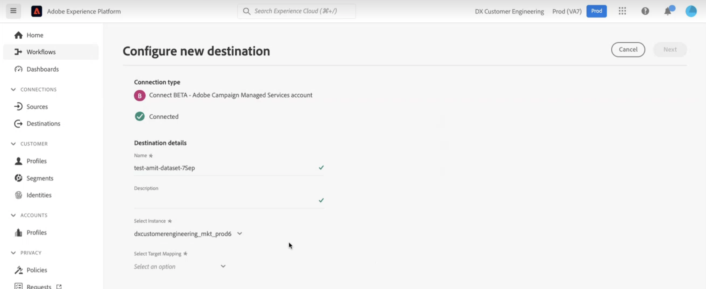
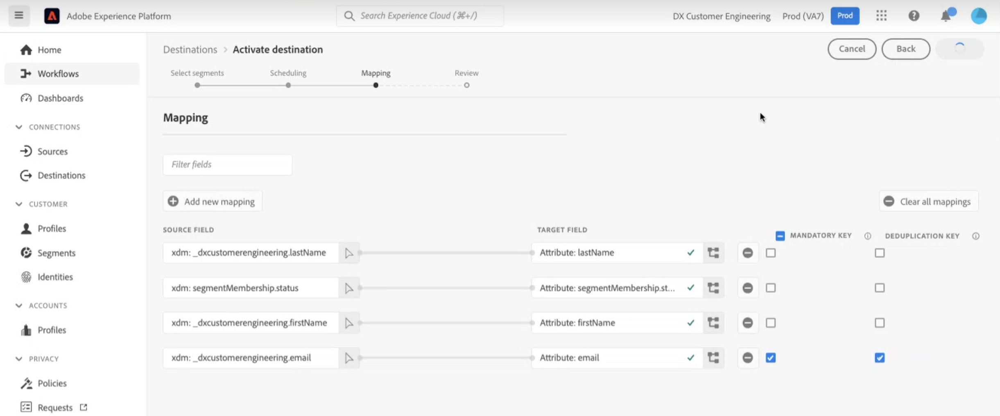
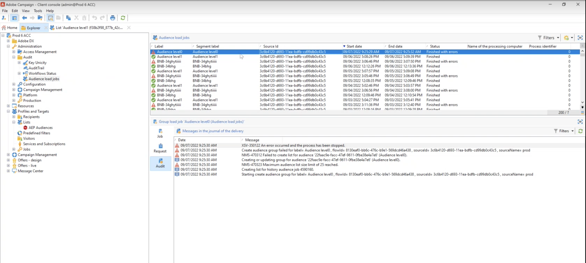

# Adobe Campaign Managed Cloud Services connection {#adobe-campaign-managed-services}

>[!IMPORTANT]
>
>This integration works with [Adobe Campaign version 8.4 or higher](https://experienceleague.adobe.com/docs/campaign/campaign-v8/new/release-notes.html?lang=en#release-8-4-1).

## Overview {#overview}

Adobe Campaign Managed Cloud Services provides a platform for designing cross-channel customer experiences and an environment for visual campaign orchestration, real-time interaction management and cross channel execution. [Get Started with Campaign](https://experienceleague.adobe.com/docs/campaign/campaign-v8/start/get-started.html)

Use Campaign to:
* Drive personalization and engagement through a single accessible view of the customer,
* Integrate email, mobile, online and offline channels into the customer journey,
* Automate the delivery of meaningful and timely messages and offers.

>[!IMPORTANT]
>
>Keep in mind the following guardrails when using the Adobe Campaign Managed Cloud Services connection:
>
>* A maximum of 50 segments can be [activated](#activate) for the destination,
>* For each segment, you can add up to 20 fields to [map](#map) to Adobe Campaign,
>* Data retention on Azure Blob storage Data Landing Zone (DLZ) : 7 day,
>* The activation frequency is 3 hours minimum.

## Use cases {#use-cases}

To help you better understand how and when you should use the Adobe Campaign Manage Service destination, here is a sample use case that Adobe Experience Platform customers can solve by using this destination.

Adobe Experience Platform creates a customer profile that incorporates information like the identity graph, behavioral data from analytics, merges offline and online data etc. With this integration, you can augment the segmentation capabilities that are already existing within Adobe Campaign with those Adobe Experience Platform powered audiences, and you can hence activate that data in Campaign.

For example, a sports attire company wants to leverage the Adobe Experience Platform powered smart segments and activate them using Adobe Campaign to reach out to their customer base across the different channels supported by Adobe Campaign. 

Once the messages are sent, they want to enhance the customer profile in Adobe Experience platform with experience data from Adobe Campaign such as sends, open and clicks.

The result is cross channel campaigns that are more consistent across the Adobe Experience cloud ecosystem and a rich customer profile that is quickly adapting and learning.

[Learn more on Adobe Campaign integration with Adobe Experience Platform](https://experienceleague.adobe.com/docs/campaign/campaign-v8/connect/ac-aep.html)

## Supported identities {#supported-identities}

*Adobe Campaign Managed Cloud Services* supports the activation of identities described in the table below. Learn more about [identities](/help/identity-service/namespaces.md).

|Target Identity|Description|Considerations|
|---|---|---|
|external_id|Custom user IDs|Select this target identity when your source identity is a custom namespace. We recommend using this identity and mapping it to the ID in your Campaign instance that represents customer (loyalty_ID, account_ID, customer_ID...)|
|ECID|Experience Cloud ID|A namespace that represents ECID. This namespace can also be referred to by the following aliases: "Adobe Marketing Cloud ID", "Adobe Experience Cloud ID", "Adobe Experience Platform ID". See the following document on [ECID](/help/identity-service/ecid.md) for more information.|
|email_lc_sha256|Email addresses hashed with the SHA256 algorithm|Both plain text and SHA256 hashed email addresses are supported by Adobe Experience Platform. When your source field contains unhashed attributes, check the **[!UICONTROL Apply transformation]** option, to have [!DNL Platform] automatically hash the data on activation.|
|phone_sha256|Phone numbers hashed with the SHA256 algorithm|Both plain text and SHA256 hashed phone numbers are supported by Adobe Experience Platform. When your source field contains unhashed attributes, check the **[!UICONTROL Apply transformation]** option, to have [!DNL Platform] automatically hash the data on activation.|
|GAID|Google Advertising ID|Select the GAID target identity when your source identity is a GAID namespace.|
|IDFA|Apple ID for Advertisers|Select the IDFA target identity when your source identity is an IDFA namespace.|

{style="table-layout:auto"}

## Export type and frequency {#export-type-frequency}

Refer to the table below for information about the destination export type and frequency.

| Item | Type | Notes |
---------|----------|---------|
| Export type | **[!UICONTROL Profile-based]** | You are exporting all members of a segment, together with the desired schema fields (for example: email address, phone number, last name), as chosen in the select profile attributes screen of the [destination activation workflow](/help/destinations/ui/activate-batch-profile-destinations.md#select-attributes).|
| Export frequency | **[!UICONTROL Batch]** | Batch destinations export files to downstream platforms in increments of three, six, eight, twelve, or twenty-four hours. Read more about [batch file-based destinations](/help/destinations/destination-types.md#file-based).|

{style="table-layout:auto"}

## Connect to the destination {#connect}

>[!IMPORTANT]
> 
>To connect to the destination, you need the **[!UICONTROL Manage Destinations]** [access control permission](/help/access-control/home.md#permissions). Read the [access control overview](/help/access-control/ui/overview.md) or contact your product administrator to obtain the required permissions.

To connect to this destination, follow the steps described in the [destination configuration tutorial](../../ui/connect-destination.md). In the configure destination workflow, fill in the fields listed in the two sections below.

### Fill in destination details {#destination-details}

To configure details for the destination, fill in the required and optional fields below. An asterisk next to a field in the UI indicates that the field is required.

*  **[!UICONTROL Name]**: A name by which you will recognize this destination in the future.
*  **[!UICONTROL Description]**: A description that will help you identify this destination in the future.
* **[!UICONTROL Select instance]**: Your **[!DNL Campaign]** marketing instance.
* **[!UICONTROL Target mapping]**: Select the target mapping that you are using in **[!DNL Adobe Campaign]** to send deliveries. [Learn more](https://experienceleague.adobe.com/docs/campaign/campaign-v8/profiles-and-audiences/add-profiles/target-mappings.html).

### Enable alerts {#enable-alerts}

You can enable alerts to receive notifications on the status of the dataflow to your destination. Select an alert from the list to subscribe to receive notifications on the status of your dataflow. For more information on alerts, refer to the guide on [subscribing to destinations alerts using the UI](../../ui/alerts.md).

When you are finished providing details for your destination connection, select **[!UICONTROL Next]**.

### Governance policy & enforcement actions {#governance}

Select the marketing actions applicable to the data that you want to export to the destination. For Adobe Campaign, we recommend you select the **[!UICONTROL Email Targeting]** marketing action.

For more information about marketing actions, see the [data usage policies overview](/help/data-governance/policies/overview.md) page.

## Activate segments to this destination {#activate}

>[!IMPORTANT]
> 
>To activate data, you need the **[!UICONTROL Manage Destinations]**, **[!UICONTROL Activate Destinations]**, **[!UICONTROL View Profiles]**, and **[!UICONTROL View Segments]** [access control permissions](/help/access-control/home.md#permissions). Read the [access control overview](/help/access-control/ui/overview.md) or contact your product administrator to obtain the required permissions.

Read [Activate audience data to batch profile export destinations](https://experienceleague.adobe.com/docs/experience-platform/destinations/ui/activate/activate-batch-profile-destinations.html) for instructions on activating audience data to this destination.

### Map attributes and identities {#map}

Select XDM fields to export with the profiles and map them to the corresponding Adobe Campaign fields.[Learn more on identity and attributes selection for email marketing destinations](overview.md)

1. Select source fields:

    * Select an **identifier** (For example: the email field) as source identity that uniquely identifies a profile in Adobe Experience Platform and Adobe Campaign.

    * Select all other **XDM source profile attributes** that need to be exported to Adobe Campaign.

    >[!NOTE]
    >
    >The "segmentMembershipStatus" field is a required mapping to reflect segmentMembership status. This field is added by default and cannot be modified or removed.

1. Map each field with its target field in Adobe Campaign. Available target fields are determined by the target mapping selected when [creating the destination](#destination-details).

1. Identify mandatory attributes and deduplication keys. Note that values in attributes marked as "Mandatory" or "Deduplication key" cannot be null.

    * [Mandatory attributes](../../ui/activate-batch-profile-destinations.md#mandatory-attributes) ensure that all profile records contain the selected attribute(s). For example: all exported profiles contain an email address. Recommendation is to set to mandatory both the identity field and the field used as deduplication key.
    * [A deduplication key](../../ui/activate-batch-profile-destinations.md#mandatory-attributes) is a primary key which determines the identity by which users want their profiles to be deduplicated.

      >[!IMPORTANT]
      >
      >Make sure that the deduplication key attribute's name matches a column name of the selected target mapping.

    

1. Once mapping has been performed, you can review and complete the destination configuration to start sending data to **[!DNL Campaign]**.
[Learn how to review and complete destination configuration](/help/destinations/destination-types.md#review).

## Exported data / Validate data export {#exported-data}

Once a destination has been activated, you can access the corresponding job and exported data in Campaign.

### Monitor data export jobs {#jobs}

Navigate to the **[!UICONTROL Administration]** > **[!UICONTROL Audit]** > **[!UICONTROL Audience load jobs]** menu to monitor all export jobs activated from Adobe Experience Platform.

### Access exported data {#data}

Navigate to the **[!UICONTROL Profile and target]** > **[!UICONTROL List]** > **[!UICONTROL AEP audiences]** menu  to access audiences created after activating a destination.

## Data usage and governance {#data-usage-governance}

All [!DNL Adobe Experience Platform] destinations are compliant with data usage policies when handling your data. For detailed information on how [!DNL Adobe Experience Platform] enforces data governance, read the [Data Governance overview](/help/data-governance/home.md).
