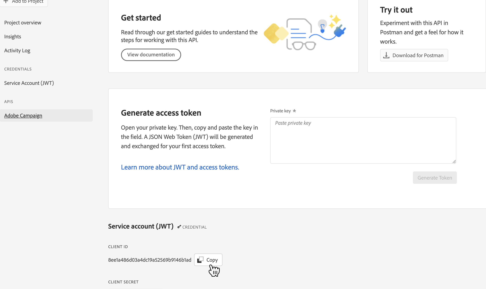

# Adobe Campaign Managed Services connection {#adobe-campaign-managed-services}

## Overview {#overview}

Adobe Campaign Managed Services provides a platform for designing cross-channel customer experiences and an environment for visual campaign orchestration, real-time interaction management and cross channel execution. [Get Started with Campaign](https://experienceleague.adobe.com/docs/campaign/campaign-v8/start/get-started.html)

Use Campaign to:
* Drive personalization and engagement through a single accessible view of the customer,
* Integrate email, mobile, online and offline channels into the customer journey,
* Automate the delivery of meaningful and timely messages and offers.

<!--## Use cases {#use-cases}

To help you better understand how and when you should use the *YourDestination* destination, here are sample use cases that Adobe Experience Platform customers can solve by using this destination.

### Use case #1 {#use-case-1}

*For mobile messaging platforms:*

*A home rental and sales platform wants to push mobile notifications to customers' Android and iOS devices to let them know that there are 100 updated listings in the area where they previously searched for a rental.*

### Use case #2 {#use-case-2}

*For social network platforms:*

*An athletic apparel brand wants to reach existing customers through their social media accounts. The apparel brand can ingest email addresses from their own CRM to Adobe Experience Platform, build segments from their own offline data, and send these segments to YourDestination, to display ads in their customers' social media feeds.*-->

## Prerequisites {#prerequisites}

In order for Campaign to be able to retrieve data from Adobe Experience Platform, you need to create a Campaign API project, and ask Customer Care to add the associated Client ID to an allow list.

>[!NOTE]
>
>Global information on how to create an API project are detailed in [this documentation](https://experienceleague.adobe.com/docs/platform-learn/getting-started-for-data-architects-and-data-engineers/set-up-developer-console-and-postman.html)

1. Log in to [Adobe Developer Console](https://console.adobe.io/) and create a new project.

1. Select **[!UICONTROL Add API]** and choose **[!UICONTROL Adobe Campaign]**.

    

1. Generate a key pair.

1. Select the `<Instance Name> - admin` product profile and select **[!UICONTROL Save configured API]**.

1. Your API project is created. Note down the **[!UICONTROL Client ID]** displayed in your project. Reach out to Adobe Customer Care and ask them to add your Client ID to an allow list.

    

## Supported identities {#supported-identities}

*Adobe Campaign Managed Services* supports the activation of identities described in the table below. Learn more about [identities](/help/identity-service/namespaces.md).

|Target Identity|Description|Considerations|
|---|---|---|
|ECID|Experience Cloud ID|A namespace that represents ECID. This namespace can also be referred to by the following aliases: "Adobe Marketing Cloud ID", "Adobe Experience Cloud ID", "Adobe Experience Platform ID". See the following document on [ECID](/help/identity-service/ecid.md) for more information.|
|email_lc_sha256|Email addresses hashed with the SHA256 algorithm|Both plain text and SHA256 hashed email addresses are supported by Adobe Experience Platform. When your source field contains unhashed attributes, check the **[!UICONTROL Apply transformation]** option, to have [!DNL Platform] automatically hash the data on activation.|
|phone_sha256|Phone numbers hashed with the SHA256 algorithm|Both plain text and SHA256 hashed phone numbers are supported by Adobe Experience Platform. When your source field contains unhashed attributes, check the **[!UICONTROL Apply transformation]** option, to have [!DNL Platform] automatically hash the data on activation.|
|GAID|Google Advertising ID|Select the GAID target identity when your source identity is a GAID namespace.|
|IDFA|Apple ID for Advertisers|Select the IDFA target identity when your source identity is an IDFA namespace.|
|extern_id|Custom user IDs|Select this target identity when your source identity is a custom namespace.|

{style="table-layout:auto"}

## Export type and frequency {#export-type-frequency}

Refer to the table below for information about the destination export type and frequency.

| Item | Type | Notes |
---------|----------|---------|
| Export type | **[!UICONTROL Profile-based]** | You are exporting all members of a segment, together with the desired schema fields (for example: email address, phone number, last name), as chosen in the select profile attributes screen of the [destination activation workflow](/help/destinations/ui/activate-batch-profile-destinations.md#select-attributes).|
| Export frequency | **[!UICONTROL Batch]** | Batch destinations export files to downstream platforms in increments of three, six, eight, twelve, or twenty-four hours. Read more about [batch file-based destinations](/help/destinations/destination-types.md#file-based).|

{style="table-layout:auto"}

## Connect to the destination {#connect}

>[!IMPORTANT]
> 
>To connect to the destination, you need the **[!UICONTROL Manage Destinations]** [access control permission](/help/access-control/home.md#permissions). Read the [access control overview](/help/access-control/ui/overview.md) or contact your product administrator to obtain the required permissions.

To connect to this destination, follow the steps described in the [destination configuration tutorial](../../ui/connect-destination.md). In the configure destination workflow, fill in the fields listed in the two sections below.

### Authenticate to destination {#authenticate}

To authenticate to the destination, fill in the required fields and select **[!UICONTROL Connect to destination]**.

* **[!UICONTROL Bearer token]**: Fill in the bearer token to authenticate to the destination.

### Fill in destination details {#destination-details}

To configure details for the destination, fill in the required and optional fields below. An asterisk next to a field in the UI indicates that the field is required.

*  **[!UICONTROL Name]**: A name by which you will recognize this destination in the future.
*  **[!UICONTROL Description]**: A description that will help you identify this destination in the future.
* **[!UICONTROL Select instance]**: Your Campaign marketing instance.
* **[!UICONTROL Target mapping]**: Select the target mapping that you are using in Adobe Campaign to send deliveries. [Learn more](https://experienceleague.adobe.com/docs/campaign/campaign-v8/profiles-and-audiences/add-profiles/target-mappings.html).

### Enable alerts {#enable-alerts}

You can enable alerts to receive notifications on the status of the dataflow to your destination. Select an alert from the list to subscribe to receive notifications on the status of your dataflow. For more information on alerts, refer to the guide on [subscribing to destinations alerts using the UI](../../ui/alerts.md).

When you are finished providing details for your destination connection, select **[!UICONTROL Next]**.

### Governance policy & enforcement actions {#governance}

Select the marketing actions applicable to the data that you want to export to the destination. For Adobe Campaign, we recommend you select the **[!UICONTROL Email Targeting]** marketing action.

For more information about marketing actions, see the [data usage policies overview](/help/data-governance/policies/overview.md) page.

## Activate segments to this destination {#activate}

>[!IMPORTANT]
> 
>To activate data, you need the **[!UICONTROL Manage Destinations]**, **[!UICONTROL Activate Destinations]**, **[!UICONTROL View Profiles]**, and **[!UICONTROL View Segments]** [access control permissions](/help/access-control/home.md#permissions). Read the [access control overview](/help/access-control/ui/overview.md) or contact your product administrator to obtain the required permissions.

Read [Activate audience data to batch profile export destinations](https://experienceleague.adobe.com/docs/experience-platform/destinations/ui/activate/activate-batch-profile-destinations.html) for instructions on activating audience data to this destination.

### Map attributes and identities {#map}

Select XDM fields to export with the profiles and map them to the corresponding Adobe Campaign fields.

>[!IMPORTANT]
>
>You can add up to 20 fields to map with Adobe Campaign.

1. Select source fields:

    * Select an identifier (For example: the email field) as source identity that uniquely identifies a profile in Adobe Experience Platform and Adobe Campaign.
    * Select all other XDM source profile attribute that need to be exported to Adobe Campaign.

1. Map each field with its target field in Adobe Campaign. Available target fields are determined by the target mapping selected when [creating the destination](#destination-details).

1. Identify mandatory attributes and deduplication keys.

    * [Mandatory attributes](../../ui/activate-batch-profile-destinations.md#mandatory-attributes) ensure that all profile records contain the selected attribute(s). For example: all exported profiles contain an email address. Recommendation is to set to mandatory both the identity field and the field used as deduplication key.
    * [A deduplication key](../../ui/activate-batch-profile-destinations.md#mandatory-attributes) is a primary key which determines the identity by which users want their profiles to be deduplicated.

      >[!IMPORTANT]
      >
      >Make sure that the deduplication key matches the primary key of the selected target mapping. For example, if you are using the `CustomerID` field as deduplication key, make sure that the field exists both on the source XDM schema and the Adobe Campaign target mapping.

## Exported data / Validate data export {#exported-data}

Once a destination has been activated, you can access the corresponding export job and exported data in Campaign.

### Monitor data export jobs {#jobs}

Navigate to the **[!UICONTROL Administration]** > **[!UICONTROL Audit]** > **[!UICONTROL Audience load jobs]** menu to monitor all export jobs activated from Adobe Experience Platform.

### Access exported data {#data}

Navigate to the **[!UICONTROL Profile and target]** > **[!UICONTROL List]** > **[!UICONTROL AEP audiences]** menu  to access audiences created after activating a destination.

## Data usage and governance {#data-usage-governance}

All [!DNL Adobe Experience Platform] destinations are compliant with data usage policies when handling your data. For detailed information on how [!DNL Adobe Experience Platform] enforces data governance, read the [Data Governance overview](/help/data-governance/home.md).

