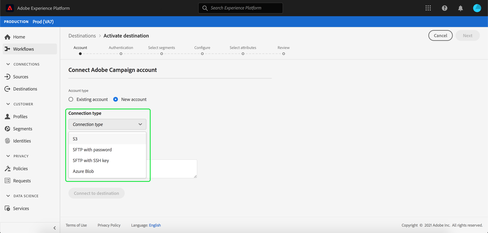
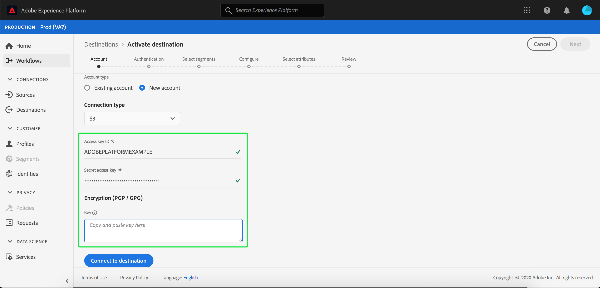

# Adobe Campaign

## Overview

Adobe Campaign is a set of solutions that help you personalize and deliver campaigns across all your online and offline channels. See [About Adobe Campaign Classic](https://experienceleague.adobe.com/docs/campaign-classic/using/getting-started/starting-with-adobe-campaign/about-adobe-campaign-classic.html) for more information.

To send segment data to Adobe Campaign, you must first [connect the destination](#connect-destination) in Adobe Experience Platform, and then [set up a data import](#import-data-into-campaign) from your storage location into Adobe Campaign.

## Export Type {#export-type}

**Profile-based** - you are exporting all members of a segment, together with the desired schema fields (for example: email address, phone number, last name), as chosen from the select attributes screen of the [destination activation workflow](../../ui/activate-destinations.md#select-attributes).

## Connect destination {#connect-destination}

In **[!UICONTROL Connections]** > **[!UICONTROL Destinations]**, select Adobe Campaign, then select **[!UICONTROL Connect destination]**.

In the Connect destination workflow, select the **[!UICONTROL Connection type]** for your storage location. For Adobe Campaign, you can select between **[!UICONTROL Amazon S3]**, **[!UICONTROL SFTP with Password]**, **[!UICONTROL SFTP with SSH Key]**, and **[!UICONTROL Azure Blob]**. Fill in the information below, depending on your connection type, then select **[!UICONTROL Connect]**.

- For **[!UICONTROL Amazon S3]** connections, you must provide your Access Key ID and Secret Access Key. 
- For **[!UICONTROL SFTP with Password]** connections, you must provide Domain, Port, Username, and Password.
- For **[!UICONTROL SFTP with SSH Key]** connections, you must provide Domain, Port, Username, and SSH Key.
- For **[!UICONTROL Azure Blob]** connections, you must provide a connection string.

Optionally, you can attach your RSA-formatted public key to add encryption with PGP/GPG to your exported files under the **[!UICONTROL Key]** section. Note that this public key **must** be written as a Base64 encoded string. 

In **[!UICONTROL Basic Information]**, fill in the relevant information for your destination, as shown below:
   - **[!UICONTROL Name]**: Pick a relevant name for your destination.
   - **[!UICONTROL Description]**: Enter a description for your destination.
   - **[!UICONTROL Bucket Name]**: *For S3 connections*. Enter the location of your S3 bucket where Platform will deposit your export data as CSV or tab-delimited files. 
   - **[!UICONTROL Folder Path]**: Provide the path in your storage location where Platform will deposit your export data as CSV or tab-delimited files.
   - **[!UICONTROL File Format]**: **CSV** or **TAB_DELIMITED**. Select which file format to export to your storage location. 

Click **[!UICONTROL Create]** after filling in the fields above. Your destination is now connected and you can [activate segments](../../ui/activate-destinations.md) to the destination.

## Activate segments {#activate-segments}

See [Activate profiles and segments to a destination](../../ui/activate-destinations.md) for information about the segment activation workflow.

## Destination attributes {#destination-attributes}

When [activating segments](../../ui/activate-destinations.md) to the Adobe Campaign destination, we recommend that you select a unique identifier from your [union schema](../../../profile/home.md#profile-fragments-and-union-schemas). Select the unique identifier and any other XDM fields that you want to export to the destination. For more information, see [Select which schema fields to use as destination attributes in your exported files](./overview.md#destination-attributes) in email marketing destinations documentation. 

## Exported data {#exported-data}

For [!DNL Adobe Campaign] destinations, Platform creates a tab-delimited `.txt` or `.csv` file in the storage location that you provided. For more information about the files, see [Email Marketing destinations and Cloud storage destinations](../../ui/activate-destinations.md#esp-and-cloud-storage) in the segment activation tutorial. 

## Set up data import into Adobe Campaign {#import-data-into-campaign}

>[!IMPORTANT]
>
>- Please keep in mind the SFTP storage limits, database storage limits, and active profile limits as per your Adobe Campaign contract while performing this integration.
>- You need to schedule, import, and map your exported segment(s) in Adobe Campaign using [!DNL Campaign] workflows. Refer to [Setting up a recurring import](https://experienceleague.adobe.com/docs/campaign-classic/using/automating-with-workflows/general-operation/importing-data.html#automating-with-workflows) in Adobe Campaign documentation.

After connecting Platform to your [!DNL Amazon S3] or SFTP storage, you must set up the data import from your storage location into Adobe Campaign. To learn how to accomplish this, refer to [Importing data](https://experienceleague.adobe.com/docs/campaign-classic/using/automating-with-workflows/general-operation/importing-data.html) in the Adobe Campaign documentation.