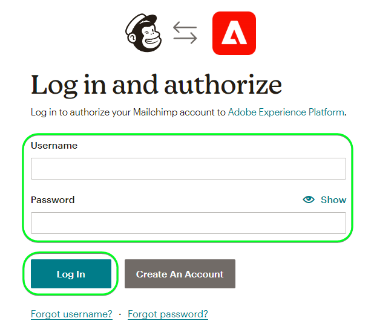
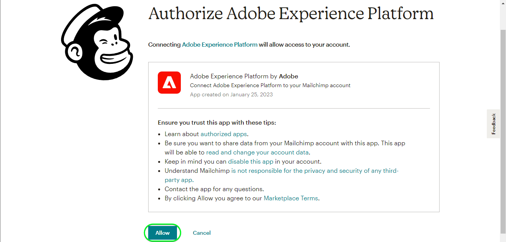

# [!DNL Mailchimp Interest Categories] connection

[[!DNL Mailchimp]](https://mailchimp.com) *(also known as [!DNL Intuit Mailchimp])* is a popular marketing automation platform and email marketing service used by businesses to manage and talk to contacts *(clients, customers, or other interested parties)* using mailing lists and email marketing campaigns.

[!DNL Mailchimp Interest Categories] uses [audiences](https://mailchimp.com/help/getting-started-audience/) and [groups](https://mailchimp.com/help/getting-started-with-groups/). Groups can be used to help organize your contacts within [!DNL Mailchimp] based on their interests and preferences and then broadcast group specific campaign emails.

<!--
Compared to [!DNL Mailchimp Tags] which you would use for internal classification, [!DNL Mailchimp Interest Categories] is meant to manage subscriptions to topics of interest that your contacts might be interested in. *Note, Experience Platform also has a connection for [!DNL Mailchimp Tags], you can check it out on the [[!DNL Mailchimp Tags]](/help/destinations/catalog/email-marketing/mailchimp-tags.md) page.*
-->

This [!DNL Adobe Experience Platform] [destination](/help/destinations/home.md) leverages the [[!DNL Mailchimp batch subscribe or unsubscribe API]](https://mailchimp.com/developer/marketing/api/lists/batch-subscribe-or-unsubscribe/) endpoint. You can **add new contacts** or **update the information of existing [!DNL Mailchimp] contacts**, then **add or remove them from their desired groups** within an existing [!DNL Mailchimp] audience after activating them within a new segment. [!DNL Mailchimp Interest Groups] uses the selected segment names from Platform as the tag names within [!DNL Mailchimp].

[!DNL Mailchimp Interest Group] uses OAuth 2 with Authorization Code to communicate with the [!DNL Mailchimp] API. Instructions to authenticate to your [!DNL Mailchimp Interest Categories] instance are further below, in the [Authenticate to destination](#authenticate) section.

## Use cases {#use-cases}

To help you better understand how and when you should use the [!DNL Mailchimp Interest Categories] destination, here is a sample use case that Adobe Experience Platform customers can solve by using this destination.

### Send emails to contacts for marketing campaigns {#use-case-send-emails}

The sales department of a sporting goods website wants to broadcast an email based marketing campaign to a list of contacts who have self identified themselves as being interested in soccer. The lists of contacts are segregated as batches in the data export received from the development team of the website and therefore need to be tracked. The team identifies an existing [!DNL Mailchimp] audience and starts building the Experience Platform segment's into which the contacts from each list are added. After sending these segments to [!DNL Mailchimp Interest Categories] if any contacts do not exist in the selected [!DNL Mailchimp] audience they get added to a group having the segment name the contact belongs to. If any contacts already exist in the [!DNL Mailchimp] audience or group then their information is updated. Once the data is sent over to [!DNL Mailchimp Interest Categories] the Sales team can select and send the marketing campaign email to the soccer interest group within the [!DNL Mailchimp] audience.

## Prerequisites {#prerequisites}

Refer to the sections below for any prerequisites that you need to set up in Experience Platform and [!DNL Mailchimp] and for information that you need to gather before working with the [!DNL Mailchimp Interest Categories] destination.

### Prerequisites in Experience Platform {#prerequisites-in-experience-platform}

Before activating data to the [!DNL Mailchimp Interest Categories] destination, you must have a [schema](/help/xdm/schema/composition.md), a [dataset](https://experienceleague.adobe.com/docs/platform-learn/tutorials/data-ingestion/create-datasets-and-ingest-data.html?lang=en), and [segments](https://experienceleague.adobe.com/docs/platform-learn/tutorials/segments/create-segments.html?lang=en) created in [!DNL Experience Platform].

### Prerequisites for the [!DNL Mailchimp Interest Categories] destination {#prerequisites-destination}

Note the following prerequisites in order to export data from Platform to your [!DNL Mailchimp] account:

#### You need to have a [!DNL Mailchimp] account {#prerequisites-account}

Before you can create a [!DNL Mailchimp Interest Categories] destination, you must first ensure that you have a [!DNL Mailchimp] account. If you do not have one already visit the [[!DNL Mailchimp] signup page](https://login.mailchimp.com/signup/) to register and create your account.

#### Gather [!DNL Mailchimp] credentials {#gather-credentials}

Note down the items below before you authenticate to the [!DNL Mailchimp Interest Categories] destination.

| Credential | Description |
| --- | --- |
| `Username` | Your [!DNL Mailchimp] account username. |
| `Password` | Your [!DNL Mailchimp] account password. |

{style="table-layout:auto"}

#### Identify [!DNL Mailchimp] data center {#identify-data-center}

Next you need to identify your Mailchimp domain. To do this, log in to your [!DNL Mailchimp] account and check the URL in your browser.
You’ll notice a value similar to *`us19`.admin.mailchimp.com*, Write down the prefix (`us19` in this example). You will need this prefix when connecting to the destination. 
If you require guidance, refer to the [Mailchimp documentation](https://mailchimp.com/developer/marketing/guides/quick-start/#make-your-first-api-call).

### Guardrails {#guardrails}

Each of your [!DNL Mailchimp] audiences can contain up to 60 group names in a single group or across several groups within the same audience. Refer to [!DNL Mailchimp] [groups](https://mailchimp.com/help/getting-started-with-groups/) for any clarifications required. When you reach this limit you will get a `400 BAD_REQUEST Cannot have more than 60 interests per list (Across all categories)` message as an error response from the [!DNL Mailchimp] API.

Additionally refer to the [!DNL Mailchimp] [rate limits](https://mailchimp.com/developer/marketing/docs/fundamentals/#api-limits) for detailed information about the limits imposed by the [!DNL Mailchimp] API.

## Supported identities {#supported-identities}

[!DNL Mailchimp] supports the activation of identities described in the table below. Learn more about [identities](/help/identity-service/namespaces.md).

| Target Identity | Description | Considerations |
|---|---|---|
| Email | Contact email Address | Mandatory |

{style="table-layout:auto"}

## Export type and frequency {#export-type-frequency}

Refer to the table below for information about the destination export type and frequency.

| Item | Type | Notes |
---------|----------|---------|
| Export type | **[!UICONTROL Profile-based]** | <ul><li>You are exporting all members of a segment, together with the desired schema fields *(for example: email address, phone number, last name)*, according to your field mapping.</li><li> For each selected segment in Platform, the corresponding [!DNL Mailchimp Interest Categories] segment status gets updated with its segment status from Platform.</li></ul>|
| Export frequency | **[!UICONTROL Streaming]** | Streaming destinations are "always on" API-based connections. As soon as a profile is updated in Experience Platform based on segment evaluation, the connector sends the update downstream to the destination platform. Read more about [streaming destinations](/help/destinations/destination-types.md#streaming-destinations).|

{style="table-layout:auto"}

## Connect to the destination {#connect}

>[!IMPORTANT]
>
>To connect to the destination, you need the **[!UICONTROL Manage Destinations]** [access control permission](/help/access-control/home.md#permissions). Read the [access control overview](/help/access-control/ui/overview.md) or contact your product administrator to obtain the required permissions.

To connect to this destination, follow the steps described in the [destination configuration tutorial](../../ui/connect-destination.md). In the configure destination workflow, fill in the fields listed in the two sections below.

Within **[!UICONTROL Destinations]** > **[!UICONTROL Catalog]**, search for [!DNL Mailchimp Interest Categories]. Alternatively you can locate it under the **[!UICONTROL Email marketing]** category.

### Authenticate to destination {#authenticate}

To authenticate to the destination, select **[!UICONTROL Connect to destination]**. You will be redirected to the [!DNL Mailchimp] authorization page.

Enter your [!DNL Mailchimp] account credentials and select [!DNL Log In].

Next, Select [!UICONTROL Allow] in the subsequent window to give permissions to the **Adobe Experience Platform** app to access your [!DNL Mailchimp] account. *You will need to do this only once*.

If the details provided are valid, the Platform UI displays the following message along with a **[!UICONTROL Connected]** status with a green check mark: *[!DNL You successfully connected to Mailchimp Interest Categories account]*. You can then proceed to the next step.

### Fill in destination details {#destination-details}

To configure details for the destination, fill in the required and optional fields below. An asterisk next to a field in the UI indicates that the field is required.

| Field | Description |
| --- | --- |
| **[!UICONTROL Name]** | A name by which you will recognize this destination in the future. |
| **[!UICONTROL Description]** | A description that will help you identify this destination in the future. |
| **[!UICONTROL Data Center]** | Your [!DNL Mailchimp] account `Data Center`. Refer to the [Identify [!DNL Mailchimp] data center](#identify-data-center) section for any guidance. |
| **[!UICONTROL Audience ID]** | After you select your **[!UICONTROL Data Center]**, this dropdown is automatically populated with the audience names from your [!DNL Mailchimp] account. Select the audience that you want to update with data from Platform. |
| **[!UICONTROL Interest Category]** | After you select your **[!UICONTROL Audience ID]**, this dropdown is automatically populated with the interest group category names from your [!DNL Mailchimp] account. Select the category name that you want to update with data from Platform. |

{style="table-layout:auto"}

### Enable alerts {#enable-alerts}

You can enable alerts to receive notifications on the status of the dataflow to your destination. Select an alert from the list to subscribe to receive notifications on the status of your dataflow. For more information on alerts, see the guide on [subscribing to destinations alerts using the UI](../../ui/alerts.md).

When you are finished providing details for your destination connection, select **[!UICONTROL Next]**.

## Activate segments to this destination {#activate}

>[!IMPORTANT]
>
>To activate data, you need the **[!UICONTROL Manage Destinations]**, **[!UICONTROL Activate Destinations]**, **[!UICONTROL View Profiles]**, and **[!UICONTROL View Segments]** [access control permissions](/help/access-control/home.md#permissions). Read the [access control overview](/help/access-control/ui/overview.md) or contact your product administrator to obtain the required permissions.

Read [Activate profiles and segments to streaming segment export destinations](/help/destinations/ui/activate-segment-streaming-destinations.md) for instructions on activating audience segments to this destination.

### Mapping considerations and example {#mapping-considerations-example}

To correctly send your audience data from Adobe Experience Platform to the [!DNL Mailchimp Interest Categories] destination, you need to go through the field mapping step. Mapping consists of creating a link between your Experience Data Model (XDM) schema fields in your Platform account and their corresponding equivalents from the target destination.

To correctly map your XDM fields to the [!DNL Mailchimp Interest Categories] destination fields, follow the steps below:

1. In the **[!UICONTROL Mapping]** step, select **[!UICONTROL Add new mapping]**. You will see a new mapping row on the screen.
1. In the **[!UICONTROL Select source field]** window, choose the **[!UICONTROL Select attributes]** category and select the XDM attribute or choose the **[!UICONTROL Select identity namespace]** and select an identity.
1. In the **[!UICONTROL Select target field]** window, choose the **[!UICONTROL Select identity namespace]** and select an identity or choose **[!UICONTROL Select attributes]** category and select from the list of attributes populated from the [!DNL Mailchimp] API. *Note any custom attributes that have been added to the selected [!DNL Mailchimp] Audience will also be available.*

    The default mappings available between your XDM profile schema and [!DNL Mailchimp Interest Categories] will be as below:
    | Source Field | Target Field | Notes |
    | --- | --- | --- |
    |`IdentityMap: Email`|`Identity: email`| Mandatory: Yes |
    |`xdm: person.name.firstName`|`Attribute: FNAME`| |
    |`xdm: person.name.lastName`|`Attribute: LNAME`| |
    |`xdm: person.birthDayAndMonth`|`Attribute: BIRTHDAY`| |

    Additionally, `ADDRESS` is a special target field known as a `merge field` within your [!DNL Mailchimp] audience. The [[!DNL Mailchimp] documentation](https://mailchimp.com/developer/marketing/docs/merge-fields/) defines the required keys as `addr1`, `city`, `state`, and `zip`, and the optional keys `addr2` and `country`. The values for these fields must be strings. If any of the `ADDRESS` field mappings are present the destination passes the `ADDRESS` object to the [!DNL Mailchimp] API for update. Any `ADDRESS` fields that are not mapped has its value default to `NULL` except for country which defaults to `US`. 
    
    The mappings available for the `ADDRESS` field are as below:

    | Source Field | Target Field |
    | --- | --- |
    | `xdm: workAddress.street1` | `Attribute: ADDRESS.addr1` |
    | `xdm: workAddress.street2` | `Attribute: ADDRESS.addr2` |
    | `xdm: workAddress.city` | `Attribute: ADDRESS.city` |
    | `xdm: workAddress.state` | `Attribute: ADDRESS.state` |
    | `xdm: workAddress.postalCode` | `Attribute: ADDRESS.zip` |
    | `xdm: workAddress.country` | `Attribute: ADDRESS.country` |

    For example, you want to update the value for `country` with the contact's existing address field `addr1`, `city`, `state`, and `zip` values as `132, My Street, Kingston`, `New York`, `New York` and `12401`. To update the `country` you need to pass the existing values with changes *(if any)* and the new value for country. So the values in your dataset should be `132, My Street, Kingston`, `New York`, `New York`, `12401` and `US`. To reiterate if you only pass `country` and do not provide values for `addr1`, `city`, `state`, and `zip` they will be overwritten by `NULL`.

    An example with the completed mappings is shown below:
    

When you have finished providing the mappings for your destination connection, select **[!UICONTROL Next]**.

## Validate data export {#exported-data}

To validate that you have correctly set up the destination, follow the steps below:

* Log in to your [[!DNL Mailchimp]](https://login.mailchimp.com/) account. Then navigate to the **[!DNL Audience]** page. Next expand the **[!DNL Manage Contacts]** menu and select **[!DNL Groups]**.

* Select the Group and check if the selected segments are created as categories sharing the segment name from Platform followed by an auto generated suffix. 
* Contacts whose emails did not exist in the group will be added to the newly created category.
* For contacts that already exist within the group the attribute field data will be updated. The contact is also added to the newly created category.

## Data usage and governance {#data-usage-governance}

All [!DNL Adobe Experience Platform] destinations are compliant with data usage policies when handling your data. For detailed information on how [!DNL Adobe Experience Platform] enforces data governance, see the [Data Governance overview](/help/data-governance/home.md).

## Errors and troubleshooting {#errors-and-troubleshooting}

When creating the destination, you might receive the following error messages: `Cannot have more than 60 interests per list (Across all categories)` or `400 BAD_REQUEST`. This happens when you exceed the 60 group names in a single group or across several groups within the same audience limit, as described in the [guardrails](#guardrails) section. To fix this error, make sure you are not exceeding the group name limit in [!DNL Mailchimp].

Refer to the [[!DNL Mailchimp] errors page](https://mailchimp.com/developer/marketing/docs/errors/) for a comprehensive list of status and error codes with explanations.

## Additional resources {#additional-resources}

Additional useful information from the [!DNL Mailchimp] documentation is below:
* [Getting started with [!DNL Mailchimp]](https://mailchimp.com/help/getting-started-with-mailchimp/)
* [Getting started with Audiences](https://mailchimp.com/help/getting-started-audience/)
* [Create an Audience](https://mailchimp.com/help/create-audience/)
* [Getting started with Groups](https://mailchimp.com/help/getting-started-with-groups/)
* [Create a new Audience Group](https://mailchimp.com/help/create-new-audience-group/)
* [Marketing API](https://mailchimp.com/developer/marketing/api/)
