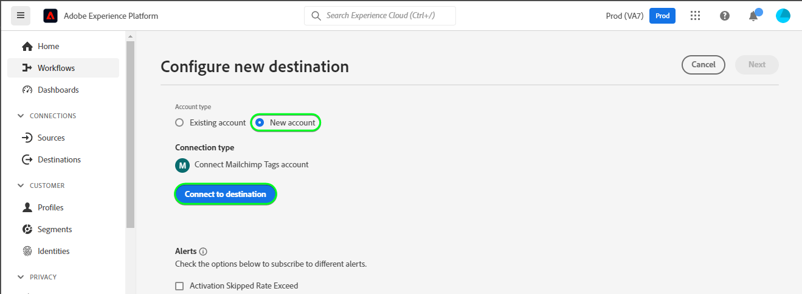
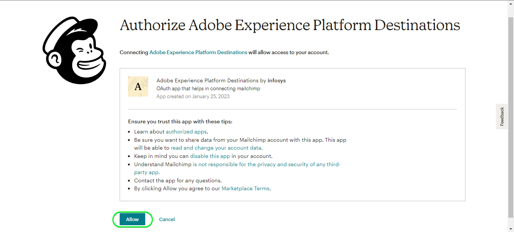
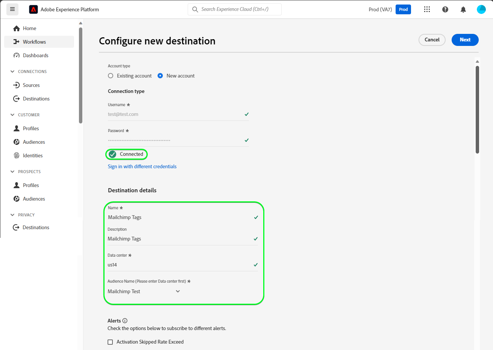
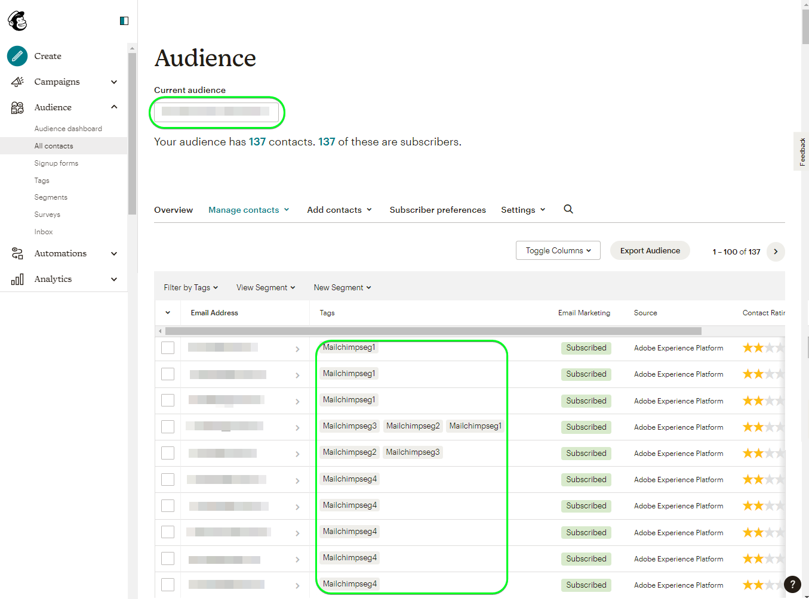

# [!DNL Mailchimp Tags] connection

[[!DNL Mailchimp]](https://mailchimp.com) *(also known as [!DNL Intuit Mailchimp])* is a popular marketing automation platform and email marketing service used by businesses to manage and talk to contacts *(clients, customers, or other interested parties)* using mailing lists and email marketing campaigns.

[!DNL Mailchimp Tags] uses [audiences](https://mailchimp.com/help/getting-started-audience/) and [tags](https://mailchimp.com/help/getting-started-tags/) to manage your contact information. Tags are labels using which you can organize your contacts and label them for your internal categorization within [!DNL Mailchimp].

This [!DNL Adobe Experience Platform] [destination](/help/destinations/home.md) leverages the [[!DNL Mailchimp Batch subscribe or unsubscribe API]](https://mailchimp.com/developer/marketing/api/lists/batch-subscribe-or-unsubscribe/) endpoint. You can add contacts or update tags of existing [!DNL Mailchimp] contacts within an existing [!DNL Mailchimp] audience after activating them within a new segment. [!DNL Mailchimp Tags] uses the selected segment names from Platform as the tag names within [!DNL Mailchimp].

[!DNL Mailchimp Tags] uses [OAuth 2 with Authorization Code](/help/destinations/destination-sdk/functionality/authentication/oauth2-authentication.md#authorization-code) to communicate with the [!DNL Account Engagement] API. Instructions to authenticate to your [!DNL Mailchimp Tags] instance are further below, in the [Authenticate to destination](#authenticate) section.

## Use cases {#use-cases}

To help you better understand how and when you should use the [!DNL Mailchimp Tags] destination, here is a sample use case that Adobe Experience Platform customers can solve by using this destination.

### Send emails to contacts for marketing campaigns {#use-case-send-emails}

The sales department of an organization wants to broadcast an email based marketing campaign to a curated list of contacts. The organizations marketing team can add new contacts or update tags of existing [!DNL Mailchimp] contacts, within an existing [!DNL Mailchimp] audience through Experience Platform, build segments from their own offline data, and send these segments to [!DNL Mailchimp Tags]. This audience can then be used to send the marketing campaign email.

## Prerequisites {#prerequisites}

Refer to the sections below for any prerequisites that you need to set up in Experience Platform and [!DNL Mailchimp] and for information that you need to gather before working with the [!DNL Mailchimp Tags] destination.

### Prerequisites in Experience Platform {#prerequisites-in-experience-platform}

Before activating data to the [!DNL Mailchimp Tags] destination, you must have a [schema](/help/xdm/schema/composition.md), a [dataset](https://experienceleague.adobe.com/docs/platform-learn/tutorials/data-ingestion/create-datasets-and-ingest-data.html?lang=en), and [segments](https://experienceleague.adobe.com/docs/platform-learn/tutorials/segments/create-segments.html?lang=en) created in [!DNL Experience Platform].

### Prerequisites in [!DNL Mailchimp Tags] {#prerequisites-destination}

Note the following prerequisites in order to export data from Platform to your [!DNL Mailchimp Tags] account:

#### You need to have a [!DNL Mailchimp] account {#prerequisites-account}

Before you can create a [!DNL Mailchimp Tags] destination, you must first ensure that you have a [!DNL Mailchimp] account. If you do not have one already visit the [[!DNL Mailchimp] signup page](https://login.mailchimp.com/signup/) to register and create your account.

#### Gather [!DNL Mailchimp] credentials {#gather-credentials}

Note down the items below before you authenticate to the [!DNL Mailchimp Tags] destination.

| Credential | Description |
| --- | --- |
| `Username` | Your [!DNL Mailchimp] account username. |
| `Password` | Your [!DNL Mailchimp] account password. |

{style="table-layout:auto"}

#### Identify [!DNL Mailchimp] domain {#identify-domain}

Next you need to identify your Mailchimp domain, to do this log in to your [!DNL Mailchimp] account and check the URL in your browser.
You’ll notice a value similar to *`us19`.admin.mailchimp.com*, the `us19` prefix is the value you will require.
<!--
If required, refer to the [Mailchimp documentation](https://mailchimp.com/developer/marketing/guides/quick-start/#make-your-first-api-call).
-->

### Guardrails {#guardrails}

Refer to the [!DNL Mailchimp] [rate limits](https://mailchimp.com/developer/marketing/docs/fundamentals/#api-limits) which details the limits imposed by the [!DNL Mailchimp] API.

## Supported identities {#supported-identities}

[!DNL Mailchimp] supports the activation of identities described in the table below. Learn more about [identities](/help/identity-service/namespaces.md).

| Target Identity | Description | Considerations |
|---|---|---|
| Email | Contact Email Address | Mandatory |

{style="table-layout:auto"}

## Export type and frequency {#export-type-frequency}

Refer to the table below for information about the destination export type and frequency.

| Item | Type | Notes |
---------|----------|---------|
| Export type | **[!UICONTROL Profile-based]** | <ul><li>You are exporting all members of a segment, together with the desired schema fields *(for example: email address, phone number, last name)*, according to your field mapping.</li><li> For each selected segment in Platform, the corresponding [!DNL Mailchimp Tags] segment status gets updated with its segment status from Platform.</li></ul>|
| Export frequency | **[!UICONTROL Streaming]** | Streaming destinations are "always on" API-based connections. As soon as a profile is updated in Experience Platform based on segment evaluation, the connector sends the update downstream to the destination platform. Read more about [streaming destinations](/help/destinations/destination-types.md#streaming-destinations).|

{style="table-layout:auto"}

## Connect to the destination {#connect}

>[!IMPORTANT]
>
>To connect to the destination, you need the **[!UICONTROL Manage Destinations]** [access control permission](/help/access-control/home.md#permissions). Read the [access control overview](/help/access-control/ui/overview.md) or contact your product administrator to obtain the required permissions.

To connect to this destination, follow the steps described in the [destination configuration tutorial](../../ui/connect-destination.md). In the configure destination workflow, fill in the fields listed in the two sections below.

Within **[!UICONTROL Destinations]** > **[!UICONTROL Catalog]**, search for [!DNL Mailchimp Tags]. Alternatively you can locate it under the **[!UICONTROL Email marketing]** category.

### Authenticate to destination {#authenticate}

To authenticate to the destination, select **[!UICONTROL Connect to destination]**. You will be navigated to the [!DNL Mailchimp Log in and authorize] page. Enter your [!DNL Mailchimp] account credentials and select [!DNL Log In].

Next, Select [!UICONTROL Allow] in the subsequent window to give permissions to the **Adobe Experience Platform** app to access your [!DNL Mailchimp] account. *You will need to do this only once*.

If the details provided are valid, the UI displays a message: *You successfully connected to Mailchimp Tags account* message and a **[!UICONTROL Connected]** status with a green check mark, you can then proceed to the next step.

### Fill in destination details {#destination-details}

To configure details for the destination, fill in the required and optional fields below. An asterisk next to a field in the UI indicates that the field is required.

| Field | Description |
| --- | --- |
| **[!UICONTROL Name]** | A name by which you will recognize this destination in the future. |
| **[!UICONTROL Description]** | A description that will help you identify this destination in the future. |
| **[!UICONTROL Data Center]** | Your [!DNL Mailchimp] account `Data Center`. Refer to the [Identify [!DNL Mailchimp] domain](#identify-domain) section for any guidance.|
| **[!UICONTROL Audience List ID]** | After you provide the value of your `Data Center` entries in this select dropdown are automatically populated with the audience names from your account. You need to select the audience of interest to which you will add or update the contact details from selected Platform segments. |

{style="table-layout:auto"}

### Enable alerts {#enable-alerts}

You can enable alerts to receive notifications on the status of the dataflow to your destination. Select an alert from the list to subscribe to receive notifications on the status of your dataflow. For more information on alerts, see the guide on [subscribing to destinations alerts using the UI](../../ui/alerts.md).

When you are finished providing details for your destination connection, select **[!UICONTROL Next]**.

## Activate segments to this destination {#activate}

>[!IMPORTANT]
>
>To activate data, you need the **[!UICONTROL Manage Destinations]**, **[!UICONTROL Activate Destinations]**, **[!UICONTROL View Profiles]**, and **[!UICONTROL View Segments]** [access control permissions](/help/access-control/home.md#permissions). Read the [access control overview](/help/access-control/ui/overview.md) or contact your product administrator to obtain the required permissions.

Read [Activate profiles and segments to streaming segment export destinations](/help/destinations/ui/activate-segment-streaming-destinations.md) for instructions on activating audience segments to this destination.

### Mapping considerations and example {#mapping-considerations-example}

To correctly send your audience data from Adobe Experience Platform to the [!DNL Mailchimp Tags] destination, you need to go through the field mapping step. Mapping consists of creating a link between your Experience Data Model (XDM) schema fields in your Platform account and their corresponding equivalents from the target destination. 

To correctly map your XDM fields to the [!DNL Mailchimp Tags] destination fields, follow the steps below:

1. In the **[!UICONTROL Mapping]** step, select **[!UICONTROL Add new mapping]**. You will see a new mapping row on the screen.
1. In the **[!UICONTROL Select source field]** window, choose the **[!UICONTROL Select identity namespace]** and select `Email`.
1. In the **[!UICONTROL Select target field]** window, choose the **[!UICONTROL Select identity namespace]** and select `Email`.
    The mappings between your XDM profile schema and [!DNL Mailchimp Tags] will be as below:
    | Source Field | Target Field | Mandatory |
    | --- | --- | --- |
    |`IdentityMap: Email`|`Identity: email`| Yes |

    An example with the above mappings is shown below:
    

When you have finished providing the mappings for your destination connection, select **[!UICONTROL Next]**.

## Validate data export {#exported-data}

To validate that you have correctly set up the destination, follow the steps below:

1. Log in to the [[!DNL Mailchimp]](https://login.mailchimp.com/) website. Then navigate to the **[!DNL Audience]** > **[!DNL All Contacts]** page and check if the contacts from the segment have been added and contacts within the segment have been updated with the segment name.

## Data usage and governance {#data-usage-governance}

All [!DNL Adobe Experience Platform] destinations are compliant with data usage policies when handling your data. For detailed information on how [!DNL Adobe Experience Platform] enforces data governance, see the [Data Governance overview](/help/data-governance/home.md).

## Additional resources {#additional-resources}

Additional useful information from the [!DNL Mailchimp] documentation is below:
* [Getting started with [!DNL Mailchimp]](https://mailchimp.com/help/getting-started-with-mailchimp/)
* [Getting started with Audiences](https://mailchimp.com/help/getting-started-audience/)
* [Create an Audience](https://mailchimp.com/help/create-audience/)
* [Getting started with Tags](https://mailchimp.com/help/getting-started-tags/)
* [Marketing API](https://mailchimp.com/developer/marketing/api/)
