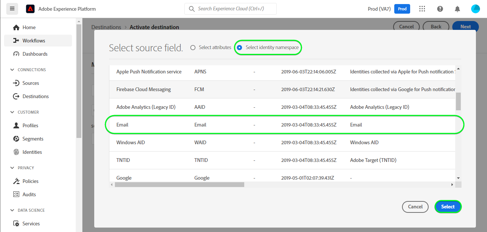
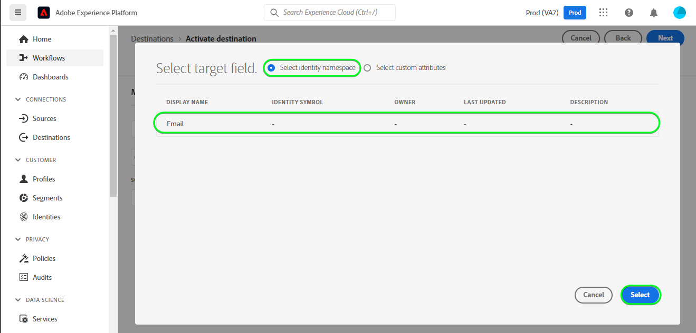

# [!DNL Mailchimp Tags] connection

[[!DNL Mailchimp]](https://mailchimp.com) *(also known as [!DNL Intuit Mailchimp])* is a popular marketing automation platform and email marketing service used by businesses to manage and talk to contacts *(clients, customers, or other interested parties)* using mailing lists and email marketing campaigns.

[!DNL Mailchimp Tags] uses [audiences](https://mailchimp.com/help/getting-started-audience/) and [tags](https://mailchimp.com/help/getting-started-tags/) to manage your contact information. Tags are labels using which you can organize your contacts and label them for your internal categorization within [!DNL Mailchimp].

Compared to [!DNL Mailchimp Interest Categories] which you would use to sort your contacts based on their interests and preferences, [!DNL Mailchimp Tags] is meant to manage subscriptions to topics of interest that your contacts might be interested in. *Note, Experience Platform also has a connection for [!DNL Mailchimp Interest Categories], you can check it out on the [[!DNL Mailchimp Interest Categories]](/help/destinations/catalog/email-marketing/mailchimp-interest-categories.md) page.*

This [!DNL Adobe Experience Platform] [destination](/help/destinations/home.md) leverages the [[!DNL Mailchimp batch subscribe or unsubscribe API]](https://mailchimp.com/developer/marketing/api/lists/batch-subscribe-or-unsubscribe/) endpoint. You can **add new contacts** or **update tags of existing [!DNL Mailchimp] contacts** within an existing [!DNL Mailchimp] audience after activating them within a new audience. [!DNL Mailchimp Tags] uses the selected audience names from Platform as the tag names within [!DNL Mailchimp].

## Use cases {#use-cases}

To help you better understand how and when you should use the [!DNL Mailchimp Tags] destination, here is a sample use case that Adobe Experience Platform customers can solve by using this destination.

### Send emails to contacts for marketing campaigns {#use-case-send-emails}

The sales department of an organization wants to broadcast an email based marketing campaign to a curated list of contacts. The contact lists are received in batches from different offline sources and therefore need to be tracked. The team identifies an existing [!DNL Mailchimp] audience and starts building the Experience Platform audiences into which the contacts from each list are added. After sending these audiences to [!DNL Mailchimp Tags], if any contacts do not exist in the selected [!DNL Mailchimp] audience, they get added with an associated tag which includes the audience name the contact belongs to. If any contacts already exist in the [!DNL Mailchimp] audience a new tag with the name of the audience is added. As the labels are visible in [!DNL Mailchimp] the offline sources are easily identifiable. After the data is sent over to [!DNL Mailchimp] they send the marketing campaign email to the audience.

## Prerequisites {#prerequisites}

Refer to the sections below for any prerequisites that you need to set up in Experience Platform and [!DNL Mailchimp] and for information that you need to gather before working with the [!DNL Mailchimp Tags] destination.

### Prerequisites in Experience Platform {#prerequisites-in-experience-platform}

Before activating data to the [!DNL Mailchimp Tags] destination, you must have a [schema](/help/xdm/schema/composition.md), a [dataset](https://experienceleague.adobe.com/docs/platform-learn/tutorials/data-ingestion/create-datasets-and-ingest-data.html?lang=en), and [audiences](https://experienceleague.adobe.com/docs/platform-learn/tutorials/audiences/create-audiences.html) created in [!DNL Experience Platform].

### Prerequisites for the [!DNL Mailchimp Tags] destination {#prerequisites-destination}

Note the following prerequisites in order to export data from Platform to your [!DNL Mailchimp Tags] account:

#### You need to have a [!DNL Mailchimp] account {#prerequisites-account}

Before you can create a [!DNL Mailchimp Tags] destination, you must first ensure that you have a [!DNL Mailchimp] account. If you do not have one already visit the [[!DNL Mailchimp] signup page](https://login.mailchimp.com/signup/) to register and create your account.

#### Gather [!DNL Mailchimp] API key {#gather-credentials}

You need your [!DNL Mailchimp] **API key** to authenticate the [!DNL Mailchimp Interest Categories] destination against your [!DNL Mailchimp] account. The **API key** serves as the **Password** when you [authenticate the destination](#authenticate).

If you do not have your **API key**, sign in to your [!DNL Mailchimp] account and refer to the [!DNL Mailchimp] documentation on [how to generate your API key](https://mailchimp.com/developer/marketing/guides/quick-start/#generate-your-api-key).

An example of an API key is `0123456789abcdef0123456789abcde-us14`. 

>[!IMPORTANT]
>
>If you generate the **API key**, write it down as you will not be able to access it after generation.

#### Identify your [!DNL Mailchimp] data center {#identify-data-center}

Next, you must identify your [!DNL Mailchimp] data center. To do this, log in to your [!DNL Mailchimp] account and navigate to the **API keys section** of your account. 

The data center ID is the first section of the URL you see in your browser. If the URL is *https://`us14`.mailchimp.com/account/api/*, then the data center is `us14`. 

The data center ID is also appended to your API key in the form *key-dc*; For example, if your API key is `0123456789abcdef0123456789abcde-us14`, then the data center is `us14`.

Write down the data center value *(`us14` in this example)*. You will need this value when you [fill in the destination details](#destination-details).

If you require further guidance, refer to the [[!DNL Mailchimp] Fundamentals documentation](https://mailchimp.com/developer/marketing/docs/fundamentals/#api-structure).

### Guardrails {#guardrails}

Refer to the [!DNL Mailchimp] [rate limits](https://mailchimp.com/developer/marketing/docs/fundamentals/#api-limits) for detailed information about the limits imposed by the [!DNL Mailchimp] API.

## Supported identities {#supported-identities}

[!DNL Mailchimp] supports the activation of identities described in the table below. Learn more about [identities](/help/identity-service/features/namespaces.md).

| Target Identity | Description | Considerations |
|---|---|---|
| Email | The email address of the contact. | Mandatory |

{style="table-layout:auto"}

## Supported audiences {#supported-audiences}

This section describes which type of audiences you can export to this destination.

| Audience origin | Supported | Description | 
---------|----------|----------|
| [!DNL Segmentation Service] | ✓ | Audiences generated through the Experience Platform [Segmentation Service](../../../segmentation/home.md).|
| Custom uploads | ✓ | Audiences [imported](../../../segmentation/ui/overview.md#import-audience) into Experience Platform from CSV files. |

{style="table-layout:auto"}

## Export type and frequency {#export-type-frequency}

Refer to the table below for information about the destination export type and frequency.

| Item | Type | Notes |
---------|----------|---------|
| Export type | **[!UICONTROL Profile-based]** | <ul><li>You are exporting all members of an audience, together with the desired schema fields *(for example: email address, phone number, last name)*, according to your field mapping.</li><li> For each audience selected in Platform, the corresponding [!DNL Mailchimp Tags] segment status gets updated with the audience status from Platform.</li></ul>|
| Export frequency | **[!UICONTROL Streaming]** | Streaming destinations are "always on" API-based connections. As soon as a profile is updated in Experience Platform based on audience evaluation, the connector sends the update downstream to the destination platform. Read more about [streaming destinations](/help/destinations/destination-types.md#streaming-destinations).|

{style="table-layout:auto"}

## Connect to the destination {#connect}

>[!IMPORTANT]
>
>To connect to the destination, you need the **[!UICONTROL Manage Destinations]** [access control permission](/help/access-control/home.md#permissions). Read the [access control overview](/help/access-control/ui/overview.md) or contact your product administrator to obtain the required permissions.

To connect to this destination, follow the steps described in the [destination configuration tutorial](../../ui/connect-destination.md). In the configure destination workflow, fill in the fields listed in the two sections below.

Within **[!UICONTROL Destinations]** > **[!UICONTROL Catalog]**, search for [!DNL Mailchimp Tags]. Alternatively you can locate it under the **[!UICONTROL Email marketing]** category.

### Authenticate to destination {#authenticate}

To authenticate to the destination, fill in the required fields below and select **[!UICONTROL Connect to destination]**.

| Field | Description |
| --- | --- |
| **[!UICONTROL Username]** | Your [!DNL Mailchimp] username. |
| **[!UICONTROL Password]** | Your [!DNL Mailchimp] **API key**, which you had noted down in the [Gather [!DNL Mailchimp] credentials](#gather-credentials) section.  Your API key takes the form of `{KEY}-{DC}`, where the `{KEY}` portion refers to the value noted down in the [[!DNL Mailchimp] API key](#gather-credentials) section and the `{DC}` portion refers to the [[!DNL Mailchimp] data center](#identify-data-center).  You can provide either the `{KEY}` portion or the entire form.  For example, if your API key is  *`0123456789abcdef0123456789abcde-us14`*,  you could provide either *`0123456789abcdef0123456789abcde`* or *`0123456789abcdef0123456789abcde-us14`* as the value. |

{style="table-layout:auto"}

If the details provided are valid, the UI displays a **[!UICONTROL Connected]** status with a green check mark. You can then proceed to the next step.

### Fill in destination details {#destination-details}

To configure details for the destination, fill in the required and optional fields below. An asterisk next to a field in the UI indicates that the field is required.

| Field | Description |
| --- | --- |
| **[!UICONTROL Name]** | A name by which you will recognize this destination in the future. |
| **[!UICONTROL Description]** | A description that will help you identify this destination in the future. |
| **[!UICONTROL Data center]** | Your [!DNL Mailchimp] account `data center`. Refer to the [Identify [!DNL Mailchimp] data center](#identify-data-center) section for any guidance. |
| **[!UICONTROL Audience Name (Please enter Data center first)]** | After you enter your **[!UICONTROL Data center]**, this dropdown is automatically populated with the audience names from your [!DNL Mailchimp] account. Select the audience that you want to update with data from Platform. |

{style="table-layout:auto"}

### Enable alerts {#enable-alerts}

You can enable alerts to receive notifications on the status of the dataflow to your destination. Select an alert from the list to subscribe to receive notifications on the status of your dataflow. For more information on alerts, see the guide on [subscribing to destinations alerts using the UI](../../ui/alerts.md).

When you are finished providing details for your destination connection, select **[!UICONTROL Next]**.

## Activate audiences to this destination {#activate}

>[!IMPORTANT]
> 
>* To activate data, you need the **[!UICONTROL View Destinations]**, **[!UICONTROL Activate Destinations]**, **[!UICONTROL View Profiles]**, and **[!UICONTROL View Segments]** [access control permissions](/help/access-control/home.md#permissions). Read the [access control overview](/help/access-control/ui/overview.md) or contact your product administrator to obtain the required permissions.
>* To export *identities*, you need the **[!UICONTROL View Identity Graph]** [access control permission](/help/access-control/home.md#permissions).   {width="100" zoomable="yes"}

Read [Activate audiences to streaming destinations](/help/destinations/ui/activate-segment-streaming-destinations.md) for instructions on activating audiences to this destination.

### Mapping considerations and example {#mapping-considerations-example}

To correctly send your audience data from Adobe Experience Platform to the [!DNL Mailchimp Tags] destination, you need to go through the field mapping step. Mapping consists of creating a link between your Experience Data Model (XDM) schema fields in your Platform account and their corresponding equivalents from the target destination. 

To correctly map your XDM fields to the [!DNL Mailchimp Tags] destination fields, follow the steps below:

1. In the **[!UICONTROL Mapping]** step, select **[!UICONTROL Add new mapping]**. You will see a new mapping row on the screen.
1. In the **[!UICONTROL Select source field]** window, choose **[!UICONTROL Select identity namespace]** and select the `Email` identity namespace.

    

1. In the **[!UICONTROL Select target field]** window, choose **[!UICONTROL Select identity namespace]** and select the `Email` identity namespace.

    

    The mappings between your XDM profile schema and [!DNL Mailchimp Tags] will be as below:
    | Source Field | Target Field | Mandatory |
    | --- | --- | --- |
    |`IdentityMap: Email`|`Identity: Email`| Yes |

    An example with the completed mappings is shown below:
    

When you have finished providing the mappings for your destination connection, select **[!UICONTROL Next]**.

## Validate data export {#exported-data}

To validate that you have correctly set up the destination, follow the steps below:

1. Log in to your [[!DNL Mailchimp]](https://login.mailchimp.com/) account. Then navigate to the **[!DNL Audience]** > **[!DNL All Contacts]** page and check if the contacts from the audience have been added and contacts within the audience have been updated with the audience name.

## Data usage and governance {#data-usage-governance}

All [!DNL Adobe Experience Platform] destinations are compliant with data usage policies when handling your data. For detailed information on how [!DNL Adobe Experience Platform] enforces data governance, see the [Data Governance overview](/help/data-governance/home.md).

## Errors and troubleshooting {#errors-and-troubleshooting}

Refer to the [[!DNL Mailchimp] errors page](https://mailchimp.com/developer/marketing/docs/errors/) for a comprehensive list of status and error codes with explanations.

## Additional resources {#additional-resources}

Additional useful information from the [!DNL Mailchimp] documentation is below:
* [Getting started with [!DNL Mailchimp]](https://mailchimp.com/help/getting-started-with-mailchimp/)
* [Getting started with Audiences](https://mailchimp.com/help/getting-started-audience/)
* [Create an Audience](https://mailchimp.com/help/create-audience/)
* [Getting started with Tags](https://mailchimp.com/help/getting-started-tags/)
* [Marketing API](https://mailchimp.com/developer/marketing/api/)
