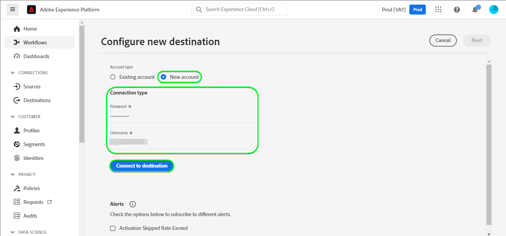
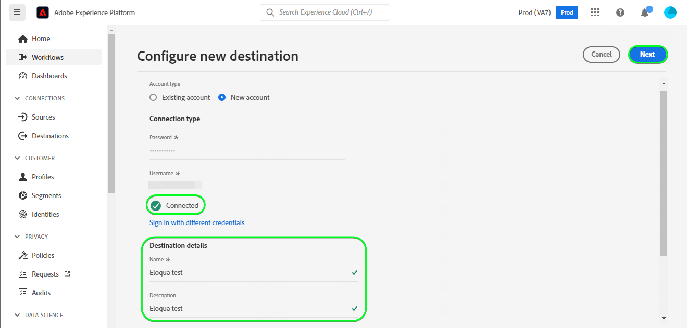
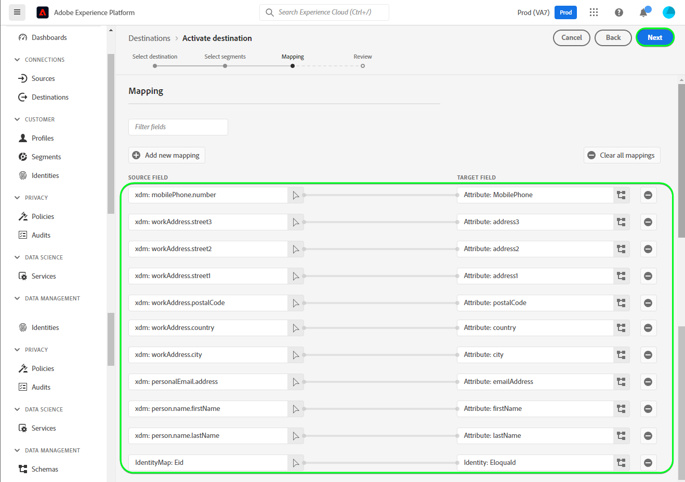
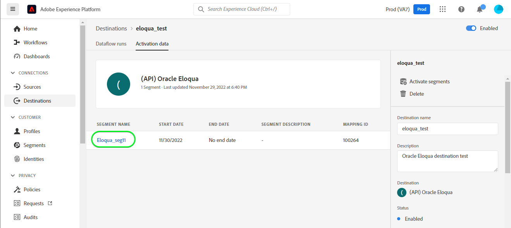
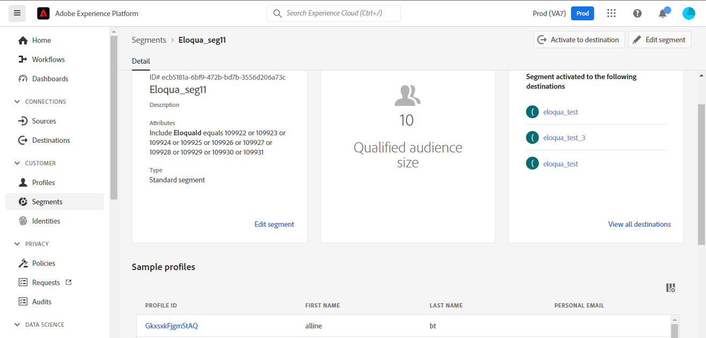
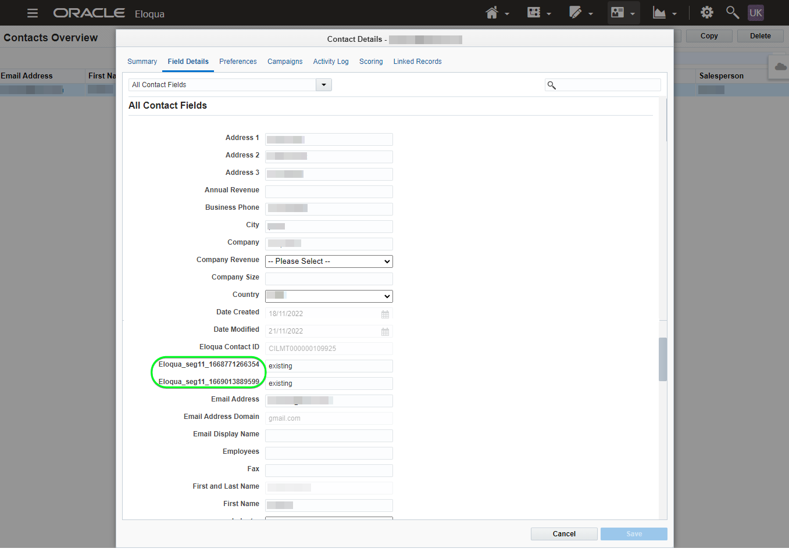
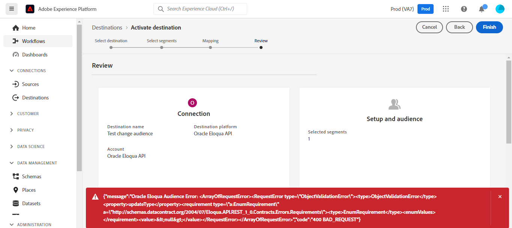

# [!DNL (API) Oracle Eloqua] connection

[[!DNL Oracle Eloqua]](https://www.oracle.com/cx/marketing/automation/) enables marketers to plan and execute campaigns while delivering a personalized customer experience for their prospects. With integrated lead management and easy campaign creation, it helps marketers engage the right audience at the right time in their buyer's journey and elegantly scales to reach audiences across channels including email, display search, video, and mobile. Sales teams can close more deals at a faster rate, increasing marketing ROI through real-time insight.

This [!DNL Adobe Experience Platform] [destination](/help/destinations/home.md) leverages the [[!DNL Oracle Eloqua] Update a Contact REST API](https://docs.oracle.com/en/cloud/saas/marketing/eloqua-rest-api/op-api-rest-1.0-data-contact-id-put.html), which allows you to update identities within a segment into [!DNL Oracle Eloqua].

[!DNL Oracle Eloqua] uses [Basic Authentication](https://docs.oracle.com/en/cloud/saas/marketing/eloqua-rest-api/Authentication_Basic.html) to communicate with the [!DNL Oracle Eloqua Update a Contact REST API]. Instructions to authenticate to your [!DNL Oracle Eloqua] instance are further below, in the [Authenticate to destination](#authenticate) section.

## Use cases {#use-cases}

As a marketer, you can deliver personalized experiences to your users, based on attributes from their Adobe Experience Platform profiles. You can build segments from your offline data and send these segments to [!DNL Oracle Eloqua], to display in the users' feeds as soon as segments and profiles are updated in Adobe Experience Platform.

## Prerequisites {#prerequisites}

### Experience Platform prerequisites {#prerequisites-in-experience-platform}

Before activating data to the [!DNL Oracle Eloqua] destination, you must have a [schema](/help/xdm/schema/composition.md), a [dataset](https://experienceleague.adobe.com/docs/platform-learn/tutorials/data-ingestion/create-datasets-and-ingest-data.html?lang=en), and [segments](https://experienceleague.adobe.com/docs/platform-learn/tutorials/segments/create-segments.html?lang=en) created in [!DNL Experience Platform].

Refer to the Experience Platform documentation for [Segment Membership Details schema field group](/help/xdm/field-groups/profile/segmentation.md) if you need guidance on segment statuses.

### [!DNL Oracle Eloqua] prerequisites {#prerequisites-destination}

In order to export data from Platform to your [!DNL Oracle Eloqua] account you need to have an [!DNL Oracle Eloqua] account.

#### Gather [!DNL Oracle Eloqua] credentials {#gather-credentials}

Note down the items below before you authenticate to the [!DNL Oracle Eloqua] destination:

| Credential | Description |
| --- | --- |
| `Username` | The Username of your [!DNL Oracle Eloqua] account. |
| `Password` | The Password of your [!DNL Oracle Eloqua] account. |

## Guardrails {#guardrails}

>[!NOTE]
>
>* [!DNL Oracle Eloqua] custom contact fields are automatically created using the names of the segments selected during the **[!UICONTROL Destinations]** > **[!UICONTROL Activate Destination]** > **[!UICONTROL Select segments]** step.

* [!DNL Oracle Eloqua] has a maximum limit of 250 custom contact fields.
* Before exporting new segments ensure you are within this limit by logging into your [!DNL Oracle Eloqua] account.
* If this limit is exceeded, you will encounter an error in Experience Platform. This is because the [!DNL Oracle Eloqua] API fails to validate the request, and responds with a - *400: There was a validation error* - error message describing the issue.
* If you have reached the limit specified above, you need to remove existing mappings from your destination and delete the corresponding custom contact fields in your [!DNL Oracle Eloqua] account before you can export more segments.

* Refer to the [Oracle Eloqua Creating Contact Fields](https://docs.oracle.com/en/cloud/saas/marketing/eloqua-user/Help/ContactFields/Tasks/CreatingContactFields.htm) page for information about additional limits.

## Supported identities {#supported-identities}

[!DNL Oracle Eloqua] supports update of identities described in the table below. Learn more about [identities](/help/identity-service/namespaces.md).

|Target Identity|Example|Description|Mandatory|
|---|---|---|---|
| `EloquaId` | `111111` | Unique identifier of the contact.| Yes |

## Connect to the destination {#connect}

>[!IMPORTANT]
>
>To connect to the destination, you need the **[!UICONTROL Manage Destinations]** [access control permission](/help/access-control/home.md#permissions). Read the [access control overview](/help/access-control/ui/overview.md) or contact your product administrator to obtain the required permissions.

To connect to this destination, follow the steps described in the [destination configuration tutorial](../../ui/connect-destination.md). In the configure destination workflow, fill in the fields listed in the two sections below.

Within **[!UICONTROL Destinations]** > **[!UICONTROL Catalog]** search for [!DNL (API) Oracle Eloqua]. Alternatively you can locate it under the **[!UICONTROL Email Marketing]** category.

### Authenticate to destination {#authenticate}

Fill in the required fields below. Refer to the [Gather [!DNL Oracle Eloqua] credentials](#gather-credentials) section for any guidance.
* **[!UICONTROL Password]**: The Password of your [!DNL Oracle Eloqua] account.
* **[!UICONTROL Username]**: The Username of your [!DNL Oracle Eloqua] account.

To authenticate to the destination, select **[!UICONTROL Connect to destination]**.


If the details provided are valid, the UI displays a **[!UICONTROL Connected]** status with a green check mark. You can then proceed to the next step.

### Fill in destination details {#destination-details}

To configure details for the destination, fill in the required and optional fields below. An asterisk next to a field in the UI indicates that the field is required.


* **[!UICONTROL Name]**: A name by which you will recognize this destination in the future.
* **[!UICONTROL Description]**: A description that will help you identify this destination in the future.

### Enable alerts {#enable-alerts}

You can enable alerts to receive notifications on the status of the dataflow to your destination. Select an alert from the list to subscribe to receive notifications on the status of your dataflow. For more information on alerts, see the guide on [subscribing to destinations alerts using the UI](../../ui/alerts.md).

When you are finished providing details for your destination connection, select **[!UICONTROL Next]**.

## Activate segments to this destination {#activate}

>[!IMPORTANT]
>
>To activate data, you need the **[!UICONTROL Manage Destinations]**, **[!UICONTROL Activate Destinations]**, **[!UICONTROL View Profiles]**, and **[!UICONTROL View Segments]** [access control permissions](/help/access-control/home.md#permissions). Read the [access control overview](/help/access-control/ui/overview.md) or contact your product administrator to obtain the required permissions.

Read [Activate profiles and segments to streaming segment export destinations](/help/destinations/ui/activate-segment-streaming-destinations.md) for instructions on activating audience segments to this destination.

### Mapping considerations and example {#mapping-considerations-example}

To correctly send your audience data from Adobe Experience Platform to the [!DNL Oracle Eloqua] destination, you need to go through the field mapping step. Mapping consists of creating a link between your Experience Data Model (XDM) schema fields in your Platform account and their corresponding equivalents from the target destination. 

>[!IMPORTANT]
>
>Both the attribute mappings listed in the table which follows are mandatory.

`EloquaID` is required to update attributes corresponding to the Identity. The `emailAddress` is also necessary as without it the API throws an error as indicated below:
```
    {
        "type": "ObjectValidationError",
        "container": {
            "type": "ObjectKey",
            "objectType": "Contact"
        },
        "property": "emailAddress",
        "requirement": {
            "type": "EmailAddressRequirement"
        },
        "value": "<null>"
    }
```
Attributes specified in the **[!UICONTROL Target field]** should be named exactly as described in table since these attributes will form request body.

Attributes specified in the **[!UICONTROL Source field]** do not follow any such restriction. You can map it based on your need, however if the data format is not correct when pushed to [!DNL Oracle Eloqua] it will result in an error. 

For example, you can map **[!UICONTROL Source field]** identity namespace `contact key`, `ABC ID` etc. to **[!UICONTROL Target field]** : `EloquaID` after ensuring that the ID values conform to the format that is accepted by [!DNL Oracle Eloqua].

To correctly map your XDM fields to the [!DNL Oracle Eloqua] destination fields, follow these steps:

1. In the **[!UICONTROL Mapping]** step, select **[!UICONTROL Add new mapping]**. You will see a new mapping row on the screen.
1. In the **[!UICONTROL Select source field]** window, choose the **[!UICONTROL Select attributes]** category and select the XDM attribute or choose the **[!UICONTROL Select identity namespace]** and select an identity.
1. In the **[!UICONTROL Select target field]** window, choose the **[!UICONTROL Select identity namespace]** and select an identity or choose **[!UICONTROL Select custom attributes]** category and select an attribute as needed.
    * Repeat these steps to add the following mappings between your XDM profile schema and your [!DNL Oracle Eloqua] instance:
        |Source Field|Target Field| Mandatory|
        |---|---|---|
        |`xdm: personalEmail.address`|`Attribute: emailAddress`| Yes |
        |`IdentityMap: Eid`|`Identity: EloquaId`| Yes |

    * An example using these mappings is shown below:
    

When you are finished providing the mappings for your destination connection, select **[!UICONTROL Next]**.

>[!NOTE]
>
>The destination automatically suffixes a unique identifier to the selected segment names on each execution when sending the contact field information to [!DNL Oracle Eloqua]. This ensures the contact field names corresponding to your segment names do not overlap. Refer to the [Validate data export](#exported-data) section screenshot example of a [!DNL Oracle Eloqua] Contact Details page with custom contact field created using the segment names.

## Validate data export {#exported-data}

To validate that you have correctly set up the destination, follow the steps below:

1. Select **[!UICONTROL Destinations]** > **[!UICONTROL Browse]** and navigate to the list of destinations.
1. Next, select the destination and switch to the **[!UICONTROL Activation data]** tab, then select a segment name.


1. Monitor the segment summary and ensure that the count of profiles corresponds to the count within the segment.


1. Log in to the [!DNL Oracle Eloqua] website, then navigate to the **[!UICONTROL Contacts Overview]** page to check if the profiles from the segment have been added. To see the segment status, drill down into a **[!UICONTROL Contact Detail]** page and check if the contact field with the selected segment name as its prefix has been created.



## Data usage and governance {#data-usage-governance}

All [!DNL Adobe Experience Platform] destinations are compliant with data usage policies when handling your data. For detailed information on how [!DNL Adobe Experience Platform] enforces data governance, see the [Data Governance overview](/help/data-governance/home.md).

## Errors and troubleshooting {#errors-and-troubleshooting}

When creating the destination, if you obtain an error message: `400: There was a validation error` or `400 BAD_REQUEST` as the [!DNL Oracle Eloqua] API response.


To fix this error, verify that the custom contact field count in [!DNL Oracle Eloqua] is within the 250 custom contact fields limit as outlined in the [guardrails](#guardrails) section.

Refer to the [[!DNL Oracle Eloqua] HTTP status codes](https://docs.oracle.com/en/cloud/saas/marketing/eloqua-rest-api/APIRequests_HTTPStatusCodes.html) and [[!DNL Oracle Eloqua] Validation errors](https://docs.oracle.com/en/cloud/saas/marketing/eloqua-rest-api/APIRequests_HTTPValidationErrors.html) pages for a comprehensive list of status and error codes with explanations.

## Additional resources {#additional-resources}

Additional useful information from the [!DNL Oracle ELoqua] documentation is below:
* [Oracle Eloqua Marketing Automation](https://docs.oracle.com/en/cloud/saas/marketing/eloqua.html)
* [REST API for Oracle Eloqua Marketing Cloud Service](https://docs.oracle.com/en/cloud/saas/marketing/eloqua-rest-api/rest-endpoints.html)