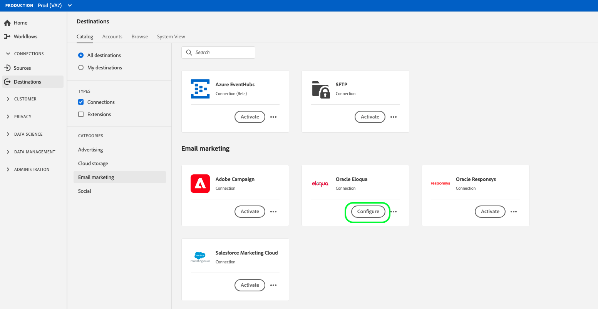
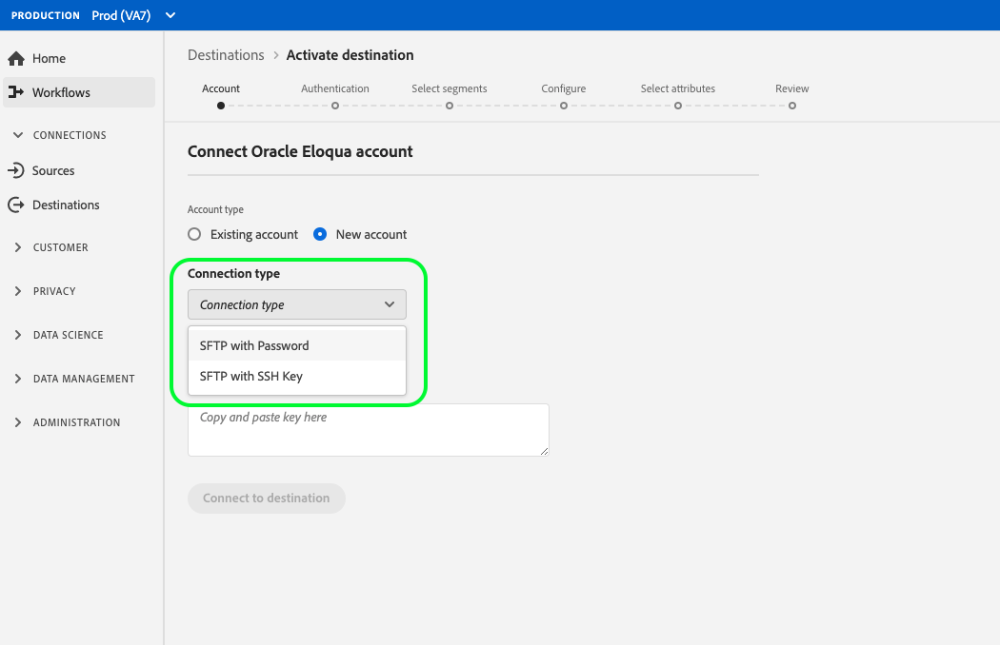
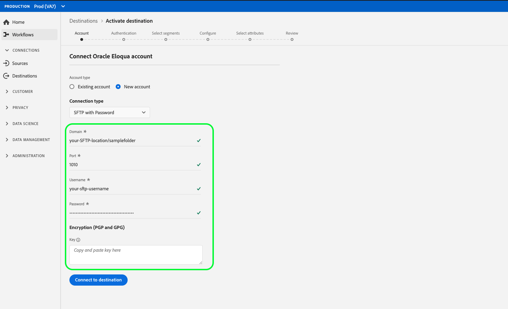
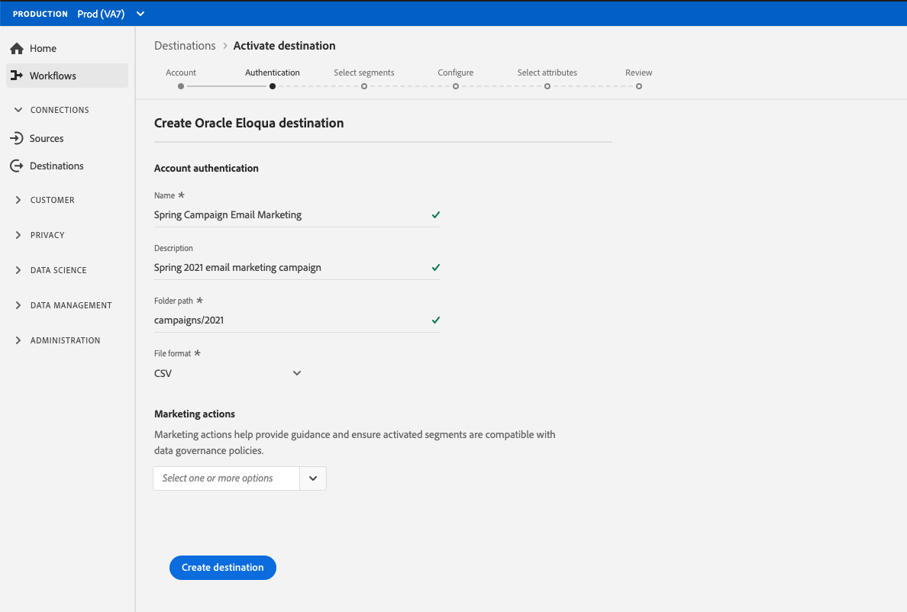

# [!DNL Oracle Eloqua] connection

[[!DNL Oracle Eloqua]](https://www.oracle.com/cx/marketing/automation/) is a software as a service (SaaS) platform for marketing automation offered by [!DNL Oracle] that aims to help B2B marketers and organizations manage marketing campaigns and sales lead generation. 

To send segment data to [!DNL Oracle Eloqua], you must first [connect the destination](#connect-destination) in Adobe Experience Platform, and then [set up a data import](#import-data-into-eloqua) from your storage location into [!DNL Oracle Eloqua].

## Export Type {#export-type}

**Profile-based** - you are exporting all members of a segment, together with the desired schema fields (for example: email address, phone number, last name), as chosen from the select attributes screen of the [destination activation workflow](../../ui/activate-destinations.md#select-attributes).

## Connect to destination {#connect-destination}

In **[!UICONTROL Connections]** > **[!UICONTROL Destinations]**, select [!DNL Oracle Eloqua], then select **[!UICONTROL Configure]**.

>[!NOTE]
>
>If a connection with this destination already exists, you can see an **[!UICONTROL Activate]** button on the destination card. For more information about the difference between [!UICONTROL Activate] and [!UICONTROL Configure], refer to the [Catalog](../../ui/destinations-workspace.md#catalog) section of the destination workspace documentation.  

In the **[!UICONTROL Account]** step, if you had previously set up a connection to your cloud storage destination, select **[!UICONTROL Existing Account]** and select one of your existing connections. Or, you can select **[!UICONTROL New Account]** to set up a new connection. Fill in your account authentication credentials and select **[!UICONTROL Connect to destination]**. For [!DNL Oracle Eloqua], you can select between **[!UICONTROL SFTP with Password]** and **[!UICONTROL SFTP with SSH Key]**. 

Fill in the information below, depending on your connection type, and select **[!UICONTROL Connect to destination]**.

- For **[!UICONTROL SFTP with Password]** connections, you must provide [!UICONTROL Domain], [!UICONTROL Port], [!UICONTROL Username], and [!UICONTROL Password].
- For **[!UICONTROL SFTP with SSH Key]** connections, you must provide [!UICONTROL Domain], [!UICONTROL Port], [!UICONTROL Username], and [!UICONTROL SSH Key].

Optionally, you can attach your RSA-formatted public key to add encryption with PGP/GPG to your exported files under the **[!UICONTROL Key]** section. Your public key must be written as a [!DNL Base64] encoded string.

In the **[!UICONTROL Authentication]** step, fill in the relevant information for your destination as shown below: 
   - **[!UICONTROL Name]**: Pick a relevant name for your destination.
   - **[!UICONTROL Description]**: Enter a description for your destination.
   - **[!UICONTROL Folder Path]**: Provide the path in your storage location where Platform will deposit your export data as CSV or tab-delimited files.
   - **[!UICONTROL File Format]**: **CSV** or **TAB_DELIMITED**. Select which file format to export to your storage location.
   - **[!UICONTROL Marketing actions]**: Marketing actions indicate the intent for which data will be exported to the destination. You can select from Adobe-defined marketing actions or you can create your own marketing action. For more information about marketing actions, see the [Data usage policies overview](../../../data-governance/policies/overview.md).

<!--

Commenting out Amazon S3 bucket part for now until support is clarified

- **[!UICONTROL Bucket name]**: Your Amazon S3 bucket, where Platform will deposit the data export. Your input must be between 3 and 63 characters long. Must begin and end with a letter or number. Must contain only lowercase letters, numbers, or hyphens ( - ). Must not be formatted as an IP address (for example, 192.100.1.1).

-->

Click **[!UICONTROL Create destination]** after filling in the fields above. Your destination is now created and you can [activate segments](../../ui/activate-destinations.md) to the destination.

## Activate segments {#activate-segments}

See [Activate profiles and segments to a destination](../../ui/activate-destinations.md) for information about the segment activation workflow.

## Destination attributes {#destination-attributes}

When [activating segments](../../ui/activate-destinations.md) to the [!DNL Oracle Eloqua] destination, Adobe recommends that you select a unique identifier from your [union schema](../../../profile/home.md#profile-fragments-and-union-schemas). Select the unique identifier and any other XDM fields that you want to export to the destination. For more information, refer to [Select which schema fields to use as destination attributes in your exported files](./overview.md#destination-attributes).

## Exported data {#exported-data}

For [!DNL Oracle Eloqua] destinations, Platform creates a tab-delimited `.csv` file in the storage location that you provided. For more information about the files, see [Email Marketing destinations and Cloud storage destinations](../../ui/activate-destinations.md#esp-and-cloud-storage) in the segment activation tutorial. 

## Set up data import into [!DNL Oracle Eloqua] {#import-data-into-eloqua}

After connecting [!DNL Platform] to your [!DNL SFTP] storage, you must set up the data import from your storage location into [!DNL Oracle Eloqua]. To learn how to accomplish this, see [Importing contacts or accounts](https://docs.oracle.com/cloud/latest/marketingcs_gs/OMCAA/Help/DataImportExport/Tasks/ImportingContactsOrAccounts.htm) in the [!DNL Oracle Eloqua Help Center].
