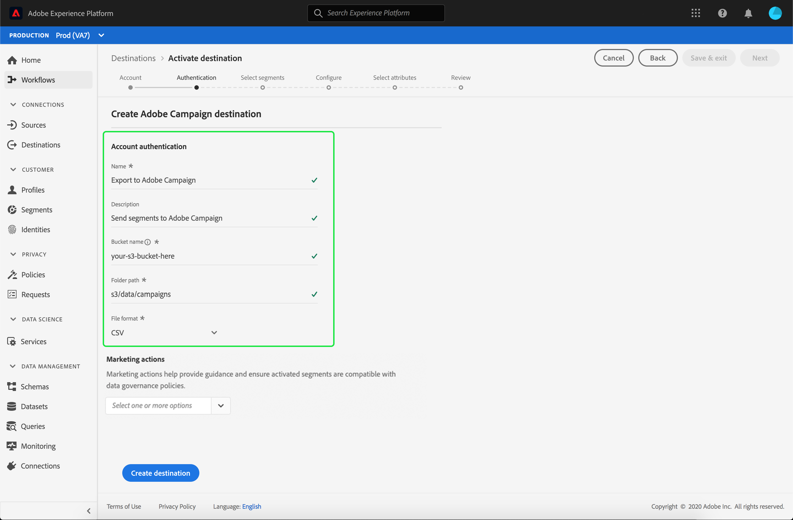

# Email marketing destinations overview {#email-marketing-destinations}

Email Service Providers (ESPs) enable you to manage your email marketing activities, such as sending promotional email campaigns. Adobe Experience Platform integrates with ESPs by allowing you to activate segments to email marketing destinations.

To send segments to email marketing destinations for your campaigns, Platform must first connect to the destination.

Connecting to email marketing destinations is a three-step process ([configure destination](#connect-destination), [activate segments](#select-segments), [import data from storage location into the destination](#import-data-into-destination)). Each of the steps is described further below on this page.

In the connect destination flow, described in the section below, connect to either [!DNL Amazon S3] or [!DNL SFTP]. Platform exports your segments as `.csv` files and delivers them to your preferred location. Schedule your data import in your email marketing platform from the storage location enabled in [!DNL Platform]. The process to import data varies for each partner. Read the individual destinations articles for more information. 

## Configure destination {#connect-destination}

In **[!UICONTROL Connections]** > **[!UICONTROL Destinations]**, select the email marketing destination that you want to connect to, then select **[!UICONTROL Configure]**.

In the **[!UICONTROL Account]** step, if you had previously set up a connection to your email marketing destination, select **[!UICONTROL Existing Account]** and select your existing connection. Or, you can select **[!UICONTROL New Account]** to set up a new connection to your email marketing destination. In the **[!UICONTROL Connection type]** selector, you can select between [!UICONTROL Amazon S3], [!UICONTROL Azure Blob], [!UICONTROL SFTP with Password], or [!UICONTROL SFTP with SSH Key]. Fill in the information below, depending on your connection type, then select **[!UICONTROL Connect]**.

- For **S3 connections**, you must provide your Amazon Access Key ID and Secret Access Key. 
- For **SFTP with Password** connections, you must provide Domain, Port, Username, and Password for your SFTP server.
- For **SFTP with SSH Key** connections, you must provide Domain, Port, Username, and SSH Key for your SFTP server.

Optionally, you can attach your RSA-formatted public key to add encryption to your exported files under the **[!UICONTROL Key]** section. Your public key must be written as a [!DNL Base64] encoded string.

In the **[!UICONTROL Authentication]** step, enter a name and a description for your new destination, and the file format for the exported files.

If you selected Amazon S3 as storage option in the previous step, insert the bucket name and the folder path in your cloud storage destination where the files will be delivered. For the SFTP storage option, insert the folder path where the files will be delivered. 

At this step, you can also select any Marketing action that should apply to this destination. Marketing actions indicate the intent for which data will be exported to the destination. You can select from Adobe-defined marketing actions or you can create your own marketing action. For more information about marketing actions, read the [Data usage policies overview](../../../data-governance/policies/overview.md).

## Select which segment members to include in your destination exports {#select-segments}

On the **[!UICONTROL Select Segments]** page, select which segments to send to the destination. Find more information about the fields in the sections below.

## Configure file names

For information about the segment schedule and file name editing options, refer to the [Configure](../../ui/activate-destinations.md#configure) step in the activate destinations tutorial.

## Select attributes - Select which schema fields to use as destination attributes in your exported files {#destination-attributes}

In this step, you are selecting which fields to export to email marketing destinations, and marking which fields are mandatory.
For information about this step, refer to the [Select attributes](../../ui/activate-destinations.md#select-attributes) step in the activate destinations tutorial.

## Identity {#identity}

Adobe recommends that you select a unique identifier from your [union schema](../../../profile/home.md#profile-fragments-and-union-schemas). This is the field that your user identities are keyed off of. Most commonly, this field is the email address, but it can also be a loyalty program ID or a phone number. Refer to the table below for the most common unique identifiers and their XDM field in the schema.

Unique Identifier | XDM field in Unified Schema
----------------- | ---------------------------
 Email Address | `personalEmail.address` 
 Phone | `mobilePhone.number` 
 Loyalty program ID | `Customer-defined XDM field` 

## Other destination attributes

In the Schema field selector, choose which other fields you want to export to the email destination. Some recommended options are:

Schema | XDM field 
------ | ---------
 First Name | `person.name.firstName`
 Last Name | `person.name.lastName`
 Phone | `mobilePhone.number` 
 Address City| `homeAddress.city` 
 Address State | `homeAddress.stateProvince` 
 Address Postal Code | `homeAddress.postalCode` 
 Birthday | `person.birthDayAndMonth`
 Segment membership | `segmentMembership.status`

## Import data from your storage location into the destination {#import-data-into-destination}

Read the individual email marketing destination articles to learn how to import data from your storage location into destinations: 

- [Adobe Campaign](./adobe-campaign.md#import-data-into-campaign)
- [Oracle Eloqua](./oracle-eloqua.md#import-data-into-eloqua)
- [Oracle Responsys](./oracle-responsys.md#import-data-into-responsys)
- [Salesforce Marketing Cloud](./salesforce-marketing-cloud.md#import-data-into-salesforce)

## Activate segments to email marketing destinations

For instructions on how to activate segments to email marketing destinations, refer to [Activate profiles and segments to a destination](../../ui/activate-destinations.md).

## Additional resources

- [Activate data to destinations](../../ui/activate-destinations.md)
- [Create email marketing destinations and activate data using the Flow Service API](../../api/email-marketing.md)
