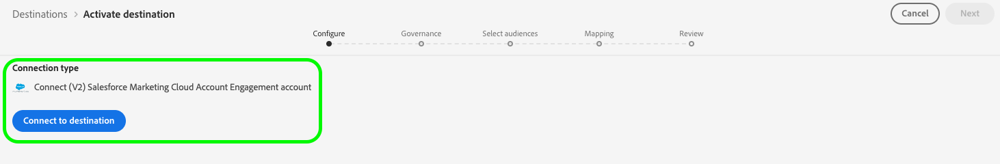
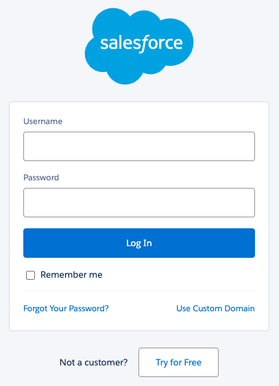
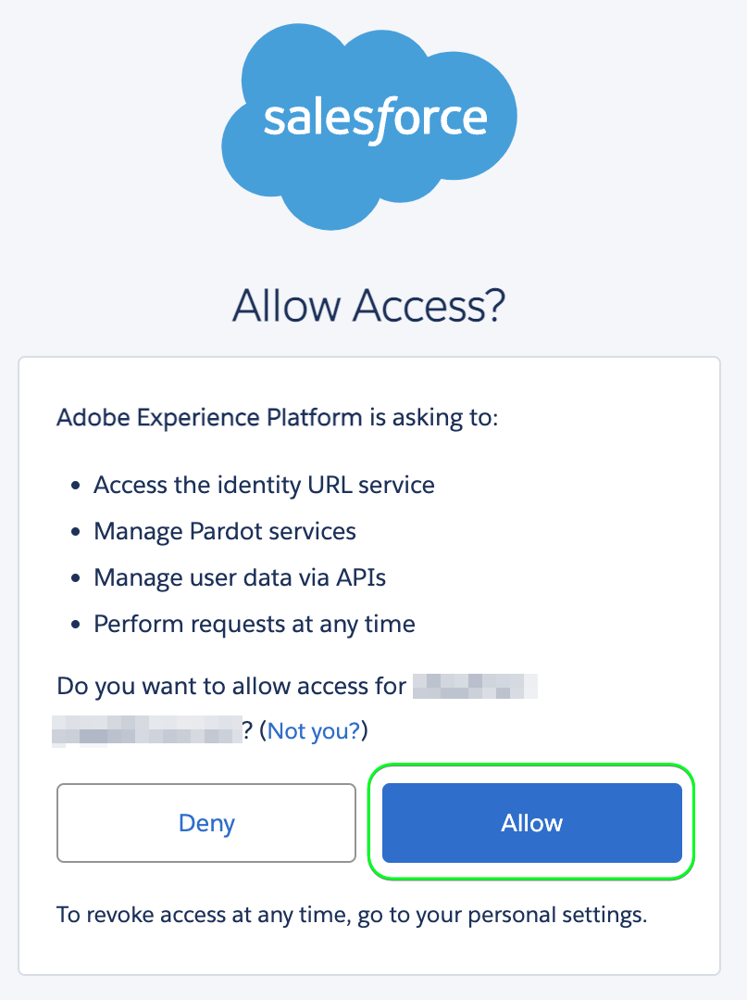
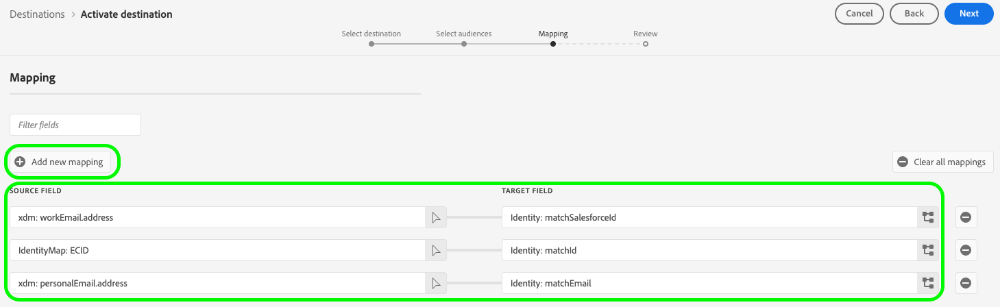
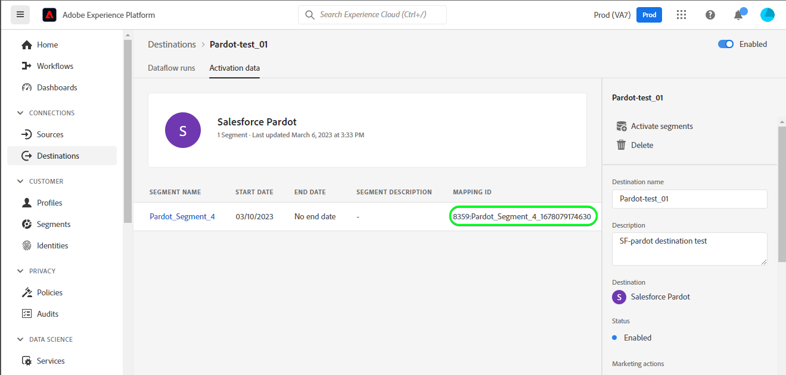
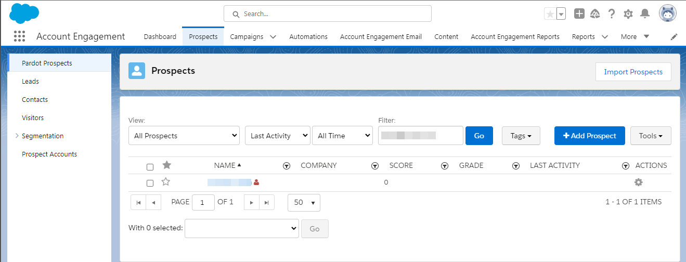

# [!DNL (V2) Salesforce Marketing Cloud Account Engagement] connection

The [[!DNL Salesforce Marketing Cloud Account Engagement]](https://www.salesforce.com/products/marketing-cloud/marketing-automation/) (formerly known as [!DNL Pardot]) destination allows you to export your Adobe Experience Platform profile data to Salesforce's B2B marketing automation platform.

This integration enables seamless data synchronization between your customer profiles in Adobe Experience Platform and your marketing campaigns in [!DNL Salesforce Marketing Cloud Account Engagement].

This destination uses the [[!DNL Salesforce Import API v5]](https://developer.salesforce.com/docs/marketing/pardot/guide/import-v5.html) to efficiently process batch data exports.

>[!IMPORTANT]
> 
> This is the V2 version of the [Salesforce Marketing Cloud Account Engagement](/help/destinations/catalog/email-marketing/salesforce-marketing-cloud-account-engagement.md) destination. This version replaces the previous destination and is currently in Alpha release.
>  
> If you are currently using the previous version of the [Salesforce Marketing Cloud Account Engagement](/help/destinations/catalog/email-marketing/salesforce-marketing-cloud-account-engagement.md) destination, you must migrate to this V2 version before **January 2026**. After January 2026, Adobe will decommission the previous version and it will no longer be available.

## Use cases {#use-cases}

To help you better understand how and when you should use the [!DNL (V2) Marketing Cloud Account Engagement] destination, here are sample use cases that Adobe Experience Platform customers can solve by using this destination.

### B2B Lead management {#use-case-lead-management}

Synchronize lead data from Adobe Experience Platform to [!DNL Salesforce Marketing Cloud Account Engagement] for comprehensive lead nurturing and scoring. Your marketing team can build rich audience profiles in Experience Platform and export them to [!DNL Salesforce Marketing Cloud Account Engagement] for automated B2B marketing campaigns.

### Campaign automation {#use-case-campaign-automation}

You can trigger marketing campaigns in [!DNL Salesforce Marketing Cloud Account Engagement] by using audiences that you define in Adobe Experience Platform. After you export your targeted audiences to [!DNL Salesforce], you can use them to run email campaigns and manage your leads through nurturing, scoring, and campaign segmentation.

### Profile enrichment {#use-case-profile-enrichment}

Enhance your [!DNL Salesforce Marketing Cloud Account Engagement] prospect profiles with rich customer data from Adobe Experience Platform. Export comprehensive profile attributes to create more detailed prospect records in [!DNL Salesforce Marketing Cloud Account Engagement] for improved targeting and personalization.

## Prerequisites {#prerequisites}

Refer to the sections below for any prerequisites that you need to set up in Experience Platform and [!DNL Salesforce] and for information that you need to gather before working with the [!DNL (V2) Marketing Cloud Account Engagement] destination.

### Experience Platform prerequisites {#prerequisites-in-experience-platform}

Before activating data to the [!DNL (V2) Marketing Cloud Account Engagement] destination, you must have a [schema](/help/xdm/schema/composition.md), a [dataset](../../../catalog/datasets/overview.md), and [audiences](../../../segmentation/types/overview.md) created in [!DNL Experience Platform].

### [!DNL Salesforce Marketing Cloud Account Engagement] prerequisites {#prerequisites-destination}

Note the following prerequisites in order to export data from Experience Platform to your [!DNL Marketing Cloud Account Engagement] account:

#### You need to have a [!DNL Marketing Cloud Account Engagement] account {#prerequisites-account}

A [!DNL Marketing Cloud Account Engagement] account with a subscription to the [Marketing Cloud Account Engagement](https://www.salesforce.com/products/marketing-cloud/marketing-automation/) product is mandatory to proceed.

#### Gather [!DNL Marketing Cloud Account Engagement] credentials {#gather-credentials}

Write down the items below before you authenticate to the [!DNL (V2) Marketing Cloud Account Engagement] destination.

| Credential | Description |
| --- | --- |
| **[!UICONTROL Account Engagement Business Unit ID]** | Your [!DNL Salesforce] Account Engagement Business Unit ID. Refer to the Salesforce [documentation](https://help.salesforce.com/s/articleView?id=000381973&type=1) to learn how to find the ID. |

{style="table-layout:auto"}

## Supported identities {#supported-identities}

[!DNL (V2) Marketing Cloud Account Engagement] supports the activation of identities described in the table below. Learn more about [identities](/help/identity-service/features/namespaces.md).

If a match is found using one of these identifiers, the existing Account Engagement prospect record will be updated with the data from Adobe Experience Platform. If no match is found, a new prospect record will be created in Account Engagement.

| Target identity | Description | Considerations |
|---|---|---|
| `matchId` | Prospect ID in Account Engagement | At least one of these three identities is required |
| `matchSalesforceId` | Salesforce Lead/Contact ID of the prospect | At least one of these three identities is required |
| `matchEmail` | Email address of the prospect | At least one of these three identities is required |

{style="table-layout:auto"}

## Export type and frequency {#export-type-frequency}

Refer to the table below for information about the destination export type and frequency.

| Item | Type | Notes |
---------|----------|---------|
| Export type | **[!UICONTROL Profile-based]** | <ul><li>You are exporting all members of an audience, together with the desired schema fields *(for example: email address, phone number, last name)*, according to your field mapping.</li><li>This destination supports batch export of profile data using the Salesforce Import API v5.</li></ul>|
| Export frequency | **[!UICONTROL Batch]** | <ul><li>**Initial Export**: Full export immediately after mapping</li><li>**Subsequent Exports**: Incremental exports every 3 hours</li><li>This schedule is fixed and cannot be customized in Alpha</li></ul>|

{style="table-layout:auto"}

## Connect to the destination {#connect}

>[!IMPORTANT]
>
>To connect to the destination, you need the **[!UICONTROL View Destinations]** and **[!UICONTROL Manage Destinations]** [access control permissions](/help/access-control/home.md#permissions). Read the [access control overview](/help/access-control/ui/overview.md) or contact your product administrator to obtain the required permissions.

To connect to this destination, follow the steps described in the [destination configuration tutorial](../../ui/connect-destination.md). In the configure destination workflow, fill in the fields listed in the two sections below.

### Authenticate to destination {#authenticate}

To authenticate to the destination, select **[!UICONTROL Connect to destination]**.

You will be redirected to the [!DNL Salesforce] login page. Enter your [!DNL Marketing Cloud Account Engagement] account credentials and select **[!UICONTROL Log In]**.

Next, select **[!UICONTROL Allow]** to give permissions to the **Adobe Experience Platform** app to access your [!DNL Salesforce Marketing Cloud Account Engagement] account. *You need to do this only once*.

If the details provided are valid, the UI displays a message: *You successfully connected to (V2) Salesforce Marketing Cloud Account Engagement account* and a **[!UICONTROL Connected]** status with a green check mark.

### Fill in destination details {#destination-details}

To configure details for the destination, fill in the required and optional fields below. An asterisk next to a field in the UI indicates that the field is required.

* **[!UICONTROL Name]**: A name by which you will recognize this destination in the future.
* **[!UICONTROL Description]**: A description that will help you identify this destination in the future.
* **[!UICONTROL Account Engagement Business Unit ID]**: Your [!DNL Salesforce] `Account Engagement Business Unit ID`.
* **[!UICONTROL Account Engagement API]**: Select whether you want to use the production (`https://pi.pardot.com`) or demo (`https://pi.demo.pardot.com`) endpoints of the Account Engagement API.
* **[!UICONTROL Account Engagement Campaign ID]**: Every [!DNL Account Engagement] prospect must be associated with a campaign. If you do not set a campaign ID, Account Engagement will attempt to assign one automatically, if a default exists in your Salesforce account.

### Enable alerts {#enable-alerts}

You can enable alerts to receive notifications on the status of the dataflow to your destination. Select an alert from the list to subscribe to receive notifications on the status of your dataflow. For more information on alerts, see the guide on [subscribing to destinations alerts using the UI](../../ui/alerts.md).

When you are finished providing details for your destination connection, select **[!UICONTROL Next]**.

## Activate audiences to this destination {#activate}

>[!IMPORTANT]
> 
>* To activate data, you need the **[!UICONTROL View Destinations]**, **[!UICONTROL Activate Destinations]**, **[!UICONTROL View Profiles]**, and **[!UICONTROL View Segments]** [access control permissions](/help/access-control/home.md#permissions). Read the [access control overview](/help/access-control/ui/overview.md) or contact your product administrator to obtain the required permissions.
>* To export *identities*, you need the **[!UICONTROL View Identity Graph]** [access control permission](/help/access-control/home.md#permissions).   {width="100" zoomable="yes"}

Read [Activate audience data to batch profile export destinations](/help/destinations/ui/activate-batch-profile-destinations.md) for instructions on activating audiences to this destination.

### Mapping considerations and example {#mapping-considerations-example}

To send audience data from Adobe Experience Platform to the [!DNL (V2) Marketing Cloud Account Engagement] destination, you must map your Experience Data Model (XDM) schema fields to the corresponding fields in the destination.

Refer to the [Salesforce Prospect API v5 documentation](https://developer.salesforce.com/docs/marketing/pardot/guide/prospect-v5.html) for a complete list of supported fields. Note that [custom fields](https://developer.salesforce.com/docs/marketing/pardot/guide/custom-field-v5.html) are not supported in the Alpha release.

#### Supported attributes {#supported-attributes}

The Salesforce Marketing Cloud Account Engagement destination supports the target attributes described in the table below.

| Attribute | Type | Description |
|---------|----------|----------|
| `salesforceId` | String | The Salesforce ID of the prospect |
| `salesforceOwnerId` | Integer | The Salesforce user ID of the prospect owner |
| `salutation` | String | The prospect's salutation (e.g., Mr., Ms., Dr.) |
| `score` | Integer | The prospect's score in Account Engagement |
| `source` | String | The source of the prospect record |
| `state` | String | The state/province of the prospect |
| `territory` | String | The territory assigned to the prospect |
| `userId` | Integer | The user ID associated with the prospect |
| `website` | String | The prospect's website URL |
| `yearsInBusiness` | String | The number of years the prospect has been in business |
| `zip` | String | The ZIP/postal code of the prospect |

#### Required mappings {#required-mappings}

Before you begin mapping your data, review the required field mappings below.

| Target field | Type | Required | When to use |
|---|---|---|---|
| `email` | Attribute | Always required | The prospect's email address. This is the primary identifier for finding and matching prospect records in Account Engagement when you don't have a `matchId` or `matchSalesforceId`.   **Note:** With Account Engagement's "Allow Multiple Prospects with the Same Email Address" feature, relying solely on email can lead to ambiguity if there are multiple prospects with the same email. Account Engagement will usually default to updating the prospect with the most recent activity in such cases. |
| `matchId` | Identity | At least one of these three identities is required | A unique identifier generated by Account Engagement for each individual prospect record. Use this when you already have the Account Engagement prospect ID and want to ensure updates are applied to the correct prospect, especially when multiple prospects share the same email address. |
| `matchSalesforceId` | Identity | At least one of these three identities is required | The Salesforce ID of a lead or contact in Salesforce. Use this when a prospect is already synced with Salesforce to maintain data consistency between Account Engagement and Salesforce. |
| `matchEmail` | Identity | At least one of these three identities is required | The prospect's email address used for matching. Use this as an alternative identifier when you don't have the specific Account Engagement prospect ID or Salesforce ID. Note: If multiple prospects share the same email address, Account Engagement will usually default to updating the prospect with the most recent activity. |

Follow the steps below to map the correct fields.

1. In the **[!UICONTROL Mapping]** step, select **[!UICONTROL Add new mapping]**. You will see a new mapping row on the screen.
1. In the **[!UICONTROL Select source field]** window, choose the **[!UICONTROL Select attributes]** category and select the XDM attribute or choose the **[!UICONTROL Select identity namespace]** and select an identity.
1. In the **[!UICONTROL Select target field]** window, choose the **[!UICONTROL Select identity namespace]** and select an identity or choose **[!UICONTROL Select custom attributes]** category and specify from the list of standard Account Engagement prospect fields.

## Validate data export {#exported-data}

To validate that you have correctly set up the destination, follow the steps below:

1. Navigate to one of the audiences you had selected. Select the **[!DNL Activation data]** tab. The **[!UICONTROL Mapping ID]** column displays the name of the custom field which is generated within the [!DNL Marketing Cloud Account Engagement Prospects] page.

1. Log in to the [[!DNL Salesforce]](https://login.salesforce.com/) website. Then navigate to the **[!DNL Account Engagement]** > **[!DNL Prospects]** > **[!DNL Pardot Prospects]** page and check if the prospects from the audience have been added/updated. Alternatively you can also access [[!DNL Account Engagement]](https://pi.pardot.com/) and access the **[!DNL Prospects]** page.

1. To check if the prospects have been updated, select a prospect and verify if the custom prospect field has been updated with the Experience Platform audience status.

## Data usage and governance {#data-usage-governance}

All [!DNL Adobe Experience Platform] destinations are compliant with data usage policies when handling your data. For detailed information on how [!DNL Adobe Experience Platform] enforces data governance, see the [Data Governance overview](/help/data-governance/home.md).

## Additional resources {#additional-resources}

* [!DNL Marketing Cloud Account Engagement] [API documentation](https://developer.salesforce.com/docs/marketing/pardot/guide/overview.html)
* [Salesforce Import API v5 Documentation](https://developer.salesforce.com/docs/marketing/pardot/guide/import-v5.html)
* [Salesforce Prospect API v5 Documentation](https://developer.salesforce.com/docs/marketing/pardot/guide/prospect-v5.html) 