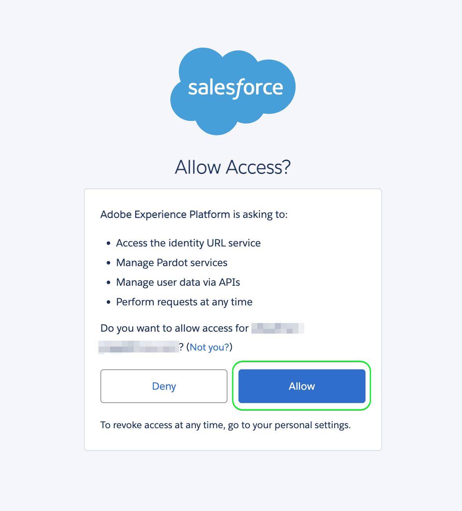
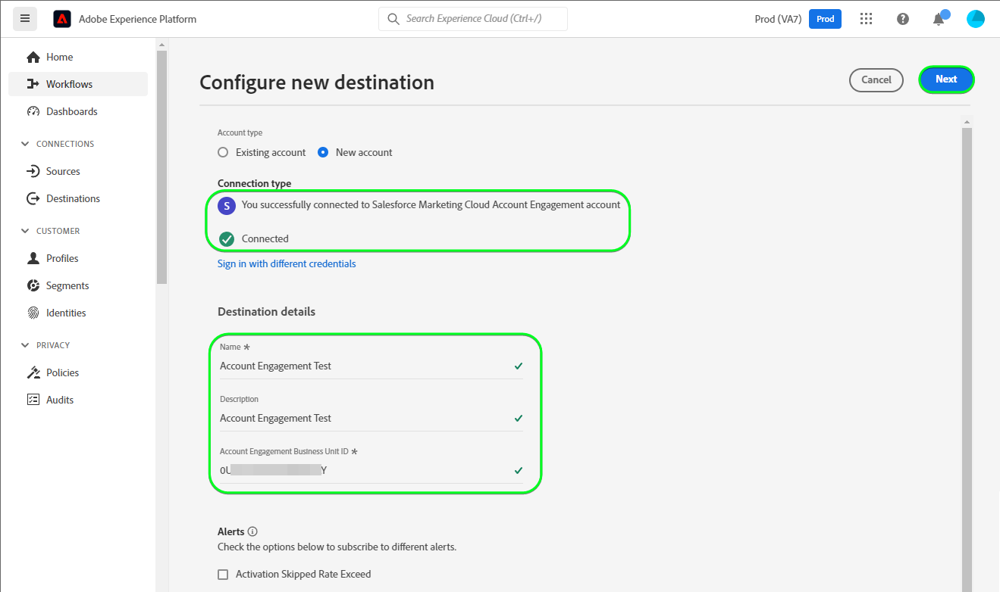
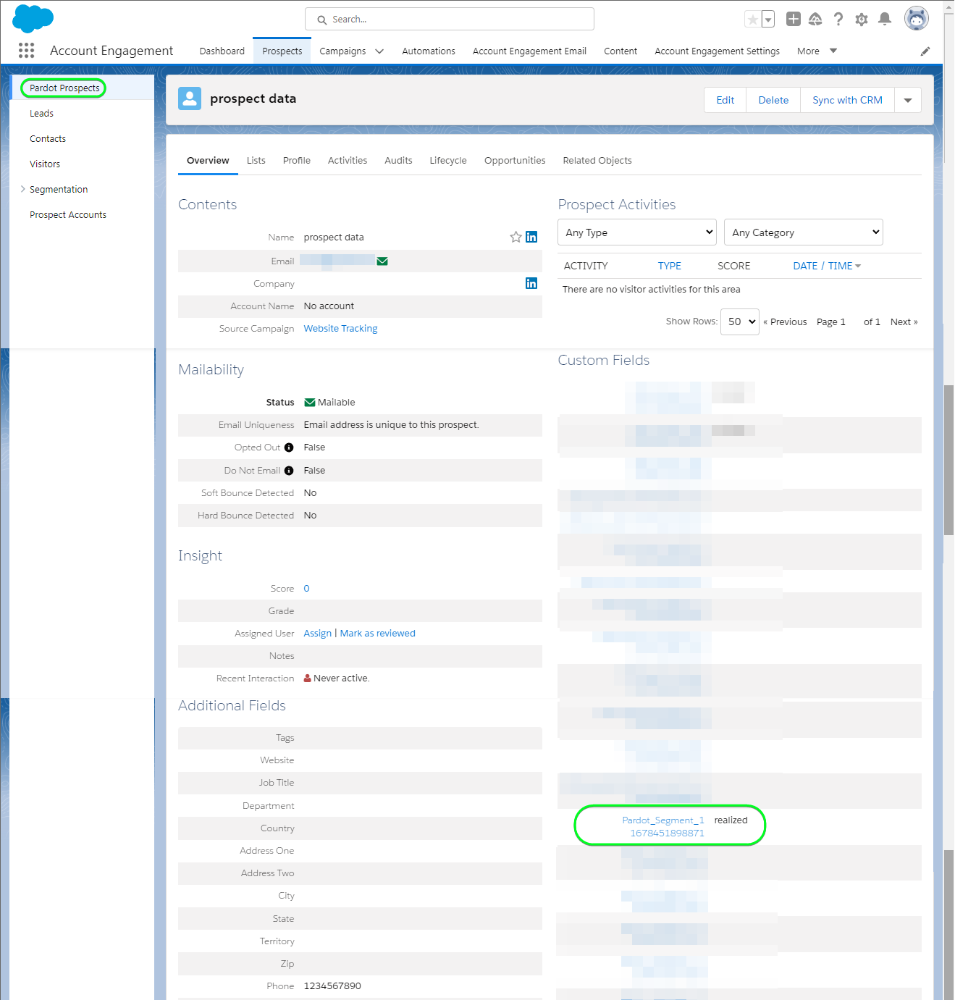

# [!DNL Salesforce Marketing Cloud Account Engagement] connection

Use the [[!DNL Salesforce Marketing Cloud Account Engagement]](https://www.salesforce.com/products/marketing-cloud/marketing-automation/) *(formerly known as [!DNL Pardot])* destination to capture, track, score and grade leads. You can also design lead tracks for all stages of the pipeline for targeted market segments and customer groups through email drip campaigns and lead management with nurturing, scoring and campaign segmentation.

Compared to [!DNL Salesforce Marketing Cloud Engagement] which is more oriented towards **B2C** marketing, [!DNL Marketing Cloud Account Engagement] is ideal for **B2B** use cases involving multiple departments and decision makers which require longer sales and decision cycles. In addition, you also maintain closer proximity and integration with your CRM to make appropriate sales and marketing decisions. *Note, Experience Platform also has connections for [!DNL Salesforce Marketing Cloud Engagement], you can check them on the [[!DNL Salesforce Marketing Cloud]](/help/destinations/catalog/email-marketing/salesforce-marketing-cloud.md) and [[!DNL (API) Salesforce Marketing Cloud]](/help/destinations/catalog/email-marketing/salesforce-marketing-cloud-exact-target.md) pages.*

This [!DNL Adobe Experience Platform] [destination](/help/destinations/home.md) leverages the [[!DNL Salesforce Account Engagement API > Prospect Upsert by Email]](https://developer.salesforce.com/docs/marketing/pardot/guide/prospect-v5.html#prospect-upsert-by-email) endpoint, to **add or update your leads** after activating them within a new [!DNL Marketing Cloud Account Engagement] segment.

[!DNL Marketing Cloud Account Engagement] uses the OAuth 2 with Authorization Code protocol to authenticate to the [!DNL Account Engagement] API. Instructions to authenticate to your [!DNL Marketing Cloud Account Engagement] instance are further below, in the [Authenticate to destination](#authenticate) section.

## Use cases {#use-cases}

To help you better understand how and when you should use the [!DNL Marketing Cloud Account Engagement] destination, here is a sample use case that Adobe Experience Platform customers can solve by using this destination.

### Send emails to contacts for marketing campaigns {#use-case-send-emails}

The marketing department of an online platform wants to broadcast an email-based marketing campaign to a curated audience of B2B leads. The platform's marketing team can add new leads or update existing lead information through Adobe Experience Platform, build segments from their own offline data, and send these segments to [!DNL Marketing Cloud Account Engagement], which can then be used to send the marketing campaign email.

## Prerequisites {#prerequisites}

Refer to the sections below for any prerequisites that you need to set up in Experience Platform and [!DNL Salesforce] and for information that you need to gather before working with the [!DNL Marketing Cloud Account Engagement] destination.

### Prerequisites in Experience Platform {#prerequisites-in-experience-platform}

Before activating data to the [!DNL Marketing Cloud Account Engagement] destination, you must have a [schema](/help/xdm/schema/composition.md), a [dataset](https://experienceleague.adobe.com/docs/platform-learn/tutorials/data-ingestion/create-datasets-and-ingest-data.html?lang=en), and [segments](https://experienceleague.adobe.com/docs/platform-learn/tutorials/segments/create-segments.html?lang=en) created in [!DNL Experience Platform].

### Prerequisites in [!DNL Marketing Cloud Account Engagement] {#prerequisites-destination}

Note the following prerequisites in order to export data from Platform to your [!DNL Marketing Cloud Account Engagement] account:

#### You need to have a [!DNL Marketing Cloud Account Engagement] account {#prerequisites-account}

A [!DNL Marketing Cloud Account Engagement] account with a subscription to the [Marketing Cloud Account Engagement](https://www.salesforce.com/products/marketing-cloud/marketing-automation/) product is mandatory to proceed.

Your [!DNL Salesforce] account should have the [!DNL Salesforce] `Account Engagement Administrator role`. This is required to [create custom prospect fields](https://help.salesforce.com/s/articleView?id=sf.pardot_fields_create_custom_field.htm&type=5).

Finally, your account should also be able to access the [[!DNL Account Engagement Lightning App]](https://help.salesforce.com/s/articleView?id=sf.pardot_lightning_enable.htm&type=5).

Reach out to [[!DNL Salesforce] Support](https://www.salesforce.com/company/contact-us/?d=cta-glob-footer-10) or your [!DNL Salesforce] account administrator if you do not have an account, or the account is missing the [!DNL Marketing Cloud Account Engagement] subscription or the [!DNL Account Engagement Administrator role].

#### Gather [!DNL Marketing Cloud Account Engagement] credentials {#gather-credentials}

Note down the items below before you authenticate to the [!DNL Marketing Cloud Account Engagement] destination.

| Credential | Description |
| --- | --- |
| `Username` | Your [!DNL Marketing Cloud Account Engagement] account username. |
| `Password` | Your [!DNL Marketing Cloud Account Engagement] account password. |
| `Account Engagement Business Unit ID` | To find the Account Engagement Business Unit ID, use Setup in [!DNL Salesforce]. From Setup, enter *Business Unit Setup* in the Quick Find box. Your Account Engagement Business Unit ID begins with `0Uv` and is 18 characters long. If you can't access the Business Unit Setup information, ask your [!DNL Salesforce] Account Administrator to provide you with the `Account Engagement Business Unit ID`. If you require any additional guidance refer to the [[!DNL Salesforce] Authentication](https://developer.salesforce.com/docs/marketing/pardot/guide/authentication) guideline page. |

{style="table-layout:auto"}

### Guardrails {#guardrails}

Refer to the [!DNL Marketing Cloud Account Engagement] [rate limits](https://developer.salesforce.com/docs/marketing/pardot/guide/overview.html#rate-limits) which details the limits imposed by your plan and would also apply to the Experience Platform executions.

>[!IMPORTANT]
>
>If your [!DNL Salesforce] account administrator has restricted access to trusted IP ranges, you need to contact them to get [Experience Platform IP's](/help/destinations/catalog/streaming/ip-address-allow-list.md) allowlisted. Refer to the [!DNL Salesforce] [Restrict Access to Trusted IP Ranges for a Connected App](https://help.salesforce.com/s/articleView?id=sf.connected_app_edit_ip_ranges.htm&type=5) documentation if you need additional guidance.

## Supported identities {#supported-identities}

[!DNL Marketing Cloud Account Engagement] supports the activation of identities described in the table below. Learn more about [identities](/help/identity-service/namespaces.md).

| Target Identity | Description | Considerations |
|---|---|---|
| Email | Prospect Email Address | Mandatory |

{style="table-layout:auto"}

## Export type and frequency {#export-type-frequency}

Refer to the table below for information about the destination export type and frequency.

| Item | Type | Notes |
---------|----------|---------|
| Export type | **[!UICONTROL Profile-based]** | <ul><li>You are exporting all members of a segment, together with the desired schema fields *(for example: email address, phone number, last name)*, according to your field mapping.</li><li> For each selected segment in Platform, the corresponding [!DNL Salesforce Marketing Cloud Account Engagement] segment status gets updated with its segment status from Platform.</li></ul>|
| Export frequency | **[!UICONTROL Streaming]** | Streaming destinations are "always on" API-based connections. As soon as a profile is updated in Experience Platform based on segment evaluation, the connector sends the update downstream to the destination platform. Read more about [streaming destinations](/help/destinations/destination-types.md#streaming-destinations).|

{style="table-layout:auto"}

## Connect to the destination {#connect}

>[!IMPORTANT]
>
>To connect to the destination, you need the **[!UICONTROL Manage Destinations]** [access control permission](/help/access-control/home.md#permissions). Read the [access control overview](/help/access-control/ui/overview.md) or contact your product administrator to obtain the required permissions.

To connect to this destination, follow the steps described in the [destination configuration tutorial](../../ui/connect-destination.md). In the configure destination workflow, fill in the fields listed in the two sections below.

Within **[!UICONTROL Destinations]** > **[!UICONTROL Catalog]**, search for [!DNL Salesforce Marketing Cloud Account Engagement]. Alternatively you can locate it under the **[!UICONTROL Email marketing]** category.

### Authenticate to destination {#authenticate}

To authenticate to the destination, select **[!UICONTROL Connect to destination]**. You will be navigated to the [!DNL Salesforce] login page. Enter your [!DNL Marketing Cloud Account Engagement] account credentials and select [!DNL Log In].

Next, Select [!UICONTROL Allow] in the subsequent window to give permissions to the **Adobe Experience Platform** app to access your [!DNL Salesforce Marketing Cloud Account Engagement] account. *You will need to do this only once*.

If the details provided are valid, the UI displays a message: *You successfully connected to Salesforce Marketing Cloud Account Engagement account* message and a **[!UICONTROL Connected]** status with a green check mark, you can then proceed to the next step.

### Fill in destination details {#destination-details}

To configure details for the destination, fill in the required and optional fields below. An asterisk next to a field in the UI indicates that the field is required. Refer to the [Gather [!DNL Marketing Cloud Account Engagement] credentials](#gather-credentials) section for any guidance.

| Field | Description |
| --- | --- |
| **[!UICONTROL Name]** | A name by which you will recognize this destination in the future. |
| **[!UICONTROL Description]** | A description that will help you identify this destination in the future. |
| **[!UICONTROL Account Engagement Business Unit ID]** | Your [!DNL Salesforce] `Account Engagement Business Unit ID`. |

{style="table-layout:auto"}

### Enable alerts {#enable-alerts}

You can enable alerts to receive notifications on the status of the dataflow to your destination. Select an alert from the list to subscribe to receive notifications on the status of your dataflow. For more information on alerts, see the guide on [subscribing to destinations alerts using the UI](../../ui/alerts.md).

When you are finished providing details for your destination connection, select **[!UICONTROL Next]**.

## Activate segments to this destination {#activate}

>[!IMPORTANT]
>
>To activate data, you need the **[!UICONTROL Manage Destinations]**, **[!UICONTROL Activate Destinations]**, **[!UICONTROL View Profiles]**, and **[!UICONTROL View Segments]** [access control permissions](/help/access-control/home.md#permissions). Read the [access control overview](/help/access-control/ui/overview.md) or contact your product administrator to obtain the required permissions.

Read [Activate profiles and segments to streaming segment export destinations](/help/destinations/ui/activate-segment-streaming-destinations.md) for instructions on activating audience segments to this destination.

### Mapping considerations and example {#mapping-considerations-example}

To correctly send your audience data from Adobe Experience Platform to the [!DNL Marketing Cloud Account Engagement] destination, you need to go through the field mapping step. Mapping consists of creating a link between your Experience Data Model (XDM) schema fields in your Platform account and their corresponding equivalents from the target destination. 

To correctly map your XDM fields to the [!DNL Marketing Cloud Account Engagement] destination fields, follow the steps below.

1. In the **[!UICONTROL Mapping]** step, select **[!UICONTROL Add new mapping]**. You will see a new mapping row on the screen.
1. In the **[!UICONTROL Select source field]** window, choose the **[!UICONTROL Select attributes]** category and select the XDM attribute or choose the **[!UICONTROL Select identity namespace]** and select an identity.
1. In the **[!UICONTROL Select target field]** window, choose the **[!UICONTROL Select identity namespace]** and select an identity or choose **[!UICONTROL Select custom attributes]** category and specify from the list of [[!DNL Prospect API fields]](https://developer.salesforce.com/docs/marketing/pardot/guide/prospect-v5.html#fields) from the available schema.

    * Repeat these steps to add any mappings between your XDM profile schema and [!DNL Marketing Cloud Account Engagement]:
        | Source Field | Target Field | Mandatory |
        | --- | --- | --- |
        |`IdentityMap: Email`|`Identity: email`| Yes |
        |`xdm: MailingAddress.city`|`xdm: city`| |
        |`xdm: person.name.firstName`|`Attribute: firstName`| |

    * An example with the above mappings is shown below:
    

When you have finished providing the mappings for your destination connection, select **[!UICONTROL Next]**.

## Validate data export {#exported-data}

To validate that you have correctly set up the destination, follow the steps below:

1. Navigate to one of the segments you had selected. Select the **[!DNL Activation data]** tab. The **[!UICONTROL Mapping ID]** column displays the name of the custom field which is generated within the [!DNL Marketing Cloud Account Engagement Prospects] page.

1. Log in to the [[!DNL Salesforce]](https://login.salesforce.com/) website. Then navigate to the **[!DNL Account Engagement]** > **[!DNL Prospects]** > **[!DNL Pardot Prospects]** page and check if the prospects from the segment have been added / updated. Alternatively you can also access [[!DNL Salesforce Pardot]](https://pi.pardot.com/) and access the **[!DNL Prospects]** page.

1. To check if the prospects have been updated, select a prospect and verify if the custom prospect field has been updated with the Experience Platform segment status.

## Data usage and governance {#data-usage-governance}

All [!DNL Adobe Experience Platform] destinations are compliant with data usage policies when handling your data. For detailed information on how [!DNL Adobe Experience Platform] enforces data governance, see the [Data Governance overview](/help/data-governance/home.md).

## Additional resources {#additional-resources}

* [!DNL Marketing Cloud Account Engagement] [API documentation](https://developer.salesforce.com/docs/marketing/pardot/guide/overview.html).
