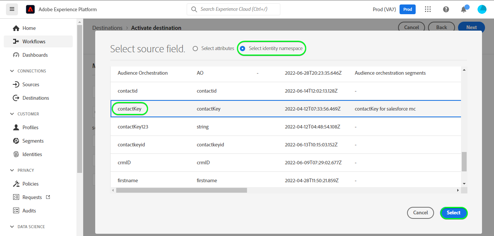
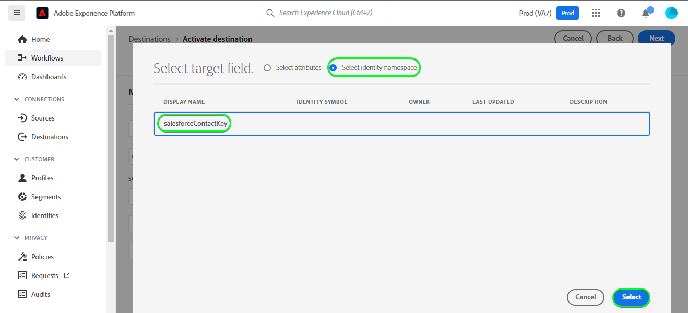
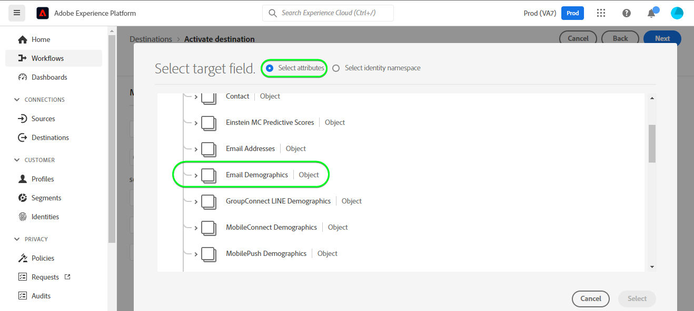

# [!DNL (API) Salesforce Marketing Cloud] connection

## Overview {#overview}

[[!DNL Salesforce Marketing Cloud]](https://www.salesforce.com/products/marketing-cloud/overview/) (formerly known as ExactTarget) is a digital marketing suite that allows you to build and customize journeys for visitors and customers to personalize their experience.

>[!IMPORTANT]
> 
> Note the difference between this connection and the other [Salesforce Marketing Cloud connection](/help/destinations/catalog/email-marketing/salesforce-marketing-cloud.md) that exists within the Email marketing catalog section. The other Salesforce Marketing Cloud connection allows you to export files to a specified storage location, whereas this is an API-based streaming connection.

This [!DNL Adobe Experience Platform] [destination](/help/destinations/home.md) leverages the [Salesforce Update Contacts REST API](https://developer.salesforce.com/docs/marketing/marketing-cloud/guide/updateContacts.html), which allows you to add contacts / update contact data for your business needs after activating them within a new Salesforce segment.

[!DNL Salesforce Marketing Cloud] uses OAuth 2 with Client Credentials as the authentication mechanism to communicate with the Salesforce REST API. Instructions to authenticate to your Salesforce instance are further below, in the [Authenticate to destination](#authenticate) section.

## Use cases {#use-cases}

To help you better understand how and when you should use the [!DNL Salesforce Marketing Cloud] destination, here is a sample use case that Adobe Experience Platform customers can solve by using this destination.

### Send emails to contacts for marketing campaigns {#use-case-send-emails}

The sales department of a home rental platform wants to broadcast a marketing email to a targeted customer audience. The platform's marketing team can add new contacts / update existing contacts *(and their email addresses)* through Adobe Experience Platform, build segments from their own offline data, and send these segments to [!DNL Salesforce Marketing Cloud], which can then be used to send the marketing campaign email.

## Prerequisites {#prerequisites}

### Prerequisites in Experience Platform {#prerequisites-in-experience-platform}

Before activating data to the [!DNL Salesforce Marketing Cloud] destination, you must have a [schema](/help/xdm/schema/composition.md), a [dataset](https://experienceleague.adobe.com/docs/platform-learn/tutorials/data-ingestion/create-datasets-and-ingest-data.html?lang=en), and [segments](https://experienceleague.adobe.com/docs/platform-learn/tutorials/segments/create-segments.html?lang=en) created in [!DNL Experience Platform].

### Prerequisites in Salesforce {#prerequisites-destination}

Note the following prerequisites in Salesforce, in order to export data from Platform to your [!DNL Salesforce Marketing Cloud] account:

#### You need to have a Salesforce account {#prerequisites-account}

Go to the Salesforce [trial](https://www.salesforce.com/in/form/signup/freetrial-sales/) page to register and create a Salesforce account, if you do not have one already.

#### Create custom field within Salesforce {#prerequisites-custom-field}

You must create a custom attribute of the type `Text Area Long`, which Experience Platform will use to update the segment status within Salesforce Marketing Cloud. In the workflow to activate segments to the destination, in the **[Segment schedule](#schedule-segment-export-example)** step, you will use the custom attribute as mapping ID for each segment you activate.

Refer to the [!DNL Salesforce Marketing Cloud] documentation to [create custom fields](https://help.salesforce.com/s/articleView?id=mc_cab_create_an_attribute.htm&type=5&language=en_US) if you need additional guidance.

>[!IMPORTANT]
>
> Ensure you create the custom attribute under the "Email Demographics" attribute-set within your Salesforce Marketing Cloud account.

>[!NOTE]
>
> * The number of custom attributes allowed per object varies according to your Salesforce Edition. Refer to the Salesforce documentation for [custom fields allowed per object](https://help.salesforce.com/s/articleView?id=sf.custom_field_allocations.htm&type=5) if you need additional guidance.
> * If you have reached this limit within Salesforce, you will need to remove the custom attribute from Salesforce that were used to store the segment status against older segments within Experience Platform before a new mappingId can be used.

Refer to the Adobe Experience Platform documentation for [Segment Membership Details schema field group](/help/xdm/field-groups/profile/segmentation.md) if you need guidance on segment statuses.

#### Gather Salesforce credentials {#gather-credentials}

Note down the items below before you authenticate to the [!DNL Salesforce Marketing Cloud] destination.

| Credential | Description | Example |
| --- | --- | --- |
| <ul><li>[!DNL Salesforce Marketing Cloud] prefix</li></ul> | See [Salesforce Marketing Cloud domain prefix](https://help.salesforce.com/s/articleView?id=sf.domain_name_setting_login_policy.htm&type=5) for additional guidance. | <ul><li>If your domain is as below, you need the highlighted value.  <i>`mcq4jrssqdlyc4lph19nnqgzzs84`.login.exacttarget.com</i></li></ul>|
|<ul><li>Client ID</li><li>Client Secret</li></ul> | Refer to the [Salesforce documentation](https://developer.salesforce.com/docs/marketing/marketing-cloud/guide/access-token-s2s.html) if you need additional guidance. | <ul><li>r23kxxxxxxxx0z05xxxxxx</li><li>ipxxxxxxxxxxT4xxxxxxxxxx</li></ul> |

{style="table-layout:auto"}

## Guardrails {#guardrails}
* Salesforce imposes certain [rate limits](https://developer.salesforce.com/docs/marketing/marketing-cloud/guide/rate-limiting.html).
* Refer to the [rate limits errors](https://developer.salesforce.com/docs/marketing/marketing-cloud/guide/rate-limiting-errors.html) page to check any errors that you might encounter.
* Refer to the [Salesforce Marketing Cloud Engagement Pricing](https://www.salesforce.com/editions-pricing/marketing-cloud/email/) page to *Download the Full Edition Comparison Chart* as a pdf which details the limits imposed by your plan.
* The [API overview](https://developer.salesforce.com/docs/marketing/marketing-cloud/guide/apis-overview.html) page details additional limits.
* A KB item collating these details is available [here](https://salesforce.stackexchange.com/questions/205898/marketing-cloud-api-limits#:~:text=Day%2FHour%2FMinute%20Limit&text=We%20recommend%20a%20limit%20of,per%20minute%20for%20SOAP%20calls.&text=As%20has%20been%20added%20in,interacting%20with%20the%20REST%2DAPI).

## Supported identities {#supported-identities}

Salesforce Marketing Cloud supports the activation of identities described in the table below. Learn more about [identities](/help/identity-service/namespaces.md).

|Target Identity|Description|Considerations|
|---|---|---|
| contactKey |Salesforce Contact Key. Refer to the [Salesforce documentation](https://help.salesforce.com/s/articleView?id=sf.mc_cab_contact_builder_best_practices.htm&type=5) if you need additional guidance.|Mandatory|

## Export type and frequency {#export-type-frequency}

Refer to the table below for information about the destination export type and frequency.

| Item | Type | Notes |
---------|----------|---------|
| Export type | **[!UICONTROL Profile-based]** | <ul><li>You are exporting all members of a segment, together with the desired schema fields *(for example: email address, phone number, last name)*, according to your field mapping.</li><li> Each segment status in [!DNL Salesforce Marketing Cloud] gets updated with the corresponding segment status from Platform, based on the [!UICONTROL Mapping ID] value provided during the [segment scheduling](#schedule-segment-export-example) step.</li></ul>|
| Export frequency | **[!UICONTROL Streaming]** | Streaming destinations are "always on" API-based connections. As soon as a profile is updated in Experience Platform based on segment evaluation, the connector sends the update downstream to the destination platform. Read more about [streaming destinations](/help/destinations/destination-types.md#streaming-destinations).|

{style="table-layout:auto"}

## Connect to the destination {#connect}

>[!IMPORTANT]
> 
>To connect to the destination, you need the **[!UICONTROL Manage Destinations]** [access control permission](/help/access-control/home.md#permissions). Read the [access control overview](/help/access-control/ui/overview.md) or contact your product administrator to obtain the required permissions.

To connect to this destination, follow the steps described in the [destination configuration tutorial](../../ui/connect-destination.md). In the configure destination workflow, fill in the fields listed in the two sections below.

Within **[!UICONTROL Destinations]** > **[!UICONTROL Catalog]** search for [!DNL (API) Salesforce Marketing Cloud]. Alternatively you can locate it under the Email marketing category.

### Authenticate to destination {#authenticate}

To authenticate to the destination, fill in the required fields and select **[!UICONTROL Connect to destination]**.

*  **[!UICONTROL Subdomain]**: Your [!DNL Salesforce Marketing Cloud] domain prefix. For example if your domain is *`mcq4jrssqdlyc4lph19nnqgzzs84`.login.exacttarget.com*, you need the highlighted value.
*  **[!UICONTROL Client ID]**: Your Salesforce Client ID.
*  **[!UICONTROL Client Secret]**: Your Salesforce Client Secret.

If the details provided are valid, the UI displays a **Connected** status with a green check mark, you can then proceed to the next step.

### Fill in destination details {#destination-details}

To configure details for the destination, fill in the required and optional fields below. An asterisk next to a field in the UI indicates that the field is required.

*  **[!UICONTROL Name]**: A name by which you will recognize this destination in the future.
*  **[!UICONTROL Description]**: A description that will help you identify this destination in the future.
*  **[!UICONTROL Customer name]**: This can be any value, however a value is mandatory. Otherwise, the destination activation will fail.

### Enable alerts {#enable-alerts}

You can enable alerts to receive notifications on the status of the dataflow to your destination. Select an alert from the list to subscribe to receive notifications on the status of your dataflow. For more information on alerts, see the guide on [subscribing to destinations alerts using the UI](../../ui/alerts.md).

When you are finished providing details for your destination connection, select **[!UICONTROL Next]**.

## Activate segments to this destination {#activate}

>[!IMPORTANT]
> 
>To activate data, you need the **[!UICONTROL Manage Destinations]**, **[!UICONTROL Activate Destinations]**, **[!UICONTROL View Profiles]**, and **[!UICONTROL View Segments]** [access control permissions](/help/access-control/home.md#permissions). Read the [access control overview](/help/access-control/ui/overview.md) or contact your product administrator to obtain the required permissions.

Read [Activate profiles and segments to streaming segment export destinations](/help/destinations/ui/activate-segment-streaming-destinations.md) for instructions on activating audience segments to this destination.

### Mapping considerations and example {#mapping-considerations-example}

To correctly send your audience data from Adobe Experience Platform to the [!DNL Salesforce Marketing Cloud] destination, you need to go through the field mapping step. Mapping consists of creating a link between your Experience Data Model (XDM) schema fields in your Platform account and their corresponding equivalents from the target destination. To correctly map your XDM fields to the [!DNL Salesforce Marketing Cloud] destination fields, follow the steps below.

The list of attribute mappings that can be set up for the [Salesforce REST API](https://developer.salesforce.com/docs/atlas.en-us.api_rest.meta/api_rest/dome_composite_upsert_example.htm?q=contacts) is given below. The destination uses the [Salesforce Search Attribute-Set Definitions REST API](https://developer.salesforce.com/docs/marketing/marketing-cloud/guide/retrieveAttributeSetDefinitions.html) to retrieve attributes defined within Salesforce for your contacts and specific to your account. 

>[!IMPORTANT]
> 
> Although your attribute names would be as per your Salesforce account, the mappings for `contactKey` and `personalEmail.address` are mandatory.

1. In the Mapping step, click **[!UICONTROL Add new mapping]**. You can now see a new mapping row on the screen.

1. In the select source field window, when selecting the source field, choose the **[!UICONTROL Select attributes]** category and select `contactKey`.

1. In the select target field window, select the target field and choose the **[!UICONTROL Select identity namespace]** category and select `salesforceContactKey`.

1. To map any custom attributes, select target field window, select the target field and choose the **[!UICONTROL Select attributes]** > **Email Demographics** category. Next provide the desired target attribute name and add the mappings desired.

1. For instance, you could add the following mapping between your XDM profile schema and your [!DNL Salesforce Marketing Cloud] instance:

    ||XDM Profile Schema|[!DNL Salesforce Marketing Cloud] Instance| Mandatory|
    |---|---|---|---|
    |Attributes|<ul><li><code>person.name.firstName</code></li><li><code>personalEmail.address</code></li></ul>|<ul><li><code>Email Demographics.First Name</code></li><li><code>Email Addresses.Email Address</code></li></ul>|<ul><li>-</li><li><code>Yes</code></li></ul>|
    |Identities|<ul><li><code>contactKey</code></li></ul>|<ul><li><code>salesforceContactKey</code></li></ul>|Yes|

1. An example using these mappings is shown below:

### Schedule segment export and example {#schedule-segment-export-example}

When performing the [Schedule segment export](/help/destinations/ui/activate-segment-streaming-destinations.md#scheduling) step, you must manually map Platform segments to the custom attribute in Salesforce.

To do this, select each segment, then enter the corresponding custom attribute from Salesforce in the **[!UICONTROL Mapping ID]** field.

>[!IMPORTANT]
>
> The value used for the Mapping ID should exactly match the name of the custom attribute created within Salesforce under the "Email Demographics" attribute-set.

An example is shown below:

## Validate data export {#exported-data}

To validate that you have correctly set up the destination, follow the steps below:

1. Select **[!UICONTROL Destinations]** > **[!UICONTROL Browse]** to navigate to the list of destinations.

1. Select the destination and validate that the status is **[!UICONTROL enabled]**.

1. Switch to the **[!DNL Activation data]** tab, then select a segment name.

1. Monitor the segment summary and ensure that the count of profiles corresponds to the count created within the segment.

1. Log in to the Salesforce Marketing Cloud website. Then navigate to the **[!DNL Audience Builder]** > **[!DNL Contact Builder]** > **[!DNL All contacts]** > **[!DNL Email]** page and check if the profiles from the segment have been added.

1. To check if any profiles have been updated, navigate to the **[!DNL Email]** page check if the attribute values for the profile from the segment have been updated. You can see that each segment status in [!Salesforce Marketing Cloud] was updated with the corresponding segment status from Platform, based on the [!UICONTROL Mapping ID] value provided during the [segment scheduling](#schedule-segment-export-example) step.

## Data usage and governance {#data-usage-governance}

All [!DNL Adobe Experience Platform] destinations are compliant with data usage policies when handling your data. For detailed information on how [!DNL Adobe Experience Platform] enforces data governance, see the [Data Governance overview](/help/data-governance/home.md).

## Errors and troubleshooting {#errors-and-troubleshooting}

### Unknown errors encountered while pushing events to Salesforce Marketing Cloud {#unknown-errors}
When checking a dataflow run, if you obtain the following error message: `Unknown errors encountered while pushing events to the destination. Please contact the administrator and try again.`

To fix this error, verify that the [!UICONTROL Mapping ID] that you provided in [!DNL Salesforce Marketing Cloud] for your Platform segment is valid and exists within [!DNL Salesforce].

## Additional resources {#additional-resources}

* [Salesforce developer portal](https://developer.salesforce.com/)
