# [!DNL (API) Salesforce Marketing Cloud] connection

## Overview {#overview}

[[!DNL (API) Salesforce Marketing Cloud]](https://www.salesforce.com/products/marketing-cloud/overview/) (formerly known as [!DNL ExactTarget]) is a digital marketing suite that allows you to build and customize journeys for visitors and customers to personalize their experience.

>[!IMPORTANT]
>
>Note the difference between this connection and the other [[!DNL Salesforce Marketing Cloud] connection](/help/destinations/catalog/email-marketing/salesforce-marketing-cloud.md) that exists within the Email marketing catalog section. The other Salesforce Marketing Cloud connection allows you to export files to a specified storage location, whereas this is an API-based streaming connection.

This [!DNL Adobe Experience Platform] [destination](/help/destinations/home.md) leverages the [!DNL Salesforce Marketing Cloud] [update contacts](https://developer.salesforce.com/docs/marketing/marketing-cloud/guide/updateContacts.html) API, which allows you to add contacts / update contact data for your business needs after activating them within a new [!DNL Salesforce Marketing Cloud] segment.

[!DNL Salesforce Marketing Cloud] uses OAuth 2 with Client Credentials as the authentication mechanism to communicate with the [!DNL Salesforce Marketing Cloud] API. Instructions to authenticate to your [!DNL Salesforce Marketing Cloud] instance are further below, in the [Authenticate to destination](#authenticate) section.

## Use cases {#use-cases}

To help you better understand how and when you should use the [!DNL (API) Salesforce Marketing Cloud] destination, here is a sample use case that Adobe Experience Platform customers can solve by using this destination.

### Send emails to contacts for marketing campaigns {#use-case-send-emails}

The sales department of a home rental platform wants to broadcast a marketing email to a targeted customer audience. The platform's marketing team can add new contacts / update existing contacts *(and their email addresses)* through Adobe Experience Platform, build segments from their own offline data, and send these segments to [!DNL Salesforce Marketing Cloud], which can then be used to send the marketing campaign email.

## Prerequisites {#prerequisites}

### Prerequisites in Experience Platform {#prerequisites-in-experience-platform}

Before activating data to the [!DNL (API) Salesforce Marketing Cloud] destination, you must have a [schema](/help/xdm/schema/composition.md), a [dataset](https://experienceleague.adobe.com/docs/platform-learn/tutorials/data-ingestion/create-datasets-and-ingest-data.html?lang=en), and [segments](https://experienceleague.adobe.com/docs/platform-learn/tutorials/segments/create-segments.html?lang=en) created in [!DNL Experience Platform].

### Prerequisites in [!DNL (API) Salesforce Marketing Cloud] {#prerequisites-destination}

Note the following prerequisites in order to export data from Platform to your [!DNL Salesforce Marketing Cloud] account:

#### You need to have a [!DNL Salesforce Marketing Cloud] account {#prerequisites-account}

Reach out to your [!DNL Salesforce Account Executive] to subscribe to the [!DNL Salesforce Marketing Cloud Account Engagement] product if you do not have it already.

#### Create custom field within [!DNL Salesforce Marketing Cloud] {#prerequisites-custom-field}

When activating segments, Platform uses the value you specify in the **[!UICONTROL Mapping ID]** field for each activated segment, in the **[Segment schedule](#schedule-segment-export-example)** step, to update segment status within [!DNL Salesforce Marketing Cloud]. Refer to the Adobe Experience Platform documentation for [Segment Membership Details schema field group](/help/xdm/field-groups/profile/segmentation.md) if you need guidance on segment statuses.

For each segment to be activated within Platform you will need a custom field of the type `Text` using the [!DNL Salesforce Marketing Cloud] [!DNL Contact Builder]. Fields to be created for the [!DNL (API) Salesforce Marketing Cloud] destination field should be under the *`[!DNL Email Demographics system attribute-set]`*. You can define the field character length of any size between 254 - 4000 characters according to your business requirement.

An example of the data designer screen in [!DNL Salesforce Marketing Cloud], into which you will add the attribute is shown below:
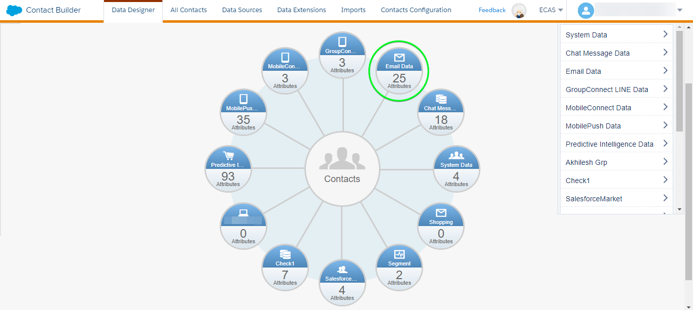

A view of the [!DNL Salesforce Marketing Cloud] [!DNL Email Demographics] attribute-set is shown below:
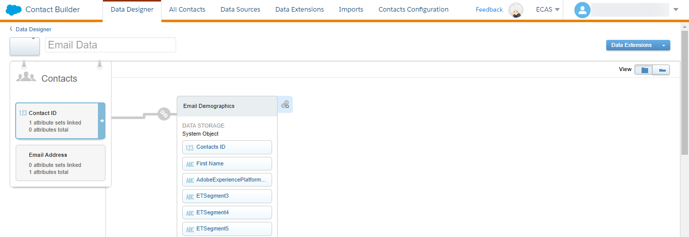

[!DNL (API) Salesforce Marketing Cloud] destination uses the [!DNL Salesforce Marketing Cloud] [!DNL Search Attribute-Set Definitions REST] [API](https://developer.salesforce.com/docs/marketing/marketing-cloud/guide/retrieveAttributeSetDefinitions.html) to dynamically retrieve the attributes and their Attribute-Sets' defined within [!DNL Salesforce Marketing Cloud]. These are displayed in the **[!UICONTROL Target field]** popup when you setup the [mapping](#mapping-considerations-example) when [activating segments to the destination](#activate). Note, only mappings for the attributes defined within the [!DNL Salesforce Marketing Cloud] `[!DNL Email Demographics]` attribute-set are supported.

>[!IMPORTANT]
>
>Within [!DNL Salesforce Marketing Cloud] you must create custom fields with a **[!UICONTROL FIELD NAME]** that exactly matches the value specified within **[!UICONTROL Mapping ID]** for each activated Platform segment. For example the screenshot below shows a custom field named `salesforce_mc_segment_1`. When activating a segment to this destination, add `salesforce_mc_segment_1` as **[!UICONTROL Mapping ID]** to populate segment audiences from Experience Platform into this custom field.

An example of custom field creation in [!DNL Salesforce Marketing Cloud], is shown below:
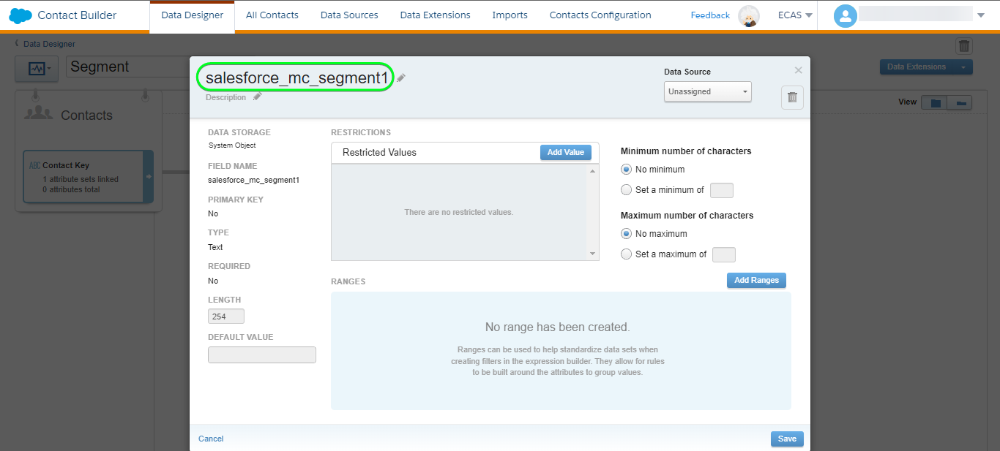

>[!TIP]
>
>* When creating the custom field do not include whitespace characters in the field name. Instead, use the underscore `(_)` character as a separator.
>* To distinguish between custom fields used for Platform segments and other custom fields within [!DNL Salesforce Marketing Cloud] you could include a recognizable prefix or suffix when creating the custom field. For example, instead of `test_segment`, use `Adobe_test_segment` or `test_segment_Adobe`
>* If you already have other custom fields created in [!DNL Salesforce Marketing Cloud], you can use the same name as the Platform segment, to easily identify the segment in [!DNL Salesforce Marketing Cloud].

#### Gather [!DNL Salesforce Marketing Cloud] credentials {#gather-credentials}

Note down the items below before you authenticate to the [!DNL (API) Salesforce Marketing Cloud] destination.

| Credential | Description | Example |
| --- | --- | --- |
| Subdomain | See [[!DNL Salesforce Marketing Cloud domain prefix]](https://developer.salesforce.com/docs/marketing/marketing-cloud/guide/your-subdomain-tenant-specific-endpoints.html) to learn how to obtain this value from the [!DNL Salesforce Marketing Cloud] interface. | If your [!DNL Salesforce Marketing Cloud] domain is  *`mcq4jrssqdlyc4lph19nnqgzzs84`.login.exacttarget.com*,  you need to provide `mcq4jrssqdlyc4lph19nnqgzzs84` as the value.|
| Client ID | See the [!DNL Salesforce Marketing Cloud] [documentation](https://developer.salesforce.com/docs/marketing/marketing-cloud/guide/access-token-s2s.html) to learn how to obtain this value from the [!DNL Salesforce Marketing Cloud] interface. | r23kxxxxxxxx0z05xxxxxx |
| Client Secret | See the [!DNL Salesforce Marketing Cloud] [documentation](https://developer.salesforce.com/docs/marketing/marketing-cloud/guide/access-token-s2s.html) to learn how to obtain this value from the [!DNL Salesforce Marketing Cloud] interface. | ipxxxxxxxxxxT4xxxxxxxxxx |

{style="table-layout:auto"}

### Guardrails {#guardrails}

* Salesforce imposes certain [rate limits](https://developer.salesforce.com/docs/marketing/marketing-cloud/guide/rate-limiting.html).
    * Refer to the [!DNL Salesforce Marketing Cloud] [documentation](https://developer.salesforce.com/docs/marketing/marketing-cloud/guide/rate-limiting-errors.html) to address any probable limits that you might encounter and reduce errors during execution.
    * Refer to the [[!DNL Salesforce Marketing Cloud] Engagement Pricing](https://www.salesforce.com/editions-pricing/marketing-cloud/email/) page to *Download the Full Edition Comparison Chart* as a pdf which details the limits imposed by your plan.
    * The [API overview](https://developer.salesforce.com/docs/marketing/marketing-cloud/guide/apis-overview.html) page details additional limits.
    * Refer [here](https://salesforce.stackexchange.com/questions/205898/marketing-cloud-api-limits) for a page which collates these details.
* The count of *custom fields allowed per object* varies according to your Salesforce Edition.
    * Refer to the [!DNL Salesforce] [documentation](https://help.salesforce.com/s/articleView?id=sf.custom_field_allocations.htm&type=5) for additional guidance.
    * If you have reached the limit defined for *custom fields allowed per object* within [!DNL Salesforce Marketing Cloud] you will need to
        * Remove older custom fields before adding new custom fields in [!DNL Salesforce Marketing Cloud]. 
        * Update or remove any destinations in Platform which use these older custom field names as the value provided for **[!UICONTROL Mapping ID]** during the [segment scheduling](#schedule-segment-export-example) step.

## Supported identities {#supported-identities}

[!DNL (API) Salesforce Marketing Cloud] supports the activation of identities described in the table below. Learn more about [identities](/help/identity-service/namespaces.md).

|Target Identity|Description|Considerations|
|---|---|---|
| contactKey |[!DNL Salesforce Marketing Cloud] Contact Key. Refer to the [!DNL Salesforce Marketing Cloud] [documentation](https://help.salesforce.com/s/articleView?id=sf.mc_cab_contact_builder_best_practices.htm&type=5) if you need additional guidance.|Mandatory|

## Export type and frequency {#export-type-frequency}

Refer to the table below for information about the destination export type and frequency.

| Item | Type | Notes |
---------|----------|---------|
| Export type | **[!UICONTROL Profile-based]** | <ul><li>You are exporting all members of a segment, together with the desired schema fields *(for example: email address, phone number, last name)*, according to your field mapping.</li><li> Each segment status in [!DNL Salesforce Marketing Cloud] gets updated with the corresponding segment status from Platform, based on the **[!UICONTROL Mapping ID]** value provided during the [segment scheduling](#schedule-segment-export-example) step.</li></ul>|
| Export frequency | **[!UICONTROL Streaming]** | Streaming destinations are "always on" API-based connections. As soon as a profile is updated in Experience Platform based on segment evaluation, the connector sends the update downstream to the destination platform. Read more about [streaming destinations](/help/destinations/destination-types.md#streaming-destinations).|

{style="table-layout:auto"}

## Connect to the destination {#connect}

>[!IMPORTANT]
>
>To connect to the destination, you need the **[!UICONTROL Manage Destinations]** [access control permission](/help/access-control/home.md#permissions). Read the [access control overview](/help/access-control/ui/overview.md) or contact your product administrator to obtain the required permissions.

To connect to this destination, follow the steps described in the [destination configuration tutorial](../../ui/connect-destination.md). In the configure destination workflow, fill in the fields listed in the two sections below.

Within **[!UICONTROL Destinations]** > **[!UICONTROL Catalog]**, search for [!DNL (API) Salesforce Marketing Cloud]. Alternatively you can locate it under the **[!UICONTROL Email marketing]** category.

### Authenticate to destination {#authenticate}

To authenticate to the destination, fill in the required fields below and select **[!UICONTROL Connect to destination]**. Refer to the [Gather [!DNL Salesforce Marketing Cloud] credentials](#gather-credentials) section for any guidance.

| [!DNL (API) Salesforce Marketing Cloud] destination | [!DNL Salesforce Marketing Cloud] |
| --- | --- |
| **[!UICONTROL Subdomain]** | Your [!DNL Salesforce Marketing Cloud] domain prefix.  For example if your domain is   *`mcq4jrssqdlyc4lph19nnqgzzs84`.login.exacttarget.com*,   you need to provide `mcq4jrssqdlyc4lph19nnqgzzs84` as the value. |
| **[!UICONTROL Client ID]** | Your [!DNL Salesforce Marketing Cloud]  `Client ID`. |
| **[!UICONTROL Client Secret]** | Your [!DNL Salesforce Marketing Cloud]  `Client Secret`. |

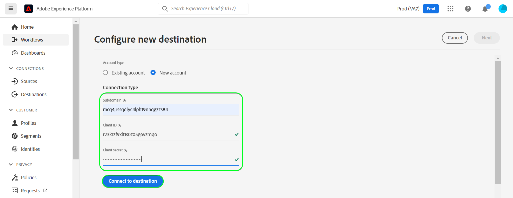

If the details provided are valid, the UI displays a **[!UICONTROL Connected]** status with a green check mark, you can then proceed to the next step.

### Fill in destination details {#destination-details}

To configure details for the destination, fill in the required and optional fields below. An asterisk next to a field in the UI indicates that the field is required.
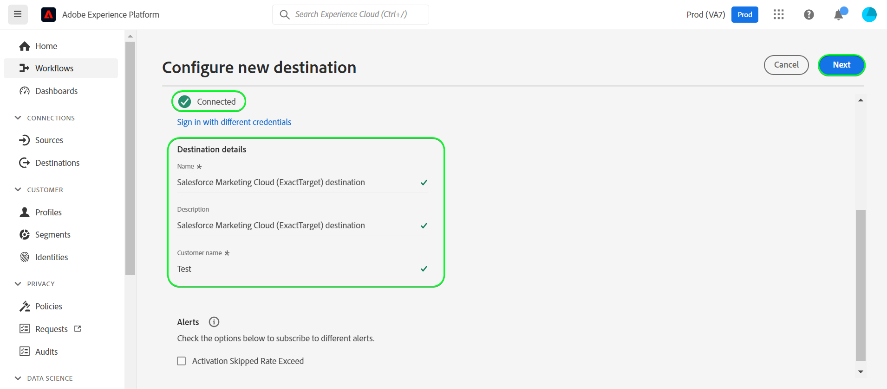

*  **[!UICONTROL Name]**: A name by which you will recognize this destination in the future.
*  **[!UICONTROL Description]**: A description that will help you identify this destination in the future.

### Enable alerts {#enable-alerts}

You can enable alerts to receive notifications on the status of the dataflow to your destination. Select an alert from the list to subscribe to receive notifications on the status of your dataflow. For more information on alerts, see the guide on [subscribing to destinations alerts using the UI](../../ui/alerts.md).

When you are finished providing details for your destination connection, select **[!UICONTROL Next]**.

## Activate segments to this destination {#activate}

>[!IMPORTANT]
>
>To activate data, you need the **[!UICONTROL Manage Destinations]**, **[!UICONTROL Activate Destinations]**, **[!UICONTROL View Profiles]**, and **[!UICONTROL View Segments]** [access control permissions](/help/access-control/home.md#permissions). Read the [access control overview](/help/access-control/ui/overview.md) or contact your product administrator to obtain the required permissions.

Read [Activate profiles and segments to streaming segment export destinations](/help/destinations/ui/activate-segment-streaming-destinations.md) for instructions on activating audience segments to this destination.

### Mapping considerations and example {#mapping-considerations-example}

To correctly send your audience data from Adobe Experience Platform to the [!DNL (API) Salesforce Marketing Cloud] destination, you need to go through the field mapping step. Mapping consists of creating a link between your Experience Data Model (XDM) schema fields in your Platform account and their corresponding equivalents from the target destination. 

Attributes specified in the **[!UICONTROL Target field]** should be named exactly as described in the attribute mappings table as these attributes will form the request body.

Attributes specified in the **[!UICONTROL Source field]** do not follow any such restriction. You can map it based on your need, however if the data format is not correct when pushed to [!DNL Salesforce Marketing Cloud] it will result in an error.

To correctly map your XDM fields to the [!DNL (API) Salesforce Marketing Cloud] destination fields, follow the steps below.

>[!IMPORTANT]
>
>Although your attribute names would be as per your [!DNL Salesforce Marketing Cloud] account, the mappings for both `contactKey` and `personalEmail.address` are mandatory. When mapping attributes, only attributes from the Experience Platform `Email Demographics` attribute-set should be used within the target fields.

1. In the **[!UICONTROL Mapping]** step, select **[!UICONTROL Add new mapping]**. You will see a new mapping row on the screen.

1. In the **[!UICONTROL Select source field]** window, choose the **[!UICONTROL Select attributes]** category and select the XDM attribute or choose the **[!UICONTROL Select identity namespace]** and select an identity.
1. In the **[!UICONTROL Select target field]** window, choose the **[!UICONTROL Select identity namespace]** and select an identity or choose **[!UICONTROL Select custom attributes]** category and select an attribute from the `Email Demographics` attributes displayed as needed. [!DNL (API) Salesforce Marketing Cloud] destination uses the [!DNL Salesforce Marketing Cloud] [!DNL Search Attribute-Set Definitions REST] [API](https://developer.salesforce.com/docs/marketing/marketing-cloud/guide/retrieveAttributeSetDefinitions.html) to dynamically retrieve the attributes and their Attribute-Sets' defined within [!DNL Salesforce Marketing Cloud]. These are displayed in the **[!UICONTROL Target field]** popup when you setup the [mapping](#mapping-considerations-example) when [activating segments to the destination](#activate). Note, only mappings for the attributes defined within the [!DNL Salesforce Marketing Cloud] `[!DNL Email Demographics]` attribute-set are supported.

    * Repeat these steps to add the following mappings between your XDM profile schema and [!DNL (API) Salesforce Marketing Cloud]:
        |Source Field|Target Field| Mandatory|
        |---|---|---|
        |`IdentityMap: contactKey`|`Identity: salesforceContactKey`| `Mandatory` |        
        |`xdm: person.name.firstName`|`Attribute: Email Demographics.First Name`| - |
        |`xdm: personalEmail.address`|`Attribute: Email Addresses.Email Address`| - |

    * An example using these mappings is shown below:
    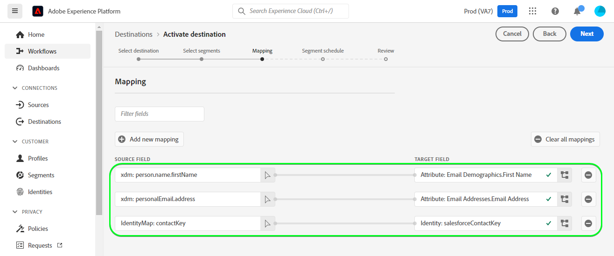

When you have finished providing the mappings for your destination connection, select **[!UICONTROL Next]**.

### Schedule segment export and example {#schedule-segment-export-example}

When performing the [Schedule segment export](/help/destinations/ui/activate-segment-streaming-destinations.md#scheduling) step, you must manually map Platform segments to the [custom field](#prerequisites-custom-field) in Salesforce.

To do this, select each segment, then enter name of the custom field from [!DNL Salesforce Marketing Cloud] in the [!DNL (API) Salesforce Marketing Cloud] **[!UICONTROL Mapping ID]** field. Refer to the [Create custom field within [!DNL Salesforce Marketing Cloud]](#prerequisites-custom-field) section for guidance and best practices on creating custom fields in [!DNL Salesforce Marketing Cloud].

For example, if your [!DNL Salesforce Marketing Cloud] custom field is `salesforce_mc_segment_1`, specify this value in the [!DNL (API) Salesforce Marketing Cloud] **[!UICONTROL Mapping ID]** to populate segment audiences from Experience Platform into this custom field.

An example custom field from [!DNL Salesforce Marketing Cloud] is shown below:

An example indicating the location of the [!DNL (API) Salesforce Marketing Cloud] **[!UICONTROL Mapping ID]** is shown below:
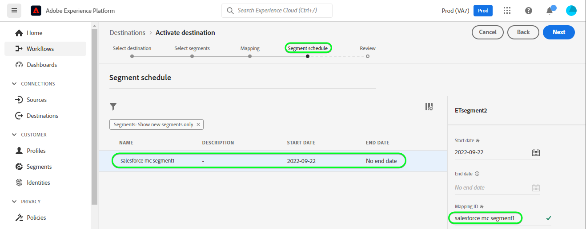

As shown the [!DNL (API) Salesforce Marketing Cloud] **[!UICONTROL Mapping ID]** should exactly match the value specified within [!DNL Salesforce Marketing Cloud] **[!UICONTROL FIELD NAME]**.

Repeat this section for each activated Platform segment.

Depending on your use case all activated segments can be mapped to the same [!DNL Salesforce Marketing Cloud] **[!UICONTROL FIELD NAME]** or to different **[!UICONTROL FIELD NAME]** in [!DNL (API) Salesforce Marketing Cloud]. A typical example based on the image shown above could be.
| [!DNL (API) Salesforce Marketing Cloud] segment name | [!DNL Salesforce Marketing Cloud] **[!UICONTROL FIELD NAME]** | [!DNL (API) Salesforce Marketing Cloud] **[!UICONTROL Mapping ID]** | 
| --- | --- | --- |
| salesforce mc segment 1 | `salesforce_mc_segment_1` | `salesforce_mc_segment_1` |
| salesforce mc Segment 2 | `salesforce_mc_segment_2` | `salesforce_mc_segment_2` |
## Validate data export {#exported-data}

To validate that you have correctly set up the destination, follow the steps below:

1. Select **[!UICONTROL Destinations]** > **[!UICONTROL Browse]** to navigate to the list of destinations.
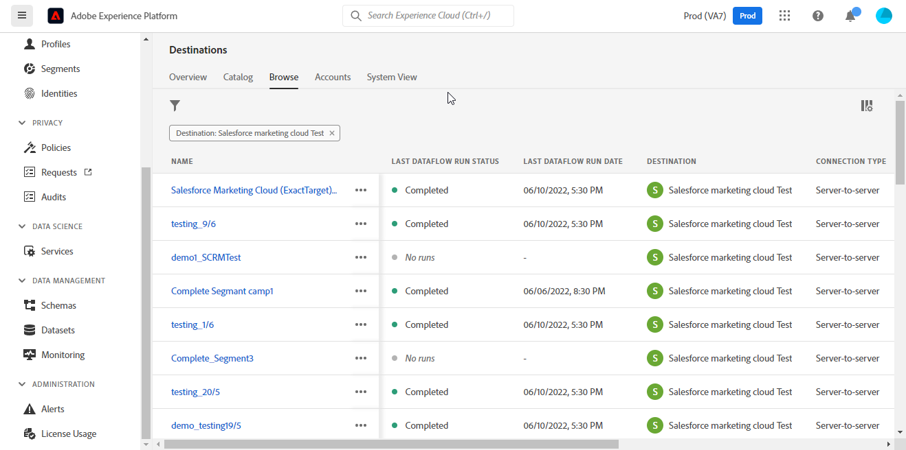

1. Select the destination and validate that the status is **[!UICONTROL enabled]**.
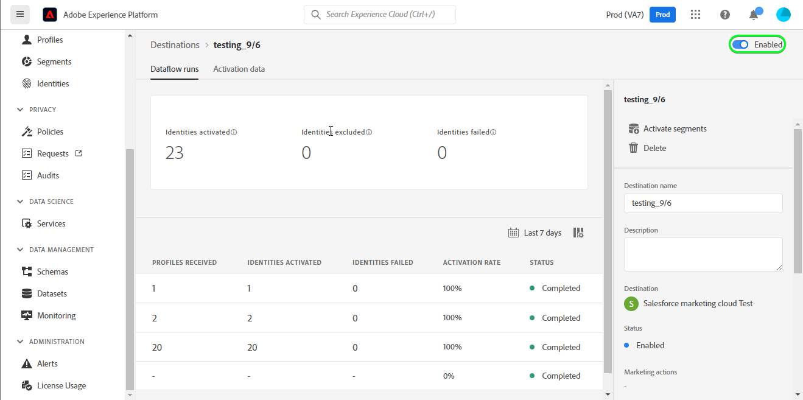

1. Switch to the **[!DNL Activation data]** tab, then select a segment name.
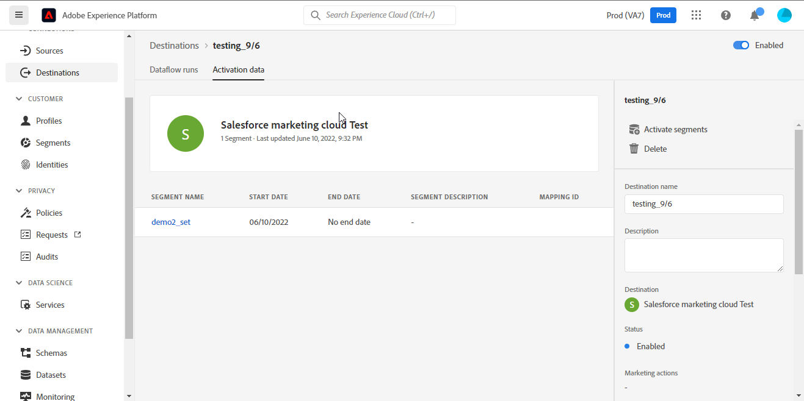

1. Monitor the segment summary and ensure that the count of profiles corresponds to the count created within the segment.
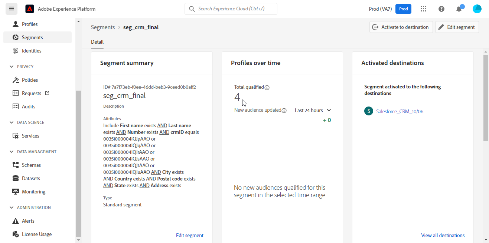

1. Log in to the [[!DNL Salesforce Marketing Cloud]](https://mc.exacttarget.com/) website. Then navigate to the **[!DNL Audience Builder]** > **[!DNL Contact Builder]** > **[!DNL All contacts]** > **[!DNL Email]** page and check if the profiles from the segment have been added.
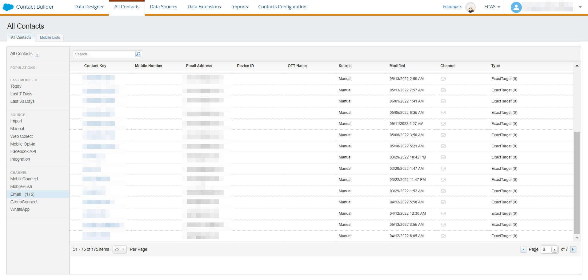

1. To check if any profiles have been updated, navigate to the **[!UICONTROL Email]** page and verify if the attribute values for the profile from the segment have been updated. If successful, you can see that each segment status in [!DNL Salesforce Marketing Cloud] was updated with the corresponding segment status from Platform, based on the **[!UICONTROL Mapping ID]** value provided in the [segment scheduling](#schedule-segment-export-example) step.
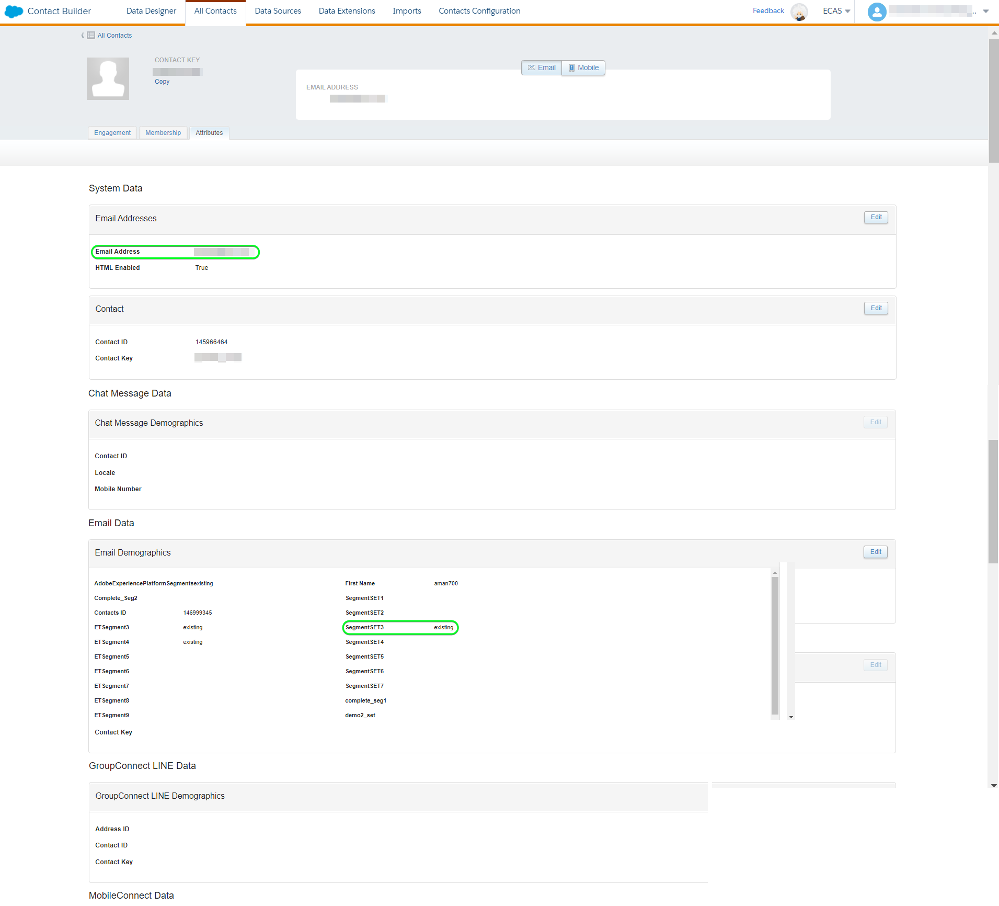

## Data usage and governance {#data-usage-governance}

All [!DNL Adobe Experience Platform] destinations are compliant with data usage policies when handling your data. For detailed information on how [!DNL Adobe Experience Platform] enforces data governance, see the [Data Governance overview](/help/data-governance/home.md).

## Errors and troubleshooting {#errors-and-troubleshooting}

### Unknown errors encountered while pushing events to Salesforce Marketing Cloud {#unknown-errors}

* When checking a dataflow run, you might encounter the following error message: `Unknown errors encountered while pushing events to the destination. Please contact the administrator and try again.`
    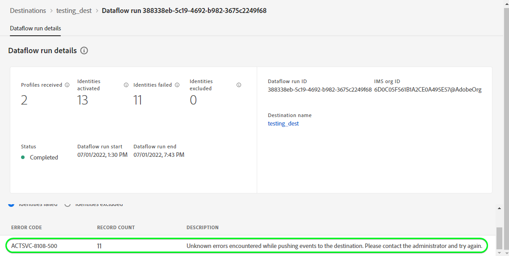

    * To fix this error, verify that the **[!UICONTROL Mapping ID]** that you provided in the activation workflow to the [!DNL (API) Salesforce Marketing Cloud] destination exactly matches the value of the custom field type you created in [!DNL Salesforce Marketing Cloud]. Refer to the [Create custom field within [!DNL Salesforce Marketing Cloud]](#prerequisites-custom-field) section for guidance.

* When activating a segment, you might obtain an error message: `The client's IP address is unauthorized for this account. Allowlist the client's IP address...`
    * To fix this error, contact your [!DNL Salesforce Marketing Cloud] account administrator to add [Experience Platform IP addresses](/help/destinations/catalog/streaming/ip-address-allow-list.md) to your [!DNL Salesforce Marketing Cloud] accounts' trusted IP ranges. Refer to the [!DNL Salesforce Marketing Cloud] [IP Addresses for Inclusion on Allowlists in Marketing Cloud](https://help.salesforce.com/s/articleView?id=sf.mc_es_ip_addresses_for_inclusion.htm&type=5) documentation if you need additional guidance.

## Additional resources {#additional-resources}

* [!DNL Salesforce Marketing Cloud] [API](https://developer.salesforce.com/docs/marketing/marketing-cloud/guide/apis-overview.html)
* [!DNL Salesforce Marketing Cloud] [documentation](https://developer.salesforce.com/docs/marketing/marketing-cloud/guide/updateContacts.html) explaining how contacts are updated with the specified information in the specified attribute groups.