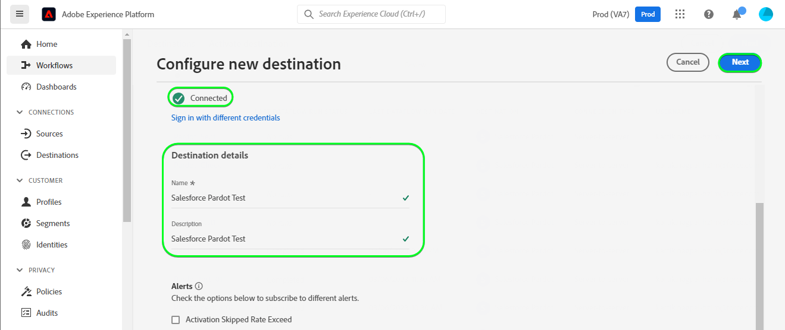
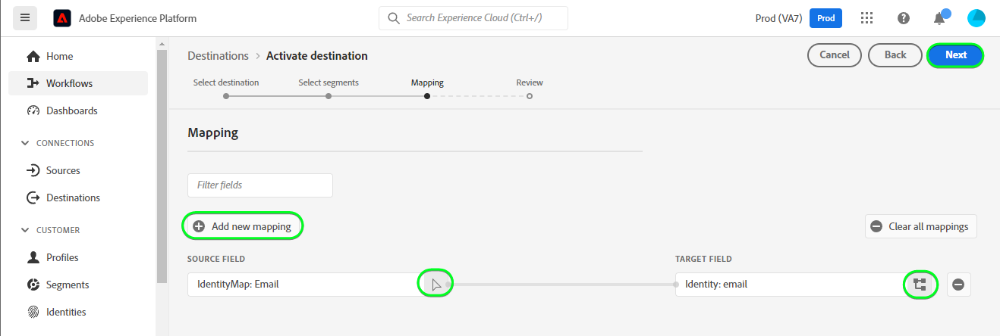
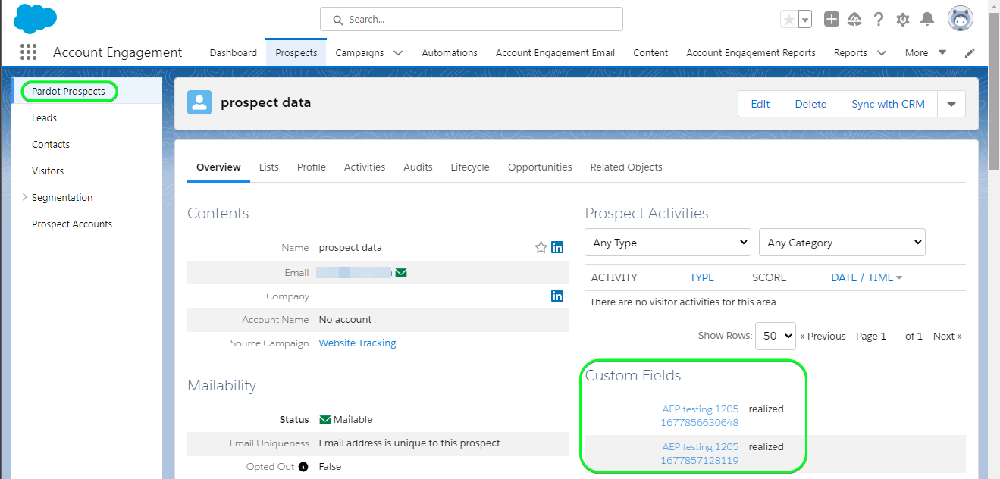

# [!DNL Salesforce Pardot] connection

[[!DNL Salesforce Pardot]](https://www.salesforce.com/products/marketing-cloud/overview/) *(now renamed as [!DNL Marketing Cloud Account Engagement])* allows you to capture and track leads by building templates, drag-and-drop builders; its powerful visual editor allows you to easily create custom landing pages, forms, and offers that attract potential leads for your sales teams. When someone engages with your forms, the lead is auto captured, and you get notified. Leads are also automatically scored and graded, so that those most likely to convert can be prioritized. Your forms can also trigger changes in lead scores upon conversion. [!DNL Salesforce Pardot] enables you to design lead tracks for all stages of the pipeline for targeted market segments and customer groups through email drip campaigns, lead management with nurturing and scoring and campaign segmentation.

This [!DNL Adobe Experience Platform] [destination](/help/destinations/home.md) leverages the [[!DNL Account Engagement]](https://developer.salesforce.com/docs/marketing/pardot/guide/overview.html) API, to work with leads for your sales needs after activating them within a new [!DNL Salesforce Pardot] segment.

[!DNL Salesforce Pardot] uses OAuth 2 with Client Credentials as the authentication mechanism to communicate with the [!DNL Account Engagement] API. Instructions to authenticate to your [!DNL Salesforce Pardot] instance are further below, in the [Authenticate to destination](#authenticate) section.

## Use cases {#use-cases}

To help you better understand how and when you should use the [!DNL Salesforce Pardot] destination, here is a sample use case that Adobe Experience Platform customers can solve by using this destination.

### Send emails to contacts for marketing campaigns {#use-case-send-emails}

The marketing department of an online platform wants to broadcast an email based marketing campaign to a curated audience of B2B leads. The platform's marketing team can add new leads / update existing lead information through Adobe Experience Platform, build segments from their own offline data, and send these segments to [!DNL Salesforce Pardot], which can then be used to send the marketing campaign email.

## Prerequisites {#prerequisites}

Refer to the sections below for any prerequisites that have to be setup / information that is to be gathered before working with the [!DNL Salesforce Pardot] destination.

### Prerequisites in Experience Platform {#prerequisites-in-experience-platform}

Before activating data to the [!DNL Salesforce Pardot] destination, you must have a [schema](/help/xdm/schema/composition.md), a [dataset](https://experienceleague.adobe.com/docs/platform-learn/tutorials/data-ingestion/create-datasets-and-ingest-data.html?lang=en), and [segments](https://experienceleague.adobe.com/docs/platform-learn/tutorials/segments/create-segments.html?lang=en) created in [!DNL Experience Platform].

>[!TIP]
>
>The [!DNL Salesforce Pardot] destination uses the selected segment names, to create custom prospect fields in [!DNL Salesforce Pardot], and update them with the Experience Platform segment status. The destination automatically replaces whitespace or special characters with the underscore `(_)` character as a separator to comply with [!DNL Salesforce Pardot] requirements.
>However, as a recommendation, when creating a segment, do not include whitespace or special characters in the segment name. Instead, use the underscore `(_)` character as a separator. For example instead of naming your segment as `Salesforce Pardot Segment 1` use `Salesforce_Pardot_Segment_1`.

### Prerequisites in [!DNL Salesforce Pardot] {#prerequisites-destination}

Note the following prerequisites in order to export data from Platform to your [!DNL Salesforce Pardot] account:

#### You need to have a [!DNL Salesforce Pardot] account {#prerequisites-account}

A [!DNL Salesforce Pardot] account with a subscription to the [Marketing Cloud Account Engagement](https://www.salesforce.com/products/marketing-cloud/marketing-automation/) product is mandatory to proceed.

>[!IMPORTANT]
>
>Your account should also have the [Account Engagement Administrator role](https://help.salesforce.com/s/articleView?id=sf.pardot_fields_create_custom_field.htm&type=5) and the [!DNL Salesforce] admin must give permissions to the [!DNL Account Engagement admin] user that allow access to [!DNL Account Engagement Lightning App].

Reach out to [[!DNL Salesforce] Support](https://www.salesforce.com/company/contact-us/?d=cta-glob-footer-10) or your [!DNL Salesforce] account administrator if you do not have an account, or the account is missing the [!DNL Marketing Cloud Account Engagement] subscription or the [!DNL Account Engagement Administrator role].

#### Configure a connected app within [!DNL Salesforce] {#prerequisites-connected-app}

You can follow the [!DNL Salesforce] documentation [here](https://help.salesforce.com/s/articleView?id=sf.pardot_sf_connector_setup_v2_parent.htm&type=5) or alternatively check the steps below.

First, you need to configure a [[!DNL Salesforce] connected app](https://help.salesforce.com/s/articleView?id=sf.connected_app_create.htm&language=en_US&r=https%3A%2F%2Fhelp.salesforce.com%2F&type=5) within your [!DNL Salesforce] account, if you do not have one already. [!DNL Salesforce Pardot] will leverage the connected app to connect to [!DNL Salesforce].

Next, follow the [[!DNL Configure the Connected App for the OAuth 2.0 Client Credentials Flow]](https://help.salesforce.com/s/articleView?id=sf.connected_app_client_credentials_setup.htm&type=5) documentation so that the access token communication between [!DNL Salesforce Pardot] destination and [!DNL Salesforce] can be setup.

Now, follow the [!DNL Configure the Connector User](https://help.salesforce.com/s/articleView?id=sf.pardot_sf_connector_setup_connector_user_parent.htm&type=5) tutorial and its subsections to [!DNL Assign the Connector User Permission Set](https://help.salesforce.com/s/articleView?id=sf.pardot_sf_connector_setup_prepare_connector_user.htm&language=en_US&type=5) and the [!DNL Assign Object Permissions to the Connector User](https://help.salesforce.com/s/articleView?id=sf.pardot_sf_connector_setup_add_connector_permissions.htm&language=en_US&type=5) to ensure your user account has the correct permissions.

Also, ensure that the [scopes](https://help.salesforce.com/s/articleView?id=connected_app_create_api_integration.htm&type=5&language=en_US) mentioned below are selected for the [!DNL Salesforce connected app].

* ``chatter_api``
* ``lightning``
* ``visualforce``
* ``content``
* ``openid``
* ``full``
* ``api``
* ``web``
* ``refresh_token``
* ``offline_access``

Finally, ensure that the `password` grant is enabled within your [!DNL Salesforce] account. Refer to the [!DNL Salesforce] [OAuth 2.0 Username-Password Flow for Special Scenarios](https://help.salesforce.com/s/articleView?id=sf.remoteaccess_oauth_username_password_flow.htm&type=5) documentation if you need guidance.

>[!IMPORTANT]
>
>If your [!DNL Salesforce] account administrator has restricted access to trusted IP ranges, you need to contact them to get [Experience Platform IP's](/help/destinations/catalog/streaming/ip-address-allow-list.md) allowlisted. Refer to the [!DNL Salesforce] [Restrict Access to Trusted IP Ranges for a Connected App](https://help.salesforce.com/s/articleView?id=sf.connected_app_edit_ip_ranges.htm&type=5) documentation if you need additional guidance.

#### Gather [!DNL Salesforce Pardot] credentials {#gather-credentials}

Note down the items below before you authenticate to the [!DNL Salesforce Pardot] destination.

| Credential | Description |
| --- | --- |
| `Username` | Your [!DNL Salesforce Pardot] account username. |
| `Password` | Your [!DNL Salesforce Pardot] account password. |
| `Pardot Business Unit Id` | To find the Account Engagement Business Unit ID, use Setup in [!DNL Salesforce]. From Setup, enter *Business Unit Setup* in the Quick Find box. Your Account Engagement Business Unit ID begins with `0Uv` and is 18 characters long. If you can’t access the Business Unit Setup information, ask your [!DNL Salesforce] Administrator to provide you with the `Account Engagement Business Unit ID`. If you require any additional guidance refer to the [[!DNL Salesforce] Authentication](https://developer.salesforce.com/docs/marketing/pardot/guide/authentication) guideline page. |
| `Client ID` | The `Consumer Key` for your [[!DNL Salesforce] connected app](#prerequisites-connected-app).   Refer to the [[!DNL Salesforce] documentation](https://help.salesforce.com/s/articleView?id=sf.connected_app_rotate_consumer_details.htm&type=5) to learn how to obtain this value from the [!DNL Salesforce] interface. |
| `Client Secret` | The `Consumer Secret` for your [[!DNL Salesforce] connected app](#prerequisites-connected-app).   Refer to the [[!DNL Salesforce] documentation](https://help.salesforce.com/s/articleView?id=sf.connected_app_rotate_consumer_details.htm&type=5) to learn how to obtain this value from the [!DNL Salesforce] interface. |
{style="table-layout:auto"}

### Guardrails {#guardrails}

* Refer to the [!DNL Salesforce Pardot] [rate limits](https://developer.salesforce.com/docs/marketing/pardot/guide/overview.html#rate-limits) which details the limits imposed by your plan and would also apply to the Experience Platform executions.

* Your [!DNL Salesforce Pardot] account and [!DNL Salesforce] connected app should be setup with any permissions mentioned in [You need to have a [!DNL Salesforce Pardot] account](#prerequisites-account) and [Configure a connected app within [!DNL Salesforce]](#prerequisites-connected-app) sections.

## Supported identities {#supported-identities}

[!DNL Salesforce Pardot] supports the activation of identities described in the table below. Learn more about [identities](/help/identity-service/namespaces.md).

| Target Identity | Description | Considerations |
|---|---|---|
| Email | Prospect Email Address | Mandatory |

## Export type and frequency {#export-type-frequency}

Refer to the table below for information about the destination export type and frequency.

| Item | Type | Notes |
---------|----------|---------|
| Export type | **[!UICONTROL Dataset export]** | You are exporting raw datasets, which are not grouped or structured by audience interests or qualifications.|

{style="table-layout:auto"}

## Connect to the destination {#connect}

>[!IMPORTANT]
>
>To connect to the destination, you need the **[!UICONTROL Manage Destinations]** [access control permission](/help/access-control/home.md#permissions). Read the [access control overview](/help/access-control/ui/overview.md) or contact your product administrator to obtain the required permissions.

To connect to this destination, follow the steps described in the [destination configuration tutorial](../../ui/connect-destination.md). In the configure destination workflow, fill in the fields listed in the two sections below.

Within **[!UICONTROL Destinations]** > **[!UICONTROL Catalog]**, search for [!DNL Salesforce Pardot]. Alternatively you can locate it under the **[!UICONTROL Email marketing]** category.

### Authenticate to destination {#authenticate}

To authenticate to the destination, fill in the required fields below and select **[!UICONTROL Connect to destination]**. Refer to the [Gather [!DNL Salesforce Pardot] credentials](#gather-credentials) section for any guidance.

| Field | Description |
| --- | --- |
| **[!UICONTROL Username]** | Your [!DNL Salesforce Pardot] account username. |
| **[!UICONTROL Password]** | Your [!DNL Salesforce Pardot] account password. |
| **[!UICONTROL Pardot Business Unit Id]** | Your [!DNL Salesforce] `Account Engagement Business Unit ID`. |
| **[!UICONTROL Client ID]** | The `Consumer Key` for your [[!DNL Salesforce] connected app](#prerequisites-connected-app). |
| **[!UICONTROL Client Secret]** | The `Consumer Secret` for your [[!DNL Salesforce] connected app](#prerequisites-connected-app). |

If the details provided are valid, the UI displays a **[!UICONTROL Connected]** status with a green check mark, you can then proceed to the next step.

### Fill in destination details {#destination-details}

To configure details for the destination, fill in the required and optional fields below. An asterisk next to a field in the UI indicates that the field is required.

*  **[!UICONTROL Name]**: A name by which you will recognize this destination in the future.
*  **[!UICONTROL Description]**: A description that will help you identify this destination in the future.

### Enable alerts {#enable-alerts}

You can enable alerts to receive notifications on the status of the dataflow to your destination. Select an alert from the list to subscribe to receive notifications on the status of your dataflow. For more information on alerts, see the guide on [subscribing to destinations alerts using the UI](../../ui/alerts.md).

When you are finished providing details for your destination connection, select **[!UICONTROL Next]**.

## Activate segments to this destination {#activate}

>[!IMPORTANT]
>
>To activate data, you need the **[!UICONTROL Manage Destinations]**, **[!UICONTROL Activate Destinations]**, **[!UICONTROL View Profiles]**, and **[!UICONTROL View Segments]** [access control permissions](/help/access-control/home.md#permissions). Read the [access control overview](/help/access-control/ui/overview.md) or contact your product administrator to obtain the required permissions.

Read [(Beta) Export datasets](/help/destinations/ui/export-datasets.md) for extensive instructions on exporting datasets to this destination.

### Mapping considerations and example {#mapping-considerations-example}

To correctly send your audience data from Adobe Experience Platform to the [!DNL Salesforce Pardot] destination, you need to go through the field mapping step. Mapping consists of creating a link between your Experience Data Model (XDM) schema fields in your Platform account and their corresponding equivalents from the target destination. 

To correctly map your XDM fields to the [!DNL Salesforce Pardot] destination fields, follow the steps below.

1. In the **[!UICONTROL Mapping]** step, select **[!UICONTROL Add new mapping]**. You will see a new mapping row on the screen.
1. In the **[!UICONTROL Select source field]** window, choose the **[!UICONTROL Select attributes]** category and select the XDM attribute or choose the **[!UICONTROL Select identity namespace]** and select an identity.
1. In the **[!UICONTROL Select target field]** window, choose the **[!UICONTROL Select identity namespace]** and select an identity or choose **[!UICONTROL Select custom attributes]** category and specify from the [!DNL Salesforce Pardot API](https://pi.pardot.com/api/v5/objects/prospects/do/upsertLatestByEmail) the required attribute name.

    * Repeat these steps to add any additional mappings between your XDM profile schema and [!DNL Salesforce Pardot]:
        |Source Field|Target Field| Mandatory|
        |---|---|---|
        |`IdentityMap: Email`|`Identity: email`| `Mandatory` |

    * An example with the above mapping is shown below:
    

When you have finished providing the mappings for your destination connection, select **[!UICONTROL Next]**.

### Review {#review}

## Validate data export {#exported-data}

To validate that you have correctly set up the destination, follow the steps below:

1. Navigate to one of the segments you had selected. Then Select the **[!DNL Activation data]** tab, The **[!UICONTROL Mapping ID]** column displays the name of the custom field which is generated within the [!DNL Salesforce Pardot Prospects] page.

1. Log in to the [[!DNL Salesforce]](https://login.salesforce.com/) website. Then navigate to the **[!DNL Account Engagement]** > **[!DNL Prospects]** > **[!DNL Pardot Prospects]** page and check if the prospects from the segment have been added / updated. Alternatively you can also access [[!DNL Salesforce Pardot]](https://pi.pardot.com/) and access the **[!DNL Prospects]** page.

1. To check if the prospects have been updated, click on a prospect and verify if the custom prospect field has been updated with the Experience Platform segment status.

## Data usage and governance {#data-usage-governance}

All [!DNL Adobe Experience Platform] destinations are compliant with data usage policies when handling your data. For detailed information on how [!DNL Adobe Experience Platform] enforces data governance, see the [Data Governance overview](/help/data-governance/home.md).

## Additional resources {#additional-resources}

* [!DNL Salesforce Pardot] [API](https://developer.salesforce.com/docs/marketing/pardot/guide/overview.html)