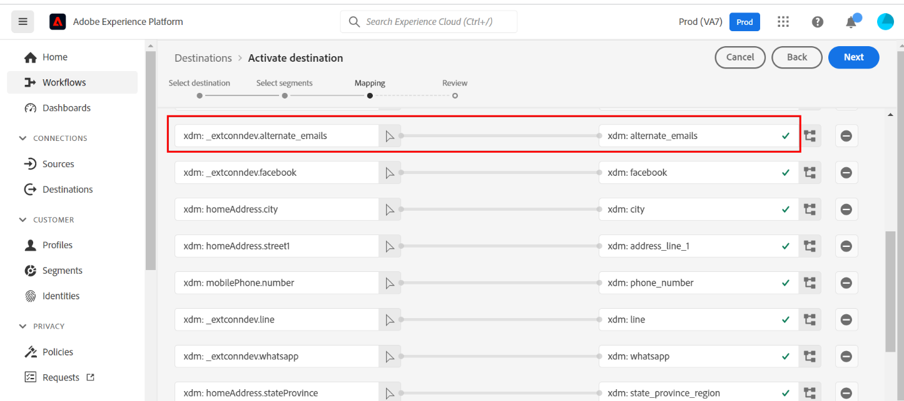
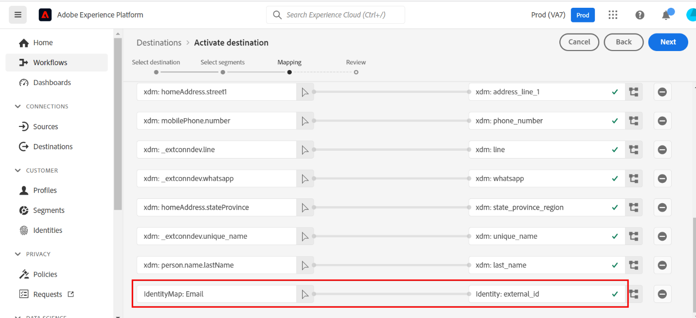
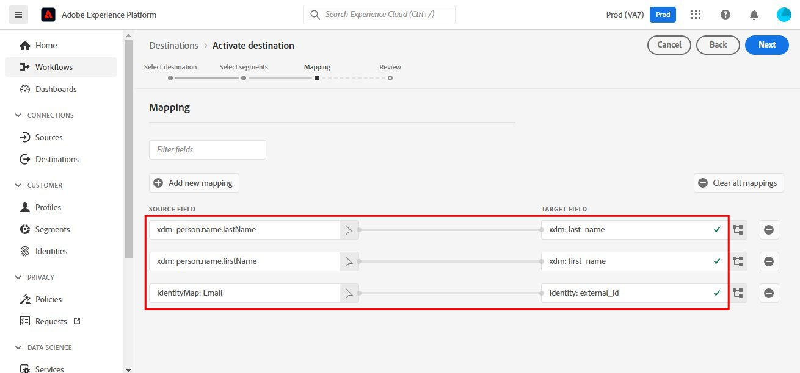
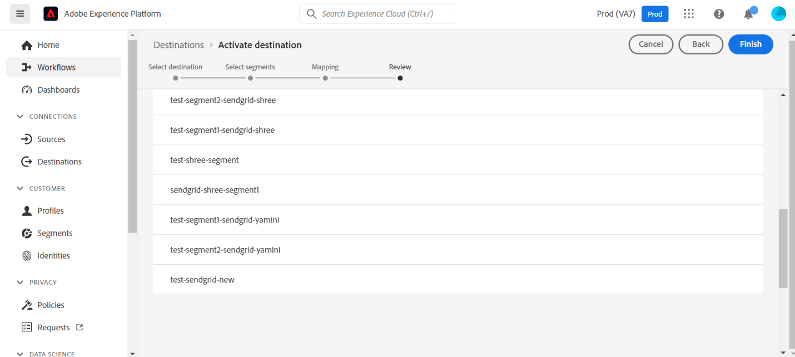

# [!DNL Sendgrid] connection

## Overview {#overview}

[Sendgrid](https://www.sendgrid.com) is a popular customer communication platform for transactional and marketing emails.

This [!DNL Adobe Experience Platform] [destination](https://experienceleague.adobe.com/docs/experience-platform/destinations/home.html?lang=en) leverages the [[!DNL Sendgrid Marketing Contacts API]](https://api.sendgrid.com/v3/marketing/contacts) allowing you to ingest your first-party email profiles and activate it within a new Sendgrid segment for your business needs.

* It uses [[!DNL Bearer tokens]](https://experienceleague.adobe.com/docs/experience-platform/landing/platform-apis/api-authentication.html#generate-an-access-token) as an authentication mechanism to communicate with the Sendgrid API.

## Prerequisites {#prerequisites}

The following items are required before you start configuring the destination.

1. You need to have a Sendgrid account. 
    * Go to the Sendgrid [signup](https://signup.sendgrid.com/) page to register and create a Sendgrid account, if you do not have one already.
1. After logging in to the Sendgrid portal, you also need to generate an API token.
1. Navigate to the Sendgrid website and access *[!DNL Settings > API Keys]* page. Alternatively, refer to the [Sendgrid documentation](https://app.sendgrid.com/settings/api_keys) to access the appropriate section in the Sendgrid app.
1. Then select the *[!DNL Create API Key]* button.
    * Refer to the [Sendgrid documentation](https://docs.sendgrid.com/ui/account-and-settings/api-keys#creating-an-api-key), if you need guidance on what actions to perform. 
    * If you would like to programmatically generate your API Key, please refer to the [Sendgrid documentation](https://docs.sendgrid.com/api-reference/api-keys/create-api-keys).

* Before activating data to the Sendgrid destination you should have created a [schema](https://experienceleague.adobe.com/docs/experience-platform/xdm/schema/composition.html), [dataset](https://experienceleague.adobe.com/docs/platform-learn/tutorials/data-ingestion/create-datasets-and-ingest-data.html?lang=en), and [segment](https://experienceleague.adobe.com/docs/platform-learn/tutorials/segments/create-segments.html?lang=en) in Experience Platform.
    * If required please refer to the [Platform documentation](https://experienceleague.adobe.com/docs/platform-learn/tutorials/destinations/create-destinations-and-activate-data.html?lang=en). 

>[!IMPORTANT]
>* During *Datasets* creation the *alternate email* value should be unique as compared to the value used for email *(indicated by the mapping's below)* else the profile when sent to Sendgrid will throw an error.

>* Please note the functionality to remove profiles from Sendgrid when they are removed from segments is yet to be developed.

## Supported identities {#supported-identities}

*Sendgrid* supports the activation of identities described in the table below. Learn more about [identities](https://experienceleague.adobe.com/docs/experience-platform/identity/namespaces.html?lang=en#getting-started).

|Target Identity|Description|Considerations|
|---|---|---|
|email |Email address|Note both plain text and SHA256 hashed email addresses are supported by [!DNL Adobe Experience Platform]. If the Experience platform source field contains unhashed attributes, check the [!UICONTROL Apply transformation] option, to have [!DNL Platform] automatically hash the data on activation.   However as **Sendgrid** does not support hashed email addresses hence only plain text data without transformation is sent|

{style="table-layout:auto"}

## Export type and frequency {#export-type-frequency}

Refer to the table below for information about the destination export type and frequency.

| Item | Type | Notes |
---------|----------|---------|
| Export type | **[!UICONTROL Profile-based]** | You are exporting all members of a segment, together with the desired schema fields (for example: email address, phone number, last name), as chosen in the select profile attributes screen of the [destination activation workflow](/help/destinations/ui/activate-batch-profile-destinations.md#select-attributes).|
| Export frequency | **[!UICONTROL Streaming]** | Streaming destinations are "always on" API-based connections. As soon as a profile is updated in Experience Platform based on segment evaluation, the connector sends the update downstream to the destination platform. Read more about [streaming destinations](/help/destinations/destination-types.md#streaming-destinations).|

{style="table-layout:auto"}

## Use cases {#use-cases}

To help you better understand how and when you should use the *Sendgrid* destination, here are sample use cases that [!DNL Adobe Experience Platform] customers can solve by using this destination.

### Use case #1
*For marketing team's using Sendgrid.*

*Create a mailing list within Sendgrid and populate it with email address*. The mailing list now created within Sendgrid can  subsequently be used for multiple marketing activities.

## Connect to destination {#connect}

To connect to this destination, follow the steps described in the [destination configuration tutorial](../../ui/connect-destination.md). Steps specific to this destination are illustrated in detail below.

* Within the [!DNL Adobe Experience Platform] console, navigate to *Destinations*.

* Select the *Catalog* tab and search for *Sendgrid*. Then select *Activate Segments*.

* You will be shown a wizard where the first screen is to choose a destination. For setting up this connector, let us create a new destination by selecting *Configure new destination*.

* Select the *New Account* option and fill in the *Bearer Token* value which is the Sendgrid *API Key* value we had previously copied within [prerequisites](#prerequisites "Goto prerequisites").

* Upon selecting *Connect to destination*, you will be shown the next [step](#connection-parameters-parameters) to fill in additional information fields.

### Connection parameters {#parameters}

While [setting up](https://experienceleague.adobe.com/docs/experience-platform/destinations/ui/connect-destination.html?lang=en) this destination, you must provide the following information:

*  **[!UICONTROL Name]**: The name by which you will recognize this destination in the future.
*  **[!UICONTROL Description]**: An optional description that will help you identify this destination in the future.

## Activate segments to this destination {#activate}

Read [Activate profiles and segments to streaming segment export destinations](../../ui/activate/activate-segment-streaming-destinations.md) for instructions on activating audience segments to this destination. Steps specific to this destination are illustrated in detail below.

> [!IMPORTANT]
> The *Source* field attribute *"Email"* should be mapped to the *Target* field attribute "external_id" as shown in the subsequent step.

* Similarly we map the remaining AEP fields and attributes to the Sendgrid attributes. For e.g. we are mapping the person object's first name atrribute below

* A preview of some of the mapping's is as below

* The comprehensive list of the mappings that would be required to be setup is listed below.

| Name | Field | Type | Description | Limits |
|---|---|---|---|---|
| contacts | - | Array of Objects | One or more contacts objects that you intend to upsert. The available fields for a contact, including the required email field are described below | maxItems: 30000 and minItems: 2 |
| | address_line_1 | String | The first line of the address | maxLength: 100 |
| | address_line_2 | String | An optional second line for the address | maxLength: 100 |
| | alternate_emails | Array of String | Additional emails associated with the contact | maxItems: 5 and minItems: 0 |
| | city | String | The contact's city | maxLength: 60 |
| | country | String | The contact's country. Can be a full name or an abbreviation | maxLength: 50 |
| | email | String | The contact's primary email. This is a mandatory field and the value passed should be valid | maxLength: 254 |
| | first_name | String | The contact's name | maxLength: 50 |
| | last_name | String | The contact's family name | maxLength: 50 |
| | postal_code | String | The contact's ZIP code or other postal code | |
| | state_province_region | String | The contact's state, province, or region | maxLength: 50|
| | line | String | The contact's Line account *(if any)* | |
| | whatsapp | String | The contact's Whatsapp account *(if any)* | |
| | facebook | String | The contact's Facebook account *(if any)* | |
| | unique_name | String | | |
| | phone_number | String | The contact’s phone number | |
| | custom_fields | Object | Custom field created by the user using the Create Custom Fields Definition API. `This mapping is not supported.` | |

* After completing the mappings, select *Next* to obtain the below review screen indicating the audience and destination are connected.

* Select *Finish* to complete the setup.

## Validate data within Sendgrid {#validate}

* To validate that you have correctly set up the destination, navigate to the list of destinations. Ensure that the destination you created is visible and the status is enabled.

* Switch to the *Activation data* tab.

* Monitor the segments to check the flow of data.

* Navigate to the Sendgrid site and check if the new email record from the dataset you created within the [prerequisites](#prerequisites-prerequisites) is being populated within the new contact list.

* Also check a couple of emails to validate if the field mapping is correct.

## Data usage and governance {#data-usage-governance}

All [!DNL Adobe Experience Platform] destinations are compliant with data usage policies when handling your data. For detailed information on how [!DNL Adobe Experience Platform] enforces data governance, see the [Data Governance overview](https://experienceleague.adobe.com/docs/experience-platform/data-governance/home.html).

## Additional resources {#additional-resources}

This Sendgrid destination leverages the below API's
  * [Sendgrid Marketing Lists](https://api.sendgrid.com/v3/marketing/lists) 
  * [Sendgrid Marketing Contacts](https://api.sendgrid.com/v3/marketing/contacts)
* The *Create a List* API is used to create a segment in Sendgrid. 
* When we execute this API call, we use the value of the *list_name* attribute and concatenate with the current timestamp to create the unique Sendgrid segment.

### Limits

* The [Marketing Contacts](https://api.sendgrid.com/v3/marketing/contacts) API's can accept 30,000 contacts, or 6MB of data, whichever is lower.