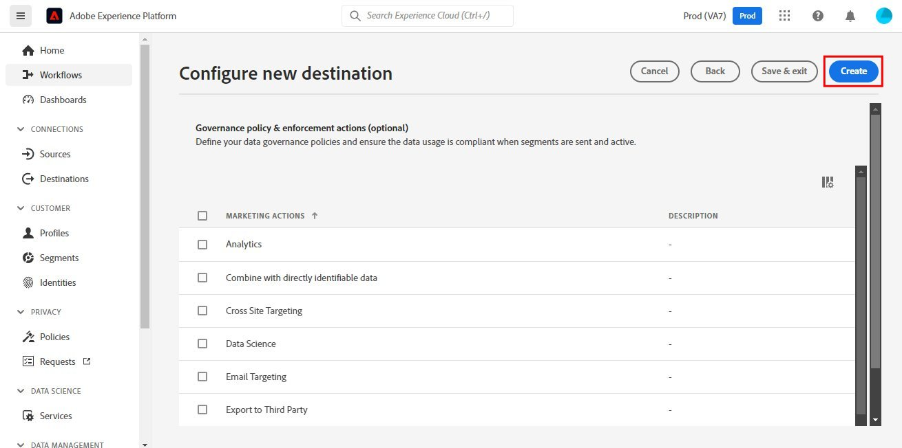
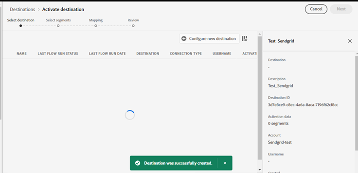
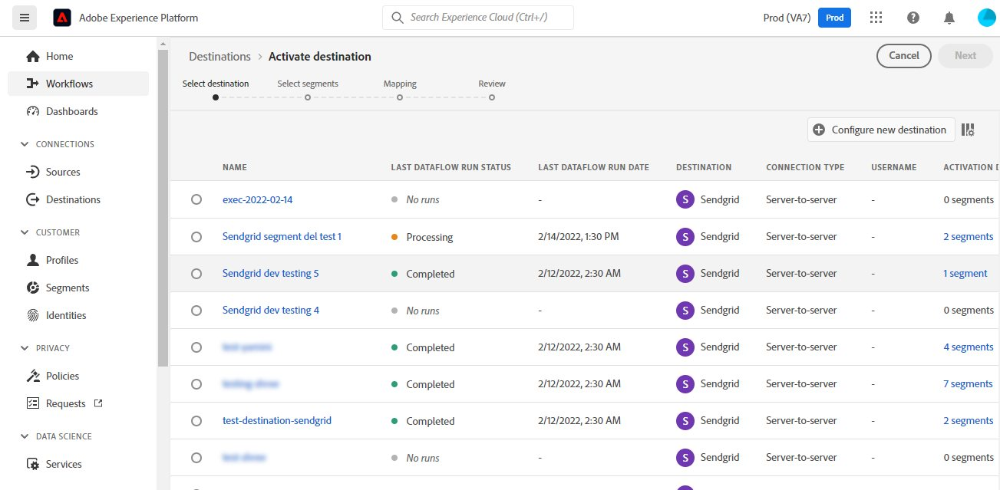
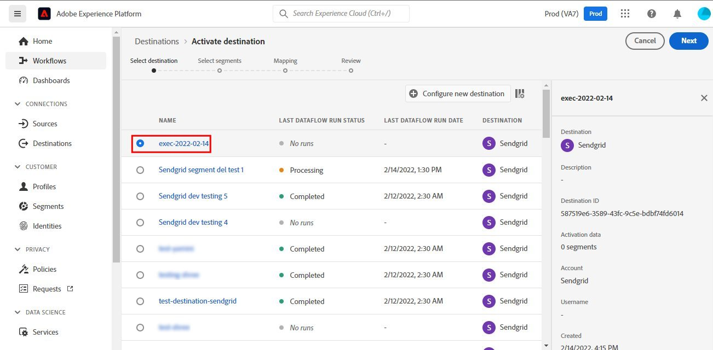
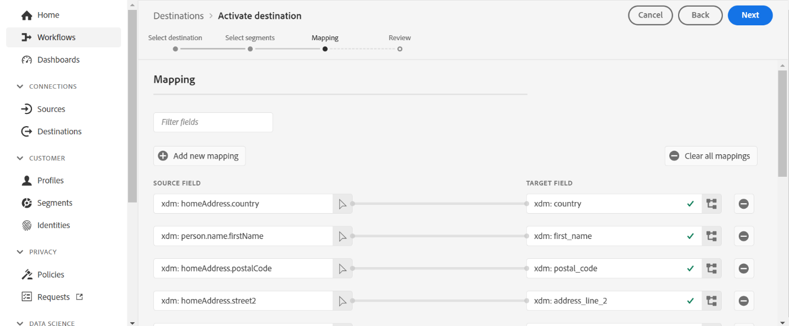
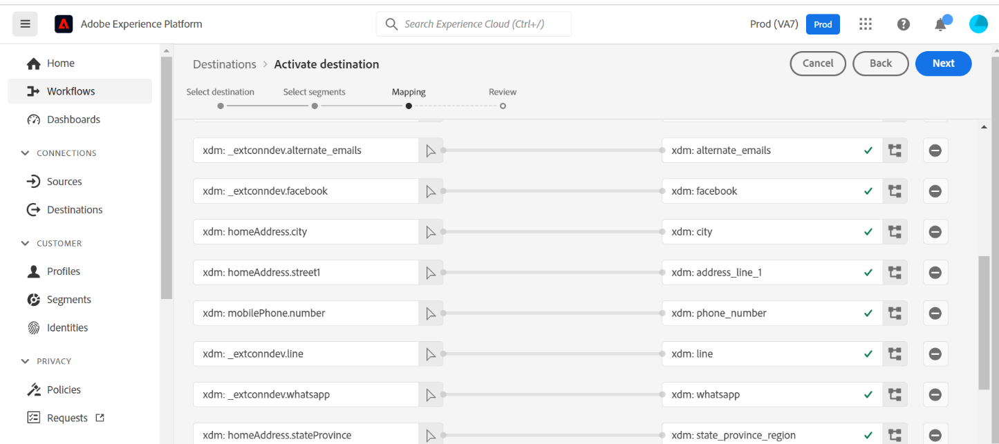

# SENDGRID

## Overview {#overview}

[Sendgrid](https://www.sendgrid.com) is a popular customer communication platform for transactional and marketing emails. 

* It provides a cloud-based service that assists businesses with email delivery. 
* The service manages various types of emails including shipping notifications, friend requests, sign-up confirmations, and email newsletters. 
* Additionally, the service allows link tracking, open-rate reporting,  tracking of email opens, unsubscribes, bounces, and spam reports, internet service provider (ISP) monitoring, domain keys, sender policy framework (SPF), and feedback loops.

This [!DNL Adobe Experience Platform] [!DNL destination](https://experienceleague.adobe.com/docs/experience-platform/destinations/home.html?lang=en) allows you to ingest your first-party data and activate it within Sendgrid for your business needs.

## Prerequisites {#prerequisites}

The following items are required before you start configuring the extension.
* Sendgrid Customers should obtain a Sendgrid account. 
  * Click [here](https://signup.sendgrid.com/) to register and create the Sendgrid account, if you do not have one already.
* After logging in to the Sendgrid portal, you would also need to generate an API token. 
* Navigate to the Sendgrid website and access *[!DNL Settings > API Keys]* page. Alternatively, click [here](https://app.sendgrid.com/settings/api_keys) to access the appropriate section in the Sendgrid app.
* Then click the *[!DNL Create API Key]* button.
  * Click [here](https://docs.sendgrid.com/ui/account-and-settings/api-keys#creating-an-api-key), if you need guidance on what actions to perform. 
  * If you would like to programmatically generate your API Key, please refer to this documentation [link](https://docs.sendgrid.com/api-reference/api-keys/create-api-keys).


* You will also require to create a [Schema](https://experienceleague.adobe.com/docs/experience-platform/xdm/schema/composition.html), [Dataset](https://experienceleague.adobe.com/docs/platform-learn/tutorials/data-ingestion/create-datasets-and-ingest-data.html?lang=en), and a [Segment](https://experienceleague.adobe.com/docs/platform-learn/tutorials/segments/create-segments.html?lang=en) for connecting to a [Destination](https://experienceleague.adobe.com/docs/platform-learn/tutorials/destinations/create-destinations-and-activate-data.html?lang=en).

>[!IMPORTANT]
>* During *Datasets* creation the *alternate email* value used within the data should be unique else the profile won't be sent to sendgrid and will throw an error.

## Supported identities {#supported-identities}

* AEP uses [!DNL Bearer tokens](https://experienceleague.adobe.com/docs/experience-platform/landing/platform-apis/api-authentication.html#generate-an-access-token) as an authentication mechanism to communicate with the Sendgrid API.

## Activate segments to this destination {#activate}

Read [Create destinations and activate data](https://experienceleague.adobe.com/docs/platform-learn/tutorials/destinations/create-destinations-and-activate-data.html?lang=en) for generic instructions on activating audience segments to this destination. See below for the screengrabs corresponding to this destination. 

* Within the AEP console, navigate to *Destinations*.

* Click the *Catalog* tab and search for *Sendgrid*. Then click *Activate Segments*.


* You will be shown a wizard where the first screen is to choose a destination. For setting up this connector, let us create a new destination by clicking on *Configure new destination*.


* Select the *New Account* option and fill in the *Bearer Token* value which is the Sendgrid *API Key* value we had previously copied within [prerequisities].(#prerequisites-prerequisites)


* Upon clicking *Connect to destination*, you will be shown the next [step](#connection-parameters-parameters) to fill in additional information fields.

### Connection parameters {#parameters}

While [setting up](https://experienceleague.adobe.com/docs/experience-platform/destinations/ui/connect-destination.html?lang=en) this destination, you must provide the following information:

*  **[!UICONTROL Name]**: A name by which you will recognize this destination in future.
*  **[!UICONTROL Description]**: An optional description that will help you identify this destination in future.


## Connect to destination {#connect}

* To connect to this destination, the generic steps described in the [destination configuration tutorial](https://experienceleague.adobe.com/docs/experience-platform/destinations/ui/connect-destination.html?lang=en) will provide guidance. See below for the screengrabs corresponding to this destination. 





* You will be navigated to the list of destinations.



* Select the newly created destination and click *Next*.



* Select the *Segment* *(created earlier in [prerequisites](#prerequisites-prerequisites))* and click *Next*.


* Now map the *Source* and *Schema* *(created earlier in [prerequisites](#prerequisites-prerequisites))* fields.


> [!IMPORTANT]
> The *Source* field attribute *"Email"* should be mapped to the *Target* field attribute "external_id" as shown in the subsequent steps.


* A complete list of the mappings to be setup is shown below.






* After completing the mappings, click *Next* to obtain the below review screen indicating the audience and destination are connected.


* Click *Finish* to complete the setup.


* Navigate to the list of destinations. Ensure that the destination we created is visible with status enabled. You can also see the flow run status, which is generally updated within an hour.


* Switch to the *Activation data* tab.


* Monitor the segments to check the flow of data.


* Naviage to the Sendgrid site and check if the new email record from the dataset you created within [prerequisites](#prerequisites-prerequisites) is being populated within the new contact list.


>[!IMPORTANT]
> * At times, the data might not be visible within Sendgrid immediately due to constraints/limitations at the backend. In such scenarios, please wait for a while before rechecking. 
> * Alternatively, only a few records might be visible initially, and the remaining data might become visible after an interval.

* Also check a couple of emails to validate if the field mapping is correct.


## Exported data {#exported-data}

* A sample JSON like the one below is sent by the destination. If you are facing any issues, please ensure the data is compliant.

```
{
  "list_ids": [
    "9abd9875-05e7-43c5-9d49-3394d702420f"
  ],
  "contacts": [
    {
      "email": "gu****y@gmail.com",
      "first_name": " Gre***",
      "last_name": "Guy",
      "address_line_1": "****, ****Vidhy****** Marg",
      "address_line_2": "********, Santacruz",
      "city": "Mumbai",
      "state_province_region": "Maharashtra",
      "country": "India",
      "postal_code": "400055",
      "alternate_emails": [
        "guy****@gmail.com"
      ],
      "phone_number": "0000000000",
      "whatsapp": "0000000000",
      "line": "guy_************",
      "facebook": "https://www.facebook.com/profile.php?id=111",
      "unique_name": "guy1"
    },
    {
      "email": "si****@gmail.com",
      "first_name": "Y****",
      "last_name": "Si****",
      "address_line_1": "****, A**** Golden Palace",
      "address_line_2": "**** Complex, Nr. Mahindra ****",
      "city": "Bangalore",
      "state_province_region": "Karnataka",
      "country": "India",
      "postal_code": "560009",
      "alternate_emails": [
        "si****@gmail.com"
      ],
      "phone_number": "0000000000",
      "whatsapp": "00000000000",
      "line": "si_****",
      "facebook": "https://www.facebook.com/profile.php?id=111",
      "unique_name": "string"
    }
  ]
}
```

## Data usage and governance {#data-usage-governance}

All [!DNL Adobe Experience Platform] destinations are compliant with data usage policies when handling your data. For detailed information on how [!DNL Adobe Experience Platform] enforces data governance, see the [Data Governance overview](https://experienceleague.adobe.com/docs/experience-platform/data-governance/home.html).

## Additional resources {#additional-resources}

* The Sengrid destination leverages the [Marketing Lists](https://api.sendgrid.com/v3/marketing/lists) and [Marketing Contacts](https://api.sendgrid.com/v3/marketing/contacts) API's to execute list creation and upsert (insert or update) of up to 30,000 contacts, or 6MB of data, whichever is lower.

### Audience templating
* *Create a List* API is used to create an audience in Sendgrid. 
* When we hit the audience template API, we pass the *list_name* as the name of the selected segment and timestamp.

```
  "requestBody": {
    "json": {
      "name": "*{{segment.name}}*_*{{ now() | toJson() }}*"
    }
  }
```

The response of this API is the list Id/Mapping Id. This Id is stored as *externalAudienceId*.

```
  "responseFields": [
    {
      "value": "*{{response.id}}*",
      "name": "externalAudienceId"
    }
  ]
```

* When we hit destination config API to create template for contacts API, we pass *audienceTemplateId* in the request body. 
* When configuring a new Sendgrid destination, a mapping id is created in AEP, corresponding to list id in Sendgrid.
* We write the template in such a way that the mapping id is passed as the *list_id* attribute in the request for contacts API.

```
  "list_ids": [
    "{{ input.aggregationKey.segmentAlias }}"
  ]
```

* Now the profile data from AEP will flow into this List.