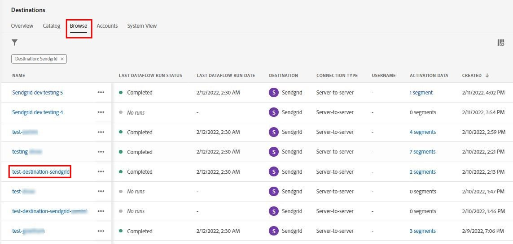

# [!DNL Sendgrid] connection

## Overview {#overview}

[Sendgrid](https://www.sendgrid.com) is a popular customer communication platform for transactional and marketing emails.

This [!DNL Adobe Experience Platform] [destination](https://experienceleague.adobe.com/docs/experience-platform/destinations/home.html?lang=en) leverages the [[!DNL Sendgrid Marketing Contacts API]](https://api.sendgrid.com/v3/marketing/contacts) allows you to ingest your first-party email profiles and activate it within a new Sendgrid segment for your business needs.

* It uses [[!DNL Bearer tokens]](https://experienceleague.adobe.com/docs/experience-platform/landing/platform-apis/api-authentication.html#generate-an-access-token) as an authentication mechanism to communicate with the Sendgrid API.

## Prerequisites {#prerequisites}

The following items are required before you start configuring the destination.

1. You need to have a Sendgrid account. 
    * Go to the Sendgrid [signup](https://signup.sendgrid.com/) page to register and create a Sendgrid account, if you do not have one already.
1. After logging in to the Sendgrid portal, you also need to generate an API token.
1. Navigate to the Sendgrid website and access **[!DNL Settings > API Keys]** page. Alternatively, refer to the [Sendgrid documentation](https://app.sendgrid.com/settings/api_keys) to access the appropriate section in the Sendgrid app.
1. Finally select the **[!DNL Create API Key]** button.
    * Refer to the [Sendgrid documentation](https://docs.sendgrid.com/ui/account-and-settings/api-keys#creating-an-api-key), if you need guidance on what actions to perform. 
    * If you would like to programmatically generate your API Key, please refer to the [Sendgrid documentation](https://docs.sendgrid.com/api-reference/api-keys/create-api-keys).

* Before activating data to the Sendgrid destination you should have created a [schema](https://experienceleague.adobe.com/docs/experience-platform/xdm/schema/composition.html), [dataset](https://experienceleague.adobe.com/docs/platform-learn/tutorials/data-ingestion/create-datasets-and-ingest-data.html?lang=en), and [segment](https://experienceleague.adobe.com/docs/platform-learn/tutorials/segments/create-segments.html?lang=en) in the [!DNL Adobe Experience Platform].

>[!IMPORTANT]
>* The Sendgrid API used for creating the mailing list from email profiles requires unique email addresses to be provided within each profile. This is irrespective of whether its usage as a value for *email* or *alternate email*. Because the Sendgrid connection supports mappings for both *email* and *alternate email* values please ensure that all email addresses used should be unique within each profile of the *Dataset* else when the email profiles are sent to Sendgrid it will result in an error and that email profile will not be present.

>[!IMPORTANT]
>* Please note the functionality to remove profiles from Sendgrid when they are removed from segments is yet to be developed.

## Supported identities {#supported-identities}

*Sendgrid* supports the activation of identities described in the table below. Learn more about [identities](https://experienceleague.adobe.com/docs/experience-platform/identity/namespaces.html?lang=en#getting-started).

|Target Identity|Description|Considerations|
|---|---|---|
|email |Email address|Note both plain text and SHA256 hashed email addresses are supported by [!DNL Adobe Experience Platform]. If the Experience platform source field contains unhashed attributes, check the **[!UICONTROL Apply transformation]** option, to have [!DNL Platform] automatically hash the data on activation.   However as *Sendgrid* does not support hashed email addresses only plain text data without transformation is sent.|

{style="table-layout:auto"}

## Export type and frequency {#export-type-frequency}

Refer to the table below for information about the destination export type and frequency.

| Item | Type | Notes |
---------|----------|---------|
| Export type | **[!UICONTROL Profile-based]** | You are exporting all members of a segment, together with the desired schema fields (for example: email address, phone number, last name), as chosen in the select profile attributes screen of the [destination activation workflow](/help/destinations/ui/activate-batch-profile-destinations.md#select-attributes).|
| Export frequency | **[!UICONTROL Streaming]** | Streaming destinations are "always on" API-based connections. As soon as a profile is updated in Experience Platform based on segment evaluation, the connector sends the update downstream to the destination platform. Read more about [streaming destinations](/help/destinations/destination-types.md#streaming-destinations).|

{style="table-layout:auto"}

## Use cases {#use-cases}

To help you better understand how and when you should use the *Sendgrid* destination, here are sample use cases that [!DNL Adobe Experience Platform] customers can solve by using this destination.

### Create a marketing list for multiple marketing activities

Marketing teams using Sendgrid can create a mailing list within Sendgrid and populate it with email addresses. The mailing list now created within Sendgrid can subsequently be used for multiple marketing activities.

## Connect to destination {#connect}

To connect to this destination, follow the steps described in the [destination configuration tutorial](../../ui/connect-destination.md). Steps specific to this destination are illustrated in detail below.

1. Within the [!DNL Adobe Experience Platform] console, navigate to *Destinations*.

1. Select the **Catalog** tab and search for *Sendgrid*. Then select **Activate Segments**.

1. You are shown a wizard which assists you in configuring the Sendgrid destinationYou will be shown a wizard where the first screen is to choose a destination. For setting up this connector, let us create a new destination by selecting **Configure new destination**.

1. Select the **New Account** option and fill in the *Bearer Token* value. This value is the Sendgrid *API Key* we had previously copied in the [prerequisites section](#prerequisites).

1. Select **Connect to destination** which will check if the Sendgrid *API Key* we provided is valid and accordingly display a *Connected* status. If the **Connected** status is shown as green we are also shown the next [step](#parameters) to fill in additional information fields.

### Connection parameters {#parameters}

While [setting up](https://experienceleague.adobe.com/docs/experience-platform/destinations/ui/connect-destination.html?lang=en) this destination, you must provide the following information:

*  **[!UICONTROL Name]**: The name by which you will recognize this destination in the future.
*  **[!UICONTROL Description]**: An optional description that will help you identify this destination in the future.

## Activate segments to this destination {#activate}

Read [Activate profiles and segments to streaming segment export destinations](../../ui/activate/activate-segment-streaming-destinations.md) for instructions on activating audience segments to this destination. 

Refer to the below images for details specific to this destination.

* Select a segment that you setup from the list of available segments

* After selecting **Add new mapping** you are shown the mapping page to map the source fields to the Sendgrid API target fields.

> [!IMPORTANT]
> The **Source field** attribute *"Email"* should be mapped to the **Target field** attribute *"external_id"* as shown in the subsequent image.

* Similarly the remaining [!DNL Adobe Experience Platform] fields and attributes are mapped to the Sendgrid attributes.

* A preview of some of the mappings is as below

* The comprehensive list of supported mappings that can be set up for the [Sendgrid Marketing Contacts API](https://api.sendgrid.com/v3/marketing/contacts) are listed below.

| Name | Field | Type | Description | Limits |
|---|---|---|---|---|
| contacts | - | Array of Objects | One or more contacts objects that you intend to add/insert. The available fields for a contact, including the required email field are described below. | Max: 30,000 items and Min: 2 items |
| | address_line_1 | String | The first line of the address. | Max Length: 100 characters |
| | address_line_2 | String | An optional second line for the address. | Max Length: 100 characters |
| | alternate_emails | Array of String | Additional emails associated with the contact. | Max: 5 items and Min: 0 items |
| | city | String | The contact's city. | MaxLength: 60 characters |
| | country | String | The contact's country. Can be a full name or an abbreviation. | Max Length: 50 characters |
| | email | String | The contact's primary email. This is a *mandatory* field and the value passed should be valid. | Max Length: 254 characters |
| | first_name | String | The contact's name | Max Length: 50 characters |
| | last_name | String | The contact's family name | Max Length: 50 characters |
| | postal_code | String | The contact's ZIP code or other postal code. | |
| | state_province_region | String | The contact's state, province, or region. | Max Length: 50 characters|
| | line | String | The contact's Line account *(if any)* | |
| | whatsapp | String | The contact's Whatsapp account *(if any)* | |
| | facebook | String | The contact's Facebook account *(if any)* | |
| | unique_name | String | | |
| | phone_number | String | The contact’s phone number. | |

* After completing the mappings, select **Next** to obtain a review screen indicating the audience and destination are connected.

* Select **Finish** to complete the setup.

## Validate data within Sendgrid {#validate}

To validate that you have correctly set up the destination.

1. Select **Destinations > Browse** to navigate to the list of destinations. 

1. Select the destination and ensure the status is **enabled**.

1. Switch to the **Activation data** tab, then select a **Segment Name**.

1. Monitor the segment summary and check the count of profiles corresponds to the count created within the dataset.

1. The [Sendgrid Marketing Lists API](https://api.sendgrid.com/v3/marketing/lists) is used to create unique contact lists within Sendgrid  by joining the value of the *list_name* attribute and the timestamp of the data export. Navigate to the Sendgrid site and check if the new contact list conforming to the name pattern is created.

1. Select the newly created contact list and check if the new email record from the dataset you created is being populated within the new contact list.

1. Additionally also check a couple of emails to validate if the field mapping is correct.

## Data usage and governance {#data-usage-governance}

All [!DNL Adobe Experience Platform] destinations are compliant with data usage policies when handling your data. For detailed information on how [!DNL Adobe Experience Platform] enforces data governance, see the [Data Governance overview](https://experienceleague.adobe.com/docs/experience-platform/data-governance/home.html).

## Additional resources {#additional-resources}

This Sendgrid destination leverages the below API's
  * [Sendgrid Marketing Lists API](https://api.sendgrid.com/v3/marketing/lists) 
  * [Sendgrid Marketing Contacts API](https://api.sendgrid.com/v3/marketing/contacts)

### Limits

* The [Sendgrid Marketing Contacts API](https://api.sendgrid.com/v3/marketing/contacts) can accept 30,000 contacts, or 6MB of data, whichever is lower.