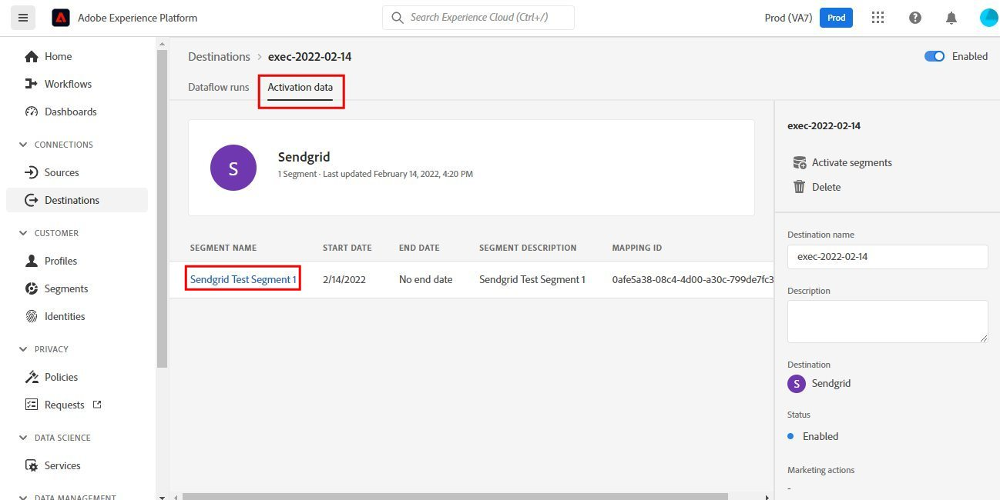

# [!DNL SendGrid] connection

## Overview {#overview}

[SendGrid](https://www.sendgrid.com) is a popular customer communication platform for transactional and marketing emails.

This [!DNL Adobe Experience Platform] [destination](/help/destinations/home.md) leverages the [[!DNL SendGrid Marketing Contacts API]](https://api.sendgrid.com/v3/marketing/contacts), which allows you to export your first-party email profiles and activate them within a new SendGrid audience for your business needs.

SendGrid uses API bearer tokens as an authentication mechanism to communicate with the SendGrid API.

## Prerequisites {#prerequisites}

The following items are required before you start configuring the destination.

1. You need to have a SendGrid account.
    * Go to the SendGrid [signup](https://signup.sendgrid.com/) page to register and create a SendGrid account, if you do not have one already.
1. After logging in to the SendGrid portal, you also need to generate an API token.
1. Navigate to the SendGrid website and access the **[!DNL Settings]** > **[!DNL API Keys]** page. Alternatively, refer to the [SendGrid documentation](https://app.sendgrid.com/settings/api_keys) to access the appropriate section in the SendGrid app.
1. Finally, select the **[!DNL Create API Key]** button.
    * Refer to the [SendGrid documentation](https://docs.sendgrid.com/ui/account-and-settings/api-keys#creating-an-api-key), if you need guidance on what actions to perform. 
    * If you would like to programmatically generate your API Key, please refer to the [SendGrid documentation](https://docs.sendgrid.com/api-reference/api-keys/create-api-keys).

Before activating data to the SendGrid destination, you must have a [schema](https://experienceleague.adobe.com/docs/experience-platform/xdm/schema/composition.html), a [dataset](https://experienceleague.adobe.com/docs/platform-learn/tutorials/data-ingestion/create-datasets-and-ingest-data.html?lang=en), and [segments](https://experienceleague.adobe.com/docs/platform-learn/tutorials/segments/create-segments.html?lang=en) created in [!DNL Experience Platform]. Refer also to the [limits](#limits) section further below on this page.

>[!IMPORTANT]
>
>* The SendGrid API used for creating the mailing list from email profiles requires unique email addresses to be provided within each profile. This is irrespective of whether it is used as a value for *email* or *alternate email*. Because the SendGrid connection supports mappings for both email and alternate email values, please ensure that all email addresses used should be unique within each profile of the *Dataset*. Otherwise, when the email profiles are sent to SendGrid, this will result in an error and that email profile will not be present in the data export.
>
>* Currently, there is no functionality in place to remove profiles from SendGrid when they are removed from audiences in Experience Platform.

## Supported identities {#supported-identities}

SendGrid supports the activation of identities described in the table below. Learn more about [identities](/help/identity-service/namespaces.md).

|Target Identity|Description|Considerations|
|---|---|---|
|email |Email address|Note both plain text and SHA256 hashed email addresses are supported by [!DNL Adobe Experience Platform]. If the Experience platform source field contains unhashed attributes, check the **[!UICONTROL Apply transformation]** option, to have [!DNL Platform] automatically hash the data on activation.   Note that **SendGrid** does not support hashed email addresses, so only plain text data without transformation is sent to the destination.|

{style="table-layout:auto"}

## Export type and frequency {#export-type-frequency}

Refer to the table below for information about the destination export type and frequency.

| Item | Type | Notes |
---------|----------|---------|
| Export type | **[!UICONTROL Profile-based]** | You are exporting all members of a segment, together with the desired schema fields (for example: email address, phone number, last name), as chosen in the select profile attributes screen of the [destination activation workflow](/help/destinations/ui/activate-batch-profile-destinations.md#select-attributes).|
| Export frequency | **[!UICONTROL Streaming]** | Streaming destinations are "always on" API-based connections. As soon as a profile is updated in Experience Platform based on audience evaluation, the connector sends the update downstream to the destination platform. Read more about [streaming destinations](/help/destinations/destination-types.md#streaming-destinations).|

{style="table-layout:auto"}

## Use cases {#use-cases}

To help you better understand how and when you should use the SendGrid destination, here are sample use cases that [!DNL Experience Platform] customers can solve by using this destination.

### Create a marketing list for multiple marketing activities

Marketing teams using SendGrid can create a mailing list within SendGrid and populate it with email addresses. The mailing list now created within SendGrid can subsequently be used for multiple marketing activities.

## Connect to destination {#connect}

>[!IMPORTANT]
> 
>To connect to the destination, you need the **[!UICONTROL Manage Destinations]** [access control permission](/help/access-control/home.md#permissions). Read the [access control overview](/help/access-control/ui/overview.md) or contact your product administrator to obtain the required permissions.

To connect to this destination, follow the steps described in the [destination configuration tutorial](../../ui/connect-destination.md). In the configure destination workflow, fill in the fields listed in the two sections below.

### Authenticate to destination {#authenticate}

1. Within the [!DNL Adobe Experience Platform] console, navigate to **Destinations**.

1. Select the **Catalog** tab and search for *SendGrid*. Then select **Set up**. After you have established a connection to the destination, the UI label changes to **Activate Segments**.

1. You are shown a wizard which assists you in configuring the SendGrid destination. Create the new destination by selecting **Configure new destination**.

1. Select the **New Account** option and fill in the **Bearer Token** value. This value is the SendGrid *API Key* previously mentioned in the [prerequisites section](#prerequisites).

1. Select **Connect to destination**. If the SendGrid *API Key* you provided is valid, the UI displays a **Connected** status with a green check mark, you can then proceed to the next step to fill in additional information fields.

### Fill in destination details {#destination-details}

While [setting up](https://experienceleague.adobe.com/docs/experience-platform/destinations/ui/connect-destination.html?lang=en) this destination, you must provide the following information:

*  **[!UICONTROL Name]**: The name by which you will recognize this destination in the future.
*  **[!UICONTROL Description]**: An optional description that will help you identify this destination in the future.

### Enable alerts {#enable-alerts}

You can enable alerts to receive notifications on the status of the dataflow to your destination. Select an alert from the list to subscribe to receive notifications on the status of your dataflow. For more information on alerts, see the guide on [subscribing to destinations alerts using the UI](../../ui/alerts.md).

When you are finished providing details for your destination connection, select **[!UICONTROL Next]**.

## Activate audiences to this destination {#activate}

>[!IMPORTANT]
> 
>To activate data, you need the **[!UICONTROL Manage Destinations]**, **[!UICONTROL Activate Destinations]**, **[!UICONTROL View Profiles]**, and **[!UICONTROL View Segments]** [access control permissions](/help/access-control/home.md#permissions). Read the [access control overview](/help/access-control/ui/overview.md) or contact your product administrator to obtain the required permissions.

Read [Activate profiles and audiences to streaming audience export destinations](/help/destinations/ui/activate-segment-streaming-destinations.md) for instructions on activating audiences to this destination. 

Refer to the below images for details specific to this destination.

1. Select one or more audiences to export to SendGrid.

1. In the **[!UICONTROL Mapping]** step, after selecting **[!UICONTROL Add new mapping]**, you are shown the mapping page to map the source XDM fields to the SendGrid API target fields. The images below demonstrate how to map identity namespaces between Experience Platform and SendGrid. Please ensure the **[!UICONTROL Source field]** *Email* should be mapped to the **[!UICONTROL Target field]** *external_id* as shown below.

1. Similarly, map the desired [!DNL Adobe Experience Platform] attributes that you want to export to the SendGrid destination.

1. After completing the mappings, select **[!UICONTROL Next]** to advance to the review screen.

1. Select **[!UICONTROL Finish]** to complete the setup.

The comprehensive list of supported attribute mappings that can be set up for the [SendGrid Marketing Contacts > Add or Update Contact API](https://docs.sendgrid.com/api-reference/contacts/add-or-update-a-contact) is below.

| Source Field | Target Field | Type | Description | Limits |
|---|---|---|---|---|
| xdm:  homeAddress.street1 | xdm:  address_line_1 | String | The first line of the address. | Max Length:  100 characters |
| xdm:  homeAddress.street2 | xdm:  address_line_2 | String | An optional second line for the address. | Max Length:  100 characters |
| xdm:  _extconndev.alternate_emails | xdm:  alternate_emails | Array of String | Additional emails associated with the contact. | <ul><li>Max: 5 items</li><li>Min: 0 items</li></ul> |
| xdm:  homeAddress.city | xdm:  city | String | The contact's city. | Max Length:  60 characters |
| xdm:  homeAddress.country | xdm:  country | String | The contact's country. Can be a full name or an abbreviation. | Max Length:  50 characters |
| identityMap:  Email | Identity:  external_id | String | The contact's primary email. This is required to be a valid email. | Max Length:  254 characters |
| xdm:  person.name.firstName | xdm:  first_name | String | The contact's name | Max Length:  50 characters |
| xdm:  person.name.lastName | xdm:  last_name | String | The contact's family name | Max Length:  50 characters |
| xdm:  homeAddress.postalCode | xdm:  postal_code | String | The contact's ZIP code or other postal code. | |
| xdm:  homeAddress.stateProvince | xdm:  state_province_region | String | The contact's state, province, or region. | Max Length:  50 characters|

## Validate the data export within SendGrid {#validate}

To validate that you have correctly set up the destination, follow the steps below:

1. Select **[!UICONTROL Destinations]** > **[!UICONTROL Browse]** to navigate to the list of destinations.

1. Select the destination and validate that the status is **[!UICONTROL enabled]**.

1. Switch to the **[!DNL Activation data]** tab, then select an audience name.

1. Monitor the audience summary and check the count of profiles corresponds to the count created within the dataset.

1. The [SendGrid Marketing Lists > Create List API](https://docs.sendgrid.com/api-reference/lists/create-list) is used to create unique contact lists within SendGrid by joining the value of the *list_name* attribute and the timestamp of the data export. Navigate to the SendGrid site and check if the new contact list conforming to the name pattern is created.

1. Select the newly created contact list and check if the new email record from the dataset you created is being populated within the new contact list.

1. Additionally, also check a couple of emails to validate if the field mapping is correct.

## Data usage and governance {#data-usage-governance}

All [!DNL Adobe Experience Platform] destinations are compliant with data usage policies when handling your data. For detailed information on how [!DNL Adobe Experience Platform] enforces data governance, see the [Data Governance overview](/help/data-governance/home.md).

## Additional resources {#additional-resources}

This SendGrid destination leverages the below APIs:
* [SendGrid Marketing Lists > Create List API](https://docs.sendgrid.com/api-reference/lists/create-list)
* [SendGrid Marketing Contacts > Add or Update Contact API](https://docs.sendgrid.com/api-reference/contacts/add-or-update-a-contact)

### Limits {#limits}

* The [SendGrid Marketing Contacts > Add or Update Contact API](https://api.sendgrid.com/v3/marketing/contacts) can accept 30,000 contacts, or 6MB of data, whichever is lower.
