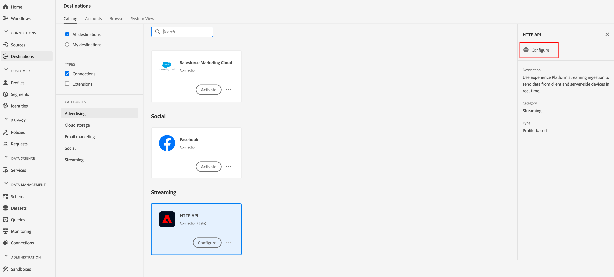
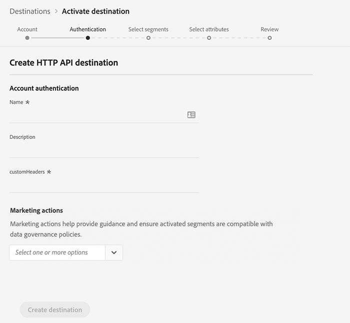

# (Alpha) [!DNL HTTP] connection

>[!IMPORTANT]
>
>The [!DNL HTTP] destination in Platform is currently in alpha. The documentation and the functionality are subject to change.

The [!DNL HTTP] destination is an [!DNL Adobe Experience Platform] streaming destination that helps you send profile data to third-party [!DNL HTTP] endpoints.

To send profile data to [!DNL HTTP] endpoints, you must first connect to the destination in [[!DNL Adobe Experience Platform]](#connect-destination).

## Use Cases {#use-cases}

The [!DNL HTTP] destination is targeted towards customers who need to export XDM profile data and audience segments to generic [!DNL HTTP] endpoints.

[!DNL HTTP] endpoints can be either customers' own systems  or third-party solutions.

## Connect to Destination {#connect-destination}

In **[!UICONTROL Connections]** > **[!UICONTROL Destinations]**, select [!DNL HTTP API], and select **[!UICONTROL Configure]**.



>[!NOTE]
>
>If a connection with this destination already exists, you can see an **[!UICONTROL Activate]** button on the destination card. For more information about the difference between **[!UICONTROL Activate]** and **[!UICONTROL Configure]**, refer to the [Catalog](../ui/destinations-workspace.md#catalog) section of the destination workspace documentation.
>
>

In the [!UICONTROL Account] step, you need to define the HTTP endpoint connection details. Select **[!UICONTROL New account]** and enter the connection details for the HTTP endpoint that you want to connect to.
- **[!UICONTROL httpEndpoint]**: the complete [!DNL URL] of the HTTP endpoint that you want to send the profile data to.
  - Optionally you can add query parameters to the [!UICONTROL httpEndpoint] [!DNL URL].
- **[!UICONTROL authEndpoint]**: the complete [!DNL URL] of the HTTP endpoint used for [!DNL OAuth2] authentication.
- **[!UICONTROL Client ID]**: the [!DNL clientID] parameter used in the [!DNL OAuth2] client credentials.
- **[!UICONTROL Client Secret]**: the [!DNL clientSecret] parameter used in the [!DNL OAuth2] client credentials.

>[!NOTE]
>
>Only [!DNL OAuth2] client credentials are currently supported.


Click **[!UICONTROL Connect to destination]**. After the connection succeeds, click **[!UICONTROL Next]**. 

In the [!UICONTROL Authentication] step, enter the account authentication credentials:
-  **[!UICONTROL Name]**: enter a name by which you will recognize this destination in the future.
-  **[!UICONTROL Description]**: enter a description that will help you identify this destination in the future.
-  **[!UICONTROL Custom Headers]**: enter any custom headers that you want to be included in the destination calls, following this format: `header1:value1,header2:value2,...headerN:valueN`.

>[!IMPORTANT]
>
>The current implementation requires at least one custom header. This limitation will be resolved in a future update.



**[!UICONTROL Marketing action]**: Marketing actions indicate the intent for which data will be exported to the destination. You can select from Adobe-defined marketing actions or you can create your own marketing action. For more information about marketing actions, see the [Data usage policies overview](../../data-governance/policies/overview.md). 

Click **[!UICONTROL Create destination]**.

## Activate Segments

See [Activate profiles and segments to a destination](../ui/activate-destinations.md#select-attributes) for information about the segment activation workflow.

## Destination Attributes

During the [[!UICONTROL Select attributes]](../ui/activate-destinations.md#select-attributes) step, when [activating segments](../ui/activate-destinations.md) to an [!DNL HTTP] destination, we recommend that you select a unique identifier from your [union schema](../../profile/home.md#profile-fragments-and-union-schemas). Select the unique identifier and any other XDM fields that you want to export to the destination.

## Exported data {#exported-data}

Your exported [!DNL Experience Platform] data lands in your [!DNL HTTP] destination in JSON format. For example, the event below contains the email address profile attribute of an audience that has qualified for a certain segment and exited another segment. The identities for this prospect are [!DNL ECID] and email.

```json
{
  "person": {
    "email": "yourstruly@adobe.con"
  },
  "segmentMembership": {
    "ups": {
      "7841ba61-23c1-4bb3-a495-00d3g5fe1e93": {
        "lastQualificationTime": "2020-05-25T21:24:39Z",
        "status": "exited"
      },
      "59bd2fkd-3c48-4b18-bf56-4f5c5e6967ae": {
        "lastQualificationTime": "2020-05-25T23:37:33Z",
        "status": "existing"
      }
    }
  },
  "identityMap": {
    "ecid": [
      {
        "id": "14575006536349286404619648085736425115"
      },
      {
        "id": "66478888669296734530114754794777368480"
      }
    ],
    "email_lc_sha256": [
      {
        "id": "655332b5fa2aea4498bf7a290cff017cb4"
      },
      {
        "id": "66baf76ef9de8b42df8903f00e0e3dc0b7"
      }
    ]
  }
}
```
