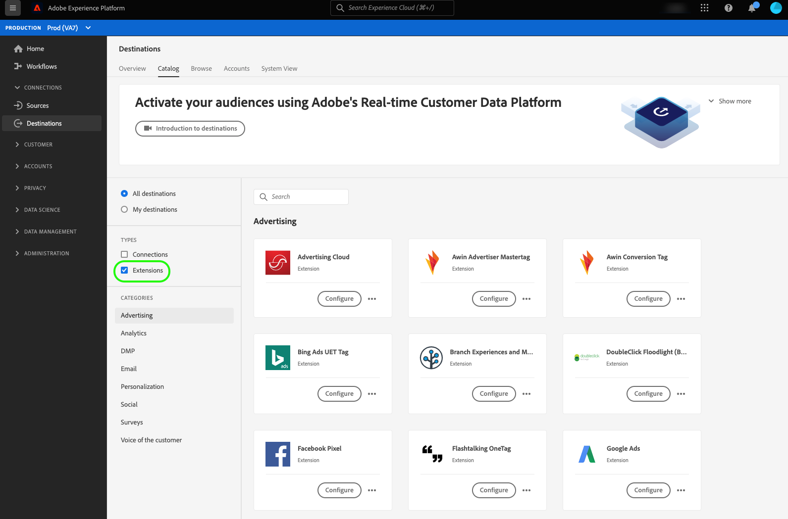

# Tag extensions in Adobe Experience Platform

Adobe Experience Platform provides the next generation of tag management capabilities from Adobe. Platform gives you a simple way to deploy and manage all of the analytics, marketing, and advertising tags necessary to power relevant customer experiences. Tags are offered to Adobe Experience Cloud customers as an included, value-add feature.

For an introduction to tags, see the resources below:

- [Tags overview](../../../tags/home.md)
- [Quick start guide](../../../tags/quick-start/quick-start.md)

## How to find tag extensions in the Platform interface {#how-to-find-extensions-in-interface}

To find the extensions in the Platform interface, browse to **[!UICONTROL Destinations]** > **[!UICONTROL Catalog]** and select **[!UICONTROL Extensions]** in the **[!UICONTROL Types]** filter. 

## How tag extensions work {#how-extensions-work}

A [tag extension](../../../tags/home.md#extensions) is a package of code that enhances the functionality of a website or mobile app. This could include sending raw event data to a destination like [Google Analytics](/help/destinations/catalog/analytics/google-universal-analytics.md) but they can also serve other functions.

It is important to differentiate between tag and event forwarding extensions. The extensions surfaced in the Platform destinations user interface are *tag extensions*. Refer to the overview on event forwarding for more information on the [differences between tags and event forwarding](/help/tags/ui/event-forwarding/overview.md#differences-between-event-forwarding-and-tags).

<!--

Extensions forward raw event data to several types of destinations. Think of extensions as an **Event Forwarding** type of destination. This is a simpler type of integration with destination platforms, which only forwards raw event data. Examples of those are the [Gainsight personalization extension](../personalization/gainsight.md) or the [Confirmit Voice of the Customer extension](../voice/confirmit-digital-feedback.md).

**Profile/Segment Export** destinations in Adobe Experience Platform capture event data, combine it with other data sources, apply segmentation, and export audiences and qualified profiles to destinations. Examples of those are the [Amazon S3 cloud storage destination](../cloud-storage/amazon-s3.md) or the [Google Display & Video 360 advertising destination](../advertising/google-dv360.md).

-->

## Benefits of using tag extensions {#extensions-benefits}

Platform's tag capabilities are free for existing Experience Cloud customers. The system simplifies tag deployment on your website via easy-to-use extensions that you can install, configure, update, and delete. Tags leave a small footprint on your website and allow you to keep your pages loading quickly.

While you cannot activate audiences to tag extensions, you can set up rules to only forward event data in certain situations. This powerful functionality enables you to forward event data only in certain situations as opposed to sending event data on every interaction. For more information, read about rules in the [tags documentation](../../../tags/ui/managing-resources/rules.md).

## Example use cases for extensions {#extensions-use-cases}

Extensions enable you to satisfy various customer use cases. Some example use cases for using extensions are:

- You can send website or native app data to Facebook via the Facebook pixel extension. Facebook Pixel indicates which parts of your site or app a visitor navigated to, forwards that information to Facebook, and you can retarget your visitor via Facebook.
- You can forward event data from your websites and apps into Google Analytics to analyze and make decisions based on that data.
- You could turn on a client-side chatbox app at the right time based on how your users are interacting with your pages, according to rules you set up.

## Extension categories {#extension-categories}

Extensions can fall under the following categories in Platform:

- [Advertising](../advertising/overview.md)
- [Analytics](../analytics/overview.md)
- [Data Management Platform](../data-management/overview.md)
- [Email marketing destinations](../email-marketing/overview.md)
- [Personalization](../personalization/overview.md)
- [Surveys](../survey/overview.md)
- [Voice of the customer](../voice/overview.md)
