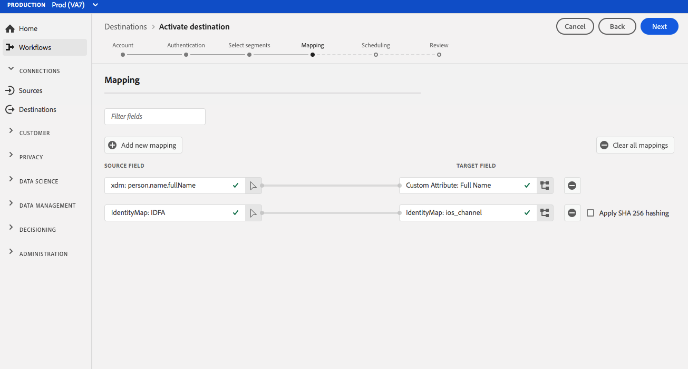
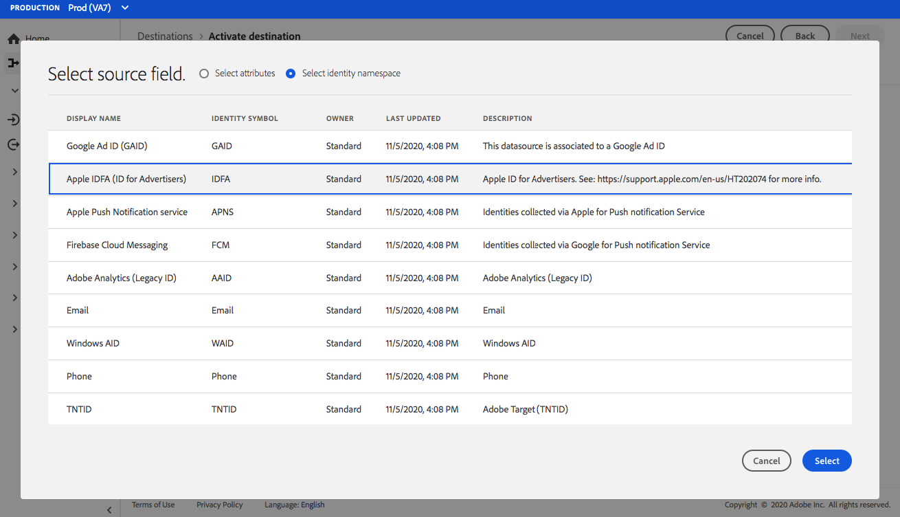
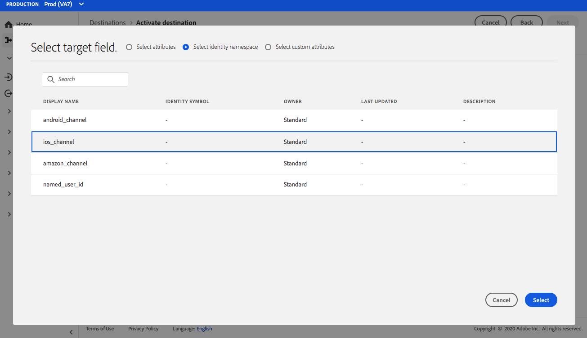
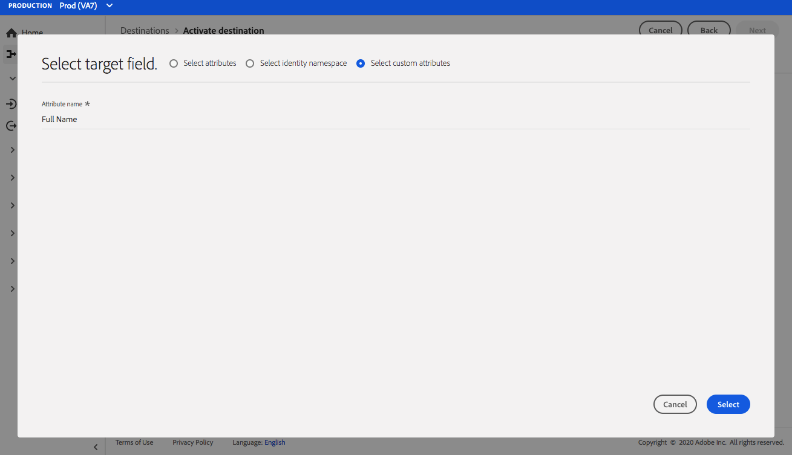

# [!DNL Airship Attributes] connection {#airship-attributes-destination}

## Overview {#overview}

[!DNL Airship] is the leading Customer Engagement Platform, helping you deliver meaningful, personalized omnichannel messaging to your users at every stage of the customer lifecycle.

This integration passes Adobe profile data into [!DNL Airship] as [Attributes](https://docs.airship.com/guides/audience/attributes/) for targeting or triggering.

To learn more about [!DNL Airship], see the [Airship Docs](https://docs.airship.com).

>[!TIP]
>
>This destination connector and documentation page are created and maintained by the [!DNL Airship] team. For any inquiries or update requests, please contact them directly at [support.airship.com](https://support.airship.com/).

## Prerequisites {#prerequisites}

Before you can send your audiences to [!DNL Airship], you must:

* Enable attributes in your [!DNL Airship] project.
* Generate a bearer token for authentication.

>[!TIP]
>
>Create an [!DNL Airship] account via [this signup link](https://go.airship.eu/accounts/register/plan/starter/) if you have not already.

## Supported audiences {#supported-audiences}

This destination supports the activation of all audiences generated through the Experience Platform [Segmentation Service](../../../segmentation/home.md).

*Additionally*, this destination also supports the activation of the audiences described in the table below.

| External audience type | Description | 
---------|----------|
| Custom uploads | Audiences [imported](../../../segmentation/ui/overview.md#import-audience) into Experience Platform from CSV files. | 

{style="table-layout:auto"}

## Export type and frequency {#export-type-frequency}

Refer to the table below for information about the destination export type and frequency.

| Item | Type | Notes |
---------|----------|---------|
| Export type | **[!UICONTROL Profile-based]** | You are exporting all members of a segment, together with the desired schema fields (for example: email address, phone number, last name) and/or identities, according to your field mapping.|
| Export frequency | **[!UICONTROL Streaming]** | Streaming destinations are "always on" API-based connections. As soon as a profile is updated in Experience Platform based on audience evaluation, the connector sends the update downstream to the destination platform. Read more about [streaming destinations](/help/destinations/destination-types.md#streaming-destinations).|

{style="table-layout:auto"}

## Enable attributes {#enable-attributes}

Adobe Experience Platform profile attributes are similar to [!DNL Airship] attributes and can be easily mapped to one another in Platform using the mapping tool demonstrated further below on this page.

[!DNL Airship] projects have several predefined and default attributes. If you have a custom attribute, you must define it in [!DNL Airship] first. See [Set Up and Manage Attributes](https://docs.airship.com/tutorials/audience/attributes/) for details.

## Generate bearer token {#bearer-token}

Go to **[!UICONTROL Settings]** » **[!UICONTROL APIs & Integrations]** in the [Airship dashboard](https://go.airship.com) and select **[!UICONTROL Tokens]** in the left-hand menu.

Click **[!UICONTROL Create Token]**.

Provide a user-friendly name for your token, e.g., "Adobe Attributes Destination", and select "All Access" for the role.

Click **[!UICONTROL Create Token]** and save the details as confidential.

## Use cases {#use-cases}

To help you better understand how and when you should use the [!DNL Airship Attributes] destination, here are sample use cases that Adobe Experience Platform customers can solve by using this destination.

### Use case #1

Leverage profile data collected within Adobe Experience Platform for personalization of the message and rich content within any of [!DNL Airship]'s channels. For example, leverage [!DNL Experience Platform] profile data to set location attributes within [!DNL Airship]. This will enable a hotel brand to display an image for the nearest hotel location for each user.

### Use case #2

Leverage Attributes from Adobe Experience Platform to further enrich [!DNL Airship] profiles and combine it with SDK or [!DNL Airship] predictive data. For example, a retailer can create an audience with loyalty status and location data (attributes from Platform) and [!DNL Airship] predicted to churn data to send highly targeted messages to users in the gold loyalty status who live in Las Vegas, NV, and have a high probability of churning.

## Connect to the destination {#connect}

>[!IMPORTANT]
> 
>To connect to the destination, you need the **[!UICONTROL Manage Destinations]** [access control permission](/help/access-control/home.md#permissions). Read the [access control overview](/help/access-control/ui/overview.md) or contact your product administrator to obtain the required permissions.

To connect to this destination, follow the steps described in the [destination configuration tutorial](../../ui/connect-destination.md). In the configure destination workflow, fill in the fields listed in the two sections below.

### Authenticate to destination {#authenticate}

To authenticate to the destination, fill in the required fields and select **[!UICONTROL Connect to destination]**.

* **[!UICONTROL Bearer token]**: the bearer token that you generated from the [!DNL Airship] dashboard.

### Fill in destination details {#destination-details}

To configure details for the destination, fill in the required and optional fields below. An asterisk next to a field in the UI indicates that the field is required.

* **[!UICONTROL Name]**: enter a name that will help you identify this destination.
* **[!UICONTROL Description]**: enter a description for this destination.
* **[!UICONTROL Domain]**: select either a US or EU data center, depending on which [!DNL Airship] data center applies to this destination.

### Enable alerts {#enable-alerts}

You can enable alerts to receive notifications on the status of the dataflow to your destination. Select an alert from the list to subscribe to receive notifications on the status of your dataflow. For more information on alerts, see the guide on [subscribing to destinations alerts using the UI](../../ui/alerts.md).

When you are finished providing details for your destination connection, select **[!UICONTROL Next]**.

## Activate audiences to this destination {#activate}

>[!IMPORTANT]
> 
>To activate data, you need the **[!UICONTROL Manage Destinations]**, **[!UICONTROL Activate Destinations]**, **[!UICONTROL View Profiles]**, and **[!UICONTROL View Segments]** [access control permissions](/help/access-control/home.md#permissions). Read the [access control overview](/help/access-control/ui/overview.md) or contact your product administrator to obtain the required permissions.

See [Activate audience data to streaming audience export destinations](../../ui/activate-segment-streaming-destinations.md) for instructions on activating audiences to this destination.

## Mapping considerations {#mapping-considerations}

[!DNL Airship] attributes can be set either on a channel, which represents device instance, e.g., iPhone, or a named user, which maps all of a user's devices to a common identifier such as a customer ID. If you have plain text (unhashed) email addresses as primary identity in your schema, select the email field in your **[!UICONTROL Source Attributes]** and map to the [!DNL Airship] named user in the right column under **[!UICONTROL Target Identities]**, as shown below.

For identifiers that should be mapped to a channel, i.e., a device, map to the appropriate channel based on the source. The following images show how two mappings are created:

* IDFA iOS Advertising ID to an [!DNL Airship] iOS channel
* Adobe `fullName` attribute to [!DNL Airship] "Full Name" attribute

>[!NOTE]
>
>Use the user-friendly name that appears in the [!DNL Airship] dashboard when selecting the target field for your attribute mapping.
   
**Map identity**

Select source field:

Select target field:

**Map attribute**

Select source attribute:

Select target attribute:

Verify mapping:

   

## Data usage and governance {#data-usage-governance}

All [!DNL Adobe Experience Platform] destinations are compliant with data usage policies when handling your data. For detailed information on how [!DNL Adobe Experience Platform] enforces data governance, see the [Data Governance overview](../../../data-governance/home.md).
