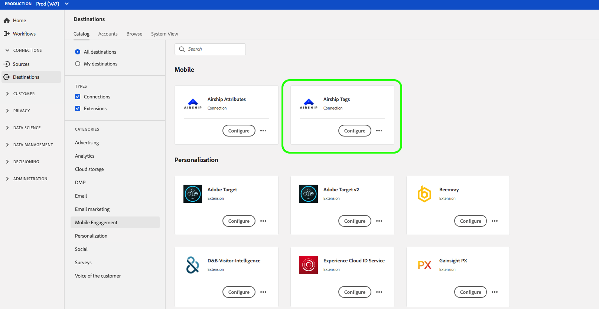
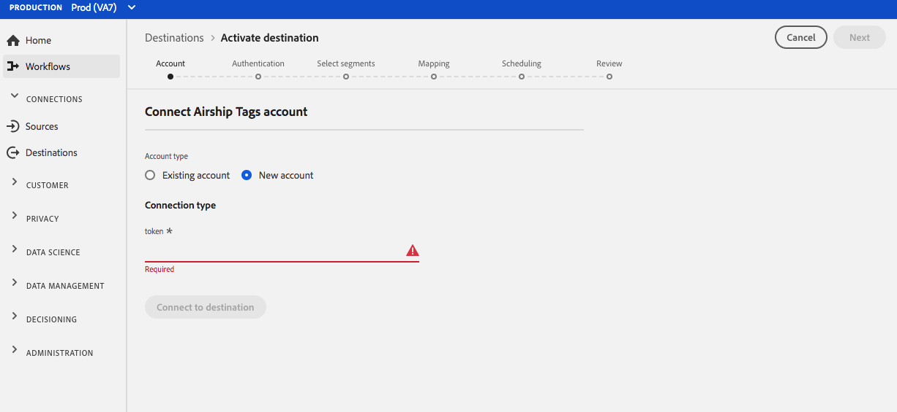
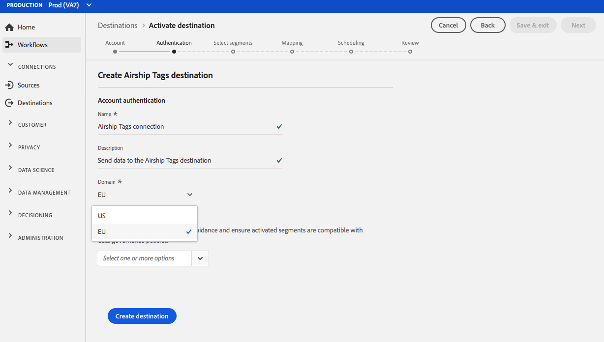
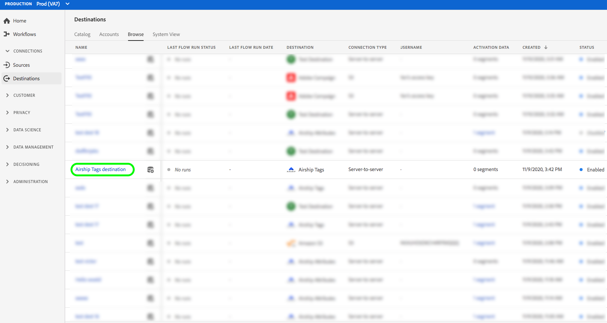
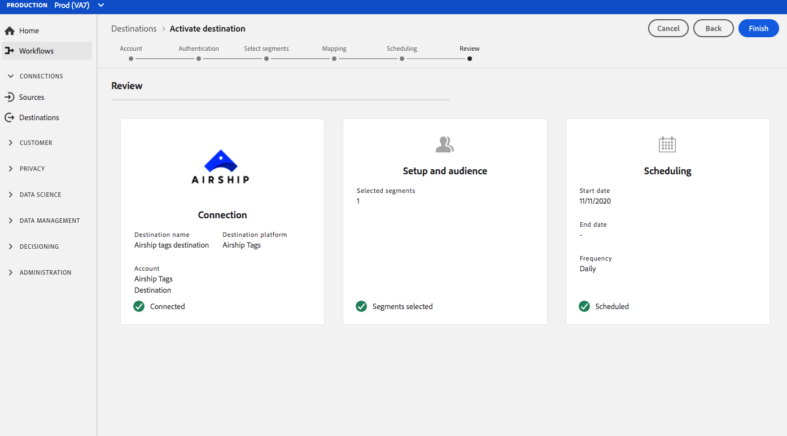

# (Beta) [!DNL Airship Tags] destination {#airship-tags-destination}

>[!IMPORTANT]
>
>The [!DNL Airship Tags] destination in Adobe Experience Platform is currently in beta. The documentation and the functionality are subject to change.

## Overview

[!DNL Airship] is the leading Customer Engagement Platform, helping you deliver meaningful, personalized omnichannel messaging to your users at every stage of the customer lifecycle.

This integration passes Adobe Experience Platform segment data into [!DNL Airship] as [Tags](https://docs.airship.com/guides/audience/tags/) for targeting or triggering.

To learn more about [!DNL Airship], see the [Airship Docs](https://docs.airship.com).

>[!TIP]
>
>This documentation page was created by the [!DNL Airship] team. For any inquiries or update requests, please contact them directly at [support.airship.com](https://support.airship.com/).

## Prerequisites

Before you can send your Adobe Experience Platform segments to [!DNL Airship], you must:

* Create a tag group in your [!DNL Airship] project.
* Generate a bearer token for authentication.

>[!TIP]
> 
>Create an [!DNL Airship] account via [this signup link](https://go.airship.eu/accounts/register/plan/starter/) if you have not already.

### Tag groups

The concept of segments in Adobe Experience Platorm is similar to [Tags](https://docs.airship.com/guides/audience/tags/) in Airship, with slight differences in implementation. This integration maps the status of a user's [membership in an Experience Platform segment](https://experienceleague.adobe.com/docs/experience-platform/xdm/mixins/profile/segmentation.html?lang=en#mixins) to the presence or non-presence of an [!DNL Airship] tag. For example, in a Platform segment where the `xdm:status` changes to `realized`, the tag is added to the [!DNL Airship] channel or named user this profile is mapped to. If the `xdm:status` changes to `exited`, the tag is removed.

To enable this integration, create a *tag group* in [!DNL Airship] named `adobe-segments`.

>[!IMPORTANT]
>
>When creating your new tag group **Do not check** the radio button that says "[!DNL Allow these tags to be set only from your server]". Doing so will make the Adobe tags integration fail.

See [Manage Tag Groups](https://docs.airship.com/tutorials/manage-project/messaging/tag-groups) for instructions on creating the tag group.

### Bearer token

Go to **[!UICONTROL Settings]** » **[!UICONTROL APIs & Integrations]** in the [Airship dashboard](https://go.airship.com) and select **[!UICONTROL Tokens]** in the left-hand menu.

Click **[!UICONTROL Create Token]**.

Provide a user-friendly name for your token, e.g., "Adobe Tags Destination", and select "All Access" for the role.

Click **[!UICONTROL Create Token]** and save the details as confidential.

## Use cases

To help you better understand how and when you should use the [!DNL Airship Tags] destination, here are sample use cases that Adobe Experience Platform customers can solve by using this destination.

### Use case #1

Retailers or entertainment platforms can create user profiles on their loyalty customers, and pass those segments into [!DNL Airship] for message targeting on mobile campaigns.

### Use case #2

Trigger one-to-one messages in real time when users fall into or out of specific segments within Adobe Experience Platform.

For example, a retailer sets up a jeans brand-specific segment in Platform. That retailer can now trigger a mobile message as soon as someone sets their jeans preference to a specific brand.

## Connect to [!DNL Airship Tags] {#connect-airship-tags}

In **[!UICONTROL Destinations]** > **[!UICONTROL Catalog]**, scroll to the **[!UICONTROL Mobile Engagement]** category. Select **[!DNL Airship Tags]**, then select **[!UICONTROL Configure]**.

>[!NOTE]
>
>If a connection with this destination already exists, you can see an **[!UICONTROL Activate]** button on the destination card. For more information about the difference between **[!UICONTROL Activate]** and **[!UICONTROL Configure]**, refer to the [Catalog](../../ui/destinations-workspace.md#catalog) section of the destination workspace documentation.

In the **Account** step, if you had previously set up a connection to your [!DNL Airship Tags] destination, select **[!UICONTROL Existing Account]** and select your existing connection. Or, you can select **[!UICONTROL New Account]** to set up a new connection to [!DNL Airship Tags]. Select **[!UICONTROL Connect to destination]** to connect Adobe Experience Platform to your [!DNL Airship] project using the bearer token that you generated from the [!DNL Airship] dashboard.

>[!NOTE]
>
>Adobe Experience Platform supports credentials validation in the authentication process and displays an error message if you input incorrect credentials to your [!DNL Airship] account. This ensures that you don't complete the workflow with incorrect credentials.

Once your credentials are confirmed and Adobe Experience Platform is connected to your [!DNL Airship] project, you can select **[!UICONTROL Next]** to proceed to the **[!UICONTROL Setup]** step.

In the **[!UICONTROL Authentication]** step, enter a **[!UICONTROL Name]** and a **[!UICONTROL Description]** for your activation flow.   Also in this step, you can select either US or EU data center, depending on which [!DNL Airship] data center applies to this destination. Finally, select one or more marketing use cases for which data will be exported to the destination. You can select from Adobe-defined marketing use cases or you can create your own. For more information about marketing use cases, see the [Data Governance in Real-time CDP](../../../rtcdp/privacy/data-governance-overview.md#destinations) page. For information about the individual Adobe-defined marketing use cases, see the [Data usage policies overview](../../../data-governance/policies/overview.md#core-actions). 

Select **[!UICONTROL Create Destination]** after you have filled in the fields above.

Your destination is now created. You can select **[!UICONTROL Save & Exit]** if you want to activate segments later on or you can select **[!UICONTROL Next]** to continue the workflow and select segments to activate. In either case, see the next section, [Activate segments](#activate-segments), for the rest of the workflow.

## Activate segments {#activate-segments}

To activate segments to [!DNL Airship Tags], follow the steps below:

In **[!UICONTROL Destinations > Browse]**, select the [!DNL Airship Tags] destination where you want to activate your segments. 

Click the name of the destination. This takes you to the Activate flow.

Note that if an activation flow already exists for a destination, you can see the segments that are currently being sent to the destination. Select **[!UICONTROL Edit activation]** in the right rail and follow the steps below to modify the activation details.  

Select **[!UICONTROL Activate]**. In the **[!UICONTROL Activate destination]** workflow, on the **[!UICONTROL Select Segments]** page, select which segments to send to [!DNL Airship Tags].

In the **[!UICONTROL Mapping]** step, select which attributes and identities from the [XDM](../../../xdm/home.md) schema to map to the destination schema. Select **[!UICONTROL Add new mapping]** to browse your schema and map them to the corresponding target identity.

[!DNL Airship] tags can be set either on a channel, which represents device instance, e.g., iPhone, or a named user, which maps all of a user's devices to a common identifier such as a customer ID. If you have plain text (unhashed) email addresses as primary identity in your schema, select the email field in your **[!UICONTROL Source Attributes]** and map to the [!DNL Airship] named user in the right column under **[!UICONTROL Target Identities]**, as shown below.

For identifiers that should be mapped to a channel, i.e., a device, map to the appropriate channel based on the source. The following images show how to map a Google Advertising ID to an [!DNL Airship] Android channel. 

 
 

On the **[!UICONTROL Segment schedule]** page, scheduling is currently disabled. Click **[!UICONTROL Next]** to continue to the review step.

On the **[!UICONTROL Review]** page, you can see a summary of your selection. Select **[!UICONTROL Cancel]** to break up the flow, **[!UICONTROL Back]** to modify your settings, or **[!UICONTROL Finish]** to confirm your selection and start sending data to the destination.

>[!IMPORTANT]
>
>In this step, Adobe Experience Platform checks for data usage policy violations. Shown below is an example where a policy is violated. You cannot complete the segment activation workflow until you have resolved the violation. For information on how to resolve policy violations, see [Policy enforcement](../../../rtcdp/privacy/data-governance-overview.md#enforcement) in the data governance documentation section.

If no policy violations have been detected, select **[!UICONTROL Finish]** to confirm your selection and start sending data to the destination.

## Data usage and governance {#data-usage-governance}

All [!DNL Adobe Experience Platform] destinations are compliant with data usage policies when handling your data. For detailed information on how [!DNL Adobe Experience Platform] enforces data governance, see [Data Governance in Real-time CDP](../../../rtcdp/privacy/data-governance-overview.md).

