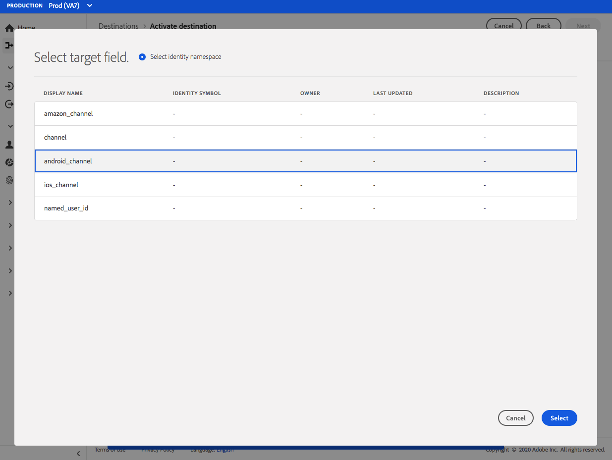
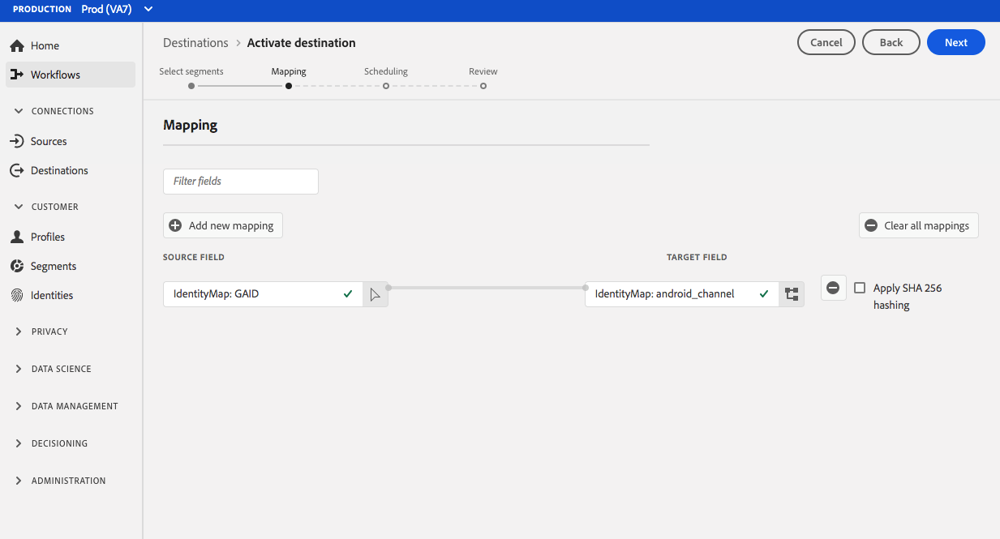

# [!DNL Airship Tags] connection {#airship-tags-destination}

## Overview

[!DNL Airship] is the leading Customer Engagement Platform, helping you deliver meaningful, personalized omnichannel messaging to your users at every stage of the customer lifecycle.

This integration passes Adobe Experience Platform audience data into [!DNL Airship] as [Tags](https://docs.airship.com/guides/audience/tags/) for targeting or triggering.

To learn more about [!DNL Airship], see the [Airship Docs](https://docs.airship.com).

>[!TIP]
>
>This destination connector and documentation page are created and maintained by the [!DNL Airship] team. For any inquiries or update requests, please contact them directly at [support.airship.com](https://support.airship.com/).

## Prerequisites

Before you can send your Adobe Experience Platform audiences to [!DNL Airship], you must:

* Create a tag group in your [!DNL Airship] project.
* Generate a bearer token for authentication.

>[!TIP]
> 
>Create an [!DNL Airship] account via [this signup link](https://go.airship.eu/accounts/register/plan/starter/) if you have not already.

## Supported audiences {#supported-audiences}

This section describes which types of audiences you can export to this destination.

| Audience origin | Supported | Description | 
---------|----------|----------|
| [!DNL Segmentation Service] | ✓ | Audiences generated through the Experience Platform [Segmentation Service](../../../segmentation/home.md).|
| Custom uploads | ✓ | Audiences [imported](../../../segmentation/ui/overview.md#import-audience) into Experience Platform from CSV files. |

{style="table-layout:auto"}

## Export type and frequency {#export-type-frequency}

Refer to the table below for information about the destination export type and frequency.

| Item | Type | Notes |
---------|----------|---------|
| Export type | **[!UICONTROL Audience export]** | You are exporting all members of an audience with the identifiers used in the Airship Tags destination.|
| Export frequency | **[!UICONTROL Streaming]** | Streaming destinations are "always on" API-based connections. As soon as a profile is updated in Experience Platform based on audience evaluation, the connector sends the update downstream to the destination platform. Read more about [streaming destinations](/help/destinations/destination-types.md#streaming-destinations).|

{style="table-layout:auto"}

## Tag groups

The concept of audiences in Adobe Experience Platorm is similar to [Tags](https://docs.airship.com/guides/audience/tags/) in Airship, with slight differences in implementation. This integration maps the status of a user's [membership in an Experience Platform segment](../../../xdm/field-groups/profile/segmentation.md) to the presence or non-presence of an [!DNL Airship] tag. For example, in a Platform audience where the `xdm:status` changes to `realized`, the tag is added to the [!DNL Airship] channel or named user this profile is mapped to. If the `xdm:status` changes to `exited`, the tag is removed.

To enable this integration, create a *tag group* in [!DNL Airship] named `adobe-segments`.

>[!IMPORTANT]
>
>When creating your new tag group **Do not check** the radio button that says "[!DNL Allow these tags to be set only from your server]". Doing so will make the Adobe tags integration fail.

See [Manage Tag Groups](https://docs.airship.com/tutorials/manage-project/messaging/tag-groups) for instructions on creating the tag group.

## Generate bearer token

Go to **[!UICONTROL Settings]** » **[!UICONTROL APIs & Integrations]** in the [Airship dashboard](https://go.airship.com) and select **[!UICONTROL Tokens]** in the left-hand menu.

Click **[!UICONTROL Create Token]**.

Provide a user-friendly name for your token, e.g., "Adobe Tags Destination", and select "All Access" for the role.

Click **[!UICONTROL Create Token]** and save the details as confidential.

## Use cases

To help you better understand how and when you should use the [!DNL Airship Tags] destination, here are sample use cases that Adobe Experience Platform customers can solve by using this destination.

### Use case #1

Retailers or entertainment platforms can create user profiles on their loyalty customers, and pass those audiences into [!DNL Airship] for message targeting on mobile campaigns.

### Use case #2

Trigger one-to-one messages in real time when users fall into or out of specific audiences within Adobe Experience Platform.

For example, a retailer sets up a jeans brand-specific audience in Platform. That retailer can now trigger a mobile message as soon as someone sets their jeans preference to a specific brand.

## Connect to the destination {#connect}

>[!IMPORTANT]
> 
>To connect to the destination, you need the **[!UICONTROL Manage Destinations]** [access control permission](/help/access-control/home.md#permissions). Read the [access control overview](/help/access-control/ui/overview.md) or contact your product administrator to obtain the required permissions.

To connect to this destination, follow the steps described in the [destination configuration tutorial](../../ui/connect-destination.md). In the configure destination workflow, fill in the fields listed in the two sections below.

### Authenticate to destination {#authenticate}

To authenticate to the destination, fill in the required fields and select **[!UICONTROL Connect to destination]**.

* **[!UICONTROL Bearer token]**: the bearer token that you generated from the [!DNL Airship] dashboard.

### Fill in destination details {#destination-details}

To configure details for the destination, fill in the required and optional fields below. An asterisk next to a field in the UI indicates that the field is required.

* **[!UICONTROL Name]**: enter a name that will help you identify this destination.
* **[!UICONTROL Description]**: enter a description for this destination.
* **[!UICONTROL Domain]**: select either a US or EU data center, depending on which [!DNL Airship] data center applies to this destination.

### Enable alerts {#enable-alerts}

You can enable alerts to receive notifications on the status of the dataflow to your destination. Select an alert from the list to subscribe to receive notifications on the status of your dataflow. For more information on alerts, see the guide on [subscribing to destinations alerts using the UI](../../ui/alerts.md).

When you are finished providing details for your destination connection, select **[!UICONTROL Next]**.

## Activate audiences to this destination {#activate}

>[!IMPORTANT]
> 
>To activate data, you need the **[!UICONTROL Manage Destinations]**, **[!UICONTROL Activate Destinations]**, **[!UICONTROL View Profiles]**, and **[!UICONTROL View Segments]** [access control permissions](/help/access-control/home.md#permissions). Read the [access control overview](/help/access-control/ui/overview.md) or contact your product administrator to obtain the required permissions.

See [Activate audience data to streaming audience export destinations](../../ui/activate-segment-streaming-destinations.md) for instructions on activating audiences to this destination.

## Mapping considerations {#mapping-considerations}

[!DNL Airship] tags can be set either on a channel, which represents device instance, e.g., iPhone, or a named user, which maps all of a user's devices to a common identifier such as a customer ID. If you have plain text (unhashed) email addresses as primary identity in your schema, select the email field in your **[!UICONTROL Source Attributes]** and map to the [!DNL Airship] named user in the right column under **[!UICONTROL Target Identities]**, as shown below.

For identifiers that should be mapped to a channel, i.e., a device, map to the appropriate channel based on the source. The following images show how to map a Google Advertising ID to an [!DNL Airship] Android channel. 

 
 

## Data usage and governance {#data-usage-governance}

All [!DNL Adobe Experience Platform] destinations are compliant with data usage policies when handling your data. For detailed information on how [!DNL Adobe Experience Platform] enforces data governance, see [Data Governance overview](../../../data-governance/home.md).
