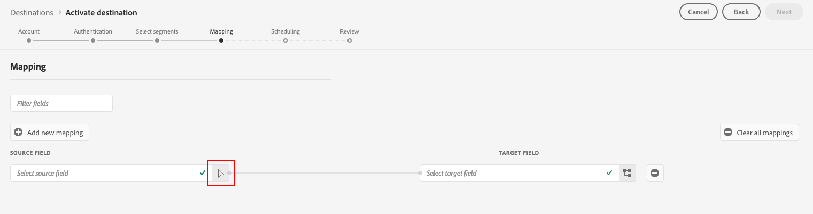
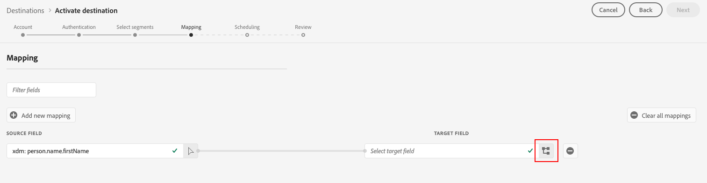
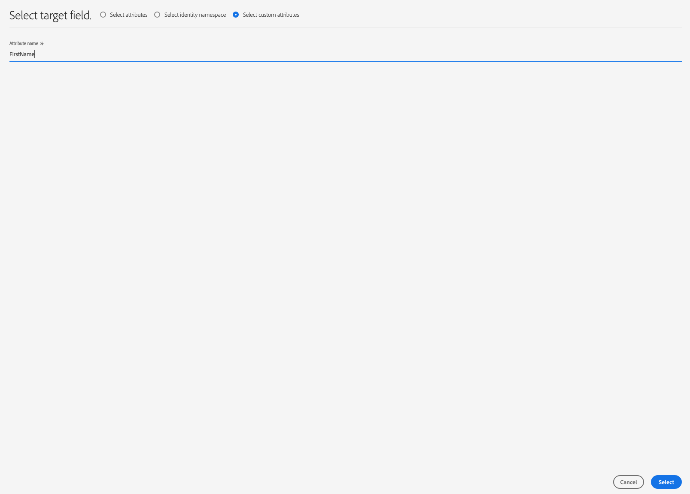

# [!DNL Braze] connection

## Overview {#overview}

The [!DNL Braze] destination helps you send profile data to [!DNL Braze].

[!DNL Braze] is a comprehensive customer engagement platform that powers relevant and memorable experiences between customers and the brands they love.

To send profile data to [!DNL Braze], you must first connect to the destination.

## Destination specifics {#specifics}

Note the following details that are specific to the [!DNL Braze] destination:

* [!DNL Adobe Experience Platform] segments are exported to [!DNL Braze] under the `AdobeExperiencePlatformSegments` attribute.

>[!NOTE]
>
>Keep in mind that sending additional custom attributes to [!DNL Braze] may cause increases in your [!DNL Braze] data point consumption. Please consult with your [!DNL Braze] account manager before sending additional custom attributes.

## Use cases {#use-cases}

As a marketer, I want to target users in a mobile engagement destination, with segments built in [!DNL Adobe Experience Platform]. Additionally, I want to deliver personalized experiences to them, based on attributes from their [!DNL Adobe Experience Platform] profiles, as soon as segments and profiles are updated in [!DNL Adobe Experience Platform].

## Supported identities {#supported-identities}

[!DNL Braze] supports the activation of identities described in the table below.

|Target Identity|Description|Considerations|
|---|---|---|
|external_id|Custom [!DNL Braze] identifier that supports mapping of any identity. |You can send any [identity](../../../identity-service/namespaces.md) to the [!DNL Braze] destination, as long as you map it to the [!DNL Braze] [`external_id`](https://www.braze.com/docs/api/basics/#external-user-id-explanation).|

{style="table-layout:auto"}

## Export type and frequency {#export-type-frequency}

Refer to the table below for information about the destination export type and frequency.

| Item | Type | Notes |
---------|----------|---------|
| Export type | **[!UICONTROL Profile-based]** | You are exporting all members of a segment, together with the desired schema fields (for example: email address, phone number, last name) and/or identities, according to your field mapping.[!DNL Adobe Experience Platform] segments are exported to [!DNL Braze] under the `AdobeExperiencePlatformSegments` attribute.|
| Export frequency | **[!UICONTROL Streaming]** | Streaming destinations are "always on" API-based connections. As soon as a profile is updated in Experience Platform based on segment evaluation, the connector sends the update downstream to the destination platform. Read more about [streaming destinations](/help/destinations/destination-types.md#streaming-destinations).|

{style="table-layout:auto"}

## Connect to the destination {#connect}

>[!IMPORTANT]
> 
>To connect to the destination, you need the **[!UICONTROL Manage Destinations]** [access control permission](/help/access-control/home.md#permissions). Read the [access control overview](/help/access-control/ui/overview.md) or contact your product administrator to obtain the required permissions.

To connect to this destination, follow the steps described in the [destination configuration tutorial](../../ui/connect-destination.md). In the configure destination workflow, fill in the fields listed in the two sections below.

### Authenticate to destination {#authenticate}

To authenticate to the destination, fill in the required fields and select **[!UICONTROL Connect to destination]**.

* **[!UICONTROL Braze account token]**: This is your [!DNL Braze] [!DNL API] key. You can find detailed instructions on how to obtain your [!DNL API] key here: [REST API Key Overview](https://www.braze.com/docs/api/api_key/).

### Fill in destination details {#destination-details}

To configure details for the destination, fill in the required and optional fields below. An asterisk next to a field in the UI indicates that the field is required.

* **[!UICONTROL Name]**: enter a name by which you will recognize this destination in the future.
* **[!UICONTROL Description]**: enter a description that will help you identify this destination in the future.
* **[!UICONTROL Endpoint Instance]**: ask your [!DNL Braze] representative which endpoint instance you should use.

### Enable alerts {#enable-alerts}

You can enable alerts to receive notifications on the status of the dataflow to your destination. Select an alert from the list to subscribe to receive notifications on the status of your dataflow. For more information on alerts, see the guide on [subscribing to destinations alerts using the UI](../../ui/alerts.md).

When you are finished providing details for your destination connection, select **[!UICONTROL Next]**.

## Activate segments to this destination {#activate}

>[!IMPORTANT]
> 
>To activate data, you need the **[!UICONTROL Manage Destinations]**, **[!UICONTROL Activate Destinations]**, **[!UICONTROL View Profiles]**, and **[!UICONTROL View Segments]** [access control permissions](/help/access-control/home.md#permissions). Read the [access control overview](/help/access-control/ui/overview.md) or contact your product administrator to obtain the required permissions.

See [Activate audience data to streaming segment export destinations](../../ui/activate-segment-streaming-destinations.md) for instructions on activating audience segments to this destination.

## Mapping considerations {#mapping-considerations}

To correctly send your audience data from [!DNL Adobe Experience Platform] to the [!DNL Braze] destination, you need to go through the field mapping step.

Mapping consists of creating a link between your [!DNL Experience Data Model] (XDM) schema fields in your [!DNL Platform] account, and their corresponding equivalents from the target destination.

To correctly map your XDM fields to the [!DNL Braze] destination fields, follow these steps:

In the [!UICONTROL Mapping] step, click **[!UICONTROL Add new mapping]**.
   

In the [!UICONTROL Source Field] section, click the arrow button next to the empty field.
   

In the [!UICONTROL Select source field] window, you can choose between two categories of XDM fields:
* [!UICONTROL Select attributes]: use this option to map a specific field from your XDM schema to a [!DNL Braze] attribute.

* [!UICONTROL Select identity namespace]: Use this option to map a [!DNL Platform] identity namespace to a [!DNL Braze] namespace.

Choose your source field, then click **[!UICONTROL Select]**.

In the [!UICONTROL Target Field] section, click the mapping icon to the right of the field.
   

In the [!UICONTROL Select target field] window, you can choose between two categories of target fields:
* [!UICONTROL Select identity namespace]: Use this option to map [!DNL Platform] identity namespaces to [!DNL Braze] identity namespaces.
* [!UICONTROL Select custom attributes]: Use this option to map XDM attributes to custom [!DNL Braze] attributes that you defined in your [!DNL Braze] account.   You can also use this option to rename existing XDM attributes into [!DNL Braze]. For instance, mapping a `lastName` XDM attribute to a custom `Last_Name` attribute in [!DNL Braze], will create the `Last_Name` attribute in [!DNL Braze], if it doesn't already exist, and map the `lastName` XDM attribute to it.
  

Choose your target field, then click **[!UICONTROL Select]**.

You should now see your field mapping in the list.
   

   
To add more mappings, repeat the previous steps.

## Mapping Example {#mapping-example}

Let's say your XDM profile schema and your [!DNL Braze] instance contain the following attributes and identities:

||XDM Profile Schema|[!DNL Braze] Instance|
|---|---|---|
|Attributes|<ul><li><code>person.name.firstName</code></li><li><code>person.name.lastName</code></li><li><code>mobilePhone.number</code></li></ul>|<ul><li><code>FirstName</code></li><li><code>LastName</code></li><li><code>PhoneNumber</code></li></ul>|
|Identities|<ul><li><code>Email</code></li><li><code>Google Ad ID (GAID)</code></li><li><code>Apple ID For Advertisers (IDFA)</code></li></ul>|<ul><li><code>external_id</code></li></ul>|

The correct mapping would look like this:

## Exported data {#exported-data}

To verify if data has been exported successfully to the [!DNL Braze] destination, check your [!DNL Braze] account. [!DNL Adobe Experience Platform] segments are exported to [!DNL Braze] under the `AdobeExperiencePlatformSegments` attribute.

## Data usage and governance {#data-usage-governance}

All [!DNL Adobe Experience Platform] destinations are compliant with data usage policies when handling your data. For detailed information on how [!DNL Adobe Experience Platform] enforces data governance, see [Data Governance overview](../../../data-governance/home.md).
