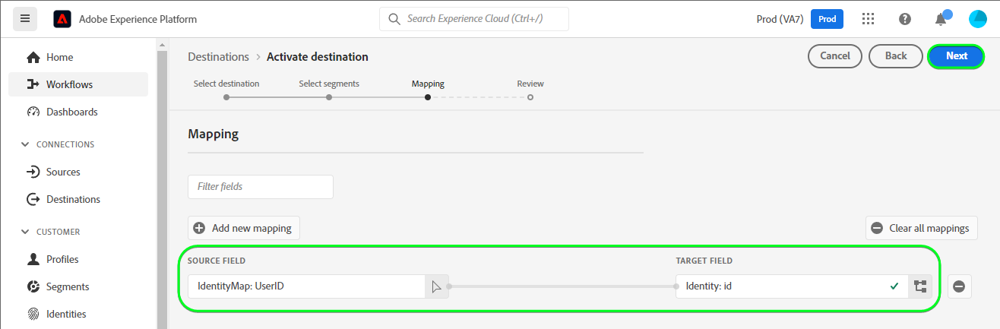

# [!DNL LINE] connection

## Overview {#overview}

[!DNL LINE](https://line.me/en/) is a popular communication platform that connects people, services and information and has grown from a chat app into a hub for entertainment, social and day-to-day activities.

This [!DNL Adobe Experience Platform] [destination](/help/destinations/home.md) leverages the [[!DNL LINE] Messaging API](https://developers.line.biz/en/reference/messaging-api/), add profiles to your segment and activate them as connections within [!DNL LINE] for your business needs.

[!DNL LINE] uses Bearer Tokens as the authentication mechanism to communicate with the [[!DNL LINE] Messaging API]. Instructions to authenticate to your [!DNL LINE] instance are further below, within [Authenticate to destination](#authenticate) section.

## Use cases {#use-cases}

As a marketer, I want to target users in a mobile engagement destination, with segments built in [!DNL Adobe Experience Platform]. Additionally, I want to deliver personalized experiences to them, based on attributes from their [!DNL Adobe Experience Platform] profiles, as soon as segments and profiles are updated in [!DNL Adobe Experience Platform].

## Prerequisites {#prerequisites}

### Experience Platform prerequisites {#prerequisites-in-experience-platform}

Before activating data to the [!DNL LINE] destination, you must have a [schema](/help/xdm/schema/composition.md), a [dataset](https://experienceleague.adobe.com/docs/platform-learn/tutorials/data-ingestion/create-datasets-and-ingest-data.html?lang=en), and [segments](https://experienceleague.adobe.com/docs/platform-learn/tutorials/segments/create-segments.html?lang=en) created in [!DNL Experience Platform].

Read [Activate profiles and segments to streaming segment export destinations](https://experienceleague.adobe.com/docs/experience-platform/destinations/ui/activate/activate-segment-streaming-destinations.html?lang=en) for instructions on activating audience segments to this destination.

### LINE prerequisites {#prerequisites-destination}

Note the following prerequisites in [!DNL LINE], in order to export data from Platform to your [!DNL LINE] account:

#### You need to have a LINE account {#prerequisites-account}

Go to the [!DNL LINE] [signup](https://account.line.biz/signup) page to register and create an account, if you do not have one already.

#### Gather the LINE channel access token (long-lived) from the LINE developer console {#gather-credentials}

* To allow Platform to access [!DNL LINE] resources you will need the *[!DNL Channel access token (long-lived)]* from the desired [!DNL LINE] *Messaging API* channel.
* Log in with your [!DNL LINE] account to the [[!DNL LINE] Developer console](https://developers.line.biz/console).
* Next, access the *[!DNL Providers]* list, then select the *[!DNL Provider]* of interest and finally select the *Messaging API* channel to access its settings.
    * If you are accessing the developer console for the first time please follow the [[!DNL LINE] documentation](https://developers.line.biz/en/docs/messaging-api/getting-started/) to complete the steps required to create a provider.
* Finally navigate to the ***[!DNL Channel access token]*** section and note down the ***[!DNL Channel access token (long-lived)]*** value required within [Authenticate to destination](#authenticate}) step.

| Credential | Description | Example |
| --- | --- | --- |
| `[!DNL Channel access token (long-lived)]` | Your [!DNL LINE Channel access token (long-lived)]. | `aaa2112XSMWqLXR7..........nyilFU=` |

Refer to the [[!DNL LINE] documentation](https://developers.line.biz/en/docs/messaging-api/getting-started/) for guidance.

## Supported identities {#supported-identities}

[!DNL LINE] supports update of identities described in the table below. Learn more about [identities](/help/identity-service/namespaces.md).

| Target Identity | Description | Considerations |
|---|---|---|
|GAID|Google Advertising ID|Select the GAID target identity when your source identity is a GAID namespace.|
|IDFA|Apple ID for Advertisers|Select the IDFA target identity when your source identity is an IDFA namespace.|
|UserID| Identifier for the LINE contact.|Select the UserID target identity when your source identity is UserID. |

## Export type and frequency {#export-type-frequency}

Refer to the table below for information about the destination export type and frequency.

| Item | Type | Notes |
---------|----------|---------|
| Export type | **[!UICONTROL Profile-based]** | You are exporting all members of a segment (audience) with the identifiers (name, phone number, or others) used in the [!DNL LINE] destination. |
| Export frequency | **[!UICONTROL Streaming]** | Streaming destinations are "always on" API-based connections. As soon as a profile is updated in Experience Platform based on segment evaluation, the connector sends the update downstream to the destination platform. Read more about [streaming destinations](/help/destinations/destination-types.md#streaming-destinations). |

{style="table-layout:auto"}

## Connect to the destination {#connect}

> [!IMPORTANT]
> 
> To connect to the destination, you need the **[!UICONTROL Manage Destinations]** [access control permission](/help/access-control/home.md#permissions). Read the [access control overview](/help/access-control/ui/overview.md) or contact your product administrator to obtain the required permissions.

To connect to this destination, follow the steps described in the [destination configuration tutorial](../../ui/connect-destination.md). In the configure destination workflow, fill in the fields listed in the two sections below.

Within **[!UICONTROL Destinations]** > **[!UICONTROL Catalog]** search for [!DNL LINE]. Alternatively you can locate it under the **[!UICONTROL Mobile engagement]** category.

### Authenticate to destination {#authenticate}

To authenticate to the destination, select **[!UICONTROL Connect to destination]**.

Fill in the required fields below.
* **[!UICONTROL Bearer token]**: Your [[!DNL LINE Channel access token (long-lived)] from the LINE developer console](#gather-credentials).

If the details provided are valid, the UI displays a **Connected** status with a green check mark. You can then proceed to the next step.

### Fill in destination details {#destination-details}

To configure details for the destination, fill in the required and optional fields below. An asterisk next to a field in the UI indicates that the field is required.

* **[!UICONTROL Name]**: A name by which you will recognize this destination in the future.
* **[!UICONTROL Description]**: A description that will help you identify this destination in the future.
* **[!UICONTROL Select Endpoint]**: One of Japan / Taiwan / Thailand, the selection depends on which region your Line account has been created.
* **[!UICONTROL Audience Type, Select true for IFA/GAID or false for UserID]**: Select *True* if you are using IFA / GAID or *False* if you are working with UserID.

### Enable alerts {#enable-alerts}

You can enable alerts to receive notifications on the status of the dataflow to your destination. Select an alert from the list to subscribe to receive notifications on the status of your dataflow. For more information on alerts, see the guide on [subscribing to destinations alerts using the UI](../../ui/alerts.md).

When you are finished providing details for your destination connection, select **[!UICONTROL Next]**.

## Activate segments to this destination {#activate}

> [!IMPORTANT]
> 
> To activate data, you need the **[!UICONTROL Manage Destinations]**, **[!UICONTROL Activate Destinations]**, **[!UICONTROL View Profiles]**, and **[!UICONTROL View Segments]** [access control permissions](/help/access-control/home.md#permissions). Read the [access control overview](/help/access-control/ui/overview.md) or contact your product administrator to obtain the required permissions.

Read [Activate profiles and segments to streaming segment export destinations](../../ui/activate/activate-segment-streaming-destinations.md) for instructions on activating audience segments to this destination.

### Map attributes and identities {#map}

To correctly send your audience data from Adobe Experience Platform to the [!DNL LINE] destination, you need to go through the field mapping step. Mapping consists of creating a link between your Experience Data Model (XDM) schema fields in your Platform account and their corresponding equivalents from the target destination. To correctly map your XDM fields to the [!DNL LINE] destination fields, follow these steps:

The following target identity namespace(s) must be mapped:
* **UserID** must be mapped as a target field using **Target field** > **[!UICONTROL Select identity namespace]** > **id**

* An example is shown below:

## Validate data export {#exported-data}

For each successful execution the [!DNL LINE] destination creates a new audience within [!DNL LINE] using the selected segments name.

To validate that you have correctly set up the destination, follow the steps below:

1. Log in to the [Manager console](https://manager.line.biz/).

1. Next, navigate to [!UICONTROL Data Controls] > [!UICONTROL Audiences] and check the name matching the selected segment within the [!UICONTROL Audience name] column.

1. The updated volume would match the count within the segment.

An example setup within [!DNL LINE] is shown below:

## Data usage and governance {#data-usage-governance}

All [!DNL Adobe Experience Platform] destinations are compliant with data usage policies when handling your data. For detailed information on how [!DNL Adobe Experience Platform] enforces data governance, see the [Data Governance overview](/help/data-governance/home.md).