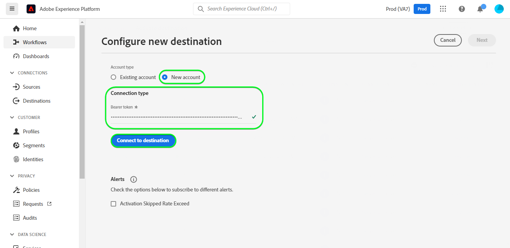
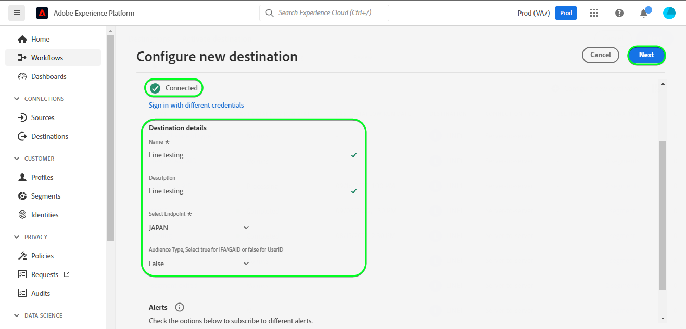
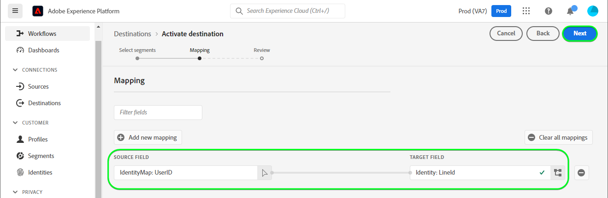
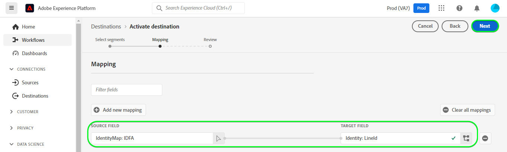
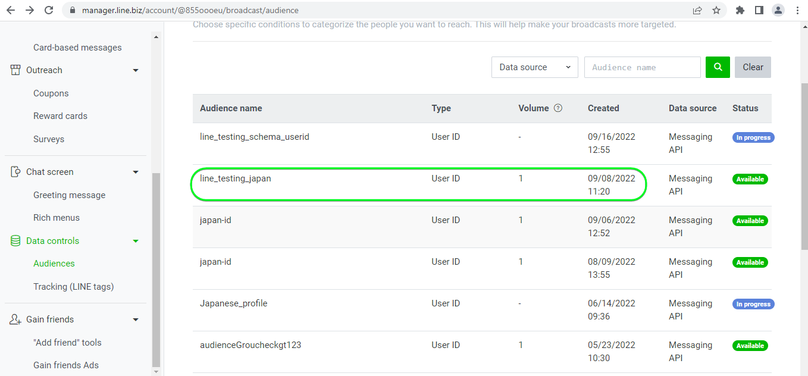

# [!DNL LINE] connection

## Overview {#overview}

[[!DNL LINE]](https://line.me/en/) is a popular communication platform that connects people, services and information and has grown from a chat app into a hub for entertainment, social, and day-to-day activities.

This [!DNL Adobe Experience Platform] [destination](/help/destinations/home.md) leverages the [[!DNL LINE] Messaging API](https://developers.line.biz/en/reference/messaging-api/). You can activate profiles from your Experience Platform audiences as connections within [!DNL LINE] for your business needs.

[!DNL LINE] uses Bearer Tokens as the authentication mechanism to communicate with the [!DNL LINE] Messaging API. Instructions to authenticate to your [!DNL LINE] instance are further below, within [Authenticate to destination](#authenticate) section.

## Use cases {#use-cases}

As a marketer, you can target users in a mobile engagement destination, with audiences built in [!DNL Adobe Experience Platform]. Additionally, you can deliver personalized experiences to them, based on attributes from their [!DNL Adobe Experience Platform] profiles, as soon as audiences and profiles are updated in [!DNL Adobe Experience Platform].

## Prerequisites {#prerequisites}

### [!DNL LINE] prerequisites {#prerequisites-destination}

Note the following prerequisites in [!DNL LINE], in order to export data from Platform to your [!DNL LINE] account:

#### You need to have a [!DNL LINE] account {#prerequisites-account}

You need to register and create a [!DNL LINE] account, if you do not have one already. To create an account:

1. Navigate to the [!DNL LINE] [acount login](https://account.line.biz/login?redirectUri=https%3A%2F%2Fmanager.line.biz%2F) page
2. Select **[!UICONTROL Create an account]**.

#### Gather the [!DNL LINE channel access token (long-lived)] from the [!DNL LINE] developer console {#gather-credentials}

To allow Platform to access [!DNL LINE] resources, you will need the *[!DNL Channel access token (long-lived)]* from the desired [!DNL LINE] *Messaging API* channel.

1. Log in with your [!DNL LINE] account to the [[!DNL LINE] Developer console](https://developers.line.biz/console).
1. Next, access the *[!DNL Providers]* list, then select the *[!DNL Provider]* of interest and finally select the *Messaging API* channel to access its settings. If you are accessing the developer console for the first time follow the [[!DNL LINE] documentation](https://developers.line.biz/en/docs/messaging-api/getting-started/) to complete the steps required to create a provider.
1. Finally, navigate to the ***[!DNL Channel access token]*** section and copy the ***[!DNL Channel access token (long-lived)]*** value required within [Authenticate to destination](#authenticate) step.

| Credential | Description | Example |
| --- | --- | --- |
| `[!DNL Channel access token (long-lived)]` | Your [!DNL LINE Channel access token (long-lived)]. | `aaa2112XSMWqLXR7..........nyilFU=` |

Refer to the [[!DNL LINE] documentation](https://developers.line.biz/en/docs/messaging-api/getting-started/) for guidance on creating a channel or adding a channel to your existing [!DNL LINE] account through the [!DNL LINE] developers console.

## Supported identities {#supported-identities}

[!DNL LINE] supports the update and export of identities described in the table below. Learn more about [identities](/help/identity-service/features/namespaces.md).

| Target Identity | Description |
|---|---|
|ID for Advertisers(IFAs)| Select the ID for Advertisers(IFAs) target identity when the source identities are IFA *(Apple ID for Advertisers)* or GAID *(Google Advertising ID) namespaces.|
|LINE User IDs| Select the UserID target identity when the source identities are LINE User IDs. |

## Export type and frequency {#export-type-frequency}

Refer to the table below for information about the destination export type and frequency.

| Item | Type | Notes |
---------|----------|---------|
| Export type | **[!UICONTROL Profile-based]** | You are exporting all members of an audience with the identifiers (name, phone number, or others) used in the [!DNL LINE] destination. |
| Export frequency | **[!UICONTROL Streaming]** | Streaming destinations are "always on" API-based connections. As soon as a profile is updated in Experience Platform based on audience evaluation, the connector sends the update downstream to the destination platform. Read more about [streaming destinations](/help/destinations/destination-types.md#streaming-destinations). |

{style="table-layout:auto"}

## Connect to the destination {#connect}

>[!IMPORTANT]
>
>To connect to the destination, you need the **[!UICONTROL View Destinations]** and **[!UICONTROL Manage Destinations]** [access control permissions](/help/access-control/home.md#permissions). Read the [access control overview](/help/access-control/ui/overview.md) or contact your product administrator to obtain the required permissions.

To connect to this destination, follow the steps described in the [destination configuration tutorial](../../ui/connect-destination.md). In the configure destination workflow, fill in the fields listed in the two sections below.

Within **[!UICONTROL Destinations]** > **[!UICONTROL Catalog]** search for [!DNL LINE]. Alternatively you can locate it under the **[!UICONTROL Mobile engagement]** category.

### Authenticate to destination {#authenticate}

To authenticate to the destination, select **[!UICONTROL Connect to destination]**.

Fill in the required fields below.
* **[!UICONTROL Bearer token]**: Your [!DNL LINE Channel access token (long-lived)] from the [!DNL LINE] developer console. Refer to the [gather credentials](#gather-credentials) section.

If the details provided are valid, the UI displays a **[!UICONTROL Connected]** status with a green check mark. You can then proceed to the next step.

### Fill in destination details {#destination-details}

To configure details for the destination, fill in the required and optional fields below. An asterisk next to a field in the UI indicates that the field is required.

* **[!UICONTROL Name]**: A name by which you will recognize this destination in the future.
* **[!UICONTROL Description]**: A description that will help you identify this destination in the future.
* **[!UICONTROL Audience Type]**: Select **[!UICONTROL ID for Advertisers(IFAs)]** if the identities you are looking to export are of type *ID for Advertisers(IFAs)*. Select **[!UICONTROL LINE user IDs]** if the identities you are looking to export are of type *LINE User IDs*. Refer to the [Supported identities](#supported-identities) section for more information about the identity types.

### Enable alerts {#enable-alerts}

You can enable alerts to receive notifications on the status of the dataflow to your destination. Select an alert from the list to subscribe to receive notifications on the status of your dataflow. For more information on alerts, see the guide on [subscribing to destinations alerts using the UI](../../ui/alerts.md).

When you are finished providing details for your destination connection, select **[!UICONTROL Next]**.

## Activate audiences to this destination {#activate}

>[!IMPORTANT]
> 
>* To activate data, you need the **[!UICONTROL View Destinations]**, **[!UICONTROL Activate Destinations]**, **[!UICONTROL View Profiles]**, and **[!UICONTROL View Segments]** [access control permissions](/help/access-control/home.md#permissions). Read the [access control overview](/help/access-control/ui/overview.md) or contact your product administrator to obtain the required permissions.
>* To export *identities*, you need the **[!UICONTROL View Identity Graph]** [access control permission](/help/access-control/home.md#permissions).   {width="100" zoomable="yes"}

Read [Activate profiles and audiences to streaming audience export destinations](/help/destinations/ui/activate-segment-streaming-destinations.md) for instructions on activating audiences to this destination.

### Map attributes and identities {#map}

To correctly send your audience data from Adobe Experience Platform to the [!DNL LINE] destination, you need to go through the field mapping step. Mapping consists of creating a link between your Experience Data Model (XDM) schema fields in your Platform account and their corresponding equivalents from the target destination. To correctly map your XDM fields to the [!DNL LINE] destination fields, follow these steps:

Depending on your source identity the following target identity namespace(s) must be mapped:
| Target Identity | Source Field | Target Field |
| --- | --- | --- |
| ID for Advertisers(IFAs) | `IDFA` or `GAID` | `LineId` |
| LINE user IDs | `UserID` | `LineId` |

If your target identities are *LINE user ID's* you will need the below:

If your target identity is *ID for Advertisers(IFAs)* you will need the below:

## Validate data export {#exported-data}

Upon a successful data export out of Experience Platform, the [!DNL LINE] destination creates a new audience within [!DNL LINE] using the selected audience name.

To validate that you have correctly set up the destination, follow the steps below:

1. In [!DNL LINE], log in to the [Manager console](https://manager.line.biz/).

1. Next, navigate to **[!UICONTROL Data Controls]** > **[!UICONTROL Audiences]** and check the name matching the selected audience within the **[!UICONTROL Audience name]** column.

1. The updated volume would match the count within the segment.

1. The *Type* column will mention **[!UICONTROL UserID]** if the identities you exported are of type *UserID*. Similarly, The *Type* column will mention **[!UICONTROL Mobile ad Id]** if the identities you exported are of type *IDFA*.

An example setup within [!DNL LINE] is shown below:

## Data usage and governance {#data-usage-governance}

All [!DNL Adobe Experience Platform] destinations are compliant with data usage policies when handling your data. For detailed information on how [!DNL Adobe Experience Platform] enforces data governance, see the [Data Governance overview](/help/data-governance/home.md).
