# [!DNL Moengage] connection

## Overview {#overview}

Use the [!DNL Moengage] destination to connect and map your Adobe data (user attributes, segments and events) to MoEngage in real-time. Customers can then act on this data, delivering personalized, targeted experiences.

With Adobe, the integration is very simple and intuitive. Simply take any Adobe user profile, and map it to a MoEngage user attribute.

>[!IMPORTANT]
>
>This destination connector and documentation page are created and maintained by the *Moengage* team. For any inquiries or update requests, please contact them directly at *`https://help.moengage.com/hc/en-us`.*

## Use cases {#use-cases}

A marketer wants to target a user segment (built in Adobe Experience Platform) via [!DNL Moengage] campaigns. Also, they want to personalize campaign content based on attributes from Adobe Experience Platform profiles. With this integration, users and attributes are updated in MoEngage as soon as segments and profiles are updated in Adobe Experience Platform.

## Prerequisites {#prerequisites}

Before you can send your Adobe Experience Platform data to [!DNL Moengage], note the following prerequisites:

* To use the MoEngage destination with Adobe Experience Platform, users must first have access to their [!DNL Moengage] Account. Visit the following page to sign up or login to your MoEngage account: https://app.moengage.com

## Supported identities {#supported-identities}

[!DNL Moengage] supports the activation of identities described in the table below.

|Target Identity| Description                                                                              | Considerations                                                                         |
|---|------------------------------------------------------------------------------------------|----------------------------------------------------------------------------------------|
|user_id| Unique identifier that uniquely identifies a user profile in the [!DNL Moengage] system. | This identifier supports string type. Either one of user_id or anonymous_id is required |
|anonymous_id| Another identifier for an unknown user profile - meaning a profile that does not exist in the system. | This identifier supports string type. Either one of user_id or anonymous_id is required  |

{style="table-layout:auto"}

## Export type and frequency {#export-type-frequency}

Refer to the table below for information about the destination export type and frequency.

| Item | Type | Notes                                                                                                                                                                                                                                                                                                                              |
---------|----------|------------------------------------------------------------------------------------------------------------------------------------------------------------------------------------------------------------------------------------------------------------------------------------------------------------------------------------|
| Export type | **[!UICONTROL Profile-based]** | You are exporting all members of a segment (audience) with the identifiers (user_id, anonymous_id) along with custom attributes defined by you exported to [!DNL Moengage].                                                                                                                                                        |
| Export frequency | **[!UICONTROL Streaming]** | Streaming destinations are "always on" API-based connections. As soon as a profile is updated in Experience Platform based on segment evaluation, the connector sends the update downstream to the destination platform. Read more about [streaming destinations](/help/destinations/destination-types.md#streaming-destinations). |

{style="table-layout:auto"}

## Connect to the destination {#connect}

>[!IMPORTANT]
> 
>To connect to the destination, you need the **[!UICONTROL Manage Destinations]** [access control permission](/help/access-control/home.md#permissions). Read the [access control overview](/help/access-control/ui/overview.md) or contact your product administrator to obtain the required permissions.

To connect to this destination, follow the steps described in the [destination configuration tutorial](../../ui/connect-destination.md). In the configure destination workflow, fill in the fields listed in the two sections below.

### Authenticate to destination {#authenticate}

To authenticate to the destination, fill in the required fields and select **[!UICONTROL Connect to destination]**.

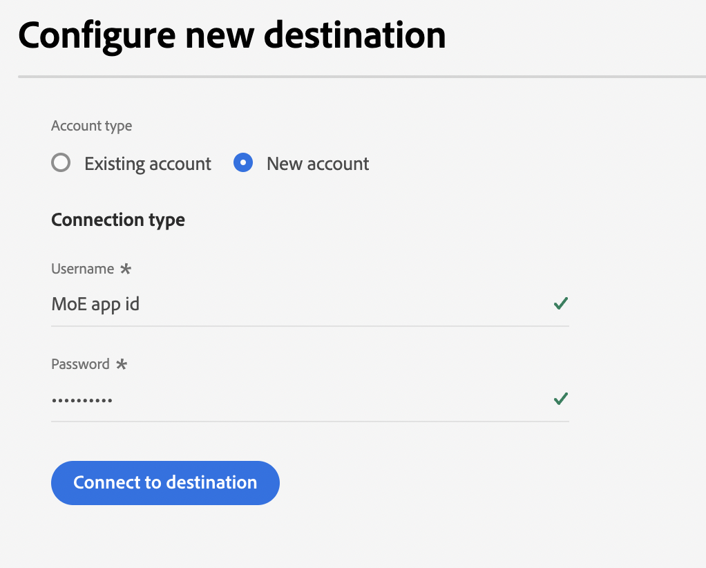

### Fill in destination details {#destination-details}

To configure details for the destination, fill in the required and optional fields below. An asterisk next to a field in the UI indicates that the field is required.
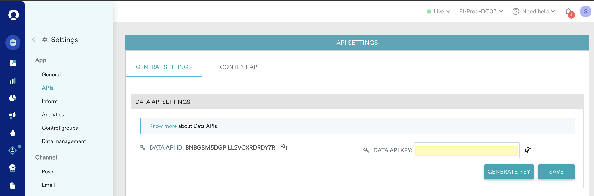
*  **[!UICONTROL USERNAME]**: DATA APP ID of  settings page of [!DNL Moengage] dashboard.
*  **[!UICONTROL PASSWORD]**: DATA APP KEY from settings page of [!DNL Moengage] dashboard.

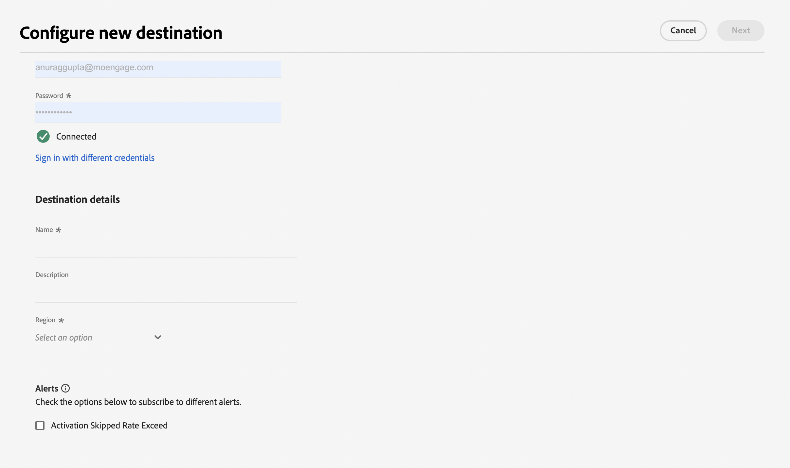

*  **[!UICONTROL Name]**: A name by which you will recognize this destination in the future.
*  **[!UICONTROL Description]**: A description that will help you identify this destination in the future.
*  **[!UICONTROL Region]**: Your app *data center*.

### Enable alerts {#enable-alerts}

You can enable alerts to receive notifications on the status of the dataflow to your destination. Select an alert from the list to subscribe to receive notifications on the status of your dataflow. For more information on alerts, see the guide on [subscribing to destinations alerts using the UI](../../ui/alerts.md).

When you are finished providing details for your destination connection, select **[!UICONTROL Next]**.

## Activate segments to this destination {#activate}

>[!IMPORTANT]
> 
>To activate data, you need the **[!UICONTROL Manage Destinations]**, **[!UICONTROL Activate Destinations]**, **[!UICONTROL View Profiles]**, and **[!UICONTROL View Segments]** [access control permissions](/help/access-control/home.md#permissions). Read the [access control overview](/help/access-control/ui/overview.md) or contact your product administrator to obtain the required permissions.

See [Activate audience data to streaming segment export destinations](../../ui/activate-segment-streaming-destinations.md) for instructions on activating audience segments to this destination.

### Map attributes and identities {#map}

To correctly send your audience data from [!DNL Adobe Experience Platform] to the [!DNL Moengage] destination, you need to go through the field mapping step.

Mapping consists of creating a link between your [!DNL Experience Data Model] (XDM) schema fields in your [!DNL Platform] account, and their corresponding equivalents from the target destination.

To correctly map your XDM fields to the [!DNL Moengage] destination fields, follow these steps:

In the [!UICONTROL Mapping] step, select **[!UICONTROL Checkbox]**.

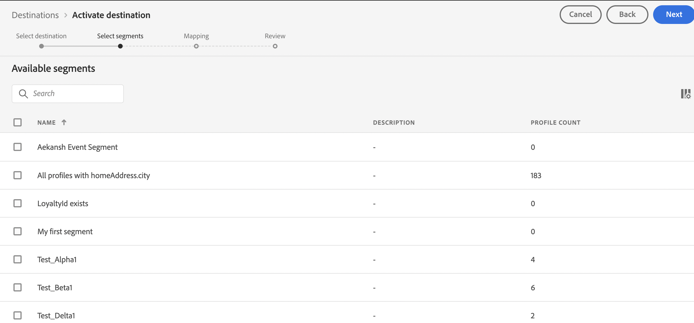

In the [!UICONTROL Mapping] step, select **[!UICONTROL Add new mapping]**.

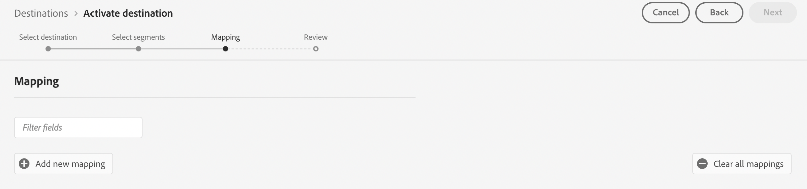

In the [!UICONTROL Source Field] section, select the arrow button next to the empty field.
   
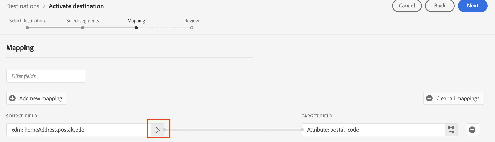

In the [!UICONTROL Select source field] window, you can choose between two categories of XDM fields:
* [!UICONTROL Select attributes]: use this option to map a specific field from your XDM schema to [!DNL Moengage] attribute.

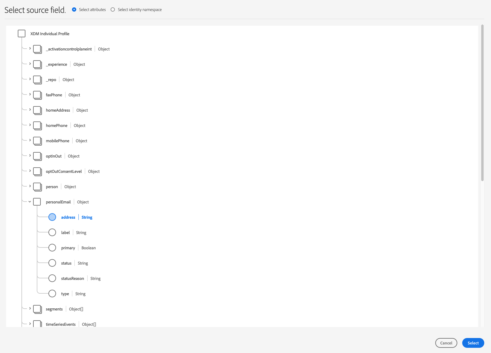

Choose your source field, then select **[!UICONTROL Select]**.

In the [!UICONTROL Target Field] section, select the mapping icon to the right of the field.
   
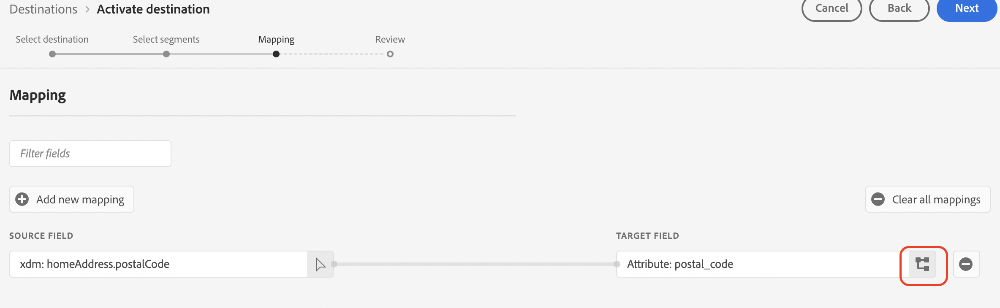

In the [!UICONTROL Select target field] window, you can choose between two categories of target fields:
* [!UICONTROL Select identity namespace]: Use this option to map [!DNL Platform] identity namespaces to [!DNL Moengage] identity namespaces.
* [!UICONTROL Select custom attributes]: Use this option to map XDM attributes to custom [!DNL Moengage] attributes that you defined in your [!DNL Moengage] account.   You can also use this option to rename existing XDM attributes into [!DNL Moengage]. For instance, mapping a `lastName` XDM attribute to a custom `Last_Name` attribute in [!DNL Moengage], will create the `Last_Name` attribute in [!DNL Moengage], if it doesn't already exist, and map the `lastName` XDM attribute to it.
  
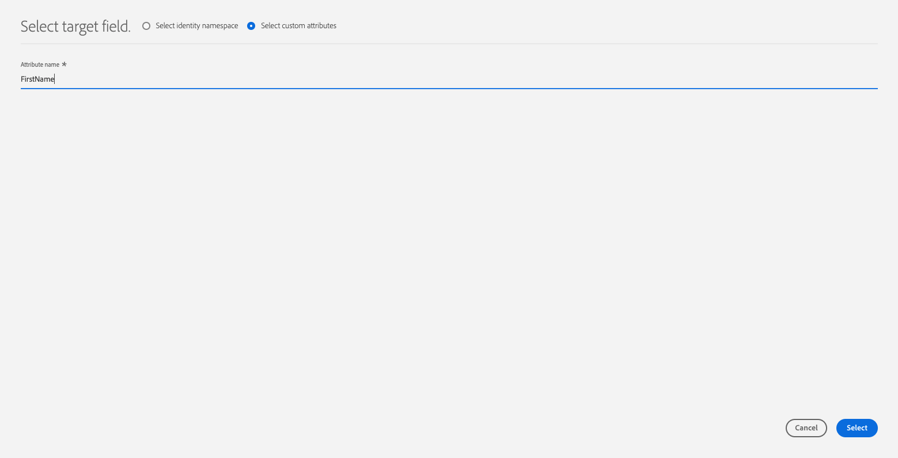

Choose your target field, then select **[!UICONTROL Select]**.

You should now see your field mapping in the list.

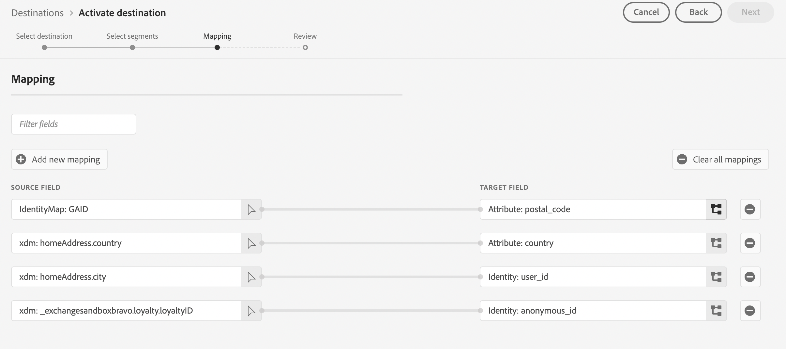
    
To add more mappings, repeat the previous steps.

## Exported data / Validate data export {#exported-data}

To verify if data has been exported successfully to the [!DNL Moengage] destination, go to the user profile on your [!DNL Moengage] account. You will see a user attribute called AEP Segment. 

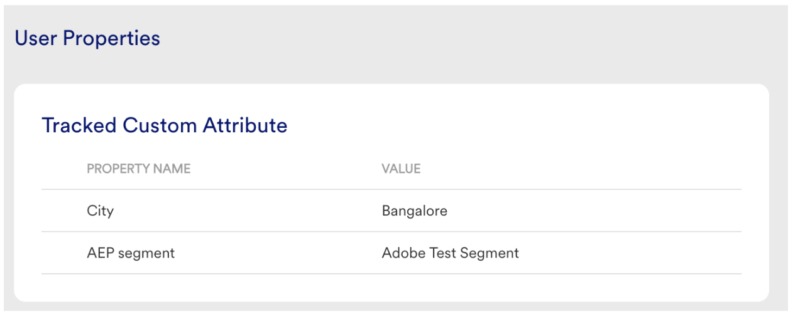

## Data usage and governance {#data-usage-governance}

All [!DNL Adobe Experience Platform] destinations are compliant with data usage policies when handling your data. For detailed information on how [!DNL Adobe Experience Platform] enforces data governance, read the [Data Governance overview](/help/data-governance/home.md).

