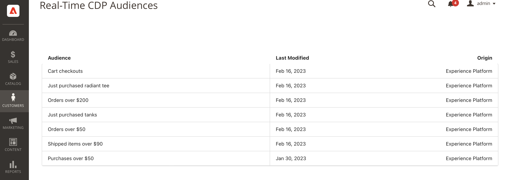

# Adobe Commerce Connection {#adobe-commerce}

## Overview {#overview}

The [!DNL Adobe Commerce] destination connector lets you select one or more Real-Time CDP audiences to activate to your [!DNL Adobe Commerce] account to deliver a dynamic personalized experience for your shoppers. Within [!DNL Adobe Commerce], you can then select those Real-Time CDP audiences to personalize unique offers in the cart such as 'buy 2 get 1 free,'. You can also display hero banners and modify product pricing through promotional offers, all customized to Adobe Real-Time CDP audiences.

## Prerequisites {#prerequisites}

This connector is available in the destinations catalog for customers who have purchased Real-Time CDP Prime or Ultimate and Adobe Commerce.

To use this destination connection, make sure that you have access to:

- [Adobe Experience Platform](https://experience.adobe.com/)
- [Adobe Developer Console](https://developer.adobe.com/developer-console/docs/guides/getting-started/). With access to the developer console, you can view service account and credential information that is needed to [complete the configuration](https://experienceleague.adobe.com/docs/commerce-admin/customers/customers-menu/audience-activation.html#configure-the-extension) of the extension in Adobe Commerce. 
- [Adobe Commerce Cloud version 2.4.4 or higher](https://business.adobe.com/products/magento/magento-commerce.html)

In Experience Platform, create the following:

- [Schema](../../../xdm/schema/composition.md). The schema you create represents the data you plan to ingest from Adobe Commerce. [Learn more](https://experienceleague.adobe.com/docs/commerce-merchant-services/data-connection/fundamentals/update-xdm.html) about how to create a schema that contains Commerce-specific field groups.
- [Dataset](../../../catalog/datasets/user-guide.md#create). A dataset is a storage and management construct for a collection of data. You create this dataset from the schema that you created above.
- [Datastream](../../../datastreams/overview.md#create). ID that allows data to flow from Adobe Experience Platform to other Adobe DX products. This ID must be associated to a specific website within your specific Adobe Commerce instance. When you create this datastream, specify the XDM schema you created above.

After you complete the prerequisites, connect to the [!DNL Commerce] destination.

## Connect to the destination {#connect}

>[!IMPORTANT]
> 
>To connect to the destination, you need the **[!UICONTROL View Destinations]** and **[!UICONTROL Manage Destinations]** [access control permissions](/help/access-control/home.md#permissions). Read the [access control overview](/help/access-control/ui/overview.md) or contact your product administrator to obtain the required permissions.

To connect to the [!DNL Adobe Commerce] destination:

1. In the [Platform interface](https://experience.adobe.com/platform/), go to **[!UICONTROL Destinations]** > **[!UICONTROL Catalog]**.
1. Select **[!UICONTROL Personalization]**.
1. Select the Adobe Commerce destination to highlight it, then select **[!UICONTROL Set up]**.
1. Follow the steps described in the [destination configuration tutorial](../../ui/connect-destination.md).

### Connection parameters {#parameters}

While [setting up](../../ui/connect-destination.md) this destination, you must provide the following information:

-  **[!UICONTROL Name]**: Fill in the preferred name for this destination.
-  **[!UICONTROL Description]**: Enter a description for your destination. For example, you can mention which campaign you are using this destination for. This field is optional.
-  **[!UICONTROL Integration alias]**: This value is sent to the Experience Platform Web SDK as a JSON object name. 
-  **[!UICONTROL Datastream ID]**: This determines which Data Collection datastream contains the audiences that are included in the response to the page. The drop-down menu shows only datastreams that have the destination configuration enabled. See [Configuring a datastream](../../../datastreams/overview.md) for more details.

### Enable alerts {#enable-alerts}

You can enable alerts to receive notifications on the status of the dataflow to your destination. Select an alert from the list to subscribe to receive notifications on the status of your dataflow. For more information on alerts, see the guide on [subscribing to destinations alerts using the UI](../../ui/alerts.md).

When you are finished providing details for your destination connection, select **[!UICONTROL Next]**.

## Activate audiences to the [!DNL Commerce] destination {#activate}

>[!IMPORTANT]
> 
>To activate data, you need the **[!UICONTROL View Destinations]**, **[!UICONTROL Activate Destinations]**, **[!UICONTROL View Profiles]**, and **[!UICONTROL View Segments]** [access control permissions](/help/access-control/home.md#permissions). Read the [access control overview](/help/access-control/ui/overview.md) or contact your product administrator to obtain the required permissions.

Read [Activate profiles and audiences to profile request destinations](../../ui/activate-edge-personalization-destinations.md) for instructions on activating audiences to the [!DNL Commerce] destination.

## Next steps in [!DNL Adobe Commerce]

Now that you have configured the [!DNL Commerce] destination within Experience Platform, you need to install the [!DNL Audience Activation] extension in [!DNL Commerce] and configure the [!DNL Commerce Admin] to import the Real-Time CDP audiences you created. See the [[!DNL Commerce] documentation](https://experienceleague.adobe.com/docs/commerce-admin/customers/customers-menu/audience-activation.html) to learn more.

## Validate audience activation in Commerce {#exported-data}

After you activate Real-Time CDP audiences to your [!DNL Adobe Commerce] account, you will see those audiences available when you go to the _Admin_ sidebar, then go to **[!UICONTROL Customers]** > **[!UICONTROL Real-Time CDP Audience]**.

## Data usage and governance {#data-usage-governance}

All [!DNL Adobe Experience Platform] destinations are compliant with data usage policies when handling your data. For detailed information on how [!DNL Adobe Experience Platform] enforces data governance, read the [Data Governance overview](/help/data-governance/home.md).
