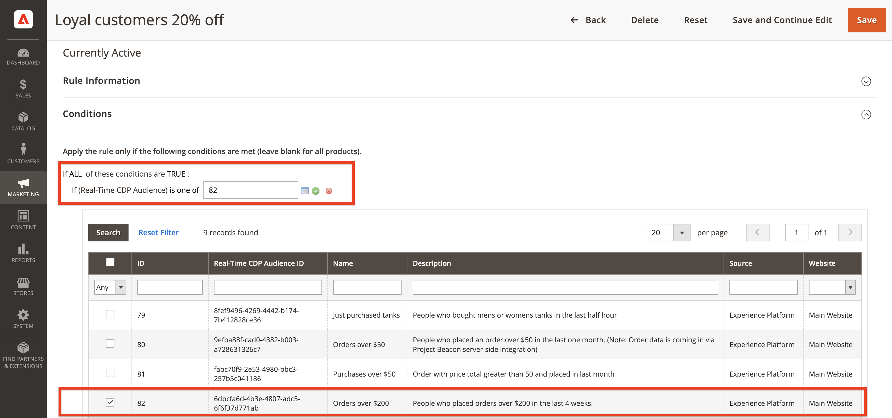

# (Beta) Adobe Commerce connection {#adobe-commerce}

## Overview {#overview}

>[!IMPORTANT]
> 
>The **[!UICONTROL Adobe Commerce]** connector is in beta and only available to a select number of customers.

The Adobe Commerce destination connector lets you select one or more Experience Platform segments to activate to your Adobe Commerce account to deliver a dynamic personalized experience for your shoppers. Within Adobe Commerce, you can then select those Adobe Experience Platform segments to personalize unique offers in the cart such as 'buy 2 get 1 free,'. You also can display hero banners and modify product pricing through promotional offers, all customized to Adobe Experience Platform segments.

<!--## Use cases {#use-cases}

To help you better understand how and when you should use the *YourDestination* destination, here are sample use cases that Adobe Experience Platform customers can solve by using this destination.

### Use case #1 {#use-case-1}

*For mobile messaging platforms:*

*A home rental and sales platform wants to push mobile notifications to customers' Android and iOS devices to let them know that there are 100 updated listings in the area where they previously searched for a rental.*

### Use case #2 {#use-case-2}

*For social network platforms:*

*An athletic apparel brand wants to reach existing customers through their social media accounts. The apparel brand can ingest email addresses from their own CRM to Adobe Experience Platform, build segments from their own offline data, and send these segments to YourDestination, to display ads in their customers' social media feeds.*-->

## Prerequisites {#prerequisites}

This extension is available in the Destinations catalog for select beta customers who have purchased Real-time CDP Prime or Ultimate and Adobe Commerce.

Beta customers should have access to:

- [Adobe Experience Platform](https://experience.adobe.com/)
- [Adobe Developer Console](https://developer.adobe.com/developer-console/docs/guides/getting-started/)
- [Adobe Commerce Cloud version 2.4.3 or higher](https://business.adobe.com/products/magento/magento-commerce.html)

In Experience Platform, create the following:

- [Schema](https://experienceleague.adobe.com/docs/experience-platform/xdm/schema/composition.html). The schema you create represents the data you plan to ingest from Adobe Commerce. [Learn more](https://experienceleague.adobe.com/docs/commerce-merchant-services/experience-platform-connector/fundamentals/update-xdm.html) about how to create a schema that contains Commerce-specific field groups.
- [Dataset](https://experienceleague.adobe.com/docs/experience-platform/catalog/datasets/user-guide.html#create). A dataset is a storage and management construct for a collection of data. You need to create this dataset from the schema you created above.
- [Datastream](https://experienceleague.adobe.com/docs/experience-platform/edge/datastreams/overview.html#create). ID that allows data to flow from Adobe Experience Platform to other Adobe DX products. This ID must be associated to a specific website within your specific Adobe Commerce instance. When you create this datastream, specify the XDM schema you created above.

After you complete the prerequisits, connect to the Commerce destination.

## Connect to the destination {#connect}

>[!IMPORTANT]
> 
>To connect to the destination, you need the **[!UICONTROL Manage Destinations]** [access control permission](/help/access-control/home.md#permissions). Read the [access control overview](/help/access-control/ui/overview.md) or contact your product administrator to obtain the required permissions.

To connect to the Adobe Commerce destination:

1. In the [Platform interface](https://experience.adobe.com/platform/), go to **[!UICONTROL Destinations]** > **[!UICONTROL Catalog]**.
1. Select **[!UICONTROL Personalization]**.
1. Select the Adobe Commerce destination to highlight it, then select **[!UICONTROL Set up]**.
1. Follow the steps described in the [destination configuration tutorial](../../ui/connect-destination.md).

### Connection parameters {#parameters}

While [setting up](../../ui/connect-destination.md) this destination, you must provide the following information:

-  **[!UICONTROL Name]**: Fill in the preferred name for this destination.
-  **[!UICONTROL Description]**: Enter a description for your destination. For example, you can mention which campaign you are using this destination for. This field is optional.
-  **[!UICONTROL Integration alias]**: This value is sent to the Experience Platform Web SDK as a JSON object name. 
-  **[!UICONTROL Datastream ID]**: This determines in which Data Collection datastream the segments will be included in the response to the page. The drop-down menu shows only datastreams that have the destination configuration enabled. See [Configuring a datastream](../../../edge/datastreams/overview.md) for more details.

### Enable alerts {#enable-alerts}

You can enable alerts to receive notifications on the status of the dataflow to your destination. Select an alert from the list to subscribe to receive notifications on the status of your dataflow. For more information on alerts, see the guide on [subscribing to destinations alerts using the UI](../../ui/alerts.md).

When you are finished providing details for your destination connection, select **[!UICONTROL Next]**.

## Activate segments to the Commerce destination {#activate}

>[!IMPORTANT]
> 
>To activate data, you need the **[!UICONTROL Manage Destinations]**, **[!UICONTROL Activate Destinations]**, **[!UICONTROL View Profiles]**, and **[!UICONTROL View Segments]** [access control permissions](/help/access-control/home.md#permissions). Read the [access control overview](/help/access-control/ui/overview.md) or contact your product administrator to obtain the required permissions.

Read [Activate profiles and segments to profile request destinations](../../ui/activate-profile-request-destinations.md) for instructions on activating audience segments to the Commerce destination.

## Next steps in Adobe Commerce

Now that you have configured the Commerce destination within Experience Platform, you need to configure the Commerce Admin to import the Real-time CDP segments you created. See the [Commerce documentation](https://docs.magento.com/user-guide/marketing/customer-segment-rtcdp.html) to learn more.

## Validate data export {#exported-data}

After you activate Real-Time CDP segments to your Adobe Commerce account, you will see those segments available in the Admin when you create a Cart Price Rule:

## Data usage and governance {#data-usage-governance}

All [!DNL Adobe Experience Platform] destinations are compliant with data usage policies when handling your data. For detailed information on how [!DNL Adobe Experience Platform] enforces data governance, read the [Data Governance overview](/help/data-governance/home.md).
