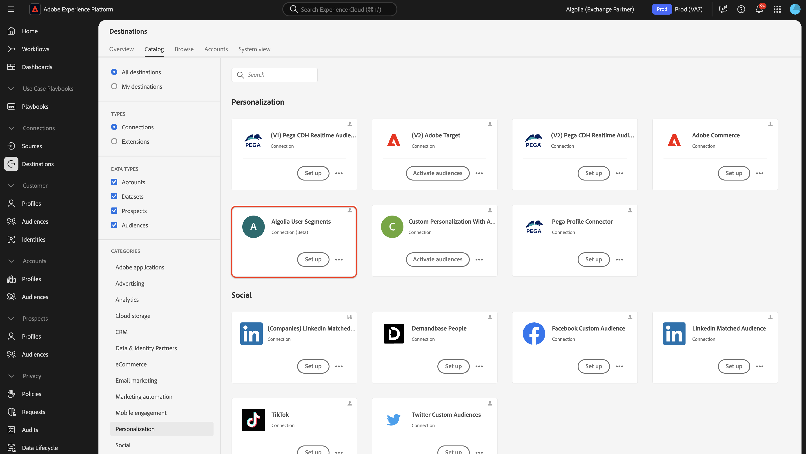

# [!DNL Algolia User Segments] destination connection

>[!NOTE]
>
>The [!DNL Algolia User Segments] destination connector and documentation page are created and maintained by the Algolia Integration Services team. For any inquiries or update requests, please contact them directly at adobe-algolia-solutions@algolia.com.

## Overview {#overview}

Use the [!DNL Algolia User Segments] connector to send Adobe Experience Platform audiences to Algolia to personalize search and recommendations. This requires the use of the [!DNL Algolia User Profiles] source connector to pull user profiles from Algolia to help build rich audiences.

This tutorial provides steps to create an [!DNL Algolia User Segments] destination connection and dataflow using the Adobe Experience Platform user interface. This connector is used to deliver audiences and user ids to Algolia.

## Use cases {#use-cases}

To help you better understand how and when you should use the [!DNL Algolia User Segments] destination, here are sample use cases that Adobe Experience Platform customers can solve by using this destination.

### Personalization Consistency {#personalization-consistency}

This connector should be used by marketing professionals aiming to deliver a consistent personalization across the site from home page to search.  

For example, as a marketer, you might want to build rich audiences from multiple user data source include Algolia that can be share with variaus channels to targeting strategies, leading to a boost in campaign personalization and conversion.

The use case is executed through a combination of both destination and source connectors.

You would start by importing your existing [!DNL Algolia] user profiles into Adobe Experience Platform Real-time CDP and other sources to start the creation of rich audiences source connector. Marketer would create audience using the profile data that can be sent to Algolia for search and recommendation personalization.

The customer would then use the corresponding [Algolia User Profiles](/help/sources/connectors/data-partners/algolia-user-profiles.md) source to ingest and augment customer profiles back into Adobe Real-Time CDP.

## Prerequisites {#prerequisites}

>[!IMPORTANT]
>
>* To connect to the destination, you need the **[!UICONTROL View Destinations]** and **[!UICONTROL Manage Destinations]**, **[!UICONTROL Activate Destinations]**, **[!UICONTROL View Profiles]**, and **[!UICONTROL View Segments]** [access control permissions](/help/access-control/home.md#permissions). Read the [access control overview](/help/access-control/ui/overview.md) or contact your product administrator to obtain the required permissions.
>* To export *identities*, you need the **[!UICONTROL View Identity Graph]** [access control permission](/help/access-control/home.md#permissions).   {width="100" zoomable="yes"}

## Supported audiences {#supported-audiences}

This section describes which type of audiences you can export to this destination.

| Audience origin             | Supported | Description                                                                                                         | 
|-----------------------------|-----------|---------------------------------------------------------------------------------------------------------------------|
| [!DNL Segmentation Service] | ✓         | Audiences generated through the Experience Platform [Segmentation Service](../../../segmentation/home.md).          |

{style="table-layout:auto"}

## Export type and frequency {#export-type-frequency}

Refer to the table below for information about the destination export type and frequency.

| Item | Type | Notes |
|---------|----------|---------|
| Export type | **[!DNL Profile request]** | You are requesting all the audiences that are mapped in the Algolia User Segments destination for a single profile.|
| Export frequency | **[!UICONTROL Streaming]** | Streaming destinations are "always on" API-based connections. As soon as a profile is updated in Experience Platform based on audience evaluation, the connector sends the update downstream to the destination platform. Read more about [streaming destinations](/help/destinations/destination-types.md#streaming-destinations).|

{style="table-layout:auto"}

## Connect to the destination {#connect}

>[!IMPORTANT]
>
>To connect to the destination, you need the **[!UICONTROL View Destinations]** and **[!UICONTROL Manage and Activate Dataset Destinations]** [access control permissions](/help/access-control/home.md#permissions). Read the [access control overview](/help/access-control/ui/overview.md) or contact your product administrator to obtain the required permissions.

To connect to this destination, follow the steps described in the [destination configuration tutorial](../../ui/connect-destination.md). In the destination configuration workflow, fill in the fields listed in the two sections below.

### Authenticate to destination {#authenticate}

To authenticate to the destination, fill in the required fields and select **[!UICONTROL Connect to destination]**.

### New Account

| Credential | Description |
| --- | --- |
| Application ID | The [!DNL Algolia] application ID is a unique identifier assigned to your [!DNL Algolia] account.   |
| API Key | The [!DNL Algolia] API Key is a credential used to authenticate and authorize API requests to [!DNL Algolia]'s search and indexing services. |

For more information on these credentials, see the [!DNL Algolia] [authentication documentation](https://www.algolia.com/doc/tools/cli/get-started/authentication/).

After connection to destinatino is successful, enter the below information to complete the Account creation.

| Credential | Description |
| --- | --- |
| Name | Fill in the preferred name for this destination. |
| Description | Short explanation of the destination's purpose. |
| Region | The options are **US** or **EU**.  Select the region where the customers data is stored |

### Existing Account

Accounts already defined using the [!DNL Algolia User Segments] destination appear in a list pop-up. When selected, you can see details on the account in the right rail. View the example from the UI, when you navigate to **[!UICONTROL Destinations]** > **[!UICONTROL Accounts]**;

#### Enable alerts {#enable-alerts}

You can enable alerts to receive notifications on the status of the dataflow to your destination. Select an alert from the list to subscribe to receive notifications on the status of your dataflow. For more information on alerts, see the guide on [subscribing to destinations alerts using the UI](../../ui/alerts.md).

When you are finished providing details for your destination connection, select **[!UICONTROL Next]**.

### Data usage and governance {#governance}

All [!DNL Adobe Experience Platform] destinations are compliant with data usage policies when handling your data. For detailed information on how [!DNL Adobe Experience Platform] enforces data governance, read the [Data Governance overview](https://experienceleague.adobe.com/docs/experience-platform/data-governance/home.html).

## Activate audiences to this destination {#activate}

>[!IMPORTANT]
> 
>To activate data, you need the **[!UICONTROL View Destinations]**, **[!UICONTROL Activate Destinations]**, **[!UICONTROL View Profiles]**, and **[!UICONTROL View Segments]** [access control permissions](/help/access-control/home.md#permissions). Read the [access control overview](/help/access-control/ui/overview.md) or contact your product administrator to obtain the required permissions.

Read [Activate audiences to edge personalization destinations](../../ui/activate-edge-personalization-destinations.md) for instructions on activating audiences to this destination.

### Mapping suggestions

Mapping suggestions are provided in the table below listing attributes on your destination side that are used by Algolia.

| Target Field | Source Description                                          |
|--------------|-------------------------------------------------------------|
| userId         | The `IdentityMap: AlgoliaUserToken` value in Experience Platform.   |

>[!NOTE]
>
>It is preferred to use the [!DNL Algolia User Token] identity as the source field.  If this has not been done, then you can select `userToken` in the Algolia Profile Details JSON structure. 

## Validate data export {#exported-data}

To verify if audiences have been exported to the user profiles successfully, check your [!DNL Algolia] dashboard and navigate to **[!UICONTROL Advanced Personalization]** and click on **[!UICONTROL User Inspector]**.  Find a user profile associated to the exported Adobe Experience Platform audience and search for it in the User Inspector.  You will see the audience id in the segment section.

## Next steps

By following this tutorial, you have successfully created a dataflow to export audiences from Experience Platform to your [!DNL Algolia] application.
