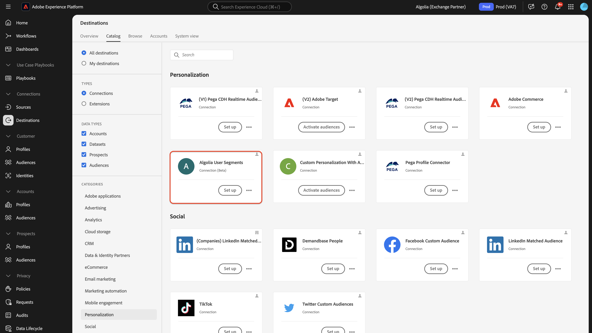
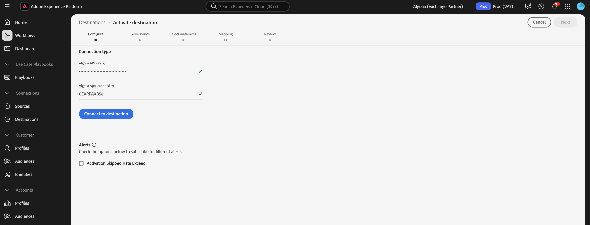
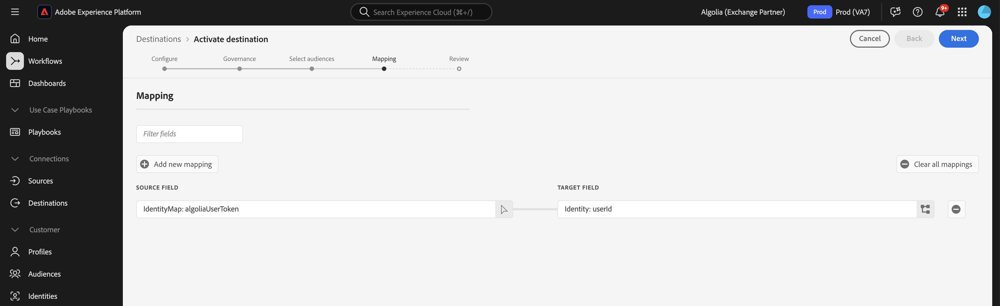
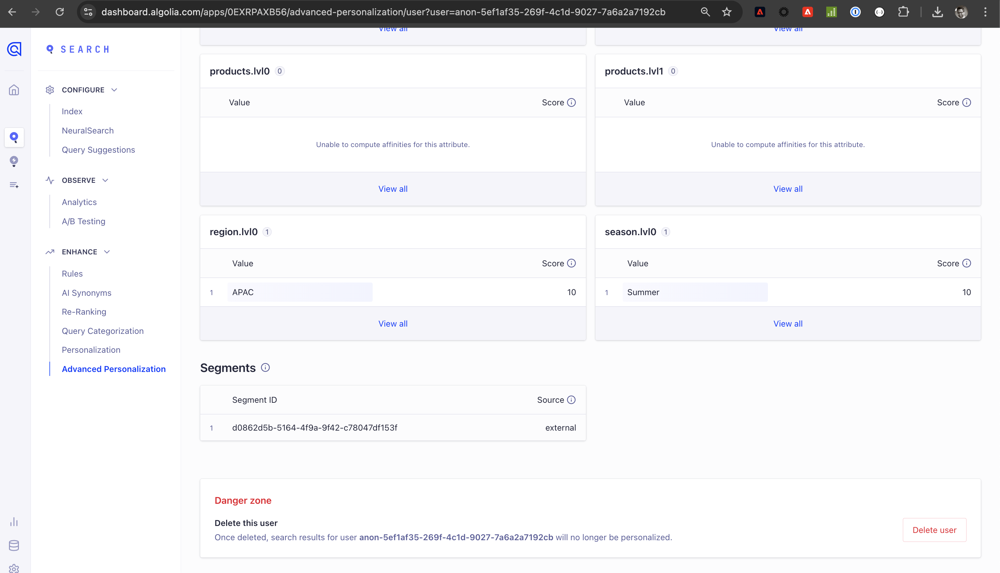

# [!DNL Algolia] connection

## Overview {#overview}

>[!IMPORTANT]
>
>The [!DNL Algolia] destination connector and documentation page are created and maintained by the Algolia Integration Services team. For inquiries or update requests, contact them at [adobe-algolia-solutions@algolia.com](mailto:adobe-algolia-solutions@algolia.com).

Use the [!DNL Algolia] destination connection to send Adobe Experience Platform audiences to Algolia for personalized search and recommendations. Before you can use the [!DNL Algolia] destination connector, you must first set up the [[!DNL Algolia User Profiles]](/help/sources/connectors/data-partners/algolia-user-profiles.md) source connector. During the source connector setup tutorial, you will create the Algolia User Token identity. This identity is required for mapping when you configure the destination connector.

This tutorial provides steps to create an [!DNL Algolia] destination connection and dataflow using the Adobe Experience Platform user interface.

## Use cases {#use-cases}

To help you better understand how and when you should use the [!DNL Algolia] destination, here are sample use cases that Adobe Experience Platform customers can solve by using this destination.

### Personalization consistency {#personalization-consistency}

Use this destination connector to deliver a consistent personalization across your site from home page to search.  

For example, as a marketer, you might want to build rich audiences in Adobe Experience Platform from multiple user data sources, including Algolia. You can use the [!DNL Algolia] destination connector to share the audiences for targeting strategies, leading to a boost in campaign personalization and conversion.

To implement this use case, you must use both the [[!DNL Algolia User Profiles]](/help/sources/connectors/data-partners/algolia-user-profiles.md) source and [!DNL Algolia] destination connectors.

You would start by importing your existing [!DNL Algolia] user profiles into Adobe Experience Platform Real-Time CDP and other sources to begin creating rich audiences with the source connector. Marketers would create audiences using the profile data that can be sent to Algolia for search and recommendation personalization.

Then, use the corresponding [[!DNL Algolia User Profiles]](/help/sources/connectors/data-partners/algolia-user-profiles.md) source connector to ingest and augment customer profiles back into Real-Time CDP.

## Prerequisites {#prerequisites}

>[!IMPORTANT]
>
>* To connect to the destination, you need the **[!UICONTROL View Destinations]** and **[!UICONTROL Manage Destinations]**, **[!UICONTROL Activate Destinations]**, **[!UICONTROL View Profiles]**, and **[!UICONTROL View Segments]** [access control permissions](/help/access-control/home.md#permissions). Read the [access control overview](/help/access-control/ui/overview.md) or contact your product administrator to obtain the required permissions.
>* To export *identities*, you need the **[!UICONTROL View Identity Graph]** [access control permission](/help/access-control/home.md#permissions).   {width="100" zoomable="yes"}

## Supported identities {#supported-identities}

[!DNL Algolia] supports the activation of identities described in the table below. Learn more about [identities](https://experienceleague.adobe.com/en/docs/experience-platform/identity/features/namespaces).

| Target Identity | Description | Considerations |
|---------|---------|----------|
| userId | [!DNL Algolia] user token | Select this target identity to map the `AlgoliaUserToken` source identity to the `userToken` in the [!DNL Algolia] platform. |

{style="table-layout:auto"}

## Supported audiences {#supported-audiences}

This section describes which type of audiences you can export to this destination.

| Audience origin | Supported | Description |
|---------|---------|----------|
| [!DNL Segmentation Service] | ✓ | Audiences generated through the Experience Platform [Segmentation Service](../../../segmentation/home.md). |
| Custom uploads | ✓ | Audiences [imported](../../../segmentation/ui/audience-portal.md#import-audience) into Experience Platform from CSV files. |

{style="table-layout:auto"}

## Export type and frequency {#export-type-frequency}

Refer to the table below for information about the destination export type and frequency.

| Item | Type | Notes |
|---------|----------|---------|
| Export type | **[!DNL Audience export]** | You are exporting all members of an audience with the identifiers (name, phone number, or others) used in the [!DNL Algolia] destination. |
| Export frequency | **[!UICONTROL Streaming]** | Streaming destinations are "always on" API-based connections. As soon as a profile is updated in Experience Platform based on audience evaluation, the connector sends the update downstream to the destination platform. Read more about [streaming destinations](/help/destinations/destination-types.md#streaming-destinations).|

{style="table-layout:auto"}

## Connect to the destination {#connect}

>[!IMPORTANT]
>
>To connect to the destination, you need the **[!UICONTROL View Destinations]** and **[!UICONTROL Manage and Activate Dataset Destinations]** [access control permissions](/help/access-control/home.md#permissions). Read the [access control overview](/help/access-control/ui/overview.md) or contact your product administrator to obtain the required permissions.

To connect to this destination, follow the steps described in the [destination configuration tutorial](../../ui/connect-destination.md). In the destination configuration workflow, fill in the fields listed in the two sections below.

### Authenticate to destination {#authenticate}

To authenticate to the destination, fill in the required fields and select **[!UICONTROL Connect to destination]**.

* **[!UICONTROL Application ID]**: The [!DNL Algolia] application ID is a unique identifier assigned to your [!DNL Algolia] account.
* **[!UICONTROL API Key]**: The [!DNL Algolia] API Key is a credential used to authenticate and authorize API requests to [!DNL Algolia]'s search and indexing services.

For more information on these credentials, see the [!DNL Algolia] [authentication documentation](https://www.algolia.com/doc/tools/cli/get-started/authentication/).

### Fill in destination details

To configure details for the destination, fill in the required and optional fields below. An asterisk next to a field in the UI indicates that the field is required.

* **[!UICONTROL Name]**: Fill in the preferred name for this destination.
* **[!UICONTROL Description]**: Short explanation of the destination's purpose.
* **[!UICONTROL Region]**: The options are **US** or **EU**. Select the region where the customer data is stored.

### Enable alerts {#enable-alerts}

You can enable alerts to receive notifications on the status of the dataflow to your destination. Select an alert from the list to subscribe to receive notifications on the status of your dataflow. For more information on alerts, see the guide on [subscribing to destinations alerts using the UI](../../ui/alerts.md).

When you are finished providing details for your destination connection, select **[!UICONTROL Next]**.

## Activate audiences to this destination {#activate}

>[!IMPORTANT]
> 
>* To activate data, you need the **[!UICONTROL View Destinations]**, **[!UICONTROL Activate Destinations]**, **[!UICONTROL View Profiles]**, and **[!UICONTROL View Segments]** [access control permissions](/help/access-control/home.md#permissions). Read the [access control overview](/help/access-control/ui/overview.md) or contact your product administrator to obtain the required permissions.
>* To export identities, you need the View Identity Graph [access control permission](https://experienceleague.adobe.com/en/docs/experience-platform/access-control/home#permissions).

Read [Activate profiles and audiences to streaming audience export destinations](https://experienceleague.adobe.com/en/docs/experience-platform/destinations/ui/activate/activate-segment-streaming-destinations) for instructions on activating audiences to this destination.

### Map attributes and identities {#mapping-attributes-identities}

During the [!UICONTROL Mapping step], you must map the AlgoliaUserToken source identity to the userId target identity.

## Validate data export {#exported-data}

To verify if audiences have been exported to the user profiles successfully, check your [!DNL Algolia] dashboard and navigate to **[!UICONTROL Advanced Personalization]** and click on **[!UICONTROL User Inspector]**. Find a user profile associated with the exported Adobe Experience Platform audience and search for it in the User Inspector. You will see the audience ID in the segment section.

## Data usage and governance {#data-usage-governance}

All [!DNL Adobe Experience Platform] destinations are compliant with data usage policies when handling your data. For detailed information on how [!DNL Adobe Experience Platform] enforces data governance, read the [Data Governance overview](https://experienceleague.adobe.com/docs/experience-platform/data-governance/home.html).

## Additional resources {#additional-resources}

Refer to the following [!DNL Algolia] documentation for more information:

* [What is Advanced Personalization?](https://www.algolia.com/doc/guides/personalization/advanced-personalization/what-is-advanced-personalization/)
* [User profiles](https://www.algolia.com/doc/guides/personalization/advanced-personalization/what-is-advanced-personalization/concepts/user-profiles/)
* [Segment users with rule contexts](https://www.algolia.com/doc/guides/personalization/advanced-personalization/implement/guides/segment-users-with-rule-contexts/#assign-a-segment-context-at-query-time)

## Next steps {#next-steps}

By following this tutorial, you have successfully created a dataflow to export audiences from Experience Platform to your [!DNL Algolia] application. For more information about the [!DNL Algolia] platform, see the [Algolia documentation](https://www.algolia.com/doc/).