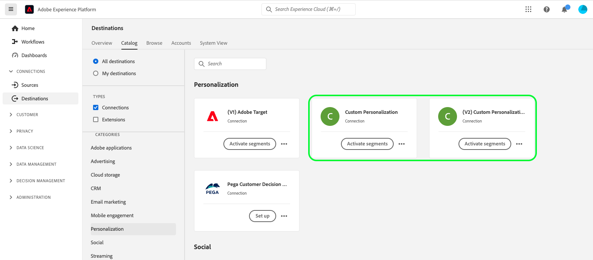

# Custom personalization connection {#custom-personalization-connection} 

## Destination changelog {#changelog}

With the beta release of the enhanced **[!UICONTROL Custom personalization]** destination connector, you might be seeing two **[!UICONTROL Custom personalization]** cards in the destinations catalog.

The **[!UICONTROL Custom Personalization With Attributes]** connector is currently in beta and only available to a select number of customers. In addition to the functionality provided by the **[!UICONTROL Custom Personalization]**, the **[!UICONTROL Custom Personalization With Attributes]** connector adds an optional [mapping step](/help/destinations/ui/activate-edge-personalization-destinations.md#map-attributes) to the activation workflow, which allows you to map profile attributes to your custom personalization destination, enabling attribute-based same-page and next-page personalization.

>[!IMPORTANT]
>
>Profile attributes may contain sensitive data. To protect this data, the **[!UICONTROL Custom Personalization With Attributes]** destination requires you to use the [Edge Network Server API](/help/server-api/overview.md) for data collection. Furthermore, all the Server API calls must be made in an [authenticated context](../../../server-api/authentication.md).
>
><br>If you are already using Web SDK or Mobile SDK for your integration, you can retrieve attributes via the Server API by adding a server-side integration.
>
><br>If you do not follow the requirements above, personalization will be based on segment membership only, identical to the experience offered by the **[!UICONTROL Custom Personalization]** connector.



## Overview {#overview}

This destination provides a way to retrieve segment information from Adobe Experience Platform to external personalization platforms, content management systems, ad servers, and other applications that are running on customer websites.

## Prerequisites {#prerequisites}

This integration is powered by the [Adobe Experience Platform Web SDK](../../../edge/home.md) or the [Adobe Experience Platform Mobile SDK](https://aep-sdks.gitbook.io/docs/). You must be using one of these SDKs to use this destination.

>[!IMPORTANT]
>
>Before creating a custom personalization connection, read the guide on how to [configure personalization destinations for same-page and next-page personalization](../../ui/activate-edge-personalization-destinations.md). This guide takes you through the required configuration steps for same-page and next-page personalization use cases, across multiple Experience Platform components.

## Export type and frequency {#export-type-frequency}

**Profile request** - you are requesting all the segments that are mapped in the custom personalization destination for a single profile. Different custom personalization destinations can be set up for different [Adobe Data Collection datastreams](../../../edge/datastreams/overview.md).

## Use cases {#use-cases}

The [!DNL Custom Personalization Connection] enables you to use your own personalization partner platforms (for example, [!DNL Optimizely], [!DNL Pega]), as well as proprietary systems (for example, in-house CMS), while also leveraging Experience Platform Edge Network data collection & segmentation capabilities, to power a deeper customer personalization experience.

The use cases described below include both site personalization and targeted on-site advertising.

To enable these use cases, customers need a quick, streamlined way of retrieving segment information from Experience Platform and sending this information to their designated systems that they configured as custom personalization connections in the Experience Platform UI.

These systems can be external personalization platforms, content management systems, ad servers, and other applications running across customers' web and mobile properties.

### Same-page personalization {#same-page}

A user visits a page of your website. The customer can use the current page visit information (for example, referring URL, browser language, embedded product info) to select the next action / decision (for example, personalization), using the custom personalization connection for non-Adobe platforms (for example, [!DNL Pega], [!DNL Optimizely], etc.).

### Next-page personalization {#next-page}

A user visits Page A on your website. Based on this interaction, the user has qualified for a set of segments. The user then clicks on a link that takes them from Page A to Page B. The segments that the user had qualified for during the previous interaction on Page A, together with the profile updates determined by the current website visit, will be used to power the next action / decision (for example, which advertising banner to display to the visitor, or, in case of A/B testing, which version of the page to display).

### Next-session personalization {#next-session}

A user visits several pages on your website. Based on these interactions, the user has qualified for a set of segments. The user then terminates the current browsing session.

The following day, the user returns to the same customer website. The segments they had qualified for during the previous interaction with all the visited website pages, together with the profile updates determined by the current website visit, will be used to select the next action / decision (for example, which advertising banner to display to the visitor, or, in case of A/B testing, which version of the page to display).

## Connect to the destination {#connect}

>[!CONTEXTUALHELP]
>id="platform_destinations_custom_personalization_datastream"
>title="About datastream IDs"
>abstract="This option determines in which data collection datastream the segments will be included in the response to the page. The drop-down menu shows only datastreams that have the destination configuration enabled. You must configure a datastream before you can configure your destination."
>additional-url="https://experienceleague.adobe.com/docs/experience-platform/edge/fundamentals/datastreams.html?lang=en" text="Learn how to configure a datastream"

>[!IMPORTANT]
> 
>To connect to the destination, you need the **[!UICONTROL Manage Destinations]** [access control permission](/help/access-control/home.md#permissions). Read the [access control overview](/help/access-control/ui/overview.md) or contact your product administrator to obtain the required permissions.

To connect to this destination, follow the steps described in the [destination configuration tutorial](../../ui/connect-destination.md).

### Connection parameters {#parameters}

While [setting up](../../ui/connect-destination.md) this destination, you must provide the following information:

*  **[!UICONTROL Name]**: Fill in the preferred name for this destination.
*  **[!UICONTROL Description]**: Enter a description for your destination. For example, you can mention which campaign you are using this destination for. This field is optional.
*  **[!UICONTROL Integration alias]**: This value is sent to the Experience Platform Web SDK as a JSON object name. 
*  **[!UICONTROL Datastream ID]**: This determines in which Data Collection datastream the segments will be included in the response to the page. The drop-down menu shows only datastreams that have the destination configuration enabled. See [Configuring a datastream](../../../edge/datastreams/overview.md) for more details.

### Enable alerts {#enable-alerts}

You can enable alerts to receive notifications on the status of the dataflow to your destination. Select an alert from the list to subscribe to receive notifications on the status of your dataflow. For more information on alerts, see the guide on [subscribing to destinations alerts using the UI](../../ui/alerts.md).

When you are finished providing details for your destination connection, select **[!UICONTROL Next]**.

## Activate segments to this destination {#activate}

>[!IMPORTANT]
> 
>To activate data, you need the **[!UICONTROL Manage Destinations]**, **[!UICONTROL Activate Destinations]**, **[!UICONTROL View Profiles]**, and **[!UICONTROL View Segments]** [access control permissions](/help/access-control/home.md#permissions). Read the [access control overview](/help/access-control/ui/overview.md) or contact your product administrator to obtain the required permissions.

Read [Activate profiles and segments to profile request destinations](../../ui/activate-edge-personalization-destinations.md) for instructions on activating audience segments to this destination.

## Exported data {#exported-data}

If you are using [Tags in Adobe Experience Platform](../../../tags/home.md) to deploy the Experience Platform Web SDK, use the [send event complete](../../../edge/extension/event-types.md) functionality and your custom code action will have an `event.destinations` variable that you can use to see the exported data.

Here is a sample value for the `event.destinations` variable:

```
[
   {
      "type":"profileLookup",
      "destinationId":"7bb4cb8d-8c2e-4450-871d-b7824f547111",
      "alias":"personalizationAlias",
      "segments":[
         {
            "id":"399eb3e7-3d50-47d3-ad30-a5ad99e8ab77"
         },
         {
            "id":"499eb3e7-3d50-47d3-ad30-a5ad99e8ab77"
         }
      ]
   }
]
```

If you are not using [Tags](../../../tags/home.md) to deploy the Experience Platform Web SDK, use the [handling responses from events](../../../edge/fundamentals/tracking-events.md#handling-responses-from-events) functionality to see the exported data.

The JSON response from Adobe Experience Platform can be parsed to find the corresponding integration alias of the application you are integrating with Adobe Experience Platform. The segment IDs can be passed into the application's code as targeting parameters. Below is a sample of what this would look like specific to the destination response.

```
alloy("sendEvent", {
  "renderDecisions": true,
  "xdm": {
    "commerce": {
      "order": {
        "purchaseID": "a8g784hjq1mnp3",
        "purchaseOrderNumber": "VAU3123",
        "currencyCode": "USD",
        "priceTotal": 999.98
      }
    }
  }
}).then(function(result) {
    if(result.destinations) { // Looking to see if the destination results are there
 
        // Get the destination with a particular alias
        var personalizationDestinations = result.destinations.filter(x => x.alias == "personalizationAlias")
        if(personalizationDestinations.length > 0) {
             // Code to pass the segment IDs into the system that corresponds to personalizationAlias
        }
        var adServerDestinations = result.destinations.filter(x => x.alias == "adServerAlias")
        if(adServerDestinations.length > 0) {
            // Code to pass the segment ids into the system that corresponds to adServerAlias
        }
     }
   })
  .catch(function(error) {
    // Tracking the event failed.
  });
```

### Example response for [!UICONTROL Custom Personalization With Attributes]

When using **[!UICONTROL Custom Personalization With Attributes]**, the API response will look similar to the example below.

The difference between **[!UICONTROL Custom Personalization With Attributes]** and **[!UICONTROL Custom Personalization]** is the inclusion of the `attributes` section in the API response.

```json
[
    {
        "type": "profileLookup",
        "destinationId": "7bb4cb8d-8c2e-4450-871d-b7824f547130",
        "alias": "personalizationAlias",
        "attributes": {
             "countryCode": {
                   "value" : "DE"
              },
             "membershipStatus": {
                   "value" : "PREMIUM"
              }
         },         
        "segments": [
            {
                "id": "399eb3e7-3d50-47d3-ad30-a5ad99e8ab77"
            },
            {
                "id": "499eb3e7-3d50-47d3-ad30-a5ad99e8ab77"
            }
        ]
    }
]
```

## Data usage and governance {#data-usage-governance}

All [!DNL Adobe Experience Platform] destinations are compliant with data usage policies when handling your data. For detailed information on how [!DNL Adobe Experience Platform] enforces data governance, read the [Data Governance overview](../../../data-governance/home.md).
