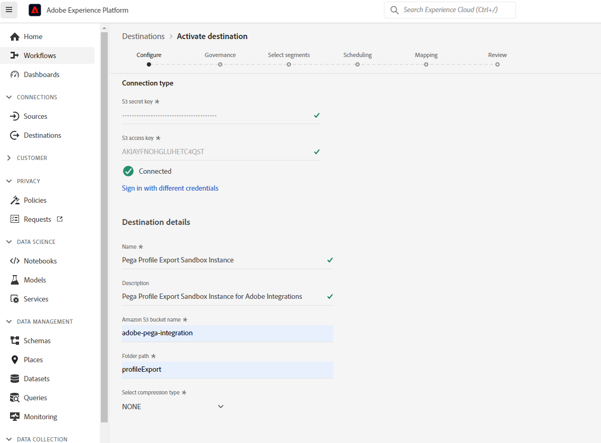
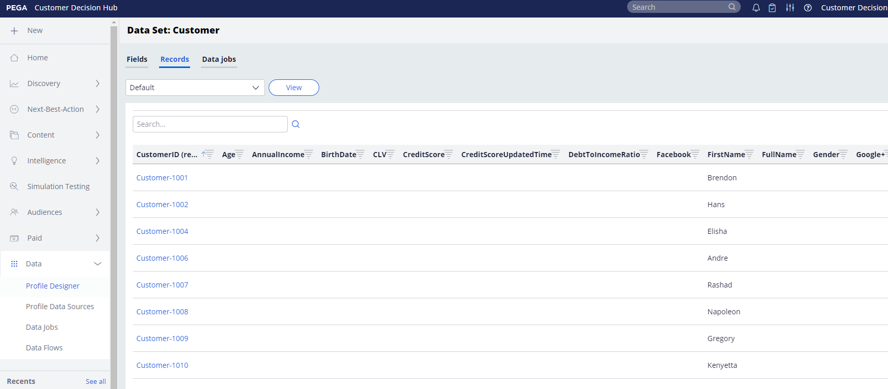
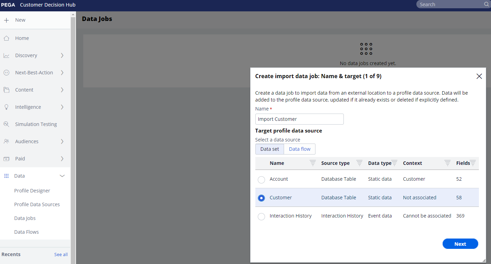

# Pega Profile Connector

## Overview {#overview}

Use the [!DNL Pega Profile Connector] in Adobe Experience Platform to create a live outbound connection to your [!DNL Amazon Web Services] (AWS) S3 storage to periodically export profile data to CSV files from Adobe Experience Platform into your own S3 buckets. In [!DNL Pega Customer Decision Hub], you can schedule data jobs to import this profile data from S3 storage to update the [!DNL Pega Customer Decision Hub] profile.

This connector helps set up the initial export of profile data and also helps sync up new profiles periodically into [!DNL Pega Customer Decision Hub].  Having up-to-date data in Customer Decision Hub provides a better and updated view of your customer base for next-best-action decisioning.

>[!IMPORTANT]
>
>This documentation page was created by Pegasystems. For any inquiries or update requests, please contact Pega directly [here](mailto:support@pega.com).

## Use cases 

To help you better understand how and when you should use the [!DNL Pega Profile Connector] destination, here are sample use cases that Adobe Experience Platform customers can solve by using this destination.

### Use case 1

A marketer wants to initially set up [!DNL Pega Customer Decision Hub] with profile data loaded from Adobe Experience Platform. This is an initial full load followed by delta loads on a scheduled basis.

### Use case 2

A marketer wants up-to-date profile data from Adobe Experience Platform available in [!DNL Pega Customer Decision Hub] that enhances the Pega insights around customer profiles on an ongoing basis.

## Prerequisites {#prerequisites}

Before you can use this destination to export data out of Adobe Experience Platform and import profiles into [!DNL Pega Customer Decision Hub], make sure you complete the following prerequisites:

* Configure [!DNL Amazon S3] bucket and the folder path to be used for export and import of data files.
* Configure the [!DNL Amazon S3] access key and [!DNL Amazon S3] secret key: In [!DNL Amazon S3], generate an `access key - secret access key` pair to grant Platform access to your [!DNL Amazon S3] account.
* To successfully connect and export data to your [!DNL Amazon S3] storage location, create an Identity and Access Management (IAM) user for [!DNL Platform] in [!DNL Amazon S3] and assign permissions such as `s3:DeleteObject`, `s3:GetBucketLocation`, `s3:GetObject`, `s3:ListBucket`, `s3:PutObject`, `s3:ListMultipartUploadParts`
* Make sure your [!DNL Pega Customer Decision Hub] instance is upgraded to 8.8 version or higher. 

## Supported identities {#supported-identities}

[!DNL Pega Customer Decision Hub] supports the activation of custom user IDs described in the table below. For more details, see [identities](/help/identity-service/namespaces.md).

|Target Identity|Description|
|---|---|
|*CustomerID*|Common User Identifier that uniquely identifies a profile in [!DNL Pega Customer Decision Hub] and Adobe Experience Platform|

{style="table-layout:auto"}

## Export type and frequency {#export-type-frequency}

Refer to the table below for information about the destination export type and frequency.

| Item | Type | Notes |
|---------|----------|---------|
| Export type | **[!UICONTROL Profile-based]** | You are exporting all members of a segment, together with the desired schema fields (for example: email address, phone number, last name), as chosen in the select profile attributes screen of the [destination activation workflow](../../ui/activate-batch-profile-destinations.md#select-attributes).|
| Export frequency | **[!UICONTROL Batch]** | Batch destinations export files to downstream platforms in increments of three, six, eight, twelve, or twenty-four hours. Read more about [batch file-based destinations](/help/destinations/destination-types.md#file-based).|

{style="table-layout:auto"}

## Connect to the destination {#connect}

>[!IMPORTANT]
> 
>To connect to the destination, you need the **[!UICONTROL Manage Destinations]** [access control permission](/help/access-control/home.md#permissions). Read the [access control overview](/help/access-control/ui/overview.md) or contact your product administrator to obtain the required permissions.

To connect to this destination, follow the steps described in the [destination configuration tutorial](../../ui/connect-destination.md). In the destination configuration workflow, fill in the fields listed in the two sections below.

### Authenticate to destination {#authenticate}

To authenticate to the destination, fill in the required fields and select **[!UICONTROL Connect to destination]**.

* **[!DNL Amazon S3] access key** and **[!DNL Amazon S3] secret key**: In [!DNL Amazon S3], generate an `access key - secret access key` pair to grant Adobe Experience Platform access to your [!DNL Amazon S3] account. Learn more in the [Amazon Web Services documentation](https://docs.aws.amazon.com/IAM/latest/UserGuide/id_credentials_access-keys.html).

### Fill in destination details {#destination-details}

After establishing the authentication connection to [!DNL Amazon S3], provide the following information for the destination:

To configure details for the destination, fill in the required fields and select **[!UICONTROL Next]**. An asterisk next to a field in the UI indicates that the field is required.

* **[!UICONTROL Name]**: enter a name that will help you identify this destination.
* **[!UICONTROL Description]**: enter a description of this destination.
* **[!UICONTROL Bucket name]**: enter the name of the [!DNL Amazon S3] bucket to be used by this destination.
* **[!UICONTROL Folder path]**: enter the path to the destination folder that will host the exported files.
* **[!UICONTROL Compression Type]**: Select compression type as GZIP or NONE.

>[!TIP]
>
>In the connect destination workflow, you can create a custom folder in your Amazon S3 storage per exported segment file. Read [Use macros to create a folder in your storage location](/help/destinations/catalog/cloud-storage/overview.md#use-macros) for instructions.

### Enable alerts {#enable-alerts}

You can enable alerts to receive notifications on the status of the dataflow to your destination. Select an alert from the list to subscribe to receive notifications on the status of your dataflow. For more information on alerts, see the guide on [subscribing to destinations alerts using the UI](../../ui/alerts.md).

When you are finished providing details for your destination connection, select **[!UICONTROL Next]**.

## Activate segments to this destination {#activate}

>[!IMPORTANT]
> 
>To activate data, you need the **[!UICONTROL Manage Destinations]**, **[!UICONTROL Activate Destinations]**, **[!UICONTROL View Profiles]**, and **[!UICONTROL View Segments]** [access control permissions](/help/access-control/home.md#permissions). Read the [access control overview](/help/access-control/ui/overview.md) or contact your product administrator to obtain the required permissions.

See [Activate audience data to batch profile export destinations](../../ui/activate-batch-profile-destinations.md) for instructions on activating audience segments to this destination.

### Map attributes and identities {#map}

In the **[!UICONTROL Mapping]** step, you can select which attribute and identity fields to export for your profiles. You can also select to change the headers in the exported file to any friendly name that you wish. For more information, view the [mapping step](/help/destinations/ui/activate-batch-profile-destinations.md#mapping) in the activate batch destinations UI tutorial.

## Validate data export {#exported-data}

For [!DNL Pega Profile Connector] destinations, [!DNL Platform] creates a `.csv` file in Amazon S3 storage location that you provided. For more information about the files, see [Activate audience data to batch profile export destinations](../../ui/activate-batch-profile-destinations.md) in the segment activation tutorial.

A successful import of profile data from S3 inserts data in the [!DNL Pega Customer] profile datastore. The imported customer profile data can be validated in [!DNL Pega Customer Profile Designer] , as shown in the following figure.

In [!DNL Pega Customer Decision Hub], data administrators can configure data jobs in [!DNL Customer Profile Designer] to import profile data periodically from S3 as shown in the following figure. See the [additional resources](#additional-resources) for more information about how to configure data jobs to import profile data from [!DNL Amazon S3].

## Additional resources {#additional-resources}

See [Import data jobs](https://academy.pega.com/topic/import-data-jobs/v1) in [!DNL Pega Customer Decision Hub].

## Data usage and governance {#data-usage-governance}

All [!DNL Adobe Experience Platform] destinations are compliant with data usage policies when handling your data. For detailed information on how [!DNL Adobe Experience Platform] enforces data governance, see the [Data Governance overview](/help/data-governance/home.md).
