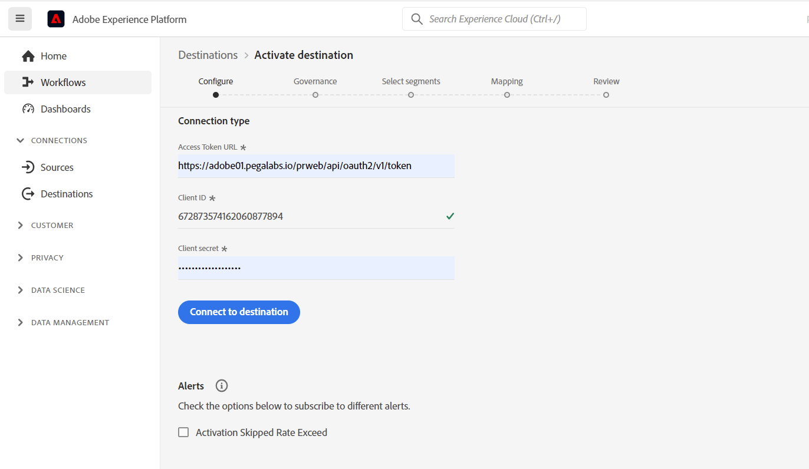
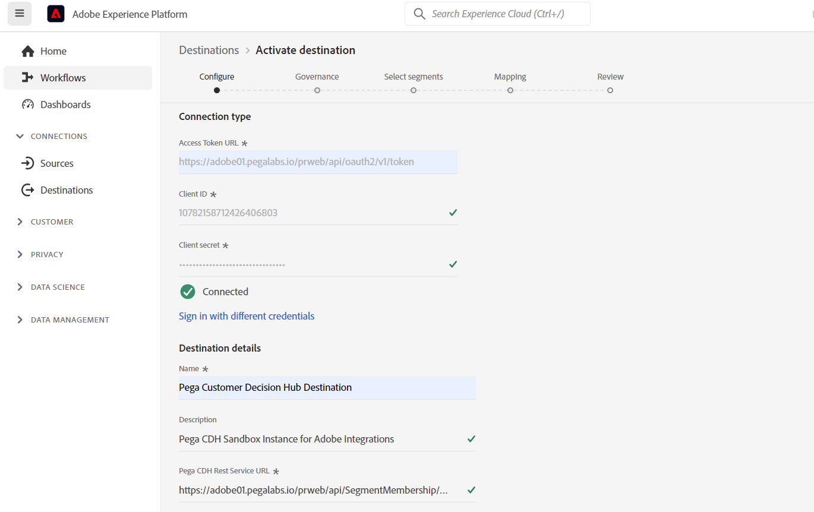
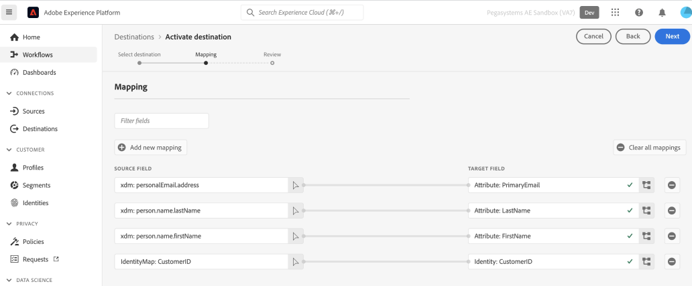
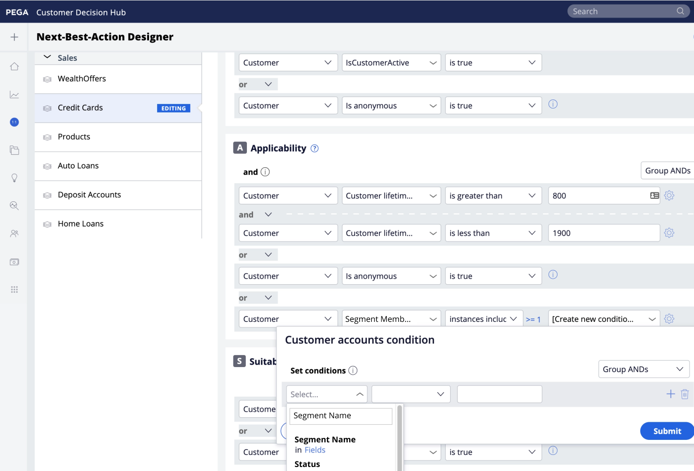
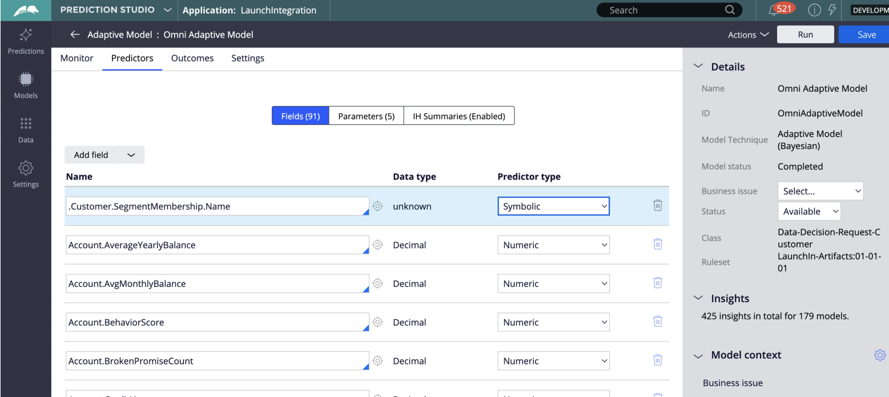

# Pega Customer Decision Hub connection

## Overview {#overview}

Use the [!DNL Pega Customer Decision Hub] destination in Adobe Experience Platform to send profile attributes and audience membership data to [!DNL Pega Customer Decision Hub] for next-best-action decisioning. 

Profile audience membership from Adobe Experience Platform, when loaded into [!DNL Pega Customer Decision Hub], can be used as predictor in adaptive models and help deliver the right contextual and behavioral data for next-best-action decisioning purposes.

>[!IMPORTANT]
>
>This destination connector and documentation page are created and maintained by Pegasystems. For any inquiries or update requests, please contact Pega directly [here](mailto:support@pega.com).

## Use cases 

To help you better understand how and when you should use the [!DNL Customer Decision Hub] destination, here are sample use cases that Adobe Experience Platform customers can solve by using this destination.

### Telecommunications

A marketer wants to leverage insights from data science model-based next best action as delivered by [!DNL Pega Customer Decision Hub] for customer engagement. [!DNL Pega Customer Decision Hub] is heavily reliant on customer intent – for example "Interested_In_5G", "Interested_in_Unlimited_Dataplan" or "Interest_in_iPhone_accessories".

### Financial services

A marketer wants to optimize the offers for customers who subscribed or unsubscribed from Pension Plan or Retirement Plan newsletters. Financial services companies can ingest multiple Customer IDs from their own CRMs into Adobe Experience Platform, build audiences from their own offline data, and send profiles that are entering and exiting the audiences to [!DNL Pega Customer Decision Hub] for next-best-action (NBA) decisioning in outbound channels.

## Prerequisites {#prerequisites}

Before you can use this destination to export data out of Adobe Experience Platform, make sure you complete the following prerequisites in [!DNL Pega Customer Decision Hub]:

* Configure the [Adobe Experience Platform Profile and Audience Membership integration Component](https://docs.pega.com/component/customer-decision-hub/adobe-experience-platform-profile-and-segment-membership-integration-component) in your [!DNL Pega Customer Decision Hub] instance.
* Configure OAuth 2.0 [Client Registration using Client Credentials](https://docs.pega.com/security/87/creating-and-configuring-oauth-20-client-registration) grant type in your [!DNL Pega Customer Decision Hub] instance.
* Configure [real-time run data flow](https://docs.pega.com/decision-management/87/creating-real-time-run-data-flows) for  Adobe Audience Membership data flow in your [!DNL Pega Customer Decision Hub] instance.

## Supported identities {#supported-identities}

[!DNL Pega Customer Decision Hub] supports the activation of custom user IDs described in the table below. For more details, see [identities](/help/identity-service/features/namespaces.md).

|Target Identity|Description|
|---|---|
|*CustomerID*|Common User Identifier that uniquely identifies a profile in [!DNL Pega Customer Decision Hub] and Adobe Experience Platform|

{style="table-layout:auto"}

## Export type and frequency {#export-type-frequency}

Refer to the table below for information about the destination export type and frequency.

| Item | Type | Notes |
---------|----------|---------|
| Export type | **[!UICONTROL Profile-based]** | Export all members of an audience with identifier (*CustomerID*), attributes (last name, first name, location, etc.) and Audience Membership data.|
| Export frequency | **[!UICONTROL Streaming]** | Streaming destinations are always-on API-based connections. As soon as a profile is updated in Experience Platform, based on audience evaluation, the connector sends the update downstream to the destination platform. For more information, see [streaming destinations](/help/destinations/destination-types.md#streaming-destinations).|

{style="table-layout:auto"}

## Connect to the destination {#connect}

To connect to this destination, follow the steps described in the [destination configuration tutorial](../../ui/connect-destination.md). In the configure destination workflow, fill in the fields listed in the two sections below.

### Authenticate to destination {#authenticate}

#### OAuth 2 Client Credentials authentication {#oauth-2-client-credentials-authentication}

Fill in the fields below and select **[!UICONTROL Connect to destination]**:

* **[!UICONTROL Access Token URL]**: The OAuth 2 access token URL on your [!DNL Pega Customer Decision Hub] instance.
* **[!UICONTROL Client ID]**: The OAuth 2 [!DNL client ID] that you generated in your [!DNL Pega Customer Decision Hub] instance.
* **[!UICONTROL Client Secret]**: The OAuth 2 [!DNL client secret] that you generated in your [!DNL Pega Customer Decision Hub] instance.

### Fill in destination details {#destination-details}

After establishing the authentication connection to the [!DNL Pega Customer Decision Hub], provide the following information for the destination:

To configure details for the destination, fill in the required fields and select **[!UICONTROL Next]**.

*  **[!UICONTROL Name]**: A name by which you will recognize this destination in the future.
*  **[!UICONTROL Description]**: A description that will help you identify this destination in the future.
*  **[!UICONTROL Host Name]**: The Pega Customer Decision Hub Host Name to which the profile gets exported as json data.

## Activate audiences to this destination {#activate}

>[!IMPORTANT]
> 
>* To activate data, you need the **[!UICONTROL View Destinations]**, **[!UICONTROL Activate Destinations]**, **[!UICONTROL View Profiles]**, and **[!UICONTROL View Segments]** [access control permissions](/help/access-control/home.md#permissions). Read the [access control overview](/help/access-control/ui/overview.md) or contact your product administrator to obtain the required permissions.
>* To export *identities*, you need the **[!UICONTROL View Identity Graph]** [access control permission](/help/access-control/home.md#permissions).   {width="100" zoomable="yes"}

See [Activate audience data to streaming profile export destinations](../../ui/activate-streaming-profile-destinations.md) for instructions on activating audiences to this destination.

### Destination attributes {#attributes}

In the [[!UICONTROL Select attributes]](../../ui/activate-streaming-profile-destinations.md#select-attributes) step, Adobe recommends that you select a unique identifier from your [union schema](../../../profile/home.md#profile-fragments-and-union-schemas). Select the unique identifier and any other XDM fields that you want to export to the destination.

### Mapping example: activating profile updates in [!DNL Pega Customer Decision Hub] {#mapping-example}

Below is an example of correct identity mapping when exporting profiles to [!DNL Pega Customer Decision Hub].

Selecting source fields:

* Select an identifier (For example: CustomerID) as source identity that uniquely identifies a profile in Adobe Experience Platform and [!DNL Pega Customer Decision Hub].
* Select XDM source profile attribute changes that need to be exported and updated in [!DNL Pega Customer Decision Hub].

Selecting target fields:

* Select the `CustomerID` namespace as target identity.
* Select destination profile attribute names that need to be mapped to corresponding XDM source profile attributes.

## Exported data / Validate data export {#exported-data}

A successful audience membership update for a profile would insert the audience identifier, name and statuses in the Pega marketing audience membership datastore. The membership data is associated to a customer using Customer Profile Designer in [!DNL Pega Customer Decision Hub], as shown below.

The audience membership data is used in Pega Next-Best-Action Designer Engagement polices for next-best-action decisioning, as shown below.

The customer audience membership data fields are added as predictors in Adaptive models, as shown below.

## Additional resources {#additional-resources}

See [Setting up an OAuth 2.0 client registration](https://docs.pega.com/security/87/creating-and-configuring-oauth-20-client-registration) in [!DNL Pega Customer Decision Hub].

See [Creating a real-time run for data flows](https://docs.pega.com/decision-management/87/creating-real-time-run-data-flows) in [!DNL Pega Customer Decision Hub].

See [Manage customer records in Customer Profile Designer](https://docs.pega.com/whats-new-pega-platform/manage-customer-records-customer-profile-designer-86).

## Data usage and governance {#data-usage-governance}

All [!DNL Adobe Experience Platform] destinations are compliant with data usage policies when handling your data. For detailed information on how [!DNL Adobe Experience Platform] enforces data governance, see the [Data Governance overview](/help/data-governance/home.md).
