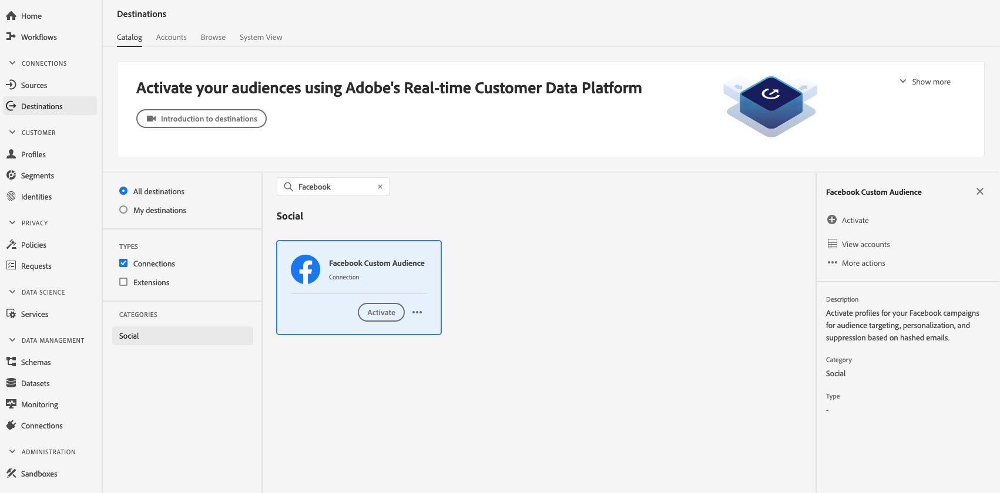
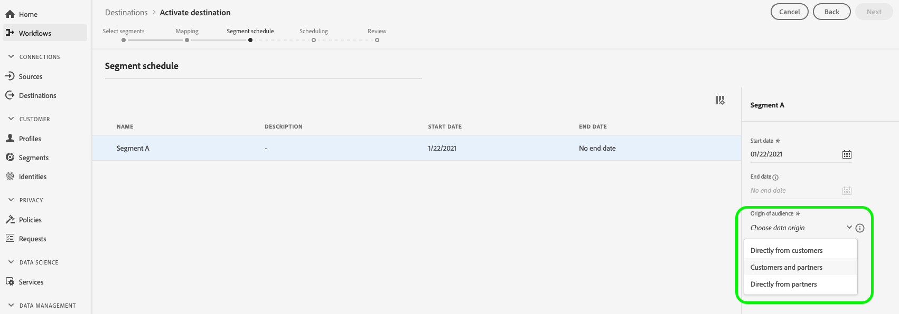
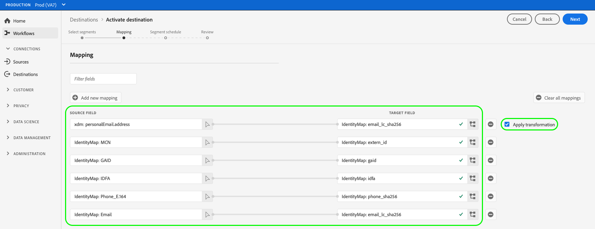

# [!DNL Facebook] connection

## Overview {#overview}

Activate profiles for your [!DNL Facebook] campaigns for audience targeting, personalization, and suppression based on hashed emails.

You can use this destination for audience targeting across [!DNL Facebook's] family of apps that are supported by [!DNL Custom Audiences], including [!DNL Facebook], [!DNL Instagram], [!DNL Audience Network], and [!DNL Messenger]. Selection of the app that you want to run campaign against is indicated at the placement level in [!DNL Facebook Ads Manager].

## Use cases

To help you better understand how and when to use the [!DNL Facebook] destination, here are two sample use cases that Adobe Experience Platform customers can solve by using this feature.

### Use case #1

An online retailer wants to reach existing customers through social platforms and show them personalized offers based on their previous orders. The online retailer can ingest email addresses from their own CRM to Adobe Experience Platform, build audiences from their own offline data, and send these audiences to the [!DNL Facebook] social platform, optimizing their advertising spending.

### Use case #2

An airline has different customer tiers (Bronze, Silver, and Gold), and wants to provide each of the tiers with personalized offers via social platforms. However, not all customers use the airline's mobile app, and some of them have not logged on to the company's website. The only identifiers that the company has about these customers are membership IDs and email addresses.

To target them across social media, they can onboard the customer data from their CRM into Adobe Experience Platform, using the email addresses as identifiers.

Next, they can use their offline data including associated membership IDs and customer tiers to build new audiences that they can target through the [!DNL Facebook] destination.

## Supported identities {#supported-identities}

[!DNL Facebook Custom Audiences] supports the activation of identities described in the table below. Learn more about [identities](/help/identity-service/features/namespaces.md).

|Target Identity|Description|Considerations|
|---|---|---|
|GAID|Google Advertising ID|Select the GAID target identity when your source identity is a GAID namespace.|
|IDFA|Apple ID for Advertisers|Select the IDFA target identity when your source identity is an IDFA namespace.|
|phone_sha256|Phone numbers hashed with the SHA256 algorithm|Both plain text and SHA256 hashed phone numbers are supported by Adobe Experience Platform. Follow the instructions in the [ID matching requirements](#id-matching-requirements-id-matching-requirements) section and use the appropriate namespaces for plain text and hashed phone numbers, respectively. When your source field contains unhashed attributes, check the **[!UICONTROL Apply transformation]** option, to have [!DNL Platform] automatically hash the data on activation.|
|email_lc_sha256|Email addresses hashed with the SHA256 algorithm|Both plain text and SHA256 hashed email addresses are supported by Adobe Experience Platform. Follow the instructions in the [ID matching requirements](#id-matching-requirements-id-matching-requirements) section and use the appropriate namespaces for plain text and hashed email addresses, respectively. When your source field contains unhashed attributes, check the **[!UICONTROL Apply transformation]** option, to have [!DNL Platform] automatically hash the data on activation.|
|extern_id|Custom user IDs|Select this target identity when your source identity is a custom namespace.|

## Supported audiences {#supported-audiences}

This section describes which types of audiences you can export to this destination.

| Audience origin | Supported | Description | 
---------|----------|----------|
| [!DNL Segmentation Service] | ✓ | Audiences generated through the Experience Platform [Segmentation Service](../../../segmentation/home.md).|
| Custom uploads | ✓ | Audiences [imported](../../../segmentation/ui/overview.md#import-audience) into Experience Platform from CSV files. |

{style="table-layout:auto"}

## Export type and frequency {#export-type-frequency}

Refer to the table below for information about the destination export type and frequency.

| Item | Type | Notes |
---------|----------|---------|
| Export type | **[!UICONTROL Audience export]** | You are exporting all members of an audience with the identifiers (name, phone number, or others) used in the Facebook destination.|
| Export frequency | **[!UICONTROL Streaming]** | Streaming destinations are "always on" API-based connections. As soon as a profile is updated in Experience Platform based on audience evaluation, the connector sends the update downstream to the destination platform. Read more about [streaming destinations](/help/destinations/destination-types.md#streaming-destinations).|

{style="table-layout:auto"}

## Facebook account prerequisites {#facebook-account-prerequisites}

Before you can send your audiences to [!DNL Facebook], make sure you meet the following requirements:

* Your [!DNL Facebook] user account must have full access to the [!DNL Facebook Business Account] which owns the Ad account that you are using.
* Your [!DNL Facebook] user account must have the **[!DNL Manage campaigns]** permission enabled for the Ad account that you plan to use.
* The **Adobe Experience Cloud** business account must be added as an advertising partner in your [!DNL Facebook Ad Account]. Use `business ID=206617933627973`. See [Add Partners to Your Business Manager](https://www.facebook.com/business/help/1717412048538897) in the Facebook documentation for details.
    >[!IMPORTANT]
    >
    > When configuring the permissions for Adobe Experience Cloud, you must enable the **Manage campaigns** permission. The permission is required for the [!DNL Adobe Experience Platform] integration.
* Read and sign the [!DNL Facebook Custom Audiences] Terms of Service. To do so, go to `https://business.facebook.com/ads/manage/customaudiences/tos/?act=[accountID]`, where `accountID` is your [!DNL Facebook Ad Account ID].
  >[!IMPORTANT]
  >
  >When signing the [!DNL Facebook Custom Audiences] Terms of Service, make sure to use the same user account that you used to authenticate in the Facebook API.

## ID matching requirements {#id-matching-requirements}

[!DNL Facebook] requires that no personally identifiable information (PII) is sent in clear. Therefore, the audiences activated to [!DNL Facebook] can be keyed off *hashed* identifiers, such as email addresses or phone numbers.

Depending on the type of IDs that you ingest into Adobe Experience Platform, you must adhere to their corresponding requirements.

## Phone number hashing requirements {#phone-number-hashing-requirements}

There are two methods to activate phone numbers in [!DNL Facebook]:

* **Ingesting raw phone numbers**: you can ingest raw phone numbers in the [!DNL E.164] format into [!DNL Platform]. They automatically hashed upon activation. If you choose this option, make sure to always ingest your raw phone numbers into the `Phone_E.164` namespace.
* **Ingesting hashed phone numbers**: you can pre-hash your phone numbers before ingestion into [!DNL Platform]. If you choose this option, make sure to always ingest your hashed phone numbers into the `Phone_SHA256` namespace.

>[!NOTE]
>
>Phone numbers ingested into the `Phone` namespace cannot be activated in [!DNL Facebook].

## Email hashing requirements {#email-hashing-requirements}

You can hash email addresses before ingesting them into Adobe Experience Platform, or use email addresses in clear in Experience Platform, and have [!DNL Platform] hash them on activation.

To learn about ingesting email addresses in Experience Platform, see the [batch ingestion overview](/help/ingestion/batch-ingestion/overview.md) and the [streaming ingestion overview](/help/ingestion/streaming-ingestion/overview.md).

If you select to hash the email addresses yourself, make sure to comply with the following requirements:

* Trim all leading and trailing spaces from the email string; example: `johndoe@example.com`, not `<space>johndoe@example.com<space>`;
* When hashing the email strings, make sure to hash the lowercase string;
  * Example: `example@email.com`, not `EXAMPLE@EMAIL.COM`;
* Ensure that the hashed string is all lowercase
  * Example: `55e79200c1635b37ad31a378c39feb12f120f116625093a19bc32fff15041149`, not `55E79200C1635B37AD31A378C39FEB12F120F116625093A19bC32FFF15041149`;
* Do not salt the string.

>[!NOTE]
>
>Data from unhashed namespaces is automatically hashed by [!DNL Platform] upon activation.
> Attribute source data is not automatically hashed. When your source field contains unhashed attributes, check the **[!UICONTROL Apply transformation]** option, to have [!DNL Platform] automatically hash the data on activation.
> The **[!UICONTROL Apply transformation]** option is only displayed when you select attributes as source fields. It is not displayed when you choose namespaces.

## Using custom namespaces {#custom-namespaces}

Before you can use the `Extern_ID` namespace to send data to [!DNL Facebook], make sure you synchronize your own identifiers using [!DNL Facebook Pixel]. See the [Facebook official documentation](https://developers.facebook.com/docs/marketing-api/audiences/guides/custom-audiences/#external_identifiers) for detailed information.

## Connect to the destination {#connect}

>[!IMPORTANT]
> 
>To connect to the destination, you need the **[!UICONTROL View Destinations]** and **[!UICONTROL Manage Destinations]** [access control permissions](/help/access-control/home.md#permissions). Read the [access control overview](/help/access-control/ui/overview.md) or contact your product administrator to obtain the required permissions.

To connect to this destination, follow the steps described in the [destination configuration tutorial](../../ui/connect-destination.md). In the configure destination workflow, fill in the fields listed in the two sections below.

The video below also demonstrates the steps to configure a [!DNL Facebook] destination and activate audiences. 

>[!VIDEO](https://video.tv.adobe.com/v/332599/?quality=12&learn=on&captions=eng)

>[!NOTE]
>
>The Experience Platform user interface is frequently updated and may have changed since the recording of this video. For the most up-to-date information, refer to the [destination configuration tutorial](../../ui/connect-destination.md).

### Authenticate to destination {#authenticate}

1. Find the Facebook destination in the destination catalog and select **[!UICONTROL Set Up]**.
2. Select **[!UICONTROL Connect to destination]**. 
  
3. Enter your Facebook credentials and select **Log In**.

### Fill in destination details {#destination-details}

>[!CONTEXTUALHELP]
>id="platform_destinations_connect_facebook_accountid"
>title="Account ID"
>abstract="Your Facebook Ad Account ID. You can find this ID in your Facebook Ads Manager account. When entering this ID, always prefix it with `act_`."

To configure details for the destination, fill in the required and optional fields below. An asterisk next to a field in the UI indicates that the field is required.

* **[!UICONTROL Name]**: A name by which you will recognize this destination in the future.
* **[!UICONTROL Description]**: A description that will help you identify this destination in the future.
* **[!UICONTROL Account ID]**: Your [!DNL Facebook Ad Account ID]. You can find this ID in your [!DNL Facebook Ads Manager] account. When entering this ID, always prefix it with `act_`.

### Enable alerts {#enable-alerts}

You can enable alerts to receive notifications on the status of the dataflow to your destination. Select an alert from the list to subscribe to receive notifications on the status of your dataflow. For more information on alerts, see the guide on [subscribing to destinations alerts using the UI](../../ui/alerts.md).

When you are finished providing details for your destination connection, select **[!UICONTROL Next]**.

## Activate audiences to this destination {#activate}

>[!CONTEXTUALHELP]
>id="platform_destinations_activate_facebook_originofaudience"
>title="Origin of audience"
>abstract="Choose how the customer data in the audience was originally collected. The data is displayed in Facebook when a user is targeted by the segment"

>[!CONTEXTUALHELP]
>id="platform_destinations_activate_facebook_originofaudience_customers"
>title="Origin of audience"
>abstract="Advertisers collected data directly from customers."

>[!CONTEXTUALHELP]
>id="platform_destinations_activate_facebook_originofaudience_partners"
>title="Origin of audience"
>abstract="Advertisers collected data directly from their partners."

>[!CONTEXTUALHELP]
>id="platform_destinations_activate_facebook_originofaudience_customersandpartners"
>title="Origin of audience"
>abstract="Advertisers collected data directly from their customers and partners."

>[!IMPORTANT]
> 
>* To activate data, you need the **[!UICONTROL View Destinations]**, **[!UICONTROL Activate Destinations]**, **[!UICONTROL View Profiles]**, and **[!UICONTROL View Segments]** [access control permissions](/help/access-control/home.md#permissions). Read the [access control overview](/help/access-control/ui/overview.md) or contact your product administrator to obtain the required permissions.
>* To export *identities*, you need the **[!UICONTROL View Identity Graph]** [access control permission](/help/access-control/home.md#permissions).   {width="100" zoomable="yes"}

See [Activate audience data to streaming audience export destinations](../../ui/activate-segment-streaming-destinations.md) for instructions on activating audiences to this destination.

In the **[!UICONTROL Segment schedule]** step, you must provide the [!UICONTROL Origin of audience] when sending audiences to [!DNL Facebook Custom Audiences].

### Mapping example: activating audience data in [!DNL Facebook Custom Audience] {#example-facebook}

Below is an example of correct identity mapping when activating audience data in [!DNL Facebook Custom Audience].

Selecting source fields:

* Select the `Email` namespace as source identity if the email addresses you are using are not hashed.
* Select the `Email_LC_SHA256` namespace as source identity if you hashed customer email addresses on data ingestion into [!DNL Platform], according to [!DNL Facebook] [email hashing requirements](#email-hashing-requirements).
* Select the `PHONE_E.164` namespace as source identity if your data consists of non-hashed phone numbers. [!DNL Platform] will hash the phone numbers to comply with [!DNL Facebook] requirements.
* Select the `Phone_SHA256` namespace as source identity if you hashed phone numbers on data ingestion into [!DNL Platform], according to [!DNL Facebook] [phone number hashing requirements](#phone-number-hashing-requirements).
* Select the `IDFA` namespace as source identity if your data consists of [!DNL Apple] device IDs. 
* Select the `GAID` namespace as source identity if your data consists of [!DNL Android] device IDs.
* Select the `Custom` namespace as source identity if your data consists of other type of identifiers.

Selecting target fields:

* Select the `Email_LC_SHA256` namespace as target identity when your source namespaces are either `Email` or `Email_LC_SHA256`.
* Select the `Phone_SHA256` namespace as target identity when your source namespaces are either `PHONE_E.164` or `Phone_SHA256`.
* Select the `IDFA` or `GAID` namespaces as target identity when your source namespaces are `IDFA` or `GAID`.
* Select the `Extern_ID` namespace as target identity when your source namespace is a custom one.

>[!IMPORTANT]
>
>Data from unhashed namespaces is automatically hashed by [!DNL Platform] upon activation.
> 
>Attribute source data is not automatically hashed. When your source field contains unhashed attributes, check the **[!UICONTROL Apply transformation]** option, to have [!DNL Platform] automatically hash the data on activation.

## Exported data {#exported-data}

For [!DNL Facebook], a successful activation means that a [!DNL Facebook] custom audience would be created programmatically in [[!DNL Facebook Ads Manager]](https://www.facebook.com/adsmanager/manage/). Audience membership would be added and removed as users are qualified or disqualified for the activated audiences.

>[!TIP]
>
>The integration between Adobe Experience Platform and [!DNL Facebook] supports historical audience backfills. All historical audience qualifications get sent to [!DNL Facebook] when you activate the audiences to the destination.

## Troubleshooting {#troubleshooting}

### 400 Bad Request error message {#bad-request}

When configuring this destination, you may receive the following error:

`{"message":"Facebook Error: Permission error","code":"400 BAD_REQUEST"}`

This error occurs when customers are using newly created accounts, and the [!DNL Facebook] permissions are not yet active.

If you receive the `400 Bad Request` error message after following the steps in [Facebook account prerequisites](#facebook-account-prerequisites), allow a few days for the [!DNL Facebook] permissions to come into effect.
