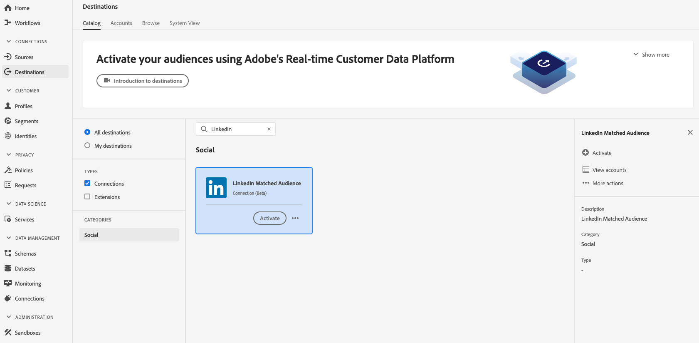
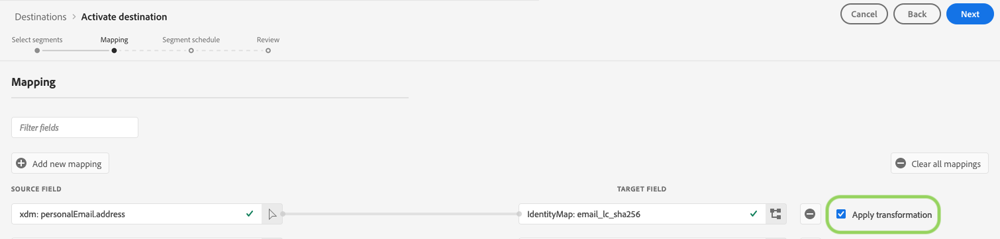

# [!DNL LinkedIn Matched Audiences] connection

## Overview {#overview}

Activate profiles for your [!DNL LinkedIn] campaigns for audience targeting, personalization, and suppression, based on hashed emails and mobile IDs.

## Use cases

To help you better understand how and when to use the [!DNL LinkedIn Matched Audiences] destination, here is a use case that Adobe Experience Platform customers can solve by using this feature.

A software company organizes a conference and wants to keep in touch with participants, and show them personalized offers based on their conference attendance status. The company can ingest email addresses or mobile device IDs from their own [!DNL CRM] into Adobe Experience Platform. Then, they can build segments from their own offline data, and send these segments to the [!DNL LinkedIn] social platform, optimizing their advertising spending.

## Supported identities {#supported-identities}

[!DNL LinkedIn Matched Audiences] supports the activation of identities described in the table below. Learn more about [identities](/help/identity-service/namespaces.md).

|Target Identity|Description|Considerations|
|---|---|---|
|GAID|Google Advertising ID|Select this target identity when your source identity is a GAID namespace.|
|IDFA|Apple ID for Advertisers|Select this target identity when your source identity is an IDFA namespace.|
|email_lc_sha256|Email addresses hashed with the SHA256 algorithm|Both plain text and SHA256 hashed email addresses are supported by Adobe Experience Platform. Follow the instructions in the [ID matching requirements](#id-matching-requirements-id-matching-requirements) section and use the appropriate namespaces for plain text and hashed emails, respectively. When your source field contains unhashed attributes, check the **[!UICONTROL Apply transformation]** option, to have [!DNL Platform] automatically hash the data on activation.|

{style="table-layout:auto"}

## External audiences support {#external-audiences-support}

All destinations support the activation of audiences generated through the Experience Platform [Segmentation Service](../../../segmentation/home.md).

Additionally, this destination also supports the activation of the external audiences described in the table below.

| External audience type | Description | 
---------|----------|
| Custom uploads | Audiences ingested into Experience Platform from CSV files. | 

{style="table-layout:auto"}

## Export type and frequency {#export-type-frequency}

Refer to the table below for information about the destination export type and frequency.

| Item | Type | Notes |
---------|----------|---------|
| Export type | **[!UICONTROL Segment export]** | You are exporting all members of a segment (audience) with the identifiers (name, phone number, and others) used in the [!DNL LinkedIn Matched Audiences] destination.|
| Export frequency | **[!UICONTROL Streaming]** | Streaming destinations are "always on" API-based connections. As soon as a profile is updated in Experience Platform based on segment evaluation, the connector sends the update downstream to the destination platform. Read more about [streaming destinations](/help/destinations/destination-types.md#streaming-destinations).|

{style="table-layout:auto"}

## LinkedIn account prerequisites {#LinkedIn-account-prerequisites}

Before you can use the [!UICONTROL LinkedIn Matched Audience] destination, make sure your [!DNL LinkedIn Campaign Manager] account has the [!DNL Creative Manager] permission level or higher.

To learn how to edit your [!DNL LinkedIn Campaign Manager] user permissions, see [Add, Edit, and Remove User Permissions on Advertising Accounts](https://www.linkedin.com/help/lms/answer/5753) in the LinkedIn documentation.

## ID matching requirements {#id-matching-requirements}

[!DNL LinkedIn Matched Audiences] requires that no personally identifiable information (PII) is sent in clear. Therefore, the audiences activated to [!DNL LinkedIn Matched Audiences] can be keyed off *hashed* identifiers, such as email addresses or mobile device IDs.

Depending on the type of IDs that you ingest into Adobe Experience Platform, you must adhere to their corresponding requirements.

## Email hashing requirements {#email-hashing-requirements}

You can hash email addresses before ingesting them into Adobe Experience Platform, or use email addresses in clear in Experience Platform, and have [!DNL Platform] hash them on activation.

To learn about ingesting email addresses in Experience Platform, see the [batch ingestion overview](/help/ingestion/batch-ingestion/overview.md) and the [streaming ingestion overview](/help/ingestion/streaming-ingestion/overview.md).

If you select to hash the email addresses yourself, make sure to comply with the following requirements:

* Trim all leading and trailing spaces from the email string. For example: `johndoe@example.com`, not `<space>johndoe@example.com<space>`;
* When hashing the email strings, make sure to hash the lowercase string;
  * Example: `example@email.com`, not `EXAMPLE@EMAIL.COM`;
* Ensure that the hashed string is all lowercase
  * Example: `55e79200c1635b37ad31a378c39feb12f120f116625093a19bc32fff15041149`, not `55E79200C1635B37AD31A378C39FEB12F120F116625093A19bC32FFF15041149`;
* Do not salt the string.

>[!NOTE]
>
>Data from unhashed namespaces is automatically hashed by [!DNL Platform] upon activation.
> Attribute source data is not automatically hashed.
> 
> During the [Identity Mapping](../../ui/activate-segment-streaming-destinations.md#mapping) step, when your source field contains unhashed attributes, check the **[!UICONTROL Apply transformation]** option, to have [!DNL Platform] automatically hash the data on activation.
> 
> The **[!UICONTROL Apply transformation]** option is only displayed when you select attributes as source fields. It is not displayed when you choose namespaces.

## Connect to the destination {#connect}

>[!IMPORTANT]
> 
>To connect to the destination, you need the **[!UICONTROL Manage Destinations]** [access control permission](/help/access-control/home.md#permissions). Read the [access control overview](/help/access-control/ui/overview.md) or contact your product administrator to obtain the required permissions.

To connect to this destination, follow the steps described in the [destination configuration tutorial](../../ui/connect-destination.md). In the configure destination workflow, fill in the fields listed in the two sections below.

The video below also demonstrates the steps to configure a [!DNL LinkedIn Matched Audiences] destination and activate segments.

>[!VIDEO](https://video.tv.adobe.com/v/332599/?quality=12&learn=on&captions=eng)

>[!NOTE]
>
>The Experience Platform user interface is frequently updated and may have changed since the recording of this video. For the most up-to-date information, refer to the [destination configuration tutorial](../../ui/connect-destination.md).

### Authenticate to destination {#authenticate}

1. Find the [!DNL LinkedIn Matched Audiences] destination in the destination catalog and select **[!UICONTROL Set Up]**.
2. Select **[!UICONTROL Connect to destination]**. 
  
3. Enter your LinkedIn credentials and select **Log In**.

### Fill in destination details {#destination-details}

>[!CONTEXTUALHELP]
>id="platform_destinations_connect_linkedin_accountid"
>title="Account ID"
>abstract="Your LinkedIn Campaign Manager Account ID. You can find this ID in your LinkedIn Campaign Manager account."

To configure details for the destination, fill in the required and optional fields below. An asterisk next to a field in the UI indicates that the field is required.

* **[!UICONTROL Name]**: A name by which you will recognize this destination in the future.
* **[!UICONTROL Description]**: A description that will help you identify this destination in the future.
* **[!UICONTROL Account ID]**: Your [!DNL LinkedIn Campaign Manager Account ID]. You can find this ID in your [!DNL LinkedIn Campaign Manager] account.

### Enable alerts {#enable-alerts}

You can enable alerts to receive notifications on the status of the dataflow to your destination. Select an alert from the list to subscribe to receive notifications on the status of your dataflow. For more information on alerts, see the guide on [subscribing to destinations alerts using the UI](../../ui/alerts.md).

When you are finished providing details for your destination connection, select **[!UICONTROL Next]**.

## Activate segments to this destination {#activate}

>[!IMPORTANT]
> 
>To activate data, you need the **[!UICONTROL Manage Destinations]**, **[!UICONTROL Activate Destinations]**, **[!UICONTROL View Profiles]**, and **[!UICONTROL View Segments]** [access control permissions](/help/access-control/home.md#permissions). Read the [access control overview](/help/access-control/ui/overview.md) or contact your product administrator to obtain the required permissions.

See [Activate audience data to streaming segment export destinations](../../ui/activate-segment-streaming-destinations.md) for instructions on activating audience segments to this destination.

## Exported data {#exported-data}

A successful activation means that a [!DNL LinkedIn] custom audience would be created programmatically in [[!DNL LinkedIn Campaign Manager]](https://www.linkedin.com/campaignmanager/login). Segment membership in the audience would be added and removed as users are qualified or disqualified for the activated segments.

>[!TIP]
>
>The integration between Adobe Experience Platform and [!DNL LinkedIn Matched Audiences] supports historical audience backfills. All historical segment qualifications get sent to [!DNL LinkedIn] when you activate the segments to the destination.
