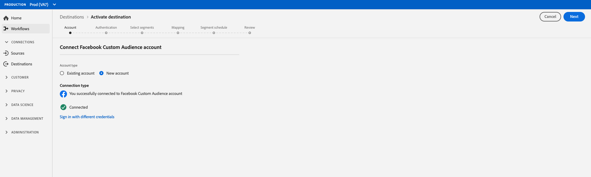
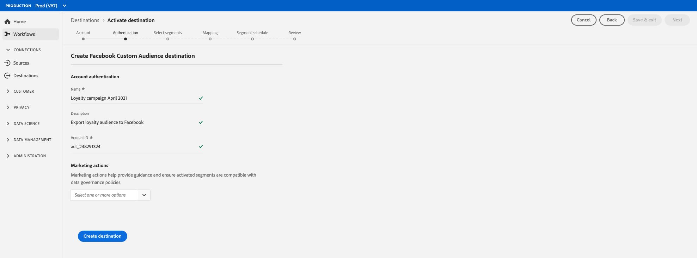

# Create a social destination {#social-network-destinations-workflow}

## Overview {#overview}

This tutorial uses [!DNL Facebook] as an example, but the Adobe Experience Platform workflow is the same for all social destinations. 

## Configure social destination - video walkthrough {#video}

The video below demonstrates how to configure a social destination and activate segments in Adobe Experience Platform. The steps are also laid out sequentially in the next sections.

>[!VIDEO](https://video.tv.adobe.com/v/332599/?quality=12&learn=on&captions=eng)

## Select social destination {#select-destination}

In **[!UICONTROL Destinations]** > **[!UICONTROL Catalog]**, scroll to the **[!UICONTROL Social]** category. Select your preferred social destination, then select **[!UICONTROL Configure]**.

>[!NOTE]
>
>If a connection with this destination already exists, you can see an **[!UICONTROL Activate]** button on the destination card. For more information about the difference between **[!UICONTROL Activate]** and **[!UICONTROL Configure]**, refer to the [Catalog](../../ui/destinations-workspace.md#catalog) section of the destination workspace documentation.   

## Account step {#account}

In the **Account** step, if you had previously set up a connection to your social destination, select **[!UICONTROL Existing Account]** and select your existing connection. Or, you can select **[!UICONTROL New Account]** to set up a new connection to your social destination. Select **[!UICONTROL Connect to destination]** and this will take you to the selected social destination to log in and connect Adobe Experience Cloud to your social Ad account.

>[!NOTE]
>
>Platform supports credentials validation in the authentication process and displays an error message if you input incorrect credentials to your social account ID. This ensures that you don't complete the workflow with incorrect credentials.

Once your credentials are confirmed and Adobe Experience Cloud is connected to your social network, you can select **[!UICONTROL Next]** to proceed to the **[!UICONTROL Authentication]** step.

## Authentication step {#authentication}

In the **[!UICONTROL Authentication]** step, enter a [!UICONTROL Name] and a [!UICONTROL Description] for your activation flow and fill in the [!UICONTROL Account ID] of your social network ad account. 

>[!IMPORTANT]
>
> * For [!DNL Facebook] destinations, **[!UICONTROL Account ID]** is your [!DNL Facebook Ad Account ID]. You can find this ID in the [!DNL Facebook Ads Manager]. Prefix the ID with `act_` as shown in the image below. 
> * For [!DNL LinkedIn] destinations, **[!UICONTROL Account ID]** is your [!DNL LinkedIn Campaign Manager Account ID]. You can find this ID in the [!DNL LinkedIn Campaign Manager].

In this step, you can also select any **[!UICONTROL Marketing action]** that should apply to this destination. Marketing actions indicate the intent for which data will be exported to the destination. You can select from Adobe-defined marketing actions or you can create your own marketing action. For more information about marketing actions, see the [Data usage policies overview](../../../data-governance/policies/overview.md). 
 
Select **[!UICONTROL Create Destination]** after you filled in the fields above.

Your destination is now created. You can select **[!UICONTROL Save & Exit]** if you want to activate segments later on or you can select **[!UICONTROL Next]** to continue the workflow and select segments to activate. In either case, see the next section, [Activate segments to social networks](#activate-segments), for the rest of the workflow.

## Activate segments to social networks {#activate-segments}

For instructions on how to activate segments to social networks, see [Activate Data to Destinations](../../ui/activate-destinations.md).
