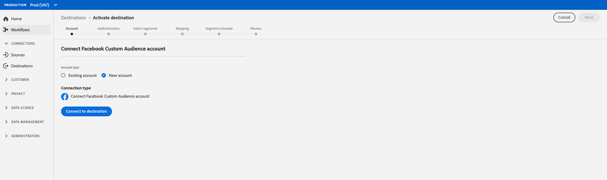
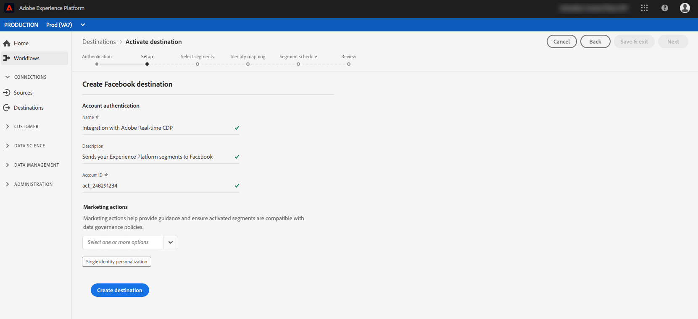

# Social Network destinations authentication workflow {#social-network-destinations-workflow}

## Workflow to create social network destinations

This tutorial uses [!DNL Facebook] as an example, but the workflow in Real-time Customer Data Platform will be the same for all social network destinations, once more are added to the product.

In **[!UICONTROL Destinations]** > **[!UICONTROL Catalog]**, scroll to the **[!UICONTROL Social]** category. Select your preferred social network destination, then select **[!UICONTROL Configure]**.

>[!NOTE]
>
>If a connection with this destination already exists, you can see an **[!UICONTROL Activate]** button on the destination card. For more information about the difference between **[!UICONTROL Activate]** and **[!UICONTROL Configure]**, refer to the [Catalog](../../ui/destinations-workspace.md#catalog) section of the destination workspace documentation.   

In the **Authentication** step, if you had previously set up a connection to your social network destination, select **[!UICONTROL Existing Account]** and select your existing connection. Or, you can select **[!UICONTROL New Account]** to set up a new connection to your social network destination. Select **[!UICONTROL Connect to destination]** and this will take you to the selected social network destination to log in and connect Adobe Experience Cloud to your social network Ad account.

>[!NOTE]
>
>Real-time CDP supports credentials validation in the authentication process and displays an error message if you input incorrect credentials to your social network account ID. This ensures that you don't complete the workflow with incorrect credentials.

Once your credentials are confirmed and Adobe Experience Cloud is connected to your social network, you can select **[!UICONTROL Next]** to proceed to the **[!UICONTROL Setup]** step.

In the **[!UICONTROL Setup]** step, enter a [!UICONTROL Name] and a [!UICONTROL Description] for your activation flow and fill in the [!UICONTROL Account ID] of your social network ad account. 

Also in this step, you can select any **[!UICONTROL Marketing use case]** that should apply to this destination. Marketing use cases indicate the intent for which data will be exported to the destination. You can select from Adobe-defined marketing use cases or you can create your own marketing use case. For more information about marketing use cases, see the [Data Governance in Real-time CDP](../../../rtcdp/privacy/data-governance-overview.md#destinations) page. For information about the individual Adobe-defined marketing use cases, see the [Data usage policies overview](../../../data-governance/policies/overview.md#core-actions). 
 
Select **[!UICONTROL Create Destination]** after you filled in the fields above.

>[!IMPORTANT]
>
> * The *Single Identity Personalization* marketing use case is selected by default for social network destinations and cannot be removed. 
> * For [!DNL Facebook] destinations. **[!UICONTROL Account ID]** is your [!DNL Facebook Ad Account ID]. You can find this ID in the [!DNL Facebook Ads Manager]. Prefix the ID with `act_` as shown below: 

Your destination is now created. You can select **[!UICONTROL Save & Exit]** if you want to activate segments later on or you can select **[!UICONTROL Next]** to continue the workflow and select segments to activate. In either case, see the next section, [Activate segments to social networks](#activate-segments), for the rest of the workflow.

## Activate segments to social networks {#activate-segments}

For instructions on how to activate segments to social networks, see [Activate Data to Destinations](../../ui/activate-destinations.md).