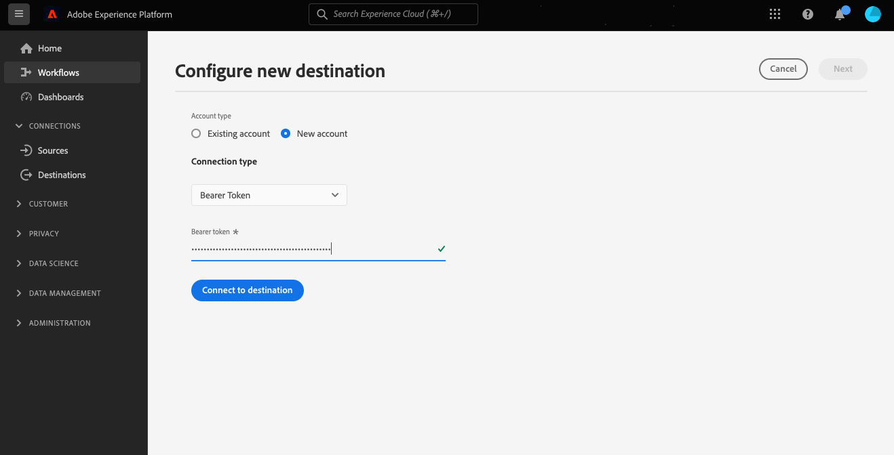
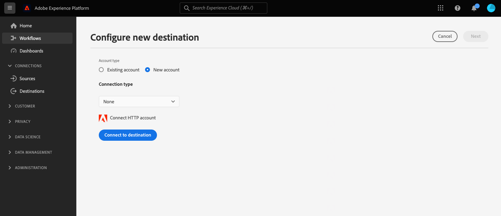
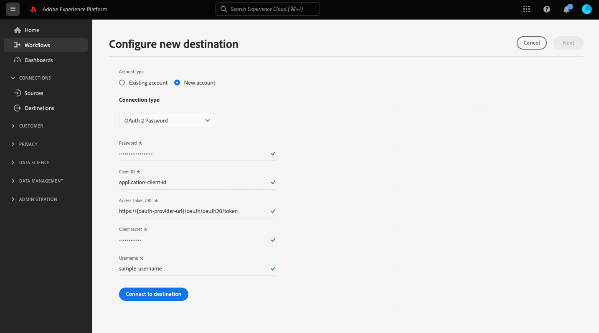
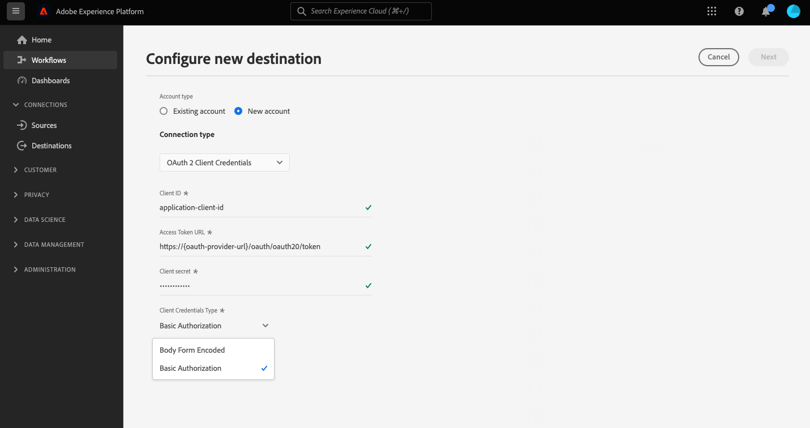
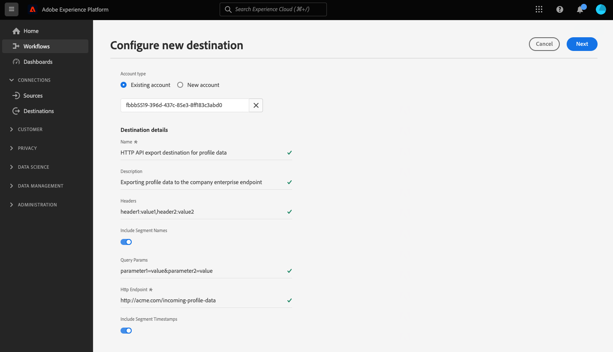

# HTTP API connection

## Overview {#overview}

>[!IMPORTANT]
>
> This destination is available only to [Adobe Real-Time Customer Data Platform Ultimate](https://helpx.adobe.com/legal/product-descriptions/real-time-customer-data-platform.html) customers.

The HTTP API destination is an [!DNL Adobe Experience Platform] streaming destination that helps you send profile data to third-party HTTP endpoints.

To send profile data to HTTP endpoints, you must first [connect to the destination](#connect-destination) in [!DNL Adobe Experience Platform].

## Use cases {#use-cases}

The HTTP API destination allows you to export XDM profile data and audience segments to generic HTTP endpoints. There, you can run your own analytics or perform any other operations you may need on profile data exported out of Experience Platform.

HTTP endpoints can be either customers' own systems or third-party solutions.

## External audiences support {#external-audiences-support}

All destinations support the activation of audiences generated through the Experience Platform [Segmentation Service](../../../segmentation/home.md).

Additionally, this destination also supports the activation of the external audiences described in the table below.

| External audience type | Description | 
---------|----------|
| Custom uploads | Audiences ingested into Experience Platform from CSV files. |

{style="table-layout:auto"}

## Export type and frequency {#export-type-frequency}

Refer to the table below for information about the destination export type and frequency.

| Item | Type | Notes |
---------|----------|---------|
| Export type | **[!UICONTROL Profile-based]** | You are exporting all members of a segment, together with the desired schema fields (for example: email address, phone number, last name), as chosen in the mapping screen of the [destination activation workflow](../../ui/activate-segment-streaming-destinations.md#mapping).|
| Export frequency | **[!UICONTROL Streaming]** | Streaming destinations are "always on" API-based connections. As soon as a profile is updated in Experience Platform based on segment evaluation, the connector sends the update downstream to the destination platform. Read more about [streaming destinations](/help/destinations/destination-types.md#streaming-destinations).|

{style="table-layout:auto"}

## Prerequisites {#prerequisites}

To use the HTTP API destination to export data out of Experience Platform, you must meet the following prerequisites:

* You must have an HTTP endpoint that supports REST API.
* Your HTTP endpoint must support the Experience Platform profile schema. No transformation to a 3rd-party payload schema is supported in the HTTP API destination. Refer to the [exported data](#exported-data) section for an example of the Experience Platform output schema.
* Your HTTP endpoint must support headers.

>[!TIP]
>
> You can also use [Adobe Experience Platform Destination SDK](/help/destinations/destination-sdk/overview.md) to set up an integration and send Experience Platform profile data to an HTTP endpoint.

## IP address allowlist {#ip-address-allowlist}

To meet customers' security and compliance requirements, Experience Platform provides a list of static IPs that you can allowlist for the HTTP API destination. Refer to [IP address allow list for streaming destinations](/help/destinations/catalog/streaming/ip-address-allow-list.md) for the complete list of IPs to allowlist.

## Supported authentication types {#supported-authentication-types}

The HTTP API destination supports several authentication types to your HTTP endpoint:

* HTTP endpoint with no authentication;
* Bearer token authentication;
* [OAuth 2.0 client credentials](https://www.oauth.com/oauth2-servers/access-tokens/client-credentials/) authentication with the body form, with [!DNL client ID], [!DNL client secret] and [!DNL grant type] in the body of the HTTP request, as shown in the example below.

```shell
curl --location --request POST '<YOUR_API_ENDPOINT>' \
--header 'Content-Type: application/x-www-form-urlencoded' \
--data-urlencode 'grant_type=client_credentials' \
--data-urlencode 'client_id=<CLIENT_ID>' \
--data-urlencode 'client_secret=<CLIENT_SECRET>'
```

* [OAuth 2.0 client credentials](https://www.oauth.com/oauth2-servers/access-tokens/client-credentials/) with basic authorization, with an authorization header which contains URL-encoded [!DNL client ID] and [!DNL client secret].

```shell
curl --location --request POST 'https://some-api.com/token' \
--header 'Authorization: Basic base64(clientId:clientSecret)' \
--header 'Content-type: application/x-www-form-urlencoded; charset=UTF-8' \
--data-urlencode 'grant_type=client_credentials'
```

* [OAuth 2.0 password grant](https://www.oauth.com/oauth2-servers/access-tokens/password-grant/).

## Connect to the destination {#connect-destination}

>[!IMPORTANT]
> 
>To connect to the destination, you need the **[!UICONTROL Manage Destinations]** [access control permission](/help/access-control/home.md#permissions). Read the [access control overview](/help/access-control/ui/overview.md) or contact your product administrator to obtain the required permissions.

To connect to this destination, follow the steps described in the [destination configuration tutorial](../../ui/connect-destination.md). When connecting to this destination, you must provide the following information:

### Authentication information {#authentication-information}

>[!CONTEXTUALHELP]
>id="platform_destinations_connect_http_clientcredentialstype"
>title="Client credentials type"
>abstract="Select **Body Form Encoded** to include the client ID and client secret in the body of the request or **Basic Authorization** to include client ID and client secret in an authorization header. View examples in the documentation."

#### Bearer token authentication {#bearer-token-authentication}

If you select the **[!UICONTROL Bearer token]** authentication type to connect to your HTTP endpoint, input the fields below and select **[!UICONTROL Connect to destination]**:



* **[!UICONTROL Bearer token]**: insert the bearer token to authenticate to your HTTP location.

#### No authentication {#no-authentication}

If you select the **[!UICONTROL None]** authentication type to connect to your HTTP endpoint:



When you select this authentication open, you only need to select **[!UICONTROL Connect to destination]** and the connection to your endpoint is established.

#### OAuth 2 Password authentication {#oauth-2-password-authentication}

If you select the **[!UICONTROL OAuth 2 Password]** authentication type to connect to your HTTP endpoint, input the fields below and select **[!UICONTROL Connect to destination]**:



* **[!UICONTROL Access Token URL]**: The URL on your side which issues access tokens and, optionally, refresh tokens.
* **[!UICONTROL Client ID]**: The [!DNL client ID] that your system assigns to Adobe Experience Platform.
* **[!UICONTROL Client Secret]**: The [!DNL client secret] that your system assigns to Adobe Experience Platform.
* **[!UICONTROL Username]**: The username to access your HTTP endpoint.
* **[!UICONTROL Password]**: The password to access your HTTP endpoint.

#### OAuth 2 Client Credentials authentication {#oauth-2-client-credentials-authentication}

If you select the **[!UICONTROL OAuth 2 Client Credentials]** authentication type to connect to your HTTP endpoint, input the fields below and select **[!UICONTROL Connect to destination]**:



* **[!UICONTROL Access Token URL]**: The URL on your side which issues access tokens and, optionally, refresh tokens.
* **[!UICONTROL Client ID]**: The [!DNL client ID] that your system assigns to Adobe Experience Platform.
* **[!UICONTROL Client Secret]**: The [!DNL client secret] that your system assigns to Adobe Experience Platform.
* **[!UICONTROL Client Credentials Type]**: Select the type of OAuth2 Client Credentials grant supported by your endpoint:
  * **[!UICONTROL Body Form Encoded]**: In this case, the [!DNL client ID] and [!DNL client secret] are included *in the body of the request* sent to your destination. For an example, see the [Supported authentication types](#supported-authentication-types) section.
  * **[!UICONTROL Basic Authorization]**: In this case, the [!DNL client ID] and [!DNL client secret] are included *in an `Authorization` header* after being base64 encoded and sent to your destination. For an example, see the [Supported authentication types](#supported-authentication-types) section.

### Fill in destination details {#destination-details}

>[!CONTEXTUALHELP]
>id="platform_destinations_connect_http_headers"
>title="Headers"
>abstract="Enter any custom headers that you want to be included in the destination calls, following this format: `header1:value1,header2:value2,...headerN:valueN`"

>[!CONTEXTUALHELP]
>id="platform_destinations_connect_http_endpoint"
>title="HTTP Endpoint"
>abstract="The URL of the HTTP endpoint where you want to send the profile data to."

>[!CONTEXTUALHELP]
>id="platform_destinations_connect_http_includesegmentnames"
>title="Include Segment Names"
>abstract="Toggle if you want the data export to include the names of the segments you are exporting. View the documentation for a data export example with this option selected."

>[!CONTEXTUALHELP]
>id="platform_destinations_connect_http_includesegmenttimestamps"
>title="Include Segment Timestamps"
>abstract="Toggle if you want the data export to include the UNIX timestamp when the segments were created and updated, as well as the UNIX timestamp when the segments were mapped to the destination for activation. View the documentation for a data export example with this option selected."

>[!CONTEXTUALHELP]
>id="platform_destinations_connect_http_queryparameters"
>title="Query Parameters"
>abstract="Optionally, you can add query parameters to the HTTP endpoint URL. Format the query parameters you use like this: `parameter1=value&parameter2=value`."

To configure details for the destination, fill in the required and optional fields below. An asterisk next to a field in the UI indicates that the field is required.



* **[!UICONTROL Name]**: Enter a name by which you will recognize this destination in the future.
* **[!UICONTROL Description]**: Enter a description that will help you identify this destination in the future.
* **[!UICONTROL Headers]**: Enter any custom headers that you want to be included in the destination calls, following this format: `header1:value1,header2:value2,...headerN:valueN`.
* **[!UICONTROL HTTP Endpoint]**: The URL of the HTTP endpoint where you want to send the profile data to.
* **[!UICONTROL Query parameters]**: Optionally, you can add query parameters to the HTTP endpoint URL. Format the query parameters you use like this: `parameter1=value&parameter2=value`.
* **[!UICONTROL Include Segment Names]**: Toggle if you want the data export to include the names of the segments you are exporting. For an example of a data export with this option selected, refer to the [Exported data](#exported-data) section further below.
* **[!UICONTROL Include Segment Timestamps]**: Toggle if you want the data export to include the UNIX timestamp when the segments were created and updated, as well as the UNIX timestamp when the segments were mapped to the destination for activation. For an example of a data export with this option selected, refer to the [Exported data](#exported-data) section further below.

### Enable alerts {#enable-alerts}

You can enable alerts to receive notifications on the status of the dataflow to your destination. Select an alert from the list to subscribe to receive notifications on the status of your dataflow. For more information on alerts, see the guide on [subscribing to destinations alerts using the UI](../../ui/alerts.md).

When you are finished providing details for your destination connection, select **[!UICONTROL Next]**.

## Activate segments to this destination {#activate}

>[!IMPORTANT]
> 
>To activate data, you need the **[!UICONTROL Manage Destinations]**, **[!UICONTROL Activate Destinations]**, **[!UICONTROL View Profiles]**, and **[!UICONTROL View Segments]** [access control permissions](/help/access-control/home.md#permissions). Read the [access control overview](/help/access-control/ui/overview.md) or contact your product administrator to obtain the required permissions.

See [Activate audience data to streaming profile export destinations](../../ui/activate-streaming-profile-destinations.md) for instructions on activating audience segments to this destination.

### Destination attributes {#attributes}

In the [[!UICONTROL Select attributes]](../../ui/activate-streaming-profile-destinations.md#select-attributes) step, Adobe recommends that you select a unique identifier from your [union schema](../../../profile/home.md#profile-fragments-and-union-schemas). Select the unique identifier and any other XDM fields that you want to export to the destination.

## Profile export behavior {#profile-export-behavior}

Experience Platform optimizes the profile export behavior to your HTTP API destination, to only export data to your API endpoint when relevant updates to a profile have occurred following segment qualification or other significant events. Profiles are exported to your destination in the following situations:

* The profile update was determined by a change in segment membership for at least one of the segments mapped to the destination. For example, the profile has qualified for one of the segments mapped to the destination or has exited one of the segments mapped to the destination.
* The profile update was determined by a change in the [identity map](/help/xdm/field-groups/profile/identitymap.md). For example, a profile who had already qualified for one of the segments mapped to the destination has been added a new identity in the identity map attribute.
* The profile update was determined by a change in attributes for at least one of the attributes mapped to the destination. For example, one of the attributes mapped to the destination in the mapping step is added to a profile.

In all the cases described above, only the profiles where relevant updates have occurred are exported to your destination. For example, if a segment mapped to the destination flow has a hundred members, and five new profiles qualify for the segment, the export to your destination is incremental and only includes the five new profiles.

Note that the all the mapped attributes are exported for a profile, no matter where the changes lie. So, in the example above all the mapped attributes for those five new profiles will be exported even if the attributes themselves haven't changed.

### What determines a data export and what is included in the export {#what-determines-export-what-is-included}

Regarding the data that is exported for a given profile, it is important to understand the two different concepts of *what determines a data export to your HTTP API destination* and *which data is included in the export*.

|What determines a destination export | What is included in the destination export |
|---------|----------|
|<ul><li>Mapped attributes and segments serve as the cue for a destination export. This means that if any mapped segments change states (from `null` to `realized` or from `realized` to `exiting`) or any mapped attributes are updated, a destination export would be kicked off.</li><li>Since identities cannot currently be mapped to HTTP API destinations, changes in any identity on a given profile also determine destination exports.</li><li>A change for an attribute is defined as any update on the attribute, whether or not it is the same value. This means that an overwrite on an attribute is considered a change even if the value itself has not changed.</li></ul> | <ul><li>The `segmentMembership` object includes the segment mapped in the activation dataflow, for which the status of the profile has changed following a qualification or segment exit event. Note that other unmapped segments for which the profile qualified for can be part of the destination export, if these segments belong to the same [merge policy](/help/profile/merge-policies/overview.md) as the segment mapped in the activation dataflow. </li><li>All identities in the `identityMap` object are included as well (Experience Platform currently does not support identity mapping in the HTTP API destination).</li><li>Only the mapped attributes are included in the destination export.</li></ul> |

{style="table-layout:fixed"}

For example, consider this dataflow to an HTTP destination where three segments are selected in the dataflow, and four attributes are mapped to the destination.  


A profile export to the destination can be determined by a profile qualifying for or exiting one of the *three mapped segments*. However, in the data export, in the `segmentMembership` object (see [Exported Data](#exported-data) section below), other unmapped segments might appear, if that particular profile is a member of them and if these share the same merge policy as the segment that triggered the export. If a profile qualifies for the **Customer with DeLorean Cars** segment but is also a member of the **Watched "Back to the Future"** movie and **Science fiction fans** segments, then these other two segments will also be present in the `segmentMembership` object of the data export, even though these are not mapped in the dataflow, if these share the same merge policy with the **Customer with DeLorean Cars** segment.

From a profile attributes point of view, any changes to the four attributes mapped above will determine a destination export and any of the four mapped attributes present on the profile will be present in the data export.

## Historical data backfill {#historical-data-backfill}

When you add a new segment to an existing destination, or when you create a new destination and map segments to it, Experience Platform exports historical segment qualification data to the destination. Profiles which qualified for the segment *before* the segment was added to the destination are exported to the destination within approximately one hour.

## Exported data {#exported-data}

Your exported [!DNL Experience Platform] data lands in your [!DNL HTTP] destination in JSON format. For example, the export below contains a profile that has qualified for a certain segment, is a member of another two segments, and exited another segment. The export also includes the profile attribute first name, last name, date of birth, and personal email address. The identities for this profile are ECID and email.

```json
{
  "person": {
    "birthDate": "YYYY-MM-DD",
    "name": {
      "firstName": "John",
      "lastName": "Doe"
    }
  },
  "personalEmail": {
    "address": "john.doe@acme.com"
  },
  "segmentMembership": {
   "ups":{
      "7841ba61-23c1-4bb3-a495-00d3g5fe1e93":{
         "lastQualificationTime":"2022-01-11T21:24:39Z",
         "status":"exited"
      },
      "59bd2fkd-3c48-4b18-bf56-4f5c5e6967ae":{
         "lastQualificationTime":"2022-01-02T23:37:33Z",
         "status":"realized"
      },
      "947c1c46-008d-40b0-92ec-3af86eaf41c1":{
         "lastQualificationTime":"2021-08-25T23:37:33Z",
         "status":"realized"
      },
      "5114d758-ce71-43ba-b53e-e2a91d67b67f":{
         "lastQualificationTime":"2022-01-11T23:37:33Z",
         "status":"realized"
      }
   }
},
  "identityMap": {
    "ecid": [
      {
        "id": "14575006536349286404619648085736425115"
      },
      {
        "id": "66478888669296734530114754794777368480"
      }
    ],
    "email_lc_sha256": [
      {
        "id": "655332b5fa2aea4498bf7a290cff017cb4"
      },
      {
        "id": "66baf76ef9de8b42df8903f00e0e3dc0b7"
      }
    ]
  }
}

```

Below are further examples of exported data, depending on the UI settings you select in the connect destination flow for the **[!UICONTROL Include Segment Names]** and **[!UICONTROL Include Segment Timestamps]** options:

+++ The data export sample below includes segment names in the `segmentMembership` section

```json
"segmentMembership": {
        "ups": {
          "5b998cb9-9488-4ec3-8d95-fa8338ced490": {
            "lastQualificationTime": "2019-04-15T02:41:50+0000",
            "status": "realized",
            "createdAt": 1648553325000,
            "updatedAt": 1648553330000,
            "mappingCreatedAt": 1649856570000,
            "mappingUpdatedAt": 1649856570000,
            "name": "First name equals John"
          }
        }
      }
```

+++

+++ The data export sample below includes segment timestamps in the `segmentMembership` section

```json
"segmentMembership": {
        "ups": {
          "5b998cb9-9488-4ec3-8d95-fa8338ced490": {
            "lastQualificationTime": "2019-04-15T02:41:50+0000",
            "status": "realized",
            "createdAt": 1648553325000,
            "updatedAt": 1648553330000,
            "mappingCreatedAt": 1649856570000,
            "mappingUpdatedAt": 1649856570000,
          }
        }
      }
```

+++

## Limits and retry policy {#limits-retry-policy}

In 95 percent of the time, Experience Platform attempts to offer a throughput latency of less than 10 minutes for successfully sent messages with a rate of less than 10 thousand requests per second for each dataflow to an HTTP destination.

In case of failed requests to your HTTP API destination, Experience Platform stores the failed requests and retries twice to send the requests to your endpoint.