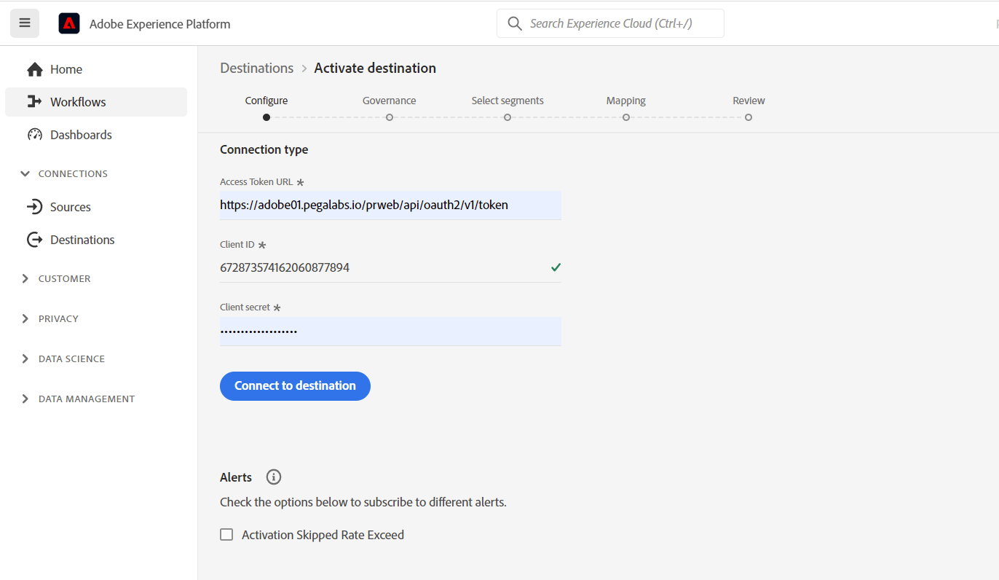
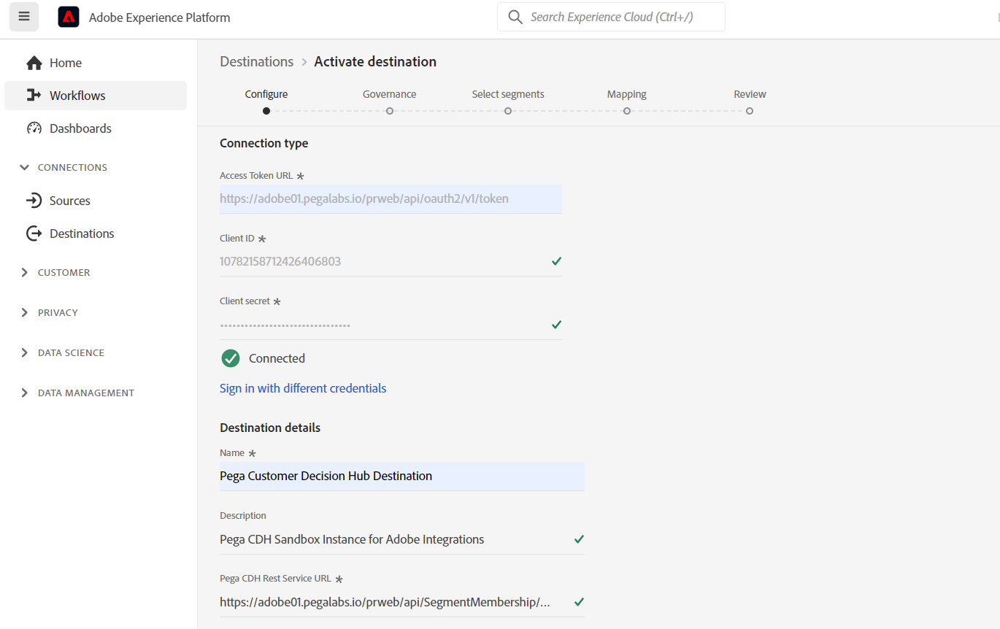

# Pega Customer Decision Hub connection

## Overview {#overview}

Use the Pega Customer Decision Hub destination in Adobe Experience Platform to send profile attributes and segment membership data to Pega Customer Descision Hub for next-best-action decisioning. 

Profile segment membership from Adobe Experience Platform, when loaded into Pega Customer Decision Hub, can be used as predictor in adaptive models and help deliver the right contextual and behavioral data for next-best-action decisioning purposes.

## Use cases 

To help you better understand how and when you should use the Customer Decision Hub destination, here are sample use cases that Adobe Experience Platform customers can solve by using this destination.

### Use case #1

### Telecommunications

A marketer wants to leverage insights from data science model-based next best action as delivered by Pega Customer Decision Hub for customer engagement. Pega Customer Decision Hub is heavily reliant on customer intent – for example "Interested_In_5G", "Interested_in_Unlimited_Dataplan" or "Interest_in_iPhone_accessories".

### Use case #2

### Financial services

A marketer wants to optimize the offers for customers who subscribed or unsubscribed from Pension Plan or Retirement Plan newsletters. Financial services companies can ingest multiple Customer IDs from their own CRMs into Adobe Experience Platform, build segments from their own offline data, and send profiles that are entering and exiting the segments to Pega Customer Decision Hub for next-best-action (NBA) decisioning in outbound channels.

## Prerequisites {#prerequisites}

Before you can use this destination to export data out of Adobe Experience Platform, make sure you complete the following prerequisites in Pega Customer Decision Hub:

* Configure the Adobe Segment Membership Component in your Pega Customer Decision Hub instance.
* Configure OAuth 2.0 Client Registration using Client Credentials grant type in your Pega Customer Decision Hub instance.
* Configure real-time processing of Adobe Segment Membership data flow to run in your Pega Customer Decision Hub instance.

## Supported identities {#supported-identities}

Pega Customer Decision Hub supports the activation of custom user IDs described in the table below. For more details, see [identities](/help/identity-service/namespaces.md).

|Target Identity|Description
|---|---|
|*CustomerID*|Common User Identifier that uniquely identifies a profile in Pega Customer Decision Hub and Adobe Experience Platform|

## Export type and frequency {#export-type-frequency}

Refer to the table below for information about the destination export type and frequency.

| Item | Type | Notes |
---------|----------|---------|
| Export type | **[!UICONTROL Profile-based]** | Export all members of a segment with identifier (*CustomerID*), attributes (last name, first name, location,..) and Segment Membership data.|
| Export frequency | **[!UICONTROL Streaming]** | Streaming destinations are an always on API-based connections. As soon as a profile is updated in Experience Platform based on segment evaluation, the connector sends the update downstream to the destination platform. For more information, see [streaming destinations](/help/destinations/destination-types.md#streaming-destinations).|

{style="table-layout:auto"}

## Connect to the destination {#connect}

To connect to this destination, follow the steps described in the [destination configuration tutorial](../../ui/connect-destination.md). In the configure destination workflow, fill in the fields listed in the two sections below.

### Authenticate to destination {#authenticate}

#### OAuth 2 Client Credentials authentication {#oauth-2-client-credentials-authentication}



* **[!UICONTROL Access Token URL]**: The URL on your side which issues access token.
* **[!UICONTROL Client ID]**: The [!DNL client ID] that your system assigns to Adobe Experience Platform.
* **[!UICONTROL Client Secret]**: The [!DNL client secret] that your system assigns to Adobe Experience Platform.

### Fill in destination details {#destination-details}

After establishing the authentication connection to the Pega Customer Decision Hub, provide the following information for the destination:


To configure details for the destination, fill in the required fields and select **[!UICONTROL Next]**.

*  **[!UICONTROL Name]**: A name by which you will recognize this destination in the future.
*  **[!UICONTROL Description]**: A description that will help you identify this destination in the future.
*  **[!UICONTROL URL]**: Pega Customer Decision Hub Service Rest Segment membership Endpoint URL. The Service endpoint URL is available by opening Service Rest rule type of Adobe Segment Membership Component enabled on your Pega instance.

## Activate segments to this destination {#activate}

>[!IMPORTANT]
> 
>To activate data, you need the **[!UICONTROL Manage Destinations]**, **[!UICONTROL Activate Destinations]**, **[!UICONTROL View Profiles]**, and **[!UICONTROL View Segments]** [access control permissions](/help/access-control/home.md#permissions). Read the [access control overview](/help/access-control/ui/overview.md) or contact your product administrator to obtain the required permissions.

See [Activate audience data to streaming profile export destinations](../../ui/activate-streaming-profile-destinations.md) for instructions on activating audience segments to this destination.

### Destination attributes {#attributes}

In the [[!UICONTROL Select attributes]](../../ui/activate-streaming-profile-destinations.md#select-attributes) step, Adobe recommends that you select a unique identifier from your [union schema](../../../profile/home.md#profile-fragments-and-union-schemas). Select the unique identifier and any other XDM fields that you want to export to the destination.

### Mapping example: activating profile updates in [!DNL Pega Customer Decision Hub] 

Below is an example of correct identity mapping when activating profile updates in [!DNL Pega Customer Decision Hub].

Selecting source fields:

* Select an Identifier (For eg: CustomerID) as source identity that uniquely identifies a profile in Adobe Experience Platform and  Pega Customer Decision Hub.
* Select XDM source profile attribute changes that need to be updated in Pega Customer Decision Hub.

Selecting target fields:

* Select the `CustomerID` namespace as target identity.
* Select destination profile attribute names that need to be mapped to corresponding XDM source profile attributes.


## Exported data / Validate data export {#exported-data}
Your exported [!DNL Experience Platform] data lands in your [!DNL HTTP] destination in JSON format. For example, the export snippet below contains a profile that is qualified for a certain segment, is a member of another two segments, and exited another segment. The export also includes the profile attribute first name (*FirstName*), last name (*LastName*), date of birth (*BirthDate*), and Customer Identfier (*CustomerID*) for this profile.

```json
{
  "CustomerID": "CUSTOMER-1021",
  "Attributes": {
    "BirthDate": "1975-08-29",
    "FirstName": "John",
    "LastName":"Doe"
  },
  "Segments": [{
    "SegmentID": "04a81716-43d6-4e7a-a49c-f1d8b3129ba91",
    "Name": "Interested in iPhone 13",
    "LastQualificationTime": "2020-05-25T21:24:39Z",
    "Status": "existing",
    "Version": "15",
    "ValidUntil": "2020-06-25T21:24:39Z",
    "Namespace": "AAM"
    }, {
    "SegmentID": "53cba6b2-a23b-454a-8069-fc41308f1c0f",
    "Name": "Interested in Unlimited Data Plan",
    "LastQualificationTime": "2020-05-25T23:37:33Z",
    "Status": "exited",
    "Version": "3",
    "ValidUntil": "2020-07-25T23:37:33Z",
    "Namespace": "AAM"
    }]
 }

```

## Data usage and governance {#data-usage-governance}

All [!DNL Adobe Experience Platform] destinations are compliant with data usage policies when handling your data. For detailed information on how [!DNL Adobe Experience Platform] enforces data governance, see the [Data Governance overview](/help/data-governance/home.md).
