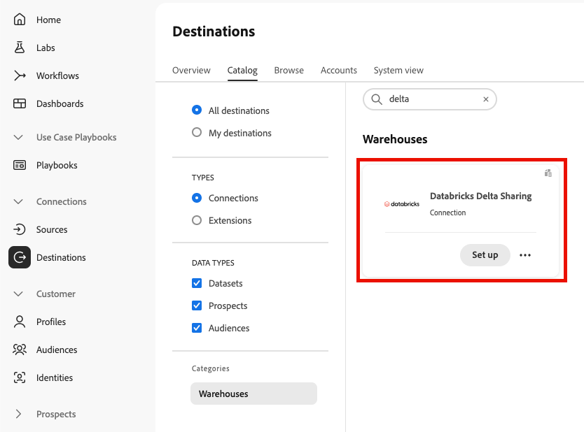
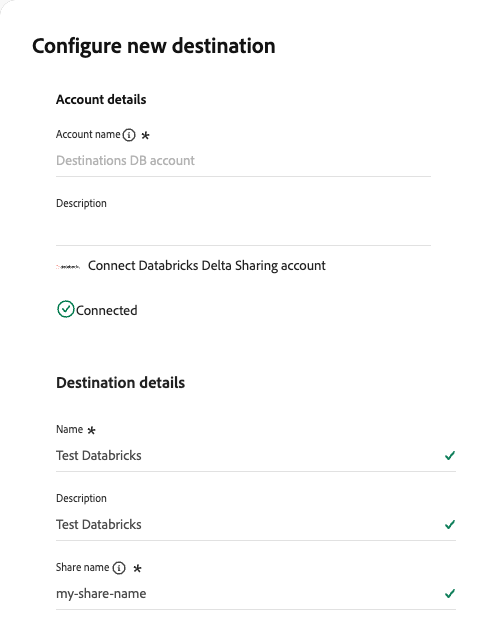
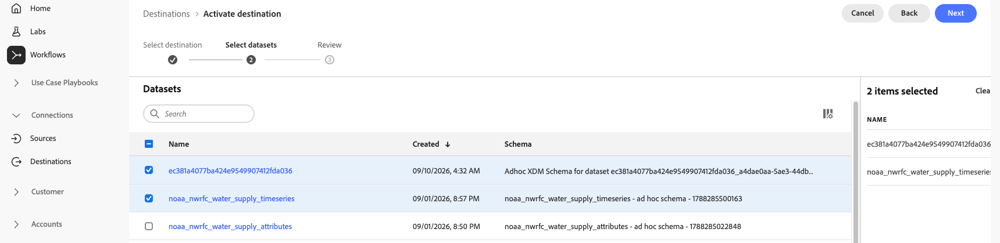
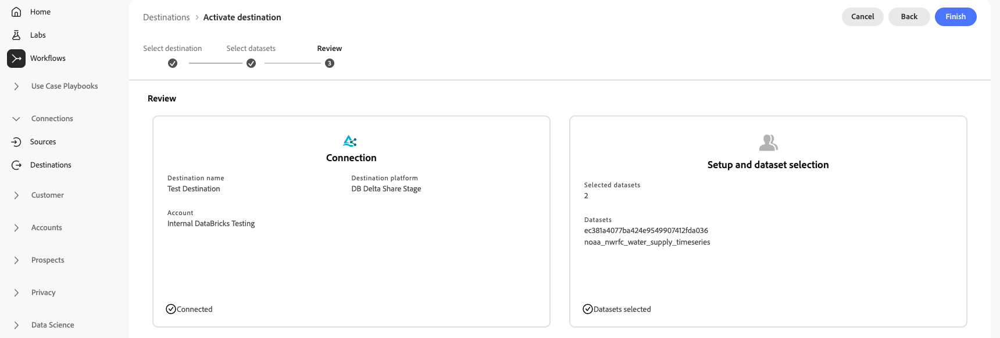
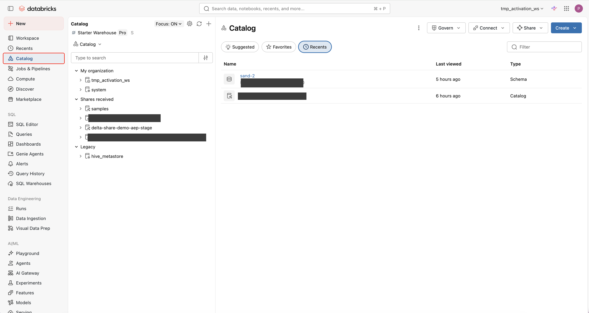
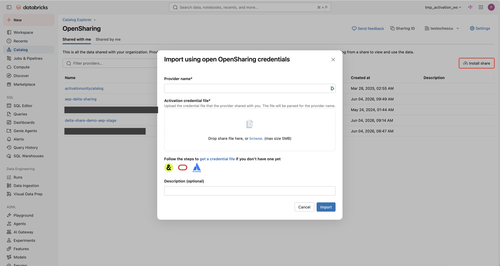
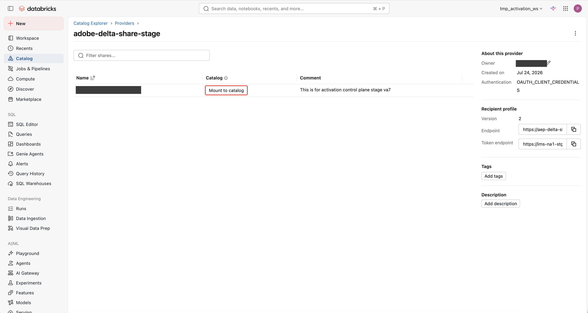
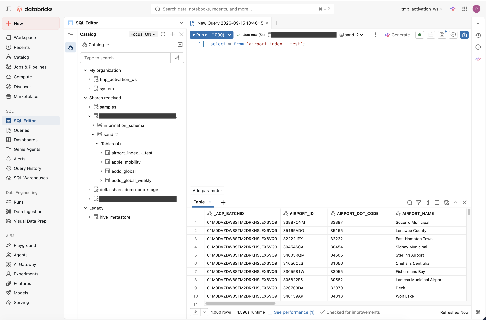

# [!DNL Databricks Delta Sharing] connection {#databricks-delta-sharing}

>[!AVAILABILITY]
>
>This destination connector is in Beta. The documentation and the feature are made available to enrolled Beta participants only. The functionality and documentation are subject to change.

## Overview {#overview}

Use the [!DNL Databricks Delta Sharing] destination to share datasets from [!DNL Adobe Experience Platform] to your [!DNL Databricks] workspace through the open [!DNL Delta Sharing] protocol. This is a zero-copy data sharing method. No data is copied, exported, or duplicated into your own storage. The data stays in [!DNL Adobe]-owned cloud storage, and your [!DNL Databricks] workspace reads it directly.

Read the following sections to understand how zero-copy data sharing works and how to set up the connection.

### How zero-copy data sharing works {#how-it-works}

This destination is built on the open [!DNL Delta Sharing] standard. Instead of copying data to your account, [!DNL Adobe] grants your [!DNL Databricks] workspace short-lived, scoped access to read the shared data directly from [!DNL Adobe]-owned cloud storage.

This approach provides the following benefits:

* **No data duplication**: Your workspace queries live [!DNL Adobe Experience Platform] data in place. Nothing is copied or exported.
* **Secure access**: Each request is authenticated and scoped to your organization, and access is short-lived.
* **Live data**: The shared views are refreshed as soon as the underlying dataset is updated, whether the dataset is populated through streaming or batch ingestion.

### What you can share {#what-you-can-share}

The [!DNL Databricks Delta Sharing] destination supports sharing datasets.

You can set up multiple independent shares that target the same [!DNL Databricks] account. Each share appears as its own set of tables in the recipient workspace.

## Use cases {#use-cases}

Zero-copy data sharing to [!DNL Databricks] is suited to scenarios where you want to read live [!DNL Adobe Experience Platform] data in your own warehouse without maintaining copies or scheduled batch exports. For example:

* **Analytics and reporting**: Query [!DNL Adobe Experience Platform] datasets directly in [!DNL Databricks] for business reporting and analysis.
* **Machine learning workloads**: Use shared datasets as training inputs for models that run in your [!DNL Databricks] environment.

## Prerequisites {#prerequisites}

Before you set up the [!DNL Databricks Delta Sharing] destination, make sure you meet the following prerequisites:

* You have access to a [!DNL Databricks] workspace with [!DNL Unity Catalog] enabled.
* You have the [!DNL Databricks] privileges required to receive data through open sharing. For more information, see the [Databricks documentation on reading data shared using open sharing](https://docs.databricks.com/aws/en/opensharing/).
* You can create a project and generate credentials in the [Adobe Developer Console](https://developer.adobe.com/console), with the [!DNL Experience Platform] API added to that project. The project and its credentials authenticate the calls between your [!DNL Databricks] workspace and the [!DNL Delta Sharing] server.
* You have the **[!UICONTROL View Destinations]**, **[!UICONTROL View Datasets]**, and **[!UICONTROL Manage and Activate Dataset Destinations]** [access control permissions](/help/access-control/home.md#permissions) required to share datasets. Read the [access control overview](/help/access-control/ui/overview.md) or contact your product administrator to obtain the required permissions.

## Supported datasets {#supported-datasets}

You can share the following types of [!DNL Adobe Experience Platform] datasets to this destination:

| Dataset type | Description |
|---------|----------|
| Record datasets | Datasets based on a [record class](../../../xdm/schema/composition.md#data-behaviors), which describes the attributes of a subject such as an organization or an individual. This includes ad hoc datasets created from sources such as CSV files. |
| Time-series datasets | Datasets based on a [time-series class](../../../xdm/schema/composition.md#data-behaviors), which describes a snapshot of the system at the time that a subject took an action. |

{style="table-layout:auto"}

>[!NOTE]
>
>System columns are excluded from shared schemas. The shared view includes a batch ID column that identifies the batch each record belongs to.

## Sharing type and frequency {#sharing-type-frequency}

This destination shares data through [!DNL Delta Sharing] rather than exporting it. No data is copied. Your [!DNL Databricks] workspace reads a live, shared view of the data in place. Refer to the table below for information about the sharing type and frequency.

| Item | Type | Notes |
|---------|----------|---------|
| Sharing type | Dataset | Datasets are shared as tables that your [!DNL Databricks] workspace reads directly. No data is copied to your workspace. |
| Frequency | Live | The shared views are refreshed as soon as the underlying [!DNL Adobe Experience Platform] dataset is updated, whether ingestion is streaming or batch. |

{style="table-layout:auto"}

## Set up Delta Sharing to Databricks {#databricks-setup}

To set up data sharing to [!DNL Databricks], the following three workflow steps are required:

1. [Generate credentials and create a share file](#credentials) in the [Adobe Developer Console](https://developer.adobe.com/console).
1. [Select the data to share](#select-data) in the [!DNL Adobe Experience Platform] Destinations workflow.
1. [Install the share in Databricks](#install-share) and import your credentials.

### Part 1: Generate credentials and create a share file {#credentials}

First, generate client credentials in the [Adobe Developer Console](https://developer.adobe.com/console), then use them to create a share file.

#### Generate client credentials {#generate-credentials}

The [!DNL Delta Sharing] server requires every request to be authenticated. Your [!DNL Databricks] workspace uses the client credentials to authenticate its requests to the server. You generate these credentials in the [Adobe Developer Console](https://developer.adobe.com/console) and add them to the share file in the next step.

To generate the client credentials, follow these steps:

1. In the [Adobe Developer Console](https://developer.adobe.com/console), create a new project and give it a name. For example, you could name it **[!UICONTROL Delta Sharing]**.
1. Select **[!UICONTROL Add API]** and filter by the **[!DNL Adobe Experience Platform]** product. Choose **[!UICONTROL Experience Platform API]** and select **[!UICONTROL Next]**.
1. For the authentication type, select **[!UICONTROL Server-to-Server Authentication]**, then select **[!UICONTROL Next]**.
1. For the authentication credential, select **[!UICONTROL OAuth Server-to-Server]**. Enter a name in the **[!UICONTROL Credential name]** field, then select **[!UICONTROL Next]**.
1. Select the appropriate product profiles, then select **[!UICONTROL Save configured API]**.
1. After the API configuration is saved, the connected credentials are generated and a credential is shown.

   {zoomable="yes"}

1. Select the **[!UICONTROL OAuth Server-to-Server]** link on the credential card to view the credential details.

   {zoomable="yes"}

1. Collect the following items, which you need to create the credentials file:
    * **[!UICONTROL Client ID]**
    * **[!UICONTROL Client Secret]** (shown when you select **[!UICONTROL Retrieve Client Secret]**)
    * **[!UICONTROL Token Endpoint]**. This is `https://ims-na1.adobelogin.com/ims/token/v3`.

You manage these credentials in the [Adobe Developer Console](https://developer.adobe.com/console).

>[!IMPORTANT]
>
>Any change to your credentials can affect or stop the share. If you revoke the client secret, the recipient loses access.

#### Create the share file {#credentials-file}

Using a text editor, create a new file with a `.share` extension that contains your client credentials. Use the following example as a template. Paste the client ID and client secret from the previous step.

```json
{
  "shareCredentialsVersion": 2,
  "type": "oauth_client_credentials",
  "endpoint": "https://aep-delta-sharing.adobe.io/delta-sharing",
  "clientId": "<CLIENT ID FROM THE PREVIOUS STEP>",
  "clientSecret": "<CLIENT SECRET FROM THE PREVIOUS STEP>",
  "tokenEndpoint": "https://ims-na1.adobelogin.com/ims/token/v3",
  "scope": "openid,AdobeID,read_organizations,additional_info.projectedProductContext"
}
```

### Part 2: Select the data to share {#select-data}

Next, create the destination connection in [!DNL Adobe Experience Platform] and select the datasets to share. This uses the standard destination activation workflow.

>[!IMPORTANT]
>
>To connect to the destination and activate data, you need the **[!UICONTROL View Destinations]**, **[!UICONTROL View Datasets]**, and **[!UICONTROL Manage and Activate Dataset Destinations]** [access control permissions](/help/access-control/home.md#permissions). Read the [access control overview](/help/access-control/ui/overview.md) or contact your product administrator to obtain the required permissions.

#### Configure the destination {#configure}

>[!CONTEXTUALHELP]
>id="platform_destinations_connect_databricks_sharename"
>title="Enter a share name"
>abstract="The share name is the unique identifier for the read-only collection of data assets that you share through the Delta Sharing protocol. The name must contain only alphanumeric characters, dashes, or underscores. Spaces and UTF-8 characters are not supported."

In the [!DNL Experience Platform] UI, go to the destinations catalog and search for the **[!UICONTROL Databricks Delta Sharing]** destination. Select **[!UICONTROL Set up]** on the destination card to start the configuration workflow.

{zoomable="yes"}

To create the destination connection, follow the steps described in the [destination configuration tutorial](../../ui/connect-destination.md). In the configure destination workflow, provide the account and destination details.

{zoomable="yes"}

Under **[!UICONTROL Account details]**, provide the following, then connect your account:

* **[!UICONTROL Account name]**: A name by which you recognize this account in the future.
* **[!UICONTROL Description]**: A description that helps you identify this account in the future.

Under **[!UICONTROL Destination details]**, provide the following:

* **[!UICONTROL Name]**: A name by which you recognize this destination in the future.
* **[!UICONTROL Description]**: A description that helps you identify this destination in the future.
* **[!UICONTROL Share name]**: The unique identifier for the read-only collection of data assets that you share through the [!DNL Delta Sharing] protocol. The name must match the regular expression `^[A-Za-z0-9_-]+$`, which means it can contain only alphanumeric characters, dashes, and underscores. Spaces and other characters are not supported. For example, `my-share_01` is accepted, but `my share 01` is rejected because it contains spaces.

#### Select datasets {#select-datasets}

In the **[!UICONTROL Select datasets]** step, select the datasets that you want to share. Use the search field to find datasets by name. Select the checkbox next to each dataset to add it to the share. The selected datasets appear in the summary panel.

{zoomable="yes"}

When you are finished, select **[!UICONTROL Next]**.

#### Review and finish {#review}

In the **[!UICONTROL Review]** step, confirm the connection and dataset selection. The **[!UICONTROL Connection]** card shows the destination name, destination platform, and account. The **[!UICONTROL Setup and dataset selection]** card shows the number of selected datasets and their names.

{zoomable="yes"}

To complete the workflow, select **[!UICONTROL Finish]**. Note the share name that you entered, because you use it again when you install the share in [!DNL Databricks].

### Part 3: Install the share in Databricks {#install-share}

Finally, install the share in your [!DNL Databricks] workspace and import your credentials to read the shared data. For more information about credential files in [!DNL Databricks], see the [Databricks open sharing documentation](https://docs.databricks.com/aws/en/opensharing/).

>[!NOTE]
>
>The share is addressed in [!DNL Databricks] by a composite share name that combines your organization ID and the share name that you entered in the [!DNL Experience Platform] configuration workflow, in the format `<organization_id>-<share_name>`. Use this composite share name when you install and mount the share.

1. Open your [!DNL Databricks] workspace and select **[!UICONTROL Catalog]**.

   {zoomable="yes"}

1. Select **[!UICONTROL Share]**, then select **[!UICONTROL OpenSharing]**.
1. Select **[!UICONTROL Install share]**.

   {zoomable="yes"}

1. Enter a provider name (for example, `Adobe-Delta-Share`). Select **[!UICONTROL browse]** to locate the `.share` credentials file that you created, then select **[!UICONTROL import]**.
1. If the import is successful, a confirmation screen shows the share and the catalog to be mounted.

   {zoomable="yes"}

1. Select **[!UICONTROL Mount to catalog]**, then select **[!UICONTROL Create a new catalog]**. When you enter the catalog name, use a name that is **exactly identical** to the name of the share. Select **[!UICONTROL Create]**.

The [!DNL Catalog] screen now shows the imported share, along with any datasets that were shared.

>[!TIP]
>
>Name your [!DNL Databricks] catalog identically to the share name. This keeps the recipient view and the provider view aligned.

## Query the shared data {#query-data}

After you mount the share, the shared datasets are available as tables in your [!DNL Databricks] workspace. In the **[!UICONTROL Catalog]** explorer, expand **[!UICONTROL Shares received]**, then expand the mounted catalog. Each [!DNL Adobe Experience Platform] sandbox appears as a schema, and each shared dataset appears as a table within that schema.

To read the data, open the **[!UICONTROL SQL Editor]** and run a `SELECT` statement against the table. For example:

```sql
SELECT * FROM `<catalog>`.`<sandbox>`.`<dataset>`;
```

The query returns the dataset's columns. Each row also includes the `_ACP_BATCHID` column, which identifies the batch that the record belongs to.

{zoomable="yes"}

## Known limitations {#known-limitations}

The [!DNL Databricks Delta Sharing] destination has the following limitations while in beta:

* You cannot monitor the number of rows or the size of shared datasets.
* You cannot share audiences with this destination.

## Best practices {#best-practices}

Follow these best practices to keep your shares secure and easy to manage:

* Use separate shares for each business use case, such as analytics, marketing, and machine learning, rather than a single share. This lets you manage each share independently.

## Data governance {#data-governance}

Datasets with conflicting Data Usage Labeling and Enforcement (DULE) labels surface as policy violations at the end of the workflow. You must resolve the violations before you can complete the workflow.

All [!DNL Adobe Experience Platform] destinations are compliant with data usage policies when handling your data. For detailed information on how [!DNL Adobe Experience Platform] enforces data governance, read the [Data Governance overview](/help/data-governance/home.md).
